<!-- source: https://palantir.com/docs/foundry/geospatial/integrate-geotemporal-series-with-the-ontology/ · mirrored 2026-08-22 from Palantir Foundry docs -->

# Integrate geotemporal series with the Ontology

To establish a geotemporal series in the Ontology that drives analysis and visualization within Palantir applications, such as a Gaia map, you will use [Pipeline Builder](/docs/foundry/pipeline-builder/overview/) to:

* Create a [geotemporal series sync](/docs/foundry/geospatial/types-of-geospatial-and-geotemporal-data/#geotemporal-series-sync) using the [geotemporal series output](/docs/foundry/pipeline-builder/outputs-add-geotemporal-series-output/).
* Create a [geotemporal series object type](/docs/foundry/geospatial/types-of-geospatial-and-geotemporal-data/#geotemporal-series-object-type) using the [object type pipeline output](/docs/foundry/pipeline-builder/outputs-add-ontology-output/#add-an-object-type-output).
* Connect the geotemporal series sync to the geotemporal series object type using a [geotemporal series reference (GTSR)](/docs/foundry/geospatial/types-of-geospatial-and-geotemporal-data/#geotemporal-series-reference-gtsr) property type. The object type also includes live and static information, such as a vessel's current position and call sign.

:::callout{theme="neutral"}
If you plan to add data from the Ontology to a Foundry [map](/docs/foundry/map/overview/) and *not* Gaia, use [time series](/docs/foundry/time-series/time-series-overview/) to view and analyze data associated with geospatial or geotemporal objects. Learn more about this in our [geospatial time series use case tutorial](/docs/foundry/time-series/geospatial-time-series-use-case/).   Review the [geospatial FAQ page](/docs/foundry/geospatial/faq/) or contact Palantir Support with additional questions about which integration type you should use to index your geotemporal data into the Ontology based on your enrollment and specific use case.
:::

Follow the instructions below to add a geotemporal series sync output as a reference to a geotemporal series object type.

## Create a new pipeline in Pipeline Builder

1. Navigate to Pipeline Builder and select the green **New pipeline** button.
2. Name your pipeline and select a project where it will be saved.
3. Choose **Streaming pipeline** before selecting **Create pipeline**. Geotemporal series are also compatible with batch pipelines, but streaming allows for real-time updates to tracked entities.

## Import and transform your geotemporal dataset

:::callout{theme="neutral"}
Review the existing [documentation on geotemporal data modeling](/docs/foundry/geospatial/data-modeling/) before proceeding.
:::

Identify the streaming [dataset](/docs/foundry/data-integration/datasets/) that will back your geotemporal series sync and object type and follow the instructions below to add them to your pipeline.

1. Select **Add Foundry data** if you have already ingested your data into the platform.
2. Search for your files in the **Add data** modal and select the **+** icon to add each dataset to your pipeline.
3. Select **Add data** in the bottom right corner of the **Add data** modal.

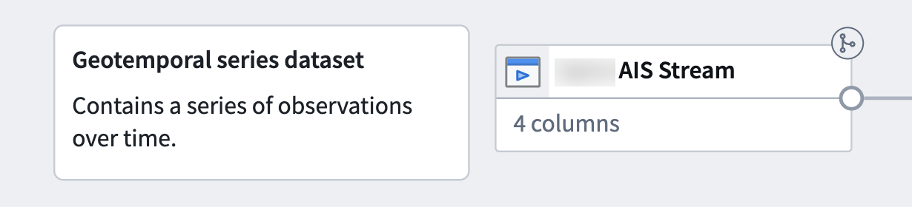

### Create your geotemporal series sync

[Learn more about configuring your geotemporal series sync in Pipeline Builder](/docs/foundry/pipeline-builder/outputs-add-geotemporal-series-output/).

:::callout{theme="neutral"}
At a minimum, your streaming dataset should contain columns that capture a tracked entity's movement over time, such as its latitude and longitude at a given timestamp, as well as a `string` column that enables you to join the geotemporal series sync to the object type. Columns that contain data that changes over time are referred to as *live* fields, whereas those that remain consistent (such as an entity's name) are called *static*.
:::

Your transform needs may vary depending on your streaming dataset's raw state upon ingest into Foundry. The example data outlined below contains the following columns that map to the sync's [primary fields](/docs/foundry/pipeline-builder/outputs-add-geotemporal-series-output/#mapping-primary-fields):

* **Series\_ID:** A `string` column used to join the geotemporal series sync to the object type. [Learn more about configuring a series ID.](/docs/foundry/geospatial/data-modeling/#picking-a-series-id)
* **Timestamp:** A `timestamp` column containing the time recorded for the entity's location.
* **Geopoint:** A `geopoint` column containing the entity's latitude and longitude pair.

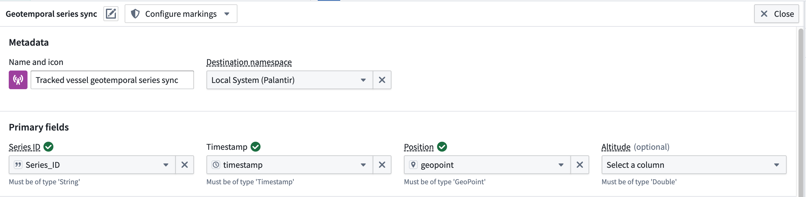

The dataset contains *additional* columns which will map to the geotemporal series sync's **Properties** but are *not* required for the sync to function in a Palantir map application.

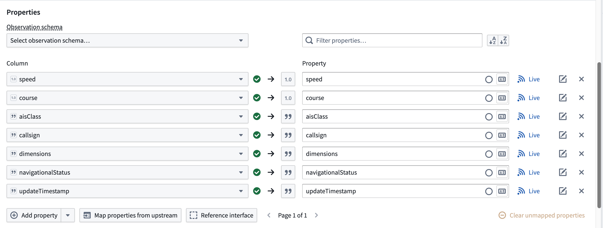

If necessary, use Pipeline Builder's **Cast** and [**Create GeoPoint**](/docs/foundry/pb-functions-expression/constructGeoPointV1/) transforms to prepare your raw streaming dataset for output as a geotemporal series sync.

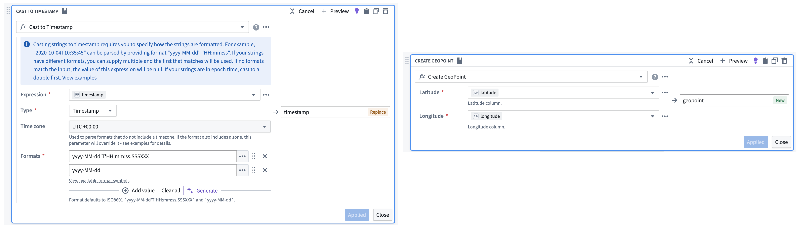

Follow the instructions below to create a geotemporal series sync output from your transformed streaming data:

1. Select the streaming dataset or transform node to render the vertical menu bar, where you will choose the gold **+** icon to add a **New geotemporal series sync** output.
2. Enter a name and optionally change the default icon for your sync in **Name and icon**.
3. Select your **Destination namespace** to which Foundry will write the sync.
4. Assign the relevant columns from your streaming dataset to the sync's **Primary fields**.
5. Set your sync's **Observation schema** if one already exists. If one does *not* exist, then you can leave this field empty; Foundry will generate a new one from your sync's mapped properties. [Learn more about observation schema.](/docs/foundry/geospatial/data-modeling/#observation-schema)
6. Optionally toggle the **Live** icon to the right of any additional **Properties** to mark one or multiple as static.

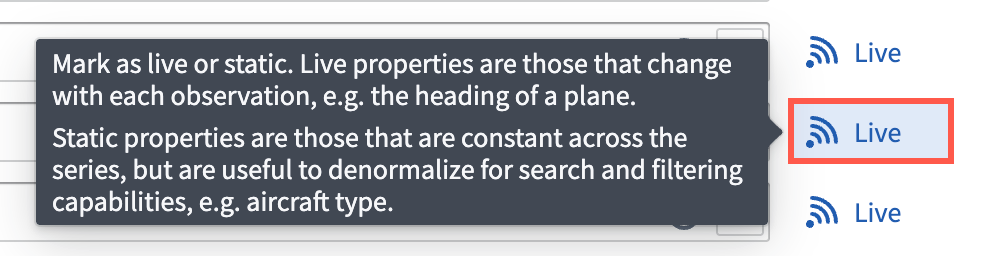

:::callout{theme="neutral"}
Foundry records a **Live** property value for every new observation, such as an entity's velocity at a given timestamp. If you mark a property as static, then Foundry records and applies the latest value of that property for all observations in the series.
:::

7. Optionally configure **Styles** for your sync to control its downstream rendering. After deployment, you can also edit default track styles for your geotemporal series object type in the **Geometry styles** tab of [Ontology Manager](/docs/foundry/ontology-manager/overview/).
8. Optionally [configure the integration's storage settings](/docs/foundry/pipeline-builder/outputs-add-geotemporal-series-output/#hot-and-cold-storage).
9. Reference an [interface](/docs/foundry/interfaces/interface-overview/) that represents your geotemporal series object type's properties by choosing **Reference interface** then mapping the properties in your geotemporal series sync.

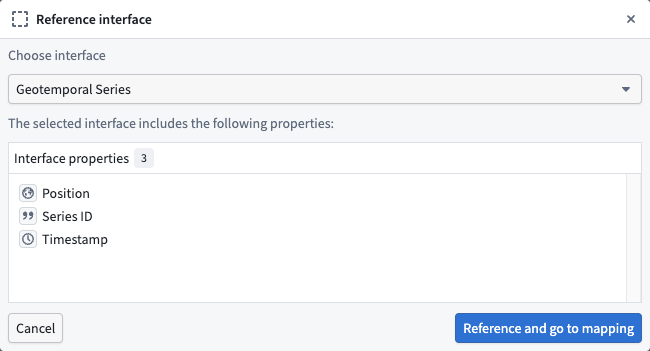

:::callout{theme="neutral"}
The `Geotemporal Series` interface is available for installation in Palantir's Core Ontology that is suitable for most use cases. Contact Palantir Support to install this interface on your enrollment if you are unable to access it in Ontology Manager.
:::

10. Select **Save** to save your geotemporal series sync.

### Create your geotemporal series object type

Next, you will transform your geotemporal dataset to create a geotemporal series object type that is linked to your geotemporal series sync though a [geotemporal series reference (GTSR)](/docs/foundry/geospatial/types-of-geospatial-and-geotemporal-data/#geotemporal-series-reference-gtsr).

1. Select the geotemporal dataset in your pipeline and choose **Transform** to insert a new transform.
2. Search for and select **Apply expression**.
3. Select the input field labeled `Column, expression, or value` and choose your dataset's primary key column from **Columns**. In this example, the dataset's `mmsi` column contains a unique vessel identifier that can be used as the primary key.
4. Create a new column titled `Series_ID` that is a copy of the dataset's unique identifier, such as `mmsi`. You will use this new column to link your geotemporal series sync to the object type.

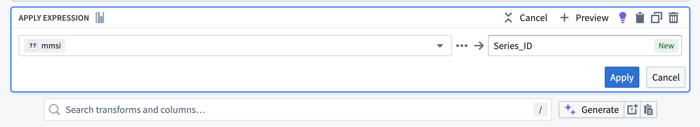

5. Select **Apply** before saving the changes to your pipeline and previewing your data.

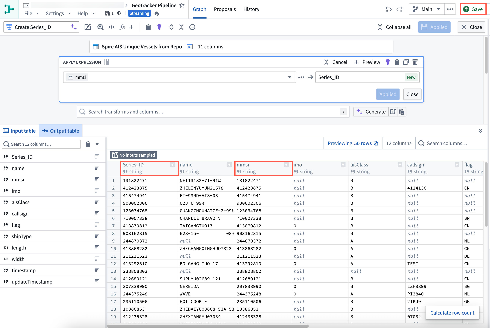

After transforming your geotemporal dataset, follow the instructions below to create a geotemporal series object type using [Pipeline Builder's ontology output](/docs/foundry/pipeline-builder/outputs-add-ontology-output/).

1. Select the transform node you just created to render the vertical menu bar, where you will choose the gold **+** icon to add a **New object type** output.

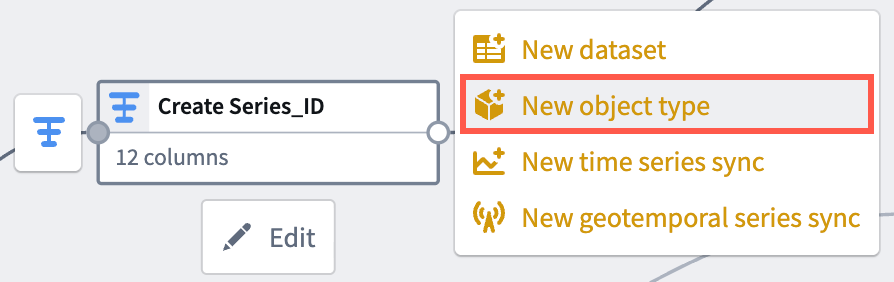

2. Enter a name and optionally change the default icon for your sync in **Name and icon**.
3. Select the ellipsis icon on the right side of a displayed property to set your primary key and title properties.

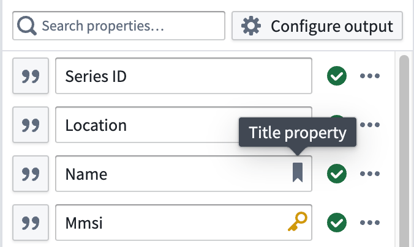

4. Select the link icon next to your `Series_ID` property to map the GTSR property to your object type by choosing **Geotemporal series > From this pipeline**. You may also select a geotemporal series sync from another pipeline by choosing **From Foundry...** and selecting the corresponding [geotemporal series integration](/docs/foundry/pipeline-builder/outputs-add-geotemporal-series-output/#geotemporal-series-sync-rid).

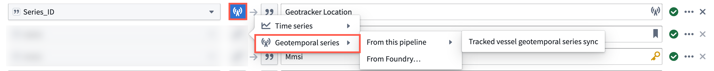

:::callout{theme="neutral"}
An object type can have at most one geotemporal series reference property, and it may not be an array of geotemporal series references.
:::

5. Select **Implement interface** at the bottom of your screen and choose the same interface referenced by your geotemporal series sync.

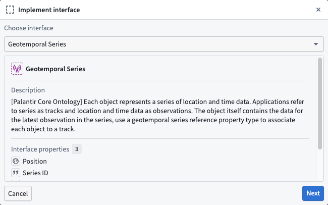

6. Choose **Next** to implement the required properties on the interface, then **Confirm and implement** to navigate back to the object type creation window in Pipeline Builder before saving your changes.

## Deploy your pipeline

After configuring your geotemporal series sync, creating an object type and interface, and establishing a link between the two via the GTSR, follow the instructions below to deploy your pipeline:

1. Ensure all changes made to your pipeline are saved.

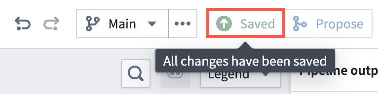

2. Select **Deploy** to render the **Deploy this pipeline** panel.

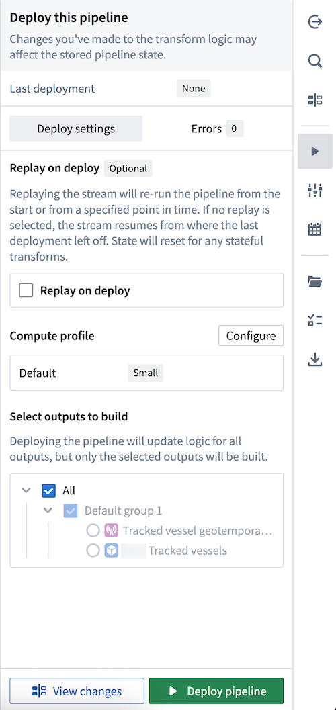

3. Optionally **Replay on deploy** to re-run your pipeline from a specified point in time. Depending on your stream's size, replaying a pipeline may impact the pipeline's deployment speed. [Learn more about additional options for streaming pipelines in Pipeline Builder.](/docs/foundry/pipeline-builder/outputs-deliver-pipeline/#additional-options-for-streaming-pipelines)
4. Select **Deploy pipeline**.

Once your pipeline deploys and your object type is created in your ontology, you can [visualize its observations](#visualize-your-geotemporal-data) on a map.

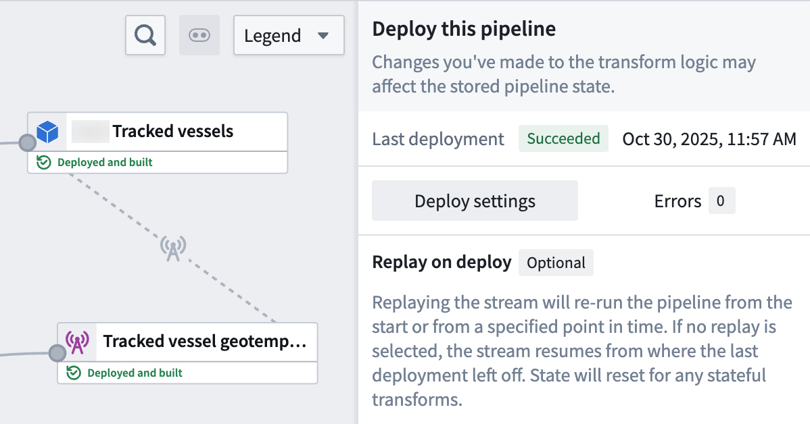

## Visualize your geotemporal data

:::callout{theme="neutral"}
Gaia is only accessible if your enrollment contains Gotham. Contact Palantir Support with questions about access to Gaia or its additional documentation available in platform.
:::

Once your geotemporal series is integrated with the ontology, you can [add its associated object type to your Gaia map](/docs/foundry/geospatial/add-ontology-data-to-gaia/).

[Type map your object type in Ontology Manager](/docs/foundry/object-link-types/enable-gotham-integration/#toggle-on-type-mapping-in-foundrys-ontology-manager) so Gotham can access and render it as a data layer in Gaia.

:::callout{theme="neutral"}
To use Pipeline Builder's advanced geotemporal features, you *must* type map your object type so Gotham can discover it *even if* your enrollment contains [Map Rendering Service](/docs/foundry/object-link-types/enable-gotham-integration/#how-to-check-if-your-enrollment-contains-mrs). This requirement includes use cases that track an entity's location as a [geotemporal series](/docs/foundry/geospatial/types-of-geospatial-and-geotemporal-data/#geotemporal-series). Review the [guidance on when to type map object types](/docs/foundry/object-link-types/enable-gotham-integration/#when-to-type-map-object-types-in-your-ontology) for additional details.
:::

Select a Foundry object rendered through an ontology-connected geotime layer, then select the button in the bottom-right corner of the map to open the observation log. The log lists all live properties configured in the object type's backing geotime integration. Use the rolling window picker to control how far back to load observations. Each row provides a **Zoom to** button that jumps to the observation's location. Selecting an observation moves the object to that point on its historical track. A refresh button appears when new observations are available.

## Geotemporal series reference (GTSR) properties in Ontology Manager

You may also configure a GTSR property type directly in [Ontology Manager](/docs/foundry/ontology-manager/overview/). Using the [geotemporal series sync you created above](#create-your-geotemporal-series-sync) in a [new](#create-a-new-pipeline-in-pipeline-builder) or the same Pipeline Builder pipeline:

1. [Import](#import-and-transform-your-geotemporal-dataset) or use the same geotemporal dataset you used to create the geotemporal series sync.
2. Select the geotemporal dataset in your pipeline and choose **Transform** to insert a new transform.
3. Search for and select the [**Create geotemporal series reference**](/docs/foundry/pb-functions-expression/constructGeotemporalSeriesReferenceV1/) expression.

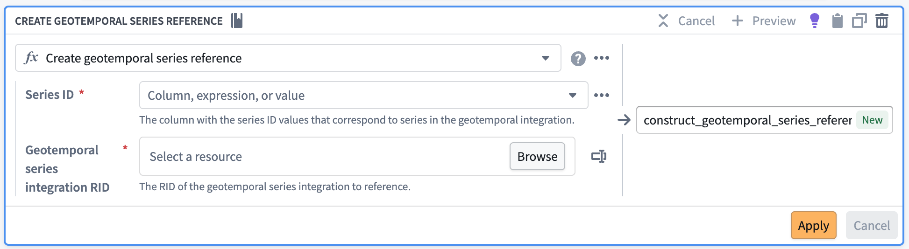

4. For `Series ID` select the same column you selected as the series ID of your geotemporal series sync.
5. For `Geotemporal series integration RID` select the [`RID` of your **deployed** geotemporal series sync](/docs/foundry/pipeline-builder/outputs-add-geotemporal-series-output/#geotemporal-series-sync-rid).
6. Select **Apply** before saving the changes to your pipeline and previewing your data.
7. Exit the transform and select the transform node to render the vertical menu bar, where you will choose the gold **+** icon to add a **New dataset** output.
8. Deploy the pipeline with the dataset that has your geotemporal series column.

In Ontology Manager, [create a new object type](https://www.palantir.com/docs/foundry/object-link-types/create-object-type/#create-an-object-type) with the new dataset you created as the [data source](/docs/foundry/object-link-types/create-object-type/#choosing-a-backing-datasource).
The corresponding `Geotemporal Series Reference` property type should be automatically configured from the column you created in Pipeline Builder. If not, you can add or [edit an existing property type](/docs/foundry/object-link-types/edit-properties/#edit-a-property-types-metadata) with the `Geotemporal Series Reference` type.

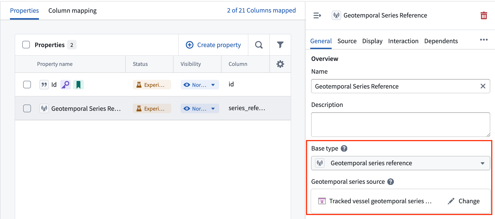

You must set the correct [geotemporal series sync's RID](/docs/foundry/pipeline-builder/outputs-add-geotemporal-series-output/#geotemporal-series-sync-rid) to proceed. You should also [implement the geotemporal interface](/docs/foundry/interfaces/implement-interface/) in this workflow.

:::callout{theme="neutral"}
An object type can have at most one geotemporal series reference property, and it may not be an array of geotemporal series references.
:::
