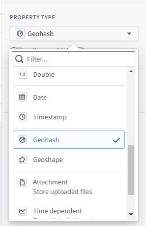
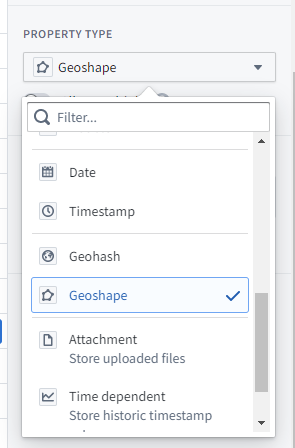
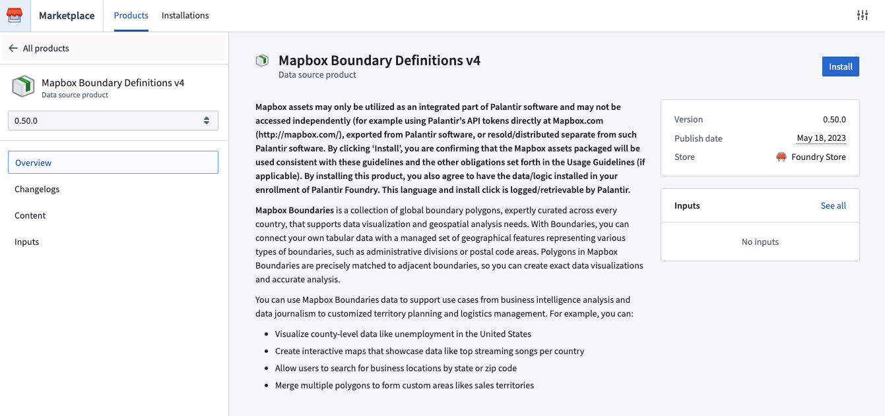
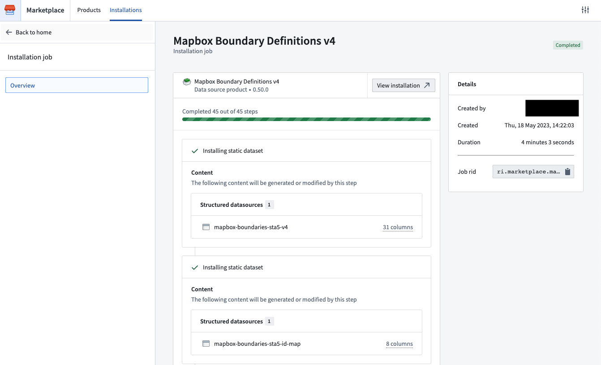
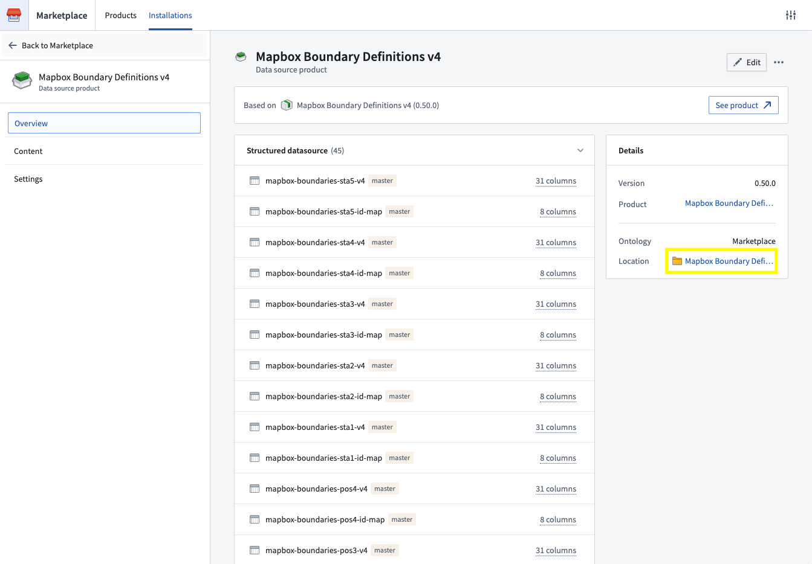
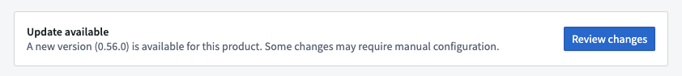
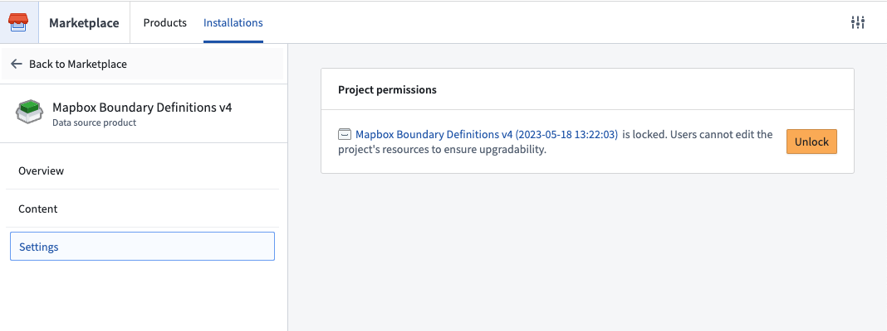

<!-- source: https://palantir.com/docs/foundry/geospatial/ontology/ · mirrored 2026-08-22 from Palantir Foundry docs -->

# Use geospatial and geotemporal data in the Ontology

:::callout{theme="warning"}
The `geospatial-tools` library is no longer actively developed; instead, use Pipeline Builder to load, transform, and wield geospatial data. The functionality for manipulating geospatial data types described on this page has been superseded by Pipeline Builder's geospatial capabilities. [Learn more about Pipeline Builder's geospatial features.](/docs/foundry/pipeline-builder/transforms-geospatial/)
:::

## How to configure Ontology datasets with vector data

Foundry's [`geospatial-tools` library](/docs/foundry/geospatial/vector-data-in-transforms/) was developed to parse, clean and convert vector data formats such as shapefiles and geoJSON into datasets which can be added to the Ontology. However, this functionality has been superseded by [Pipeline Builder's geospatial capabilities](/docs/foundry/pipeline-builder/transforms-geospatial/). You should use Pipeline Builder instead of the `geospatial-tools` library as the `geospatial-tools` library is no longer maintained and may not function as expected.

The documentation on this page will remain available as a reference until official deprecation of the `geospatial-tools` library.

### Points

Point geometries can be specified using the `geopoint` property type. The contents of a `geopoint` property should be a string of either:

* `latitude,longitude`: For example, `57.64911,10.40744`. Coordinates must use the WGS 84 CRS (standard latitude and longitude). [Learn more about coordinate reference systems and projections.](/docs/foundry/geospatial/coordinate-reference-systems-and-projections/)
* A [Geohash ↗](https://en.wikipedia.org/wiki/Geohash): For example, `u4pruydqqvj`. Geohashes will be converted into points, using the bottom-left corner of the Geohash rectangle.

Objects with `geopoint` properties are indexed for geospatial search.



### Polygons and lines

Polygon and line geometries can be specified using the `geoshape` property type. The contents of a `geoshape` property must be a GeoJSON Geometry string meeting the following requirements:

* Must be a GeoJSON LineString, Polygon, MultiLineString, MultiPolygon, MultiPoint, or Point. However, Point geometries should **not** use the `geoshape` property type; use the [`geopoint` property type](#points) for Point geometries.
* Must **not** be a Feature, FeatureCollection, or GeometryCollection.
* Must comply with the [GeoJSON Specification (RFC 7946) ↗](https://tools.ietf.org/html/rfc7946).
* Must use WGS 84 coordinates.
* Polygons and MultiPolygons must be valid according to the GeoJSON Specification. Polygons and MultiPolygons must be closed, use a right-hand/counterclockwise winding order for exterior rings, and have no self-intersection.

This is an example of valid GeoJSON for a `geoshape` property:

```json
{ "type": "LineString", "coordinates": [ [100.0, 0.0], [101.0, 1.0] ] }

```

Objects with `geoshape` properties are indexed for geospatial search.



## How to visualize, explore, and publish geospatial data

Once your geospatial data is loaded in the Ontology, there are two primary Ontology mapping tools where your data can be used:

* The [Map application](/docs/foundry/map/overview/) provides immersive geospatial analysis and investigation capabilities, including time series overlay, link analysis, and simulations.
* [Workshop](/docs/foundry/workshop/overview/) is an application-building framework designed for operational users and includes a robust map widget. Learn more about [creating maps in Workshop](/docs/foundry/workshop/widgets-map/).

Geospatial capabilities are also available in other Foundry applications, including [Slate](/docs/foundry/slate/widgets-visualization/#map), [Quiver](/docs/foundry/quiver/overview/), [Object Explorer](/docs/foundry/object-explorer/overview/), and [Contour](/docs/foundry/contour/overview/).

### Using external layers in maps

In some cases, Foundry also supports adding external layers into maps; for instance, in situations where you have an external feature service or tile server that you want to connect directly to a Foundry map without first loading all the data into a dataset.

Contact your Palantir representative for more details, as this requires additional configuration to enable.

## Mapbox Boundaries

In partnership with [Mapbox ↗](https://docs.mapbox.com/data/boundaries/guides/), Foundry provides built-in support for creating choropleth-style layers using a variety of available options for defining region boundaries.

With Boundaries, you can connect your Foundry Datasets and/or Ontology with a managed set of geographical features representing various types of boundaries, such as administrative divisions or postal code areas. Polygons in Mapbox Boundaries are edge matched for seamless global coverage, so you can create exact data visualizations and accurate analysis.

### Layer types, levels, and worldviews

Mapbox provides boundaries data across multiple types, levels, and worldviews. You can explore the types and levels of boundaries available using the [Boundaries Explorer app ↗](https://demos.mapbox.com/boundaries-explorer/), as well as [additional documentation on the different types of boundaries ↗](https://docs.mapbox.com/data/boundaries/reference/mapbox-boundaries-v4/#layer-types-and-levels).

### Using Mapbox Boundaries

The instructions below are for leveraging the latest version of Mapbox Boundaries (v4). If you are already using a prior version, [migrate your pipelines and applications](#migrate-from-mapbox-boundaries-v3-to-v4) first.

#### Install Mapbox Boundary definitions

Mapbox boundary definitions v4 are available to download in the Foundry Marketplace. To access from your Foundry instance:

1. Navigate to `/workspace/marketplace/discovery` on your Foundry instance.
2. Search for “Mapbox” or filter to the “Foundry Store” using the **Store** filter in the left panel.
3. Choose the **Mapbox Boundary Definitions v4** product.
4. Click **Install**. If someone has already installed these boundaries, you will see **Open** instead, from which you can navigate to the current installation.



5. When installing:
   1. Choose a [space](/docs/foundry/security/orgs-and-spaces/) to install into.
   2. As the product only contains datasets, an Ontology is not required.
   3. Enable **Installation suffix** to customize the project name in which the datasets will be installed.
   4. Select **Install** at the bottom of the left panel.
6. Once the installation job has finished, click **View installation** located to the right of the product name to navigate to the installation.



7. You can access the installed boundary datasets by selecting the location link in the right panel. By default, only you will have access to this Project but you can [add other users and groups in the project details panel on the right](/docs/foundry/security/projects-and-roles/).



When new minor boundary dataset versions become available, you will be able to upgrade via the banner that will appear at the top of your installation. Major version releases will be available as a new data source product.



:::callout{theme="note"}
Note that products install into a new project that has edits disabled by default to ensure safe upgrades (for example, if additional boundary datasets become available). Given that, we recommend saving content that leverages these datasets (for example, analyses, pipelines, etc) in a different project. If you need to edit the project itself, you can enable edits by selecting **Settings** in the left panel and then **Unlock**, as below.
:::



#### Integrate Mapbox IDs into pipelines

In order to leverage Mapbox Boundaries, you will need a `mapbox ID` that identifies a region for a specific type of boundary at a specific level. These IDs can be found in the [boundaries metadata files ↗](https://docs.mapbox.com/data/boundaries/reference/mapbox-boundaries-v4/#lookup-tables), which are automatically available as part of the Mapbox Boundary definitions product. See [Install Mapbox definitions](#install-mapbox-boundary-definitions) for instructions.

Once you have installed the metadata files, join them against your data within Foundry in order to add the `mapbox_id` column. Depending on the type and level of boundary, the metadata files will contain other ID and/or name columns that you can use as join keys against your own data.

This `mapbox_id` column will be used to configure downstream applications to display boundaries-based maps.

#### Configure downstream applications

Mapbox Boundaries can currently be used to produce Choropleth-style visualizations in any of the following products:

* [Workshop](/docs/foundry/workshop/widgets-map/)
* [Contour](/docs/foundry/contour/boards-map/)
* [Map Application](/docs/foundry/map/overview/)
* [Object views](/docs/foundry/object-views/overview/)
* [Object Explorer](/docs/foundry/object-explorer/overview/)
* [Quiver](/docs/foundry/quiver/overview/)

The specific configuration options may differ slightly for each consuming application, but the common configuration options will include:

* The field or property in your data that contains the `mapbox_id`
* A selection for the specific [worldview ↗](https://docs.mapbox.com/data/boundaries/reference/mapbox-boundaries-v4/#worldview-text) you wish to display the data with respect to
* The type and level of boundary to use

You will then be able to use data from your datasets and/or Ontology to drive the styling of these boundaries, such as the coloring of the polygons. For more specific documentation on those additional styling options, visit the documentation of the specific downstream application.

#### Migrate from Mapbox Boundaries v3 to v4

If you are currently using an older version of Mapbox’s Boundaries data (such as V2 or V3), we highly recommend upgrading to v4. In addition to getting updates to the boundaries themselves, the V4 release includes more reliable support for displaying region names in tooltips, as well as support for automatic zoom-to-fit for Mapbox boundaries-backed map layers, amongst other improvements.

When migrating from v3 to v4, there are a few boundaries that have breaking changes. Review a [detailed changelog of breaking changes ↗](https://docs.mapbox.com/data/boundaries/guides/boundaries-v4-migration-guide/#breaking-data-changes) before proceeding.

To migrate the data in your pipelines, you can either:

* Leverage the [V3 to V4 ID mapping tables ↗](https://docs.mapbox.com/data/boundaries/guides/boundaries-v4-migration-guide/#breaking-data-changes), which are included in the [Mapbox boundary definitions V4 product](#install-mapbox-boundary-definitions). Join them against your existing boundaries data, using the `feature_id` column from V3, and pull in the new `mapbox_id` column that was added with v4. Make sure to manually account for any of the breaking changes mentioned above.
* Or, you can simply follow the instructions above and use the boundaries metadata CSV files to join in the `mapbox_id` column from scratch.

Once you have added the `mapbox_id` column into your pipeline/Ontology, reconfigure downstream applications to leverage v4 boundaries, and select this new column and the corresponding boundary type/level.
