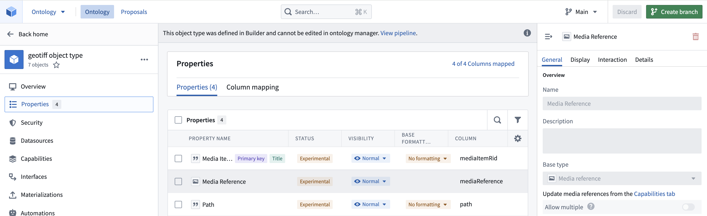
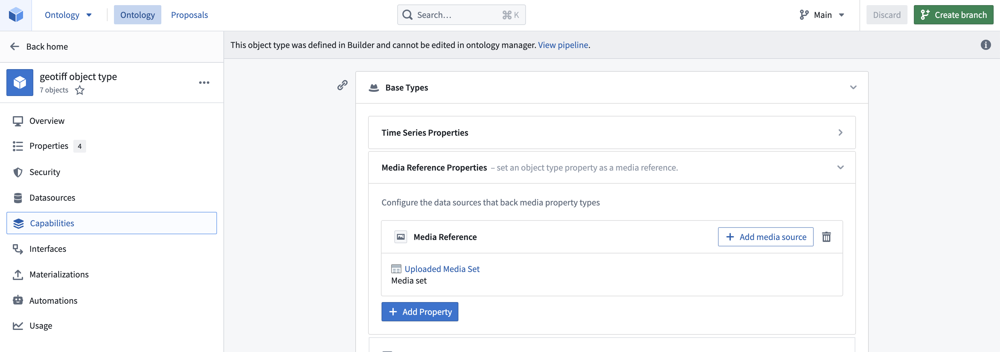
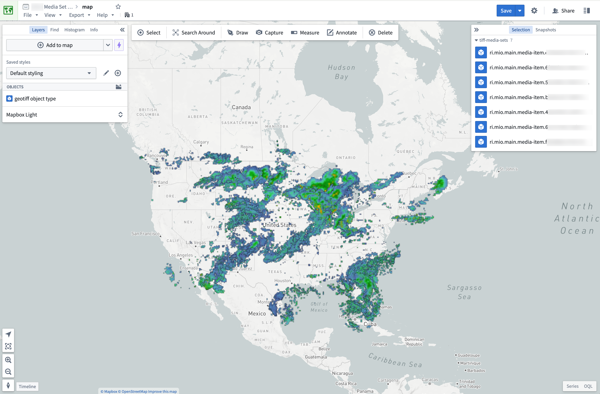

<!-- source: https://palantir.com/docs/foundry/geospatial/raster_data/ · mirrored 2026-08-22 from Palantir Foundry docs -->

# Use raster data

Foundry enables large-scale processing of raster data in a first-class manner with [media sets](/docs/foundry/data-integration/media-sets/). [File-level transforms](/docs/foundry/transforms-python/unstructured-files/) are also supported for custom image pre-processing, or for processing any file formats not currently supported by media sets.

Learn more about the different types of [geospatial data](/docs/foundry/geospatial/types-of-geospatial-and-geotemporal-data/).

## Data formats and sources

Supported media set raster file formats:

* TIFF / GeoTIFF
* NITF
* JPEG2000

Other raster file formats that can only be processed at a file level:

* PNG
* JPEG

## Use raster data with media sets

1. Import supported raster file formats as media sets. You can either create a new media set via data connection or local machine uploads. Learn the different ways to [import media](/docs/foundry/media-sets-advanced-formats/importing-media/).

2. Once imported, you can leverage the media set through media references. Select the media references in [Pipeline Builder](/docs/foundry/building-pipelines/create-batch-pipeline-pb-media-set/) or in a [transform](/docs/foundry/building-pipelines/create-batch-pipeline-cr-media-sets/).

3. Create an object type in the Ontology, either as a pipeline output within Pipeline Builder or as a direct creation in the Ontology Manager. Ensure that the object type has the media reference property as a media reference type and that you have declared the backing media set in **Capabilities** so that the platform knows where and how to reference your media items. For more information, review our documentation on [using media in the Ontology](/docs/foundry/media-sets-advanced-formats/media-in-ontology/).





Once you have an object type you can import it into the Map application to view it. Displaying raster files greater than 67 megabytes (MB) on maps is not supported.



## Use raster data in transforms

For raster file types not currently supported by media sets, you can still process them in transforms. You can view the recommended libraries and code examples in the section below.

Transforms are also ideal for pre-processing supported media set file types. For example, you can use transforms to update the size of your images using `MediaSetInput` and output a media set with `MediaSetOutput` like the example below. [Learn more on how to write media set batch pipelines](/docs/foundry/building-pipelines/create-batch-pipeline-cr-media-sets/).

```python
from transforms.api import transform
from transforms.mediasets import MediaSetInput, MediaSetOutput
@transform(
    images=MediaSetInput('/examples/images'),
    output_images=MediaSetOutput('/examples/output_images')
)
def translate_images(images, output_images):
...
```

### Recommended Python libraries

There are several common open-source libraries that work well in Foundry for processing raster data, including:

* [Rasterio ↗](https://rasterio.readthedocs.io/en/latest/)
* [PIL ↗](https://pillow.readthedocs.io/en/stable/)

### Code examples

#### Open a GeoTIFF File from a dataset using Rasterio

```python
from transforms.api import transform, Input, Output, FileSystem
import rasterio
import tempfile
import shutil
import math

@transform(
    output=Output("OUTPUT_DATASET"),
    my_input=Input("INPUT_DATASET"),
)
def my_compute_function(output, my_input):
    def process_file(file_status):
        # use temp file to download file so Image can open correctly
        with tempfile.NamedTemporaryFile() as tmp:
            with my_input.filesystem().open(file_status.path, 'rb') as f:
                shutil.copyfileobj(f, tmp)
                tmp.flush()
                # open the file with rasterio
                with rasterio.open(tmp.name, driver='GTiff') as dataset:
                    """ fill in rasterio logic """

    files = list(my_input.filesystem().ls())
    map(process_file, files)
    return
```
