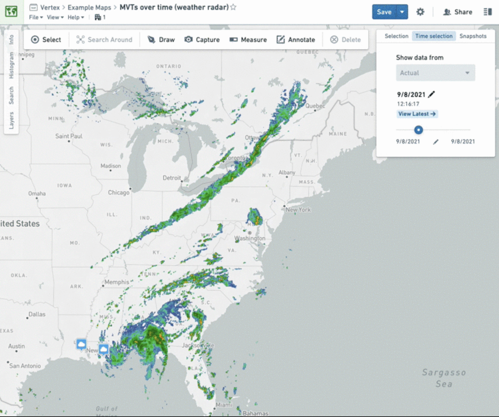
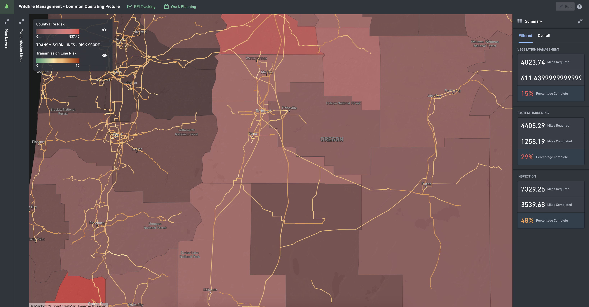

<!-- source: https://palantir.com/docs/foundry/geospatial/types-of-geospatial-and-geotemporal-data/ · mirrored 2026-08-22 from Palantir Foundry docs -->

# Types of geospatial and geotemporal data

There are many types of geospatial and geotemporal data that you may work with in Foundry. It is important to understand what type of data you have when planning how to use it.

There are two main types of geospatial data: [**raster**](#raster-data) and [**vector**](#vector-data). Geospatial data with a temporal component is known as [**geotemporal**](#geotemporal-data) data.

Review the [coordinate reference system (CRS) and projection](/docs/foundry/geospatial/coordinate-reference-systems-and-projections/) used to represent locations. Different CRSs can affect map alignment and calculations such as area and distance.

All example images use notional or open-source data.

## Raster data

Raster data consists of a matrix of cells organized into rows and columns, in which each cell represents specific information. Examples of raster data include satellite imagery sources, scanned maps, and digital elevation models (DEMs).

Learn more about [processing raster data](/docs/foundry/geospatial/raster-data/).

## Vector data

Vector data is used for storing data that has discrete boundaries and represents these data as points, lines, and polygons. Examples of vector data include points representing cities on a map of the United States, lines representing roads in a state, and polygons representing electoral district boundaries.

Learn more about [processing vector data in transforms](/docs/foundry/geospatial/vector-data-in-transforms/).

## Geotemporal data

Geospatial data may have a temporal component, such as the location of a vehicle over time or satellite images taken at different times. This data is **geotemporal**, also called "spatiotemporal", "geotime", or "track" data. Review the following key concepts to learn more about geotemporal data in Foundry.

### Key geotemporal data concepts

### Geotemporal series

A geotemporal series is a sequence of position and timestamp data points representing the location of an entity over time. Each sequence of points is identified by a [series ID](#series-id). Individual points in the sequence are referred to as [observations](#observation), and the sequence itself is referred to as a track or a series. For example, a flight from San Francisco to New York City could be represented as a geotemporal series where each reported location from the plane during the flight is an observation.

[Learn more about geotemporal series data](/docs/foundry/geospatial/geotemporal-series-overview/).

#### Geotemporal series sync

A geotemporal series sync or integration indexes the geotemporal series data into specialized geotemporal series databases. All observation values for a particular geotemporal series should be contained in the same integration. An integration is created using the [geotemporal series sync output in Pipeline Builder](/docs/foundry/pipeline-builder/outputs-add-geotemporal-series-output/).

#### Geotemporal series reference (GTSR)

Within an ontology object type, a geotemporal series reference (GTSR) property type is used to reference a particular geotemporal series from a geotemporal series sync. Applications use this reference to fetch the backing geotemporal data for the series. Each object type may have at most one GTSR property type, and it may not allow multiple values. [Learn how to integrate geotemporal series with the Ontology](/docs/foundry/geospatial/integrate-geotemporal-series-with-the-ontology/).

#### Geotemporal series object type

A geotemporal series object type contains a [geotemporal series reference](#geotemporal-series-reference-gtsr) property, and optionally, other properties about the geotemporal series being referenced. For example, an object type representing a flight may include the origin and destination airports as string properties along with the flight path as a geotemporal series reference.

:::callout{theme="neutral"}
An object type can have at most one geotemporal series reference property, and it may not be an array of geotemporal series references.
:::

#### Observation

An observation is an individual point in a geotemporal series that consists of a series ID, timestamp, position, and other integration-defined properties. For example, a single GPS ping from a plane would be an observation in a geotemporal series.

#### Series ID

A series ID is an identifier that groups multiple geotemporal observations into a single series. The series ID must be unique within a given geotemporal series sync. For example, the concatenation of the flight number, origin, destination, and date could be used to uniquely identify a single flight. [Read more about series IDs](/docs/foundry/geospatial/data-modeling/#picking-a-series-id).
