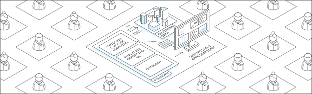

<!-- source: https://palantir.com/docs/foundry/getting-started/ · mirrored 2026-08-18 from Palantir Foundry docs -->

# Getting started with Palantir

The Palantir platform is designed to help you use data to solve real-world problems. The Palantir platform is used by:

* **All types of organizations:** From early-stage startups, to multinational companies, to governments around the world.
* **All types of users:** From IT administrators, software engineers, and data scientists, to nurses, technicians, and operators.

## Get access

If you are ready to begin, but do not yet have access to the Palantir platform, you can:

* **[Sign up for AIP Developer Tier ↗](https://signup.palantirfoundry.com/signup?signupPermitCode=BUILD_WITH_AIP\&tracking-code=ptcom-docs)** to get access to the platform and start building with a trial account.
* **[Sign up for an AIP Bootcamp ↗](https://www.palantir.com/platforms/aip/bootcamp/)** to go from zero to use case in hours or days, working alongside Palantir engineers.

## Understand the platform

To help you navigate this documentation, here is a summary of what you will find on the following pages:

* **[Introductory concepts](/docs/foundry/getting-started/introductory-concepts/):** This page introduces the Ontology and discusses the difference between the data layer and the object layer.
* **[Authentication](/docs/foundry/getting-started/authentication/):** Learn about authenticating to your Palantir enrollment, using either your own identity provider or our self-service user directory.
* **[Log in to the platform](/docs/foundry/getting-started/login/):** Learn how to configure and use a passkey to log in to Palantir.
* **[Orientation and navigation](/docs/foundry/getting-started/orientation-and-nav/):** This page provides a brief guide to the primary user interface for the Palantir platform.
* **[Delivering a use case](/docs/foundry/getting-started/delivering-a-use-case/):** Provides guidance on building a use case for your organization.
* **[Application reference](/docs/foundry/getting-started/application-reference/):** The Palantir platform provides you with many applications and capabilities to help achieve your goals. This page is intended to help you determine which application in the Palantir platform is best suited for your needs and use case.
* **[Next steps by role](/docs/foundry/getting-started/next-steps-by-role/):** Depending on your role or the type of work you perform, there are different recommendations for which applications or workflows you might find most useful.
* **[Training application](/docs/foundry/getting-started/training-application/):** Describes an in-platform application offering a set of courses from [learn.palantir.com ↗](https://learn.palantir.com).
* **[Foundry platform summary for LLMs](/docs/foundry/getting-started/foundry-platform-summary-llm/):** Provides a high-level overview of Foundry's architecture, core terminology, data integration patterns, applications, AI platform features, developer tools, security, and governance—designed to help LLMs and AI agents understand and interact with the platform.

## Start building your use case

Once you have platform access, we recommend the following resources to help you get started in the Palantir platform:

* **[Examples](/docs/foundry/getting-started/start-with-examples/)** is a comprehensive library of reference examples, tutorials, and starter kits for quickly developing new applications, designed to facilitate learning and effective platform usage.
* The **[Palantir Learning ↗](https://learn.palantir.com/)** portal provides courses, workflow tutorials, certifications, and more to help you get the most value out of the platform.
* **[AIP Assist](/docs/foundry/assist/overview/)** is an LLM-powered tool designed to help you navigate, understand, and generate value with the Palantir platform. AIP Assist can be accessed from within the platform through a dedicated icon in the lower-left corner of the interface.
* **[Solution Designer](/docs/foundry/solution-designer/overview/)** is an interactive tool for creating architectural representations of solutions for the Palantir platform. If you already have access to an enrollment, Solution Designer can be found at `<your-enrollment-URL>/workspace/solution-design`.

## Get in touch on the Developer Community

Learn more about the Palantir platform from the following resources:

* The [Palantir Developer Community ↗](https://community.palantir.com/) is a space to ask and answer questions from your fellow users.
