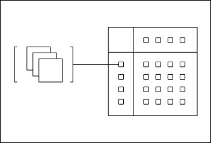
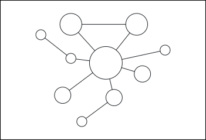

<!-- source: https://palantir.com/docs/foundry/getting-started/introductory-concepts/ · mirrored 2026-08-22 from Palantir Foundry docs -->

# Introductory concepts

As you get started in the Palantir platform, it can be helpful to think about data in the platform living in two places: the *data layer* and the *object layer*.

## Data Layer

In the data layer, data is stored inside **datasets**, which typically represent tabular data like you might find in a spreadsheet, but support data at any scale. Datasets usually come from organizational data sources that are synced into the platform, but you can also create your own datasets by uploading approved or notional data.

Every dataset in the Palantir platform maintains a record of how it was produced, so that the origins of data are always preserved and accessible. This concept is known as **data lineage**.

* Palantir keeps track of which **input datasets** were used to produce which **output datasets**. This allows you to always know where a piece of data came from, and understand how data is used.
* Palantir tracks the **logic** that was applied to produce each output dataset. For example, an input dataset might be *filtered* to produce a smaller output dataset; that filtering logic is preserved and visible in the platform. There are many ways to write logic in the platform, ranging from code repositories to point-and-click tools.

You can interact with data using one of Palantir's many **applications**. When you use applications, anything you produce, whether it is a dataset, code, or analysis, is stored in the platform as a **resource**. Resources are organized into **Projects**, which serve as permission boundaries for grouping and organizing related work. We will cover the details of how to access and use Projects in one of the upcoming sections.

## Object Layer (Ontology)

In the object layer, or Ontology, data is stored in **objects** and **links**. Objects represent real-world concepts like an airplane, vehicle, or customer, while links represent the relationships between objects. The object layer takes the data stored in tabular datasets—rows and columns of data—and converts it into a series of concepts that anyone in the organization can understand.

In addition to helping make data more understandable, converting data from datasets into objects and links unlocks a broad set of tools for interacting with objects. You can define **actions** that describe how objects can be changed by people in your organization. This enables you to build **applications** that access data from objects and capture user decisions back into the system.

The definitions of objects, links, and actions together make up what is called the Ontology, a digital representation of your organization. Developing and using the Ontology to translate data into operational outcomes is a key part of getting value out of the Palantir platform.
