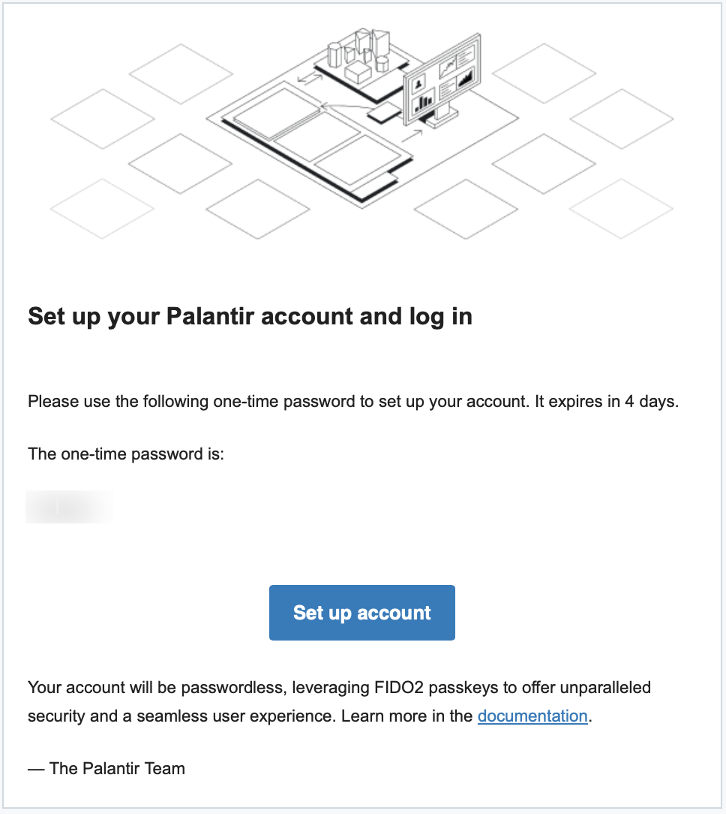
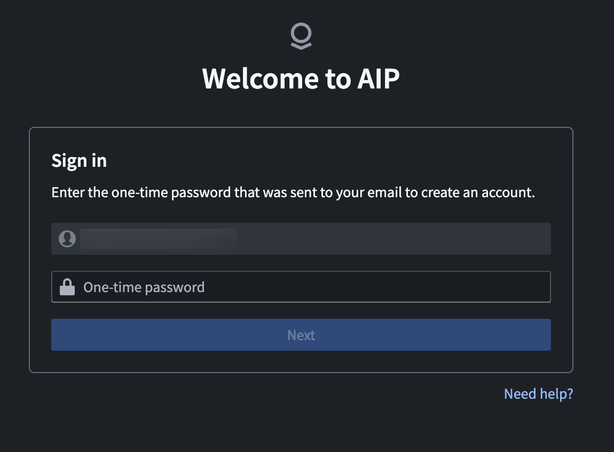
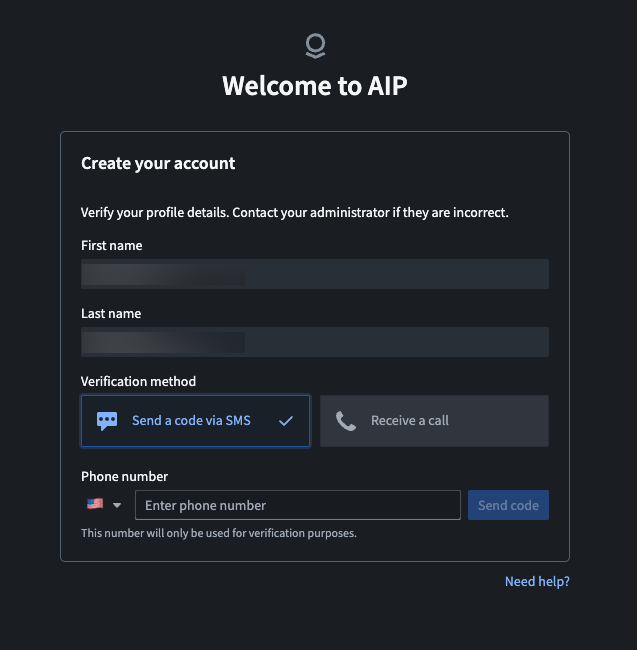
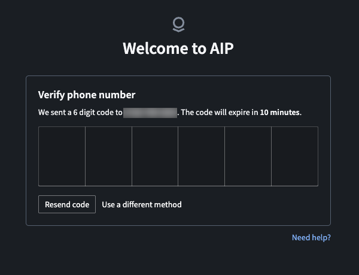
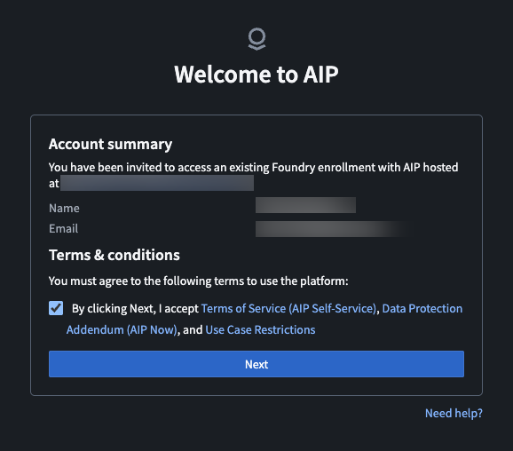
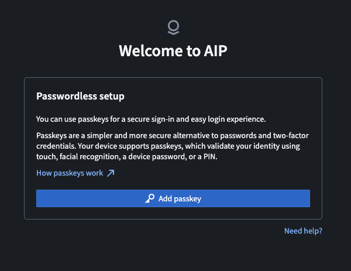
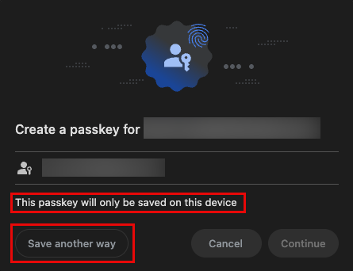
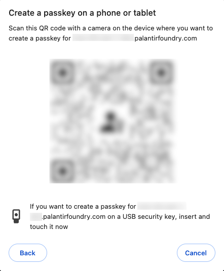
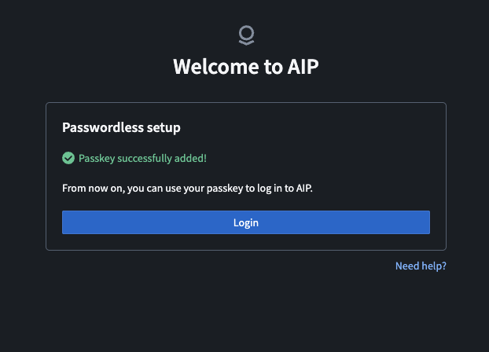
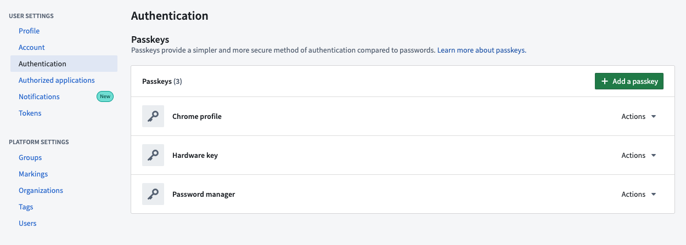

<!-- source: https://palantir.com/docs/foundry/getting-started/login/ · mirrored 2026-08-18 from Palantir Foundry docs -->

# Log in to the platform

The Palantir platform supports SSO authentication and passwordless login using passkeys. If your organization uses SSO, proceed with the steps from your SSO provider. To learn more, refer to the [authentication documentation](/docs/foundry/getting-started/authentication/). To log in to the platform with a passkey or manage your passkeys, review the sections below.

## Set up and configure a passkey

To configure and log in with a passkey, you must first receive an email from Palantir titled "Set up your Palantir account and log in". This email will contain a one-time password and a link to set up your account. You will be prompted to verify your phone number and create a passkey, which you can then use to log in. Review the sections below for more detailed instructions.

When configuring a passkey, you will have various storage options:

* **Save a passkey to the device you are using:** Depending on your device and browser, the options to save a passkey on the device you are using will vary. For example, if you are using an iPhone, you can save the passkey to your iCloud Keychain, and if you are using Google Chrome, you can save the passkey to your Chrome profile or to the Google Password Manager. It is up to you to select your preferred credential store. This may be the one you are most familiar with, or the one that offers the easiest identity verification option for you.
* **Save a passkey to a security key:** Security keys are physical devices that enhance account security by adding an extra layer of authentication. When you save a passkey to a security key, you will need to insert the security key and enter your PIN and/or touch the security key's sensor every time you need to log in.
* **Save a passkey to a mobile device:** When you save a passkey to a mobile device, you will need to scan a QR code with that device to log in. You will also be able to log in directly from that device without scanning a QR code. For example, if you add a passkey from a laptop and save it on your mobile device by scanning a QR code, the stored passkey can be used to log in directly from that mobile device. Ensure that Bluetooth is enabled on your device(s) when using this option.

Note that some devices may automatically offer the default option for storing a passkey, such as Windows Hello or iCloud Keychain. You do not need to choose the device's default option to store your passkey. You have the option to back out of the default dialog and select your preferred passkey storage option.

You do not need to use a specific authentication application. Your device's built-in security features such as facial recognition or fingerprint scanning can be used along with your device's native camera.

Depending on your device, the option to select a security key or a mobile device may appear slightly differently. For example, on iOS, the option may read **iPhone, iPad, or Android device** and list security key separately, while other devices may read **Use a phone, tablet, or security key**. Read the options carefully and select the option that reflects your desired passkey storage method.

:::callout{theme="warning" title="Device and browser support"}
Ensure that your mobile device and browser are supported before attempting to store a passkey. The following versions are supported for iOS and Android devices:

* **iOS devices:** The latest version of iOS and one prior version are supported. For example, If the latest version of iOS is iOS 18, iOS 18 and 17 are supported.
* **Android devices:** Devices running Android 13 and later are supported. <br><br>
  The Palantir platform is [fully supported](/docs/foundry/getting-help/supported-browsers-network-requirements/#supported-browsers) on Google Chrome and Microsoft Edge versions released within the past year. Mobile usage requires Google Chrome, Microsoft Edge, or Apple Safari. For best results, use Google Chrome or Microsoft Edge if possible.
:::

Follow the instructions below to continue configuring your passkey:

1. Navigate to the email from Palantir titled "Set up your account and log in", and select the **Set up account** option. <br><br>  <br><br>
2. Enter the email address that you used to register and the temporary password included in the email, then select **Next**. <br><br>  <br><br>
3. Enter your first and last name, then choose between verifying your account with SMS or with a phone call. <br><br>  <br><br>
4. Verify your phone number by entering the six digit authentication code provided by SMS or phone call. If you did not receive a verification code through SMS or phone call, select **Resend code** under the verification number input. <br><br>  <br><br>
5. If you were invited to an existing enrollment, agree to the terms and conditions to proceed. Otherwise, skip to step 6. <br><br>  <br><br>
6. Select **Add passkey**. <br><br>  <br><br>
7. Select a destination to save your passkey, then follow the on-screen instructions. Your device may automatically suggest the default credential store, but you can choose a different option by selecting **Save another way**. Pay special attention to whether your passkey will only be available on one device. <br><br>  <br><br>
   * **Save a passkey to the device you are using:** Select your preferred credential store and follow the instructions on your device to verify your identity. This may involve a fingerprint scan, facial recognition, or entering a PIN. Choose a credential store that you are familiar with, or one that offers the easiest identity verification option for you.
   * **Save your passkey to a security key:** Select **Use a phone, tablet, or security key**. You will then need to insert the security key and enter your PIN and/or touch the security key's sensor.
   * **Save your passkey to a mobile device:** Select **Use a phone, tablet, or security key**. Then, scan the QR code with your mobile device's camera and follow the instructions on your mobile device to verify your identity. <br><br>
      
   <br><br>
   * To avoid issues, ensure that you are using a [supported browser](/docs/foundry/getting-help/supported-browsers-network-requirements/).
8. Once your passkey has been successfully added, you will see the following screen: <br><br> 

Now that you have successfully configured a passkey, follow the instructions below to log in with your passkey.

## Log in with a passkey

To log in with a passkey, review the section below that applies to your situation. If you navigated away from the login page and do not remember the URL, check your registration email. After successful creation of a passkey, you will receive an email titled "Your Palantir account was successfully set up". Select the **Log in** option in this email to navigate to the platform login page.

### Log in with a passkey stored on your device

If your passkey is stored on the same device that you are using to log in, follow the instructions below.

1. On the Palantir login page, enter the email address that you registered with and select **Next**.
2. Select **Use passkey** to log in to your account using the passkey stored on your device. Your device will automatically recognize that a passkey is configured for this URL and guide you to verify your identity.
3. Follow the on-screen passkey instructions to unlock your device and select your passkey. This may involve facial recognition or a fingerprint scan to verify your identity. Once verified, you should have access to the platform.

### Log in with a passkey stored on a mobile device

If your passkey is stored on a mobile device that is not the device you are using to log in, follow the instructions below.

1. On the Palantir login page, enter the email address you registered with and select **Next**.
2. Select **Use passkey**, then **Use a phone, tablet, or security key**. Select **Continue**.
3. A QR code will appear on screen, which you can scan from the mobile device where your passkey is stored. After you scan the QR code, follow the instructions on your mobile device to verify your identity. After verification, you should have access to the platform.

### Log in with a passkey stored on a security key

If your passkey is stored on a security key, follow the instructions below.

1. On the Palantir login page, enter the email address you registered with and select **Next**.
2. Select **Use passkey**, then **Use a phone, tablet, or security key**. Select **Continue**.
3. A dialog will appear on screen instructing you to insert the security key and enter your PIN and/or touch the security key's sensor. After following the instructions, you should have access to the platform.

## Add additional passkeys

We recommend that you add more than one passkey to your account as backup. You may add up to four passkeys per account, but you may only have one passkey per credential store. This means that you can only store one passkey in Windows Hello, iCloud Keychain, Samsung Pass, or other credential store. If you are attempting to create a new passkey, ensure that you do not already have a passkey stored with that credential store. For example, if you have already stored a passkey in your iCloud Keychain, attempting to store a second passkey in your iCloud Keychain will result in an error.

Before adding additional passkeys, make sure that existing passkeys have descriptive names to avoid confusion. A good naming convention for passkeys is the device it was created on plus the credential store, for example, "Work Laptop Chrome" or "Personal iPhone Keychain".

:::callout{theme="warning"}
Passkey names are visible to your organization's administrators during account lockout recovery. Do not include personal or sensitive information in passkey names.
:::

To add an additional passkey to your account, select **Account** at the bottom of the right toolbar, then select **Settings**. On the settings page, navigate to the **User settings** section on the top right and select **Authentication**. You can also access the authentication page using the following URL:

```plaintext
<your-enrollment-URL>/workspace/settings/authentication
```



On the **Authentication** page:

1. Select the **Add a passkey** option.
   * You may be asked to re-authenticate before adding an additional passkey.
2. Select a destination to save your passkey, then follow the on-screen instructions.
   * To save your passkey on the device you are using, select your preferred credential store and follow the instructions to verify your identity.
   * To save your passkey on a security key or mobile device, select **Use a phone, tablet, or security key**. You will then need to scan the QR code with your desired mobile device, or insert a security key and enter your PIN and/or touch the security key's sensor.

## Remove a passkey

To remove a registered passkey, select **Account** at the bottom of the right toolbar, then select **Settings**. On the settings page, navigate to the **User settings** section on the top right and select **Authentication**. You can also access the authentication page using the following URL:

```plaintext
<your-enrollment-URL>/workspace/settings/authentication
```

1. Use the **Actions** dropdown menu next to the passkey you would like to remove.
2. Select **Delete**, then **Confirm** you want to remove the passkey. Once removed, you will no longer be able to use this passkey to log in.
3. After deleting a passkey from the platform, navigate to the credential store that the passkey is stored in and delete it there as well. If you do not delete the passkey from the credential store, you will **not** be able to register a new passkey with that credential store.

## Reset your account

If you cannot access any of your passkeys, depending on your enrollment type, you can use the self-service passkey reset or contact an enrollment administrator. To avoid this scenario, we recommend registering at least two passkeys in case access to one passkey is lost. Make sure to add descriptive names for your passkeys for easy identification.

If you created your enrollment, use the **Reset passkey** option found on the login page below the login form and complete the verification steps. Depending on your enrollment, this passkey reset may be immediate, or it may be submitted for review.

If you were added as a user to an existing enrollment, contact your enrollment administrator to [manage your passkeys](/docs/foundry/authentication/user-directory/#manage-passkeys).

## Support

If you have trouble accessing your account, select the **Need help?** link under the login form and fill out the form on the **AIP/Developer Tier support** page.

Provide the following information to help us identify the problem:

* The browser you are using, for example, Google Chrome, Microsoft Edge, or Firefox.
* The kind of device you are using; this could be a Macbook, Windows PC, iPhone, or Android device.
* The device you are saving the passkey to; this could be the device you are using, a separate mobile device, or a security key.
* The credential store you are using, such as Windows Hello, Samsung Pass, or iCloud keychain.

## Recommended passkey types and best practices

We recommend that you maintain at least two different passkeys for your account. For example, you can store one passkey on your phone and one in your Chrome profile.

On **Windows** computers, we recommend the following approaches to managing passkeys:

* [Create and store a passkey on a phone or a YubiKey ↗](https://learn.microsoft.com/en-us/windows/security/identity-protection/passkeys/?tabs=windows#create-a-passkey).
* [Create and store a passkey directly in Google Chrome ↗](https://blog.chromium.org/2022/12/introducing-passkeys-in-chrome.html).

On a **macOS** device, you can create and store passkeys that are synced across your devices using iCloud:

* [Ensure your iCloud passkey is enabled and use an iCloud passkey ↗](https://support.apple.com/en-us/109016).
* [Manage passkeys ↗](https://support.apple.com/en-us/102195).

On **mobile** devices, you can create and store passkeys in Google Password Manager or iCloud keychain:

* [Create and store passkeys on iOS ↗](https://support.apple.com/guide/iphone/use-passkeys-to-sign-in-to-apps-and-websites-iphf538ea8d0/ios).
* [Create and store passkeys on Android devices ↗](https://support.google.com/android/answer/14124480?hl=en\&ref_topic=7340889\&sjid=8769059686497098598-NA).

## Troubleshooting

### Lost access to passkeys

If you cannot access any of your passkeys, your account needs to be reset. This process may vary depending on whether you created your own enrollment, or if you were added to an existing enrollment. For detailed instructions, refer to the [account reset](#reset-your-account) section.

### My one-time password is expired

If your one-time password (OTP) expired before you were able to configure your account, you must request a new one. If you were added to an existing enrollment, contact your enrollment administrator for a new OTP.

If you created your own enrollment, navigate to the email from Palantir titled “Set up your Palantir account and log in”. Select the **Set up account** option to open the **Welcome to AIP** page. Here, you can select the **Need help?** link under the sign in form and fill out the support form to request a new OTP.

### Unable to create a passkey

There are multiple reasons why a passkey may fail to register, including verification time out, failure to authenticate before passkey creation, or connection issues with the device where you are trying to store the passkey. Ensure that you verify your identity within the time window, and that bluetooth is enabled on your device(s).

If you are still having issues, ensure that you do not already have a passkey for this account in the credential store you are trying to use. For example, if you delete an existing Windows Hello passkey from the platform, then attempt to register a new Windows Hello passkey before deleting the old one from **your device**, you will get an error. You must first delete existing passkeys from a given credential store (for example, iCloud Keychain, Windows Hello, or Google Password Manager) before you can store a new passkey in that credential store.

Some devices may need to have certain features enabled in order to store passkeys.

* On Apple devices, enable iCloud Keychain in System Settings and ensure that your settings allow passkeys to be synced across devices. For more information refer to the [iCloud Keychain documentation ↗](https://support.apple.com/en-us/109016).
* On Android devices, the screen lock feature must be enabled. The presence of a screen lock is a prerequisite for using passkeys on Android devices for security reasons. For more information refer to the [Android screen lock documentation ↗](https://support.google.com/android/answer/9079129?hl=en).

Each device, browser, or operating system has its own default credential store, such as iCloud Keychain or Samsung Pass. Ensure that the credential store of your choice is enabled on your device.

### Passkey not working on mobile

Some passkeys are device-specific and will only work when you use the device on which they are stored. These device-specific passkeys will alert you during creation that they can only be used on one device. Other passkeys may be accessible on multiple devices, such as passkeys stored in password managers. To ensure that you are able to use passkeys across devices, make sure that you have enabled autofill for the credential store provider on your device(s).

For example, if you wish to use Google Password Manager passkeys on multiple devices, Google Password Manager must be enabled as the autofill provider in your device settings. For more information on using Google Password Manager passkeys across devices, visit the official [Google Password Manager documentation ↗](https://support.google.com/accounts/answer/6208650?hl=en\&co=GENIE.Platform%3DiOS).

### Forgotten username

Your username is the email account you used to register for a Palantir account. The first email you will receive from Palantir is titled “Set up your Palantir account and log in”. Search your email account(s) for this email to verify that you have the right account.

### Client-side passkey issues

If you are having issues with passkeys and are not sure whether this is due to the Palantir platform or software/hardware limitations, you can test whether you are able to use passkeys in general on [webauthn.io ↗](https://webauthn.io/). Register and use a passkey on this site to identify whether passkeys work on your device. If you are still having issues, or the issue appears to originate from the Palantir platform, select the **Need help?** link under the sign in form and fill out the form on the **AIP/Developer Tier support** page to get help with your issue.

An outdated browser or operating system may not support passkeys. Use an up-to-date operating system and a version of Google Chrome, Microsoft Edge, or Apple Safari released within the past year. Review our [supported browsers](/docs/foundry/getting-help/supported-browsers-network-requirements/#supported-browsers) for more information.

### My organization does not support passkeys

If your organization does not support physical or digital passkeys in any capacity, it may not be possible to create a self-service Palantir account, including AIP Developer Tier accounts. If you will be attending a Palantir event and require access to the platform, contact the event organizer to check if compatible hardware can be provided for you.

### Phone number is unavailable

During account creation, you will be asked for a phone number. If you get the error message **Phone number is unavailable**, you will need to enter a different number. Phone numbers can only be used once per enrollment.

### Email domain restrictions

Your enrollment may restrict which email domains can be used to register or log in. If your email domain is not permitted, you may encounter an error during sign-up indicating that your domain is restricted or that your invitation is no longer valid. During login, domain restrictions may result in a general login failure without additional details.

This can occur when an enrollment administrator updates domain restrictions after an invitation was sent or after your account was created. If you previously had access or received an invitation link that is no longer working, contact your enrollment administrator to verify which email domains are currently permitted and to request a new invitation if needed.

### The authenticator used to register the passkey is not allowed

If you are using an outdated operating system or browser, you may receive the following error when trying to use a passkey:

```
The authenticator used to register the passkey is not allowed or its details could not be read.
Please confirm you are using a supported browser before trying again.
```

Passkeys from outdated operating systems or browsers are blocked for security reasons. To resolve this issue, update your operating system or browser, or use a device with up-to-date software. Ensure that you are using a [supported browser](/docs/foundry/getting-help/supported-browsers-network-requirements/#supported-browsers) to avoid issues.

### Passkey does not meet security requirements

Some enrollments enforce security policies that restrict which types of passkeys can be used. If your passkey does not satisfy these requirements, you will encounter an error when attempting to log in or register a new passkey indicating that the passkey does not meet the enrollment's security requirements. If a policy was changed after you registered your passkey, the error may indicate that it no longer meets the requirements.

This typically means your enrollment requires specific authenticators, such as hardware security keys, rather than built-in device passkeys. If you have multiple passkeys registered, try using a different one. Contact your enrollment administrator to confirm which passkey types are approved for your enrollment.
