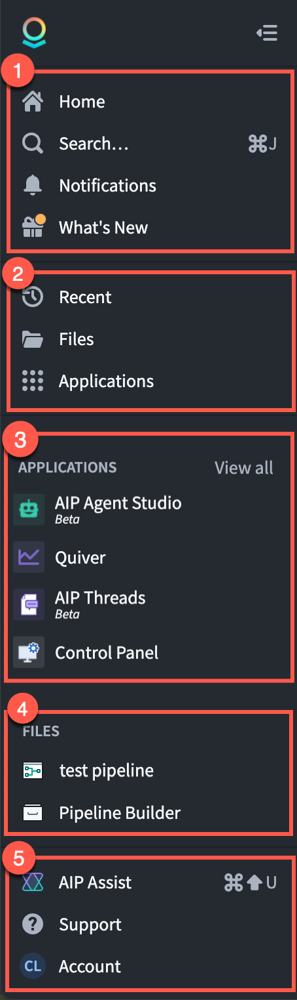
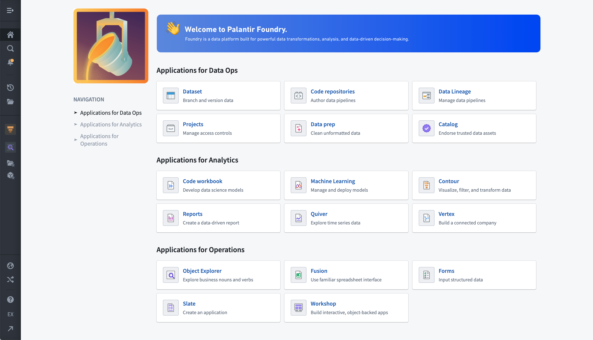
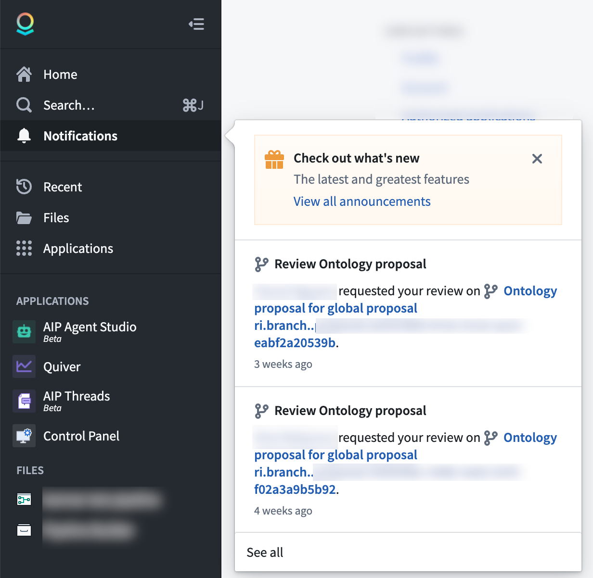
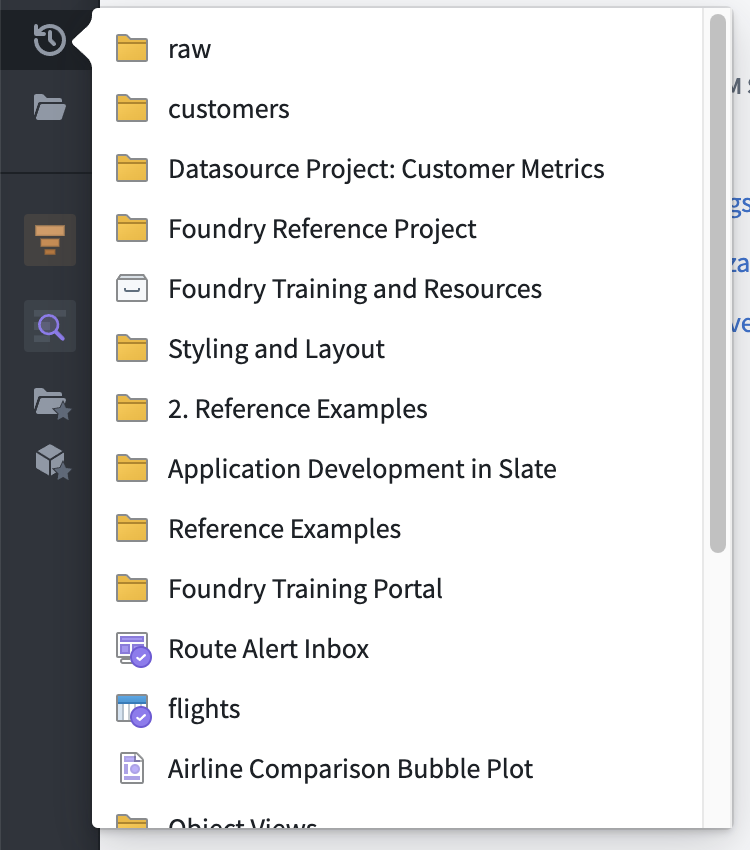
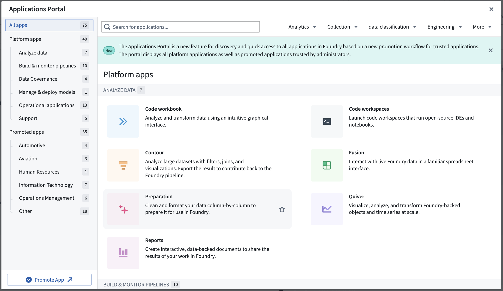
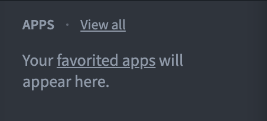
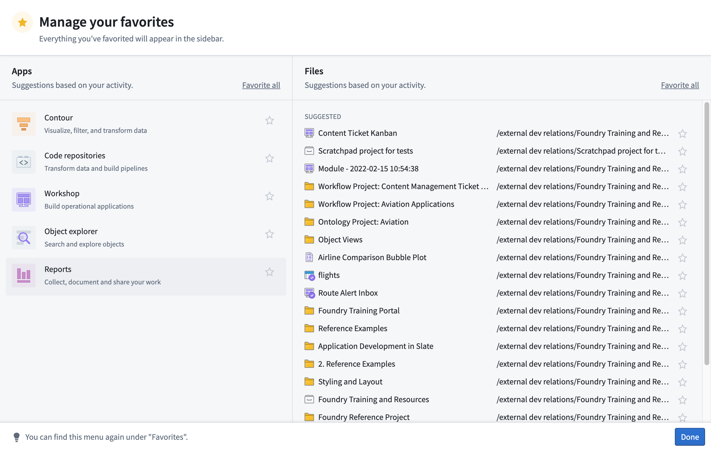
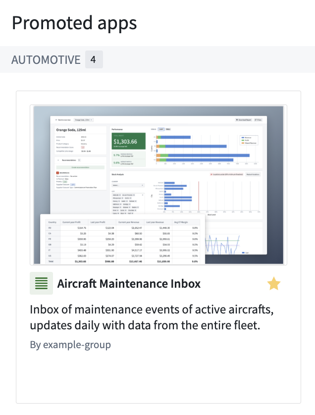
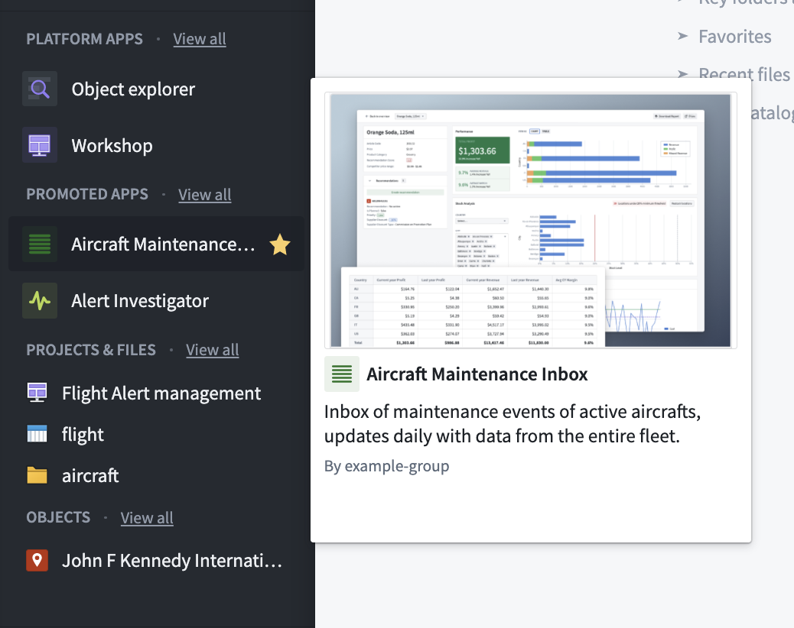
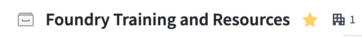

<!-- source: https://palantir.com/docs/foundry/getting-started/orientation-and-nav// · mirrored 2026-08-18 from Palantir Foundry docs -->

# Orientation and navigation

You can think of the Palantir platform as an operating system for the data in your organization. This page provides information about how to navigate and find the tools and resources required to work effectively in this operating system.

This page provides information about the **[workspace navigation sidebar](#workspace-navigation-sidebar)** that serves as a home base for moving around the platform and the **[search](#search)** feature for locating resources or data of interest. You will also learn about the [support](#support) options available to you while working in the platform. Finally, your [Palantir account settings](#account) will allow you to configure your public user and platform settings.

## Workspace navigation sidebar

The sidebar is your constant companion in the platform and the starting point for navigation. Open and collapse the sidebar with the icon in the upper right or with the keyboard shortcut `Cmd+O` (macOS) or `Ctrl+O` (Windows).

The sidebar has five primary sections that allow you to navigate to different features and tools within the platform:

|  |  |
| --- | --- |
|  | **① Home:** Return to your organization's landing page **① Search...:** Open the Quicksearch dialog **① Notifications:** View platform and application notifications **① What's New:** Read product announcements and release notes in the platform  **② Recent:** Quickly navigate to recently accessed resources **② Files:** Jump to the Projects landing page, powered by Compass **② Applications:** Find and access all platform applications using this portal  **③ Applications (Favorited):** Find applications you have previously added a star to. Organize and access your favorite applications  **④ Files (Favorited):** Find files you have previously added a star to. Organize and access your favourite resources and objects  **⑤ AIP Assist:** LLM-powered assistant for getting help **⑤ Support:** Access Palantir documentation, training resources, and help **⑤ Account:** Find account details and review permissions and groups **⑤ Other Workspaces:** Access custom Workspaces and the Control Panel (availability depends on permissions) |

## AIP Assist

We recommend **AIP Assist**, Palantir's LLM-powered assistant, as your first stop in getting help regarding the Palantir platform. AIP Assist can answer questions about the platform in multiple languages and can provide guidance about how to use the platform, including tutorials.

You can access AIP Assist from the lower-right corner of the sidebar or by using the keyboard shortcut `Cmd+U` (macOS) or `Ctrl+U` (Windows).

AIP Assist is "context-aware" in that it can detect which application you are currently working in, but AIP Assist does not have access to any of the data you are working with.

## Home

New Palantir enrollments come with a default home page that helps users orient themselves and learn about the platform. Administrators or builders can also create custom landing pages for various user groups on the platform. Some enrollments may use a completely customized home page, while others may use standard components to provide access to frequently-used parts of the platform.

While most home pages focus on navigation, you may also find announcements about the platform, starting points for common workflows within your organization, or links to custom documentation on the landing page.

## Search

Search, also known as [Quicksearch](/docs/foundry/compass/quicksearch/), is a tool for navigation and discovery of elements in the platform. Search is made of two parts:

1. **Jump-to mode:** Provides a short list of personalized results to directly navigate users to the main types of available content: platform applications, custom applications, objects, datasets, and other resources.
2. **Full results mode:** Designed to help users find content and discover what exists in the platform. Users can perform searches of platform apps, objects, datasets, and other files with advanced filters, rich metadata, and a ranking algorithm to highlight the most relevant results.

:::callout{theme="neutral"}
To open Quicksearch, select **Search...** in the navigation sidebar, or use `⌘ + J` (macOS) or `Ctrl+J` (Windows).
:::

## Notifications

The Notifications panel collects notices from across the platform, ordered from newest to oldest. Most notifications include links to navigate directly to the relevant resources. Some, such as access requests, can be responded to inline without needing to navigate to another page.

By default, notifications are delivered both within the platform in the Notifications panel and by email. Under the **See all** link, notifications are grouped by type for easier navigation. The notification **Settings** give you granular control over global and per-notification-type delivery preferences. If notifications are unread, the bell icon will have a small, yellow badge. If a notification occurs while you’re using the platform, a small pop-up in the lower left corner will briefly show the message.

## Recent

The Recent panel simply lists the last 20 resources you have opened or interacted with. Between **Favorites** and **Recent,** it’s possible to quickly navigate between primary resources in use for any project without needing to return to **Search** or browse through the Project folder structure.

## Files

[Files, powered by the Compass application](/docs/foundry/compass/overview/) takes you to the landing page for the Project folder structure, where you can access top-level **Portfolios**, **Projects**, **Your files**, and **Shared with you** shortcuts. You will learn more about Projects in the next step of this guide.

## Applications portal

The [Applications portal](/docs/foundry/app-building/curating-apps/) is a tool for finding and accessing all apps in the platform, including both platform apps and custom promoted applications.

## Favorites

The **Favorites** section of the sidebar keeps links to specific applications, resources, and individual objects for quick navigation. Use `Ctrl + Click` on Windows or `Cmd + Click` on macOS to open a favorited resource in a new browser tab.

When you first use the platform, your **Favorites** section is empty and only **Applications** will show in the sidebar. Hover over the **Applications** header and select **View all** to see all the different applications in the platform.

|  |  |
| --- | --- |
|  |  |

In this view, you will see suggested applications and resources based on your recent usage. We will cover which applications we recommend [based on your role](/docs/foundry/getting-started/next-steps-by-role/) later in this guide. To learn more, consider looking at the [application reference](/docs/foundry/getting-started/application-reference/).

### Promoted applications

From the Applications portal, you can pin useful applications to mark them as "promoted" for easier access on screen. From the portal, find your desired application and select the star icon on the portal (see left), or find the **Promoted apps** heading on the left sidebar and use the **✔ Add** option. Promoted apps appear under a dedicated section for quick access (see right).

|  |  |
| --- | --- |
|  |  |

### Favorites

You can add and remove favorites with the star icon while navigating the folder structure or from within an open resource in a Palantir platform application.

Think of favorites as shortcuts that you can add and remove to keep frequently used resources close at hand.

### Favorite objects, object types, and object type groups

[**Object Explorer**](/docs/foundry/object-explorer/overview/) is an application you can use to explore objects and links in the platform. When you navigate to an individual object view, you can select the star next to its title to save it as a favorite. This will add the object to your sidebar.

## Support

Palantir has a wide range of capabilities, features, and components available for your use cases and workflows. To help you understand how the platform can best serve your needs, the **Support** panel is a starting point for learning more and getting answers to your questions. From here, you can access:

* **Ask AIP Assist:** Ask AIP questions.
* **Training:** Learn about the platform through the Training application, in conjunction with the [Palantir Learning portal ↗](https://learn.palantir.com/).
* **Explore Examples:** Find motivation from an existing use case solution.
* **Platform documentation:** Review documentation.
* **Report issue:** Submit a platform issue to the Issues application.
* **View support tickets:** View existing tickets.
* **Platform updates:** In-platform announcements and release notes.
* **Status page:** Access your Palantir platform's status page (where enabled).
* **About:** License information.

The [Palantir Customer Success Services team ↗](https://www.palantir.com/customer-success-services/) offers support, training, and consultation services to help you and your organization get the most out of the platform. If included in your agreement, you can contact the team with questions using the **Report issue** option to create a support ticket in the **Issues** application.

[Review the documentation on getting help.](/docs/foundry/getting-help/overview/)

## Account

Select **Account** in the Account panel to bring up your account overview. Here, you can select your name to see your **User ID** and permission **Groups**, navigate to **Settings** to edit your user and platform settings, change platform language, log out, and more.

You can customize your profile with a profile image and additional information to be stored in the platform for viewing by users in your organization. This information will appear when other users hover over your name in Projects and resources. Adding distinguishing information is helpful for operational workflows that rely on assigning work or sharing resources, especially in cases where you share the same name with another coworker.

Within **Settings**, the **Notifications** section is a control center for changing notification delivery settings.

## Other workspaces

The main platform workspace is defined by the Workspace sidebar that we have been exploring. You can access other workspaces by selecting **Open other workspaces**.

### Control Panel

Administrators can access the **Control Panel** workspace for managing an enrollment. See the [Administration documentation](/docs/foundry/administration/overview/) for further resources.

### Carbon Workspaces

Application builders can use **Carbon** to create curated, custom workspaces for their end users. A wide range of applications can be combined to provide a tailored experience.
