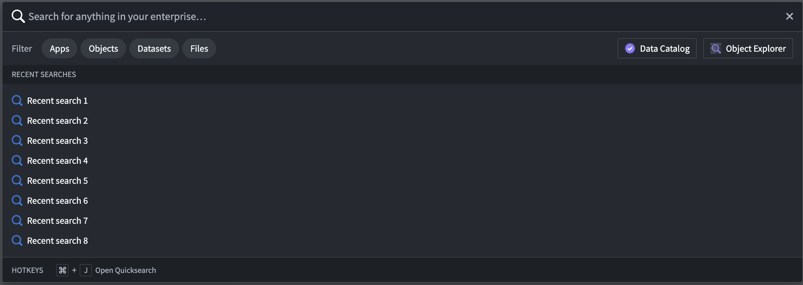
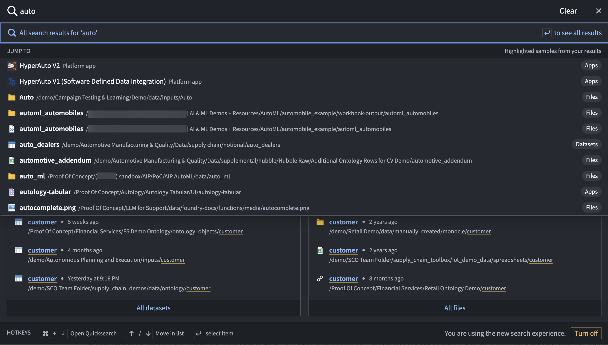
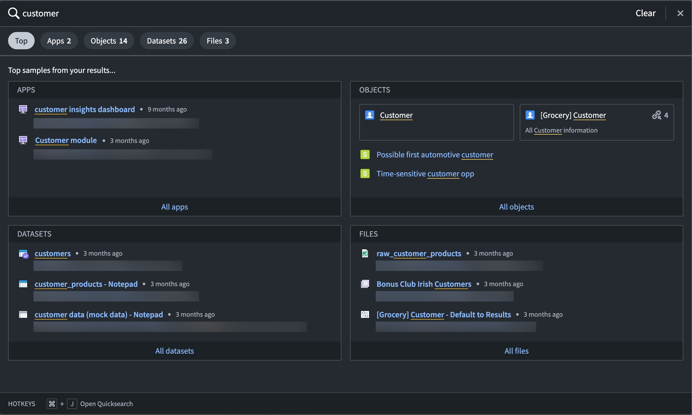
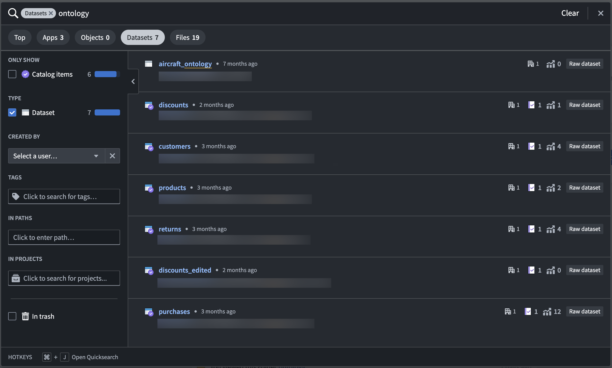
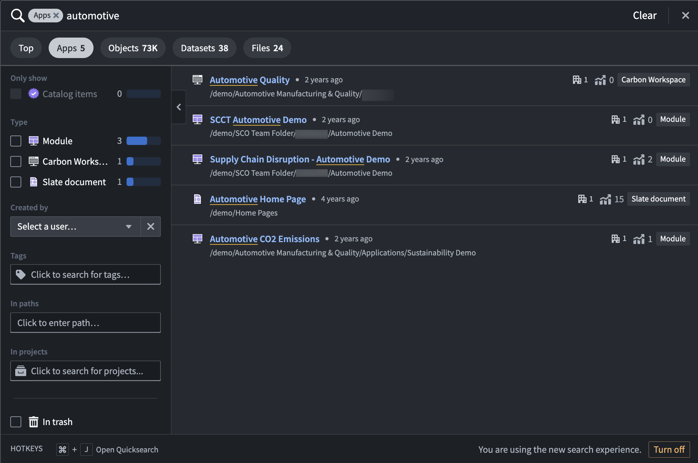
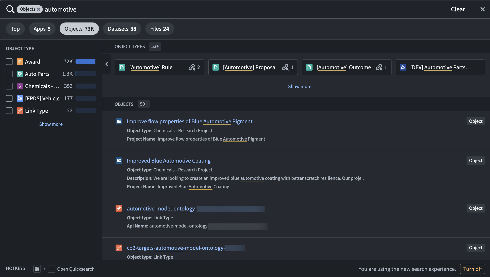
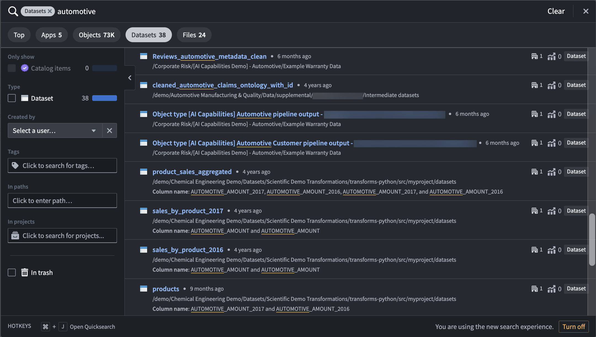
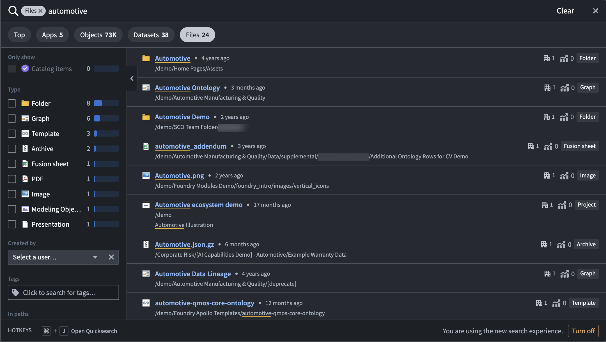

<!-- source: https://palantir.com/docs/foundry/getting-started/quicksearch/ · mirrored 2026-08-18 from Palantir Foundry docs -->

# Quicksearch

Quicksearch is a tool for fast and easy search, navigation, and discovery in the Palantir platform. Access Quicksearch from the **Search** icon in the left sidebar, or use `Cmd+J` (macOS) or `Ctrl+J` (Windows). Quicksearch consists of two view modes:

1. **Jump-to mode:** Provides a short list of personalized results to directly navigate users to the main types of available content: platform applications, custom applications, objects, datasets, and other resources.
2. **Full results view:** Designed to help users find content and discover what exists in the platform. Users can search for Palantir apps, objects, datasets, and other files using advanced filters and find the most relevant results along with rich metadata.

## Jump-to mode

* **Easy to access:** To open Quicksearch, select **Search...** in the navigation sidebar, or shortcuts `Cmd+J`(macOS) or `Ctrl+J` (Windows).
* **Navigation-focused:** The initial dialog and dropdown are navigation-oriented. Start typing to receive suggestions. Use the keyboard to jump to any page in the platform.
* **Search only on titles:** Jump-to mode only searches on titles of apps, resources, and objects. To search additional fields and metadata, use the full results mode.
* **Single click to full results:** From the dialog and dropdown, press `Enter/Return` or filter by **Apps**, **Objects**, **Datasets**, or **Files** to move to advanced search mode.
* **Personalized results:** Results in Quicksearch are personalized by your recently accessed or favorited resources, and more.

## Full results view

* **Discovery-focused:** Designed for searching and discovering, users can compare multiple search results to find the resources most useful to them.
* **Search on various fields:** Search for descriptions, column names, file paths, and more. Additionally, filter by creator, tags, Projects, folders, and more.
* **Tabs:** The interface includes a top results tab and four tabs by which to filter: **Apps**, **Objects**, **Datasets**, or **Files**.
* **Metadata:** Users can view information on each result to evaluate whether the resource is relevant to them. Search by keyword highlights, file path, view count, last updated time, key security metadata, and more.
* **Ranking:** Results are ranked based on an algorithm that contains text matching and other boost parameters.
* **Filters:** Filters are provided for advanced searches. Additionally, by selecting the filter tabs from the initial search dropdown, users can perform complex filter searches (for example, “all reports under project X that were created by me”).
* **Permissions:** Quicksearch respects all existing permissions in the platform. Content with `Discover` permissions would open a `Request access` message. Users will not see content to which they do not have access.

:::callout{theme="warning"}
Quicksearch **does not** search across all object instances in the platform. Quicksearch is limited to search for instances on 250 object types, prioritized by `Active` object types with `Prominent`, then `Normal`, and then `Experimental` status (deprecated and hidden object types are not searched on). If a user cannot find what they are looking for, they are prompted to try searching in [Object Explorer](/docs/foundry/object-explorer/search-objects/), where they can adjust their search to only specific groups of object types, or even specific object types.
:::

### Filters

You can quickly find the resources and data you need in the platform with filters in Quicksearch. Filter your search results by choosing from the **Apps**, **Objects**, **Datasets**, or **Files** result types. You can filter even further by searching within file paths, tags, or projects. Once you apply a filter, the search result view will show only the result type you chose.

As an example, we want to search for "automotive" resources in our enrollment.

#### Apps

To search for modules, workspaces, or other applications made from Palantir application-building interfaces, you can filter by **Apps**.

In our "automotive" search example, we can see three Workshop modules, one Carbon workspace, and one Slate document that are correctly recognized as applications built in Palantir.

#### Objects

To only view results that are based on Ontology object types, filter by **Objects**. In this search result view, you can select from object types that match your search terms, choose to edit or view the lineage of object types, and drill down further to individual objects.

When searching for "automotive", we see several object types and object results, with the ability to filter even further into selected object types like `Award` or `Auto Parts`.

#### Datasets

When filtering by **Datasets**, the results view will show a list of available datasets in the platform that match the search term in a dataset name or in a column name.

Using the same "automotive" example, we can see a list of 38 datasets with matching terms in dataset and column names.

#### Files

Use the **Files** tab in Quicksearch to quickly find individual resource files that were added to or created in the platform. Use the filters in the left panel to search specifically for certain file or resource types.

When we search for "automotive", we receive several file results, including folders, graphs, images, and Modeling Objectives.

