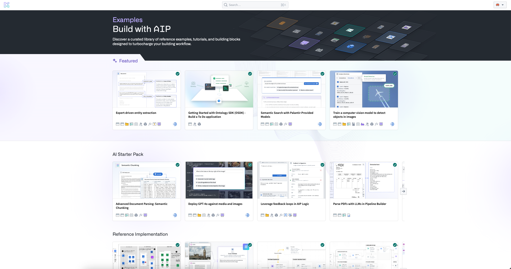
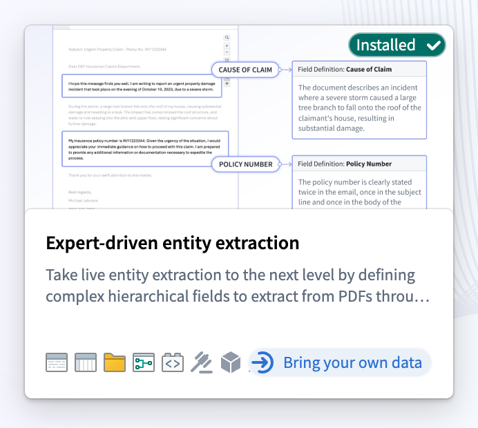
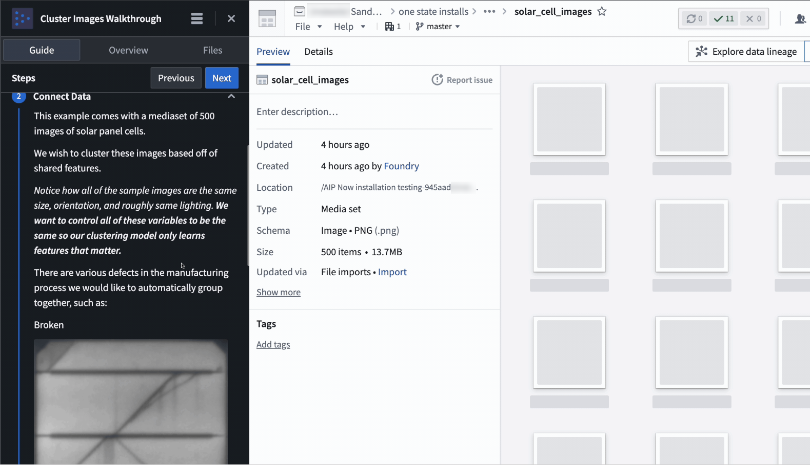

<!-- source: https://palantir.com/docs/foundry/getting-started/start-with-examples/ · mirrored 2026-08-18 from Palantir Foundry docs -->

# Start with Examples

To get started on the Palantir platform, you can use Examples, an in-platform component of Build with AIP. Examples is a comprehensive library designed to facilitate learning and effective platform usage. Examples provides application builders and developers with reference examples, tutorials, and starter kits for quickly developing new applications.

## Key features

Examples is built with two features to support user learning:

* **Bring your own data:** Examples tagged with "Bring your own data" allows you to easily install complex workflows using your own data. Find the **Using your own data** section and select **Install**, then drag and drop from your desktop (or upload an existing resource in Foundry).   
     

* **Walkthroughs:** Get a step-by-step walkthrough of how the specific workflow was made with AIP Assist.   
     

## Access Examples

You can access Examples from the Workspace navigation bar on the left, then **Support > Explore Examples**. Additionally, you can explore application-specific examples directly from application splash pages.
