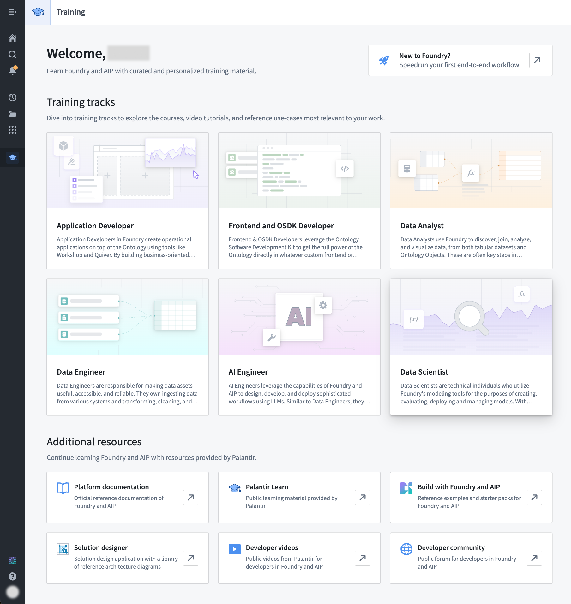
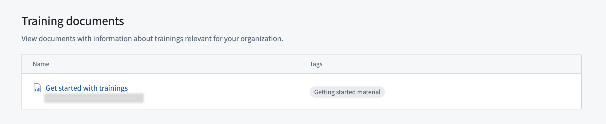

<!-- source: https://palantir.com/docs/foundry/getting-started/training-application/ · mirrored 2026-08-22 from Palantir Foundry docs -->

# Start with Training and Palantir Learning portal

The Training application presents you a curated set of courses from [the Palantir Learning portal at learn.palantir.com ↗](https://learn.palantir.com), and links to all in-platform and public material for learning how to use the Palantir platform.

We also recommend a visit to [learn.palantir.com ↗](https://learn.palantir.com) for a variety of courses that can help you familiarize with the platform and in its usage.

## Surface training documents for your organization

The Training application allows you to surface Notepad documents with information about trainings relevant for your organization.

To surface Notepad documents with training material and instructions, [create a tag category](/docs/foundry/compass/tags/) named `Training application`. Every Notepad document that is accessible by a user and tagged with a tag under the tag category `Training application` will be shown in the training application. You can freely name tags within the category which will be shown in-line to the link to the document.

