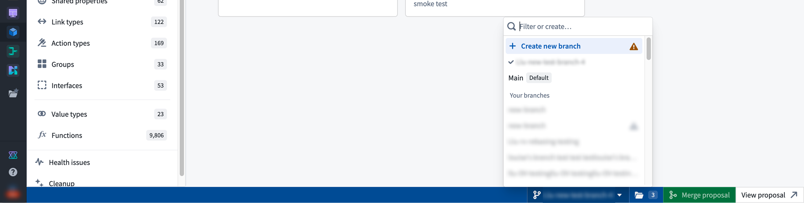
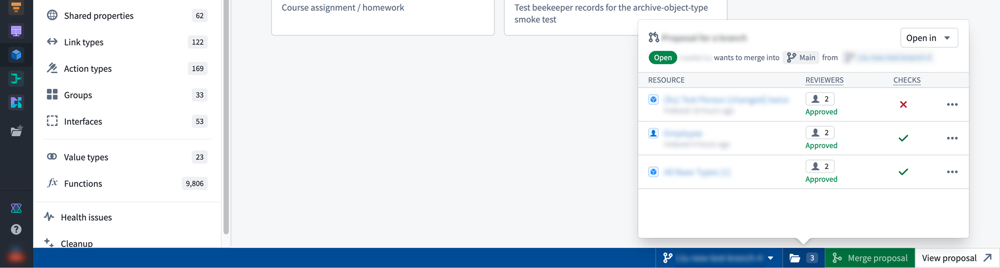

<!-- source: https://palantir.com/docs/foundry/global-branching/branch-taskbar/ · mirrored 2026-08-07 from Palantir Foundry docs -->

# Branch taskbar

The branch taskbar is incorporated in applications that integrate with Global Branching. The taskbar signals to users that they are operating in the context of a branch.

From the taskbar, you can view your active branch, switch between branches, examine modified resources, and navigate each stage of the proposal creation, review, and merging workflow.

The branch taskbar is displayed as a blue bar at the bottom of supported applications.

In [unsupported applications](/docs/foundry/global-branching/integrations/), the taskbar is displayed as a gray bar.

## Branch selector

The branch selector facilitates switching between existing branches, including the `main` branch. It also allows for branch creation.

## Modified resource panel

The resource panel lets you view and navigate to any modified resources on your branch. Once a proposal is created, you can manage reviewers and view checks status.

You can also open your modified resources in Workflow Lineage and Data Lineage from the resource panel.

## Create proposals and merge changes

The **Create proposal** option generates a proposal for the existing branch. Once created, you can navigate to it by selecting **View proposal**. When all checks have passed, the **Merge proposal** option will be enabled.
