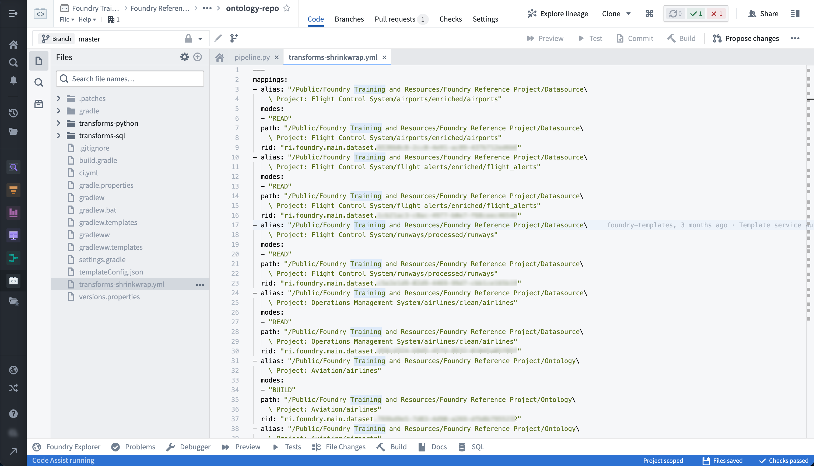

<!-- source: https://palantir.com/docs/foundry/health-checks/builds-checks-faq/ · mirrored 2026-08-22 from Palantir Foundry docs -->

# Builds and checks FAQ

The following are some frequently asked questions about builds and checks.

For general information, view our [builds](/docs/foundry/data-integration/builds/) and [health checks](/docs/foundry/health-checks/overview/) documentation.

* [How do I resolve general errors?](#how-do-i-resolve-general-errors)
* [How do I understand a long or confusing error message?](#how-do-i-understand-a-long-or-confusing-error-message)
* [Why are my builds "waiting for resources"?](#why-are-my-builds-waiting-for-resources)
* [Why are my builds taking longer to run?](#why-are-my-builds-taking-longer-to-run)
* [How do I resolve imbalanced (skewed) joins?](#how-do-i-resolve-imbalanced-skewed-joins)
* [What does “shrinkwrap” mean when referenced in an error message?](#what-does-shrinkwrap-mean-when-referenced-in-an-error-message)
* [Seeing “PERMISSION\_DENIED” in error message](#seeing-permission_denied-in-error-message)
* [How do I resolve the “Waiting for input dependencies to be computed” error message?](#how-do-i-resolve-the-waiting-for-input-dependencies-to-be-computed-error-message)
* [My CI job fails because repository does not own dataset](#my-ci-job-fails-because-repository-does-not-own-dataset)
* [Why are my checks failing on timeout?](#why-are-my-checks-failing-on-timeout)

***

## How do I resolve general errors?

If you are having trouble debugging build errors, here are a few steps to consider:

1. Has the build ever succeeded? If so, have you made changes to the logic generating the dataset? Try rolling those changes back; if the build succeeds, you can likely isolate the problem to the new logic. You can also select **Logs** in the **Datasets** pane of the **Builds** application to review build history.

2. Has the underlying data recently changed? You might see this manifest in a few ways:
   * If the scale of the data has increased dramatically, you might see reduced performance or build failures due to compute resource concerns.
   * Has the schema of the underlying data changed at all? This can often cause build failures when there is logic that depends on a specific schema. To check, select **Compare** in Build's **Datasets** pane to compare differentials with previous transactions.
   * Has the logic for any datasets upstream of your failing dataset changed? This might lead to downstream effects of increased data scale or altered schema.

[Return to top](#builds-and-checks-faq)

***

## How do I understand a long or confusing error message?

Error messages in Foundry can be long and sometimes difficult to understand. If you run into an error message that is hard to action on, try the steps below.

1. Often, the most helpful piece of an error trace is preceded by a key phrase. Look for some of the below phrases in your error message to find potentially valuable guidance for your troubleshooting. Note that the important parts of the message will often appear towards the bottom:
   * `What went wrong:`
   * `Caused by:`
   * `Py4JJavaError`
   * `UserCodeError`

2. If your error references an ErrorInstanceID with little other context, escalate the issue to Palantir Support. ErrorInstanceIDs are shown also for a user's logic errors, so be sure to first check whether this may be the cause of your issue.

3. When [contacting Support](/docs/foundry/getting-help/overview/), always include the following:
   * The full error message you are given
   * Any troubleshooting steps you have already taken
   * The exact time (date, time, timezone) you experienced the error

[Return to top](#builds-and-checks-faq)

***

## Why are my builds "waiting for resources"?

Your build is stuck on "Waiting for resources" for longer than typical and not running. This may be caused by increased activity on the platform at the time you are running your builds. The many builds being run at this time may be using up the available resources on the platform, causing your builds to be queued until other builds finish and free resources up. This behavior is a byproduct of the Spark execution model discussed on [Spark transforms](/docs/foundry/code-workbook/transforms-spark/).

To troubleshoot, perform the following steps:

* Try running your build at times when the platform is less active and see if that helps improve performance. This will help avoid your build getting queued behind other jobs.

* If you are scheduling jobs, avoid running jobs at common times such as on the hour or at midnight.

[Return to top](#builds-and-checks-faq)

\--

## Why are my builds taking longer to run?

The performance of a build worsening over time can be caused by one or more of the following: 1) a change in the logic of the transform, 2) a change in input data scale, or, 3) increased computational load on the cluster at the time of the build.

To troubleshoot, perform the following steps:

* Check the logic of your transform - what has changed since this build was last run? Even slight differences in logic can cause discrepancies in build time.
* Check the data scale of the input datasets. If datasets upstream have significantly increased in size, this can cause decreased performance in builds later down the pipeline.

[Return to top](#builds-and-checks-faq)

***

## How do I resolve imbalanced (skewed) joins?

Joins that include a large left table with many entries per key and the smaller right table with few entries per key are perfect candidates for a salted join, which evenly distributes data across partitions.

To troubleshoot, perform the following steps:

* Salted joins operate in Spark by splitting the table with many entries per key into smaller portions while exploding the smaller table into an equivalent number of copies. This results in the same-sized output as a normal join, but with smaller task sizes for the larger table and a decreased risk of OOM errors.
* You salt a join by adding a column of random numbers 0 through N to the left table and making N copies of the right table. If you add your new random column to the join, you reduce the largest bucket to 1/N of its previous size.
* The secret is the `EXPLODE` function. `EXPLODE` is a cross-product: `SELECT 'a' AS test, EXPLODE(ARRAY(1,2,3,4,5)) AS dummy2`
* This results in the following:

```
 test | test2
----------------
  a     |  1
  a     |  2
  a     |  3
  a     |  4
  a     |  5
```

* Suppose you have a misbehaving join like the following:

```sql
SELECT
left.*, right.*
FROM
`/foo/bar/baz` AS left
JOIN
`/foo2/bar2/baz2` AS right
ON
  left.something = right.something
```

* This join may fail with your build reporting a few tasks taking much longer and shuffling / spilling more data than then other tasks. This is one indication your datasets may be suffering from skew.
* Another way of verifying skew is to open each table in Contour and doing a pivot on the `something` column and aggregating row count, then joining the left and right table on `something` and multiplying the aggregate columns. This will output a row count per key of `something` which is ideally evenly distributed, but when skewed indicates the need for a salted join.
* Consider replacing your code with something like the following:

```sql
SELECT
    left.*, right.*
  FROM
    (SELECT *, FLOOR(RAND() * 8) AS salt FROM `/foo/bar/baz`) AS left
    JOIN
    (SELECT *, EXPLODE(ARRAY(0,1,2,3,4,5,6,7)) AS salt FROM `/foo2/bar2/baz2`) AS right
    ON
      left.something = right.something AND left.salt = right.salt
```

* **Tuning:**
  * You should make educated guesses to choose the factor to explode by. Powers of 2 are a good way to find the right estimate: 8, 16, 32, and so on.
  * You could use Contour to examine the two datasets you are trying to join. Does histogramming the key on which you are joining show that the largest bucket is X times the size of the next largest? Make the `explode` factor at least X.
  * A similar approach is to look at the row count per executor as your unsalted job is running.

* Be aware of the following:
  * Make sure you do not make off-by-one errors when salting a join. That will make you lose a fraction of your records.
  * `CEIL(RAND() * N)` gives you integers between 1 and N. `FLOOR(RAND() * N)` gives you numbers between 0 and N — 1. Make sure you explode the correct set of numbers in your salted join.

* Overhead from salting
  * Salting a join does not necessarily make your build faster; it simply makes it more likely to succeed.
  * If you salt your joins unnecessarily, you may start seeing declines in performance.

[Return to top](#builds-and-checks-faq)

***

## What does “shrinkwrap” mean when referenced in an error message?

Each repository contains a “shrinkwrap” file that defines the mapping between each path referenced, the unique ID for the dataset referenced by that path, and the current path for that dataset. This is helpful when a dataset is moved between folders, for instance. The shrinkwrap file in the repository generating that dataset will update; when the build is next run, the dataset is built in the correct location. You might see shrinkwrap errors for a few reasons, such as dataset deletions, renames, or relocations.

To troubleshoot, review the following considerations and associated actions:

* To find the shrinkwrap file for a given repo:

  * Select the gear icon near the top left of the screen.
  * Toggle on **Show hidden files and folders**
  * The `transforms-shrinkwrap.yml` file should show up as below:

  

* It may be the case that the dataset referenced in the repository's shrinkwrap file no longer exists. Usually, the shrinkwrap error will tell you which datasets do not exist and where in the repository they are referenced.
  * Check if any datasets referenced in the repository were moved to the trash and restore them.

* While you were iterating on your branch, a change may have been merged into `master` which added a file to the repository and updated the shrinkwrap file. To resolve this, perform the following:
  * Navigate to the `transforms-shrinkwrap.yml` file.
  * Search for changes that were merged to the repository while you were iterating on your branch.
  * Choose to accept only your changes, only the incoming changes, or both.
  * You can also delete the shrinkwrap file, and it will be regenerated automatically when the checks run.

[Return to top](#builds-and-checks-faq)

***

## Seeing “PERMISSION\_DENIED” in error message

To run a build, the user who triggers it must have the required permissions. Specifically, the user must be an `Editor` on the output dataset since running a build is effectively editing the output file.

An easy way to tell what permissions you have on a given dataset is by pulling up the dataset in Data Lineage, enabling the **Permissions** filter, and selecting **Resource Permissions** to color the nodes.

[Return to top](#builds-and-checks-faq)

***

## How do I resolve the “Waiting for input dependencies to be computed” error message?

This error happens when a dataset failed to build because the schedule that was building it was canceled due to an upstream dataset failing to build.

To troubleshoot, perform the following steps:

1. Head to the build report for the failed build.
2. Look for the first dataset in this build that failed.
3. Attempt to resolve this error message and re-run the build.

[Return to top](#builds-and-checks-faq)

***

## My CI job fails because repository does not own dataset

The dataset you are trying to build believes it is controlled by another repository. You can see which repository a dataset is controlled by in the **Details** tab of the dataset preview page, in the **sourceProvenance** block of the **Job spec** section. This happens when multiple repositories are creating the same output dataset.

To troubleshoot, perform the following steps:

* If you want to transfer ownership of the dataset to the current repository:
  1. Delete the dataset’s existing job spec. To do so, open the dataset, go to **Details > Job spec** and select **Edit > Delete**.
  2. Trigger the CI build from the current repository again.
  3. Remove the dataset source file from the other repository to prevent confusion in the future.
* If you want to keep the dataset owner as the other repository (the repository the dataset was originally created in):
  * Delete the dataset source file in the current repository.

[Return to top](#builds-and-checks-faq)

***

## Why are my checks failing on timeout?

Checks can fail on timeout for a variety of reasons, but there are a few common steps you can take that will often unblock you:

1. Try re-running your CI check again. Does it consistently fail with the same error?
2. Try upgrading your repository and then re-running your CI check. Does it fail with the same error?
3. If your CI checks are still failing, select the cog icon at the top of your folder structure and select **Show hidden files**. In the `ci.yml` add the line `—refresh-dependencies`.

[Return to top](#builds-and-checks-faq)
