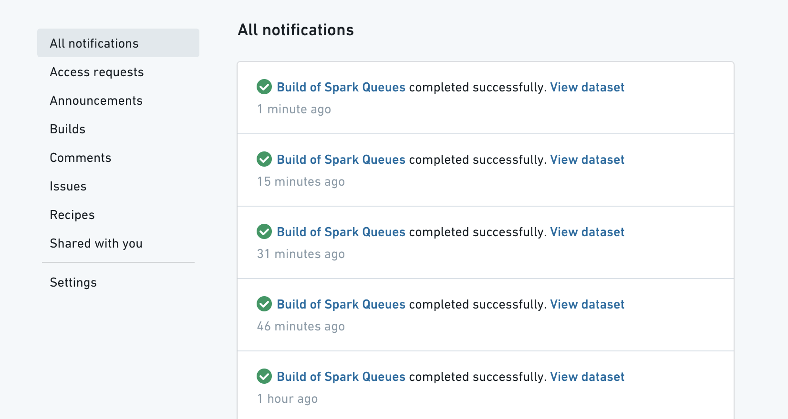
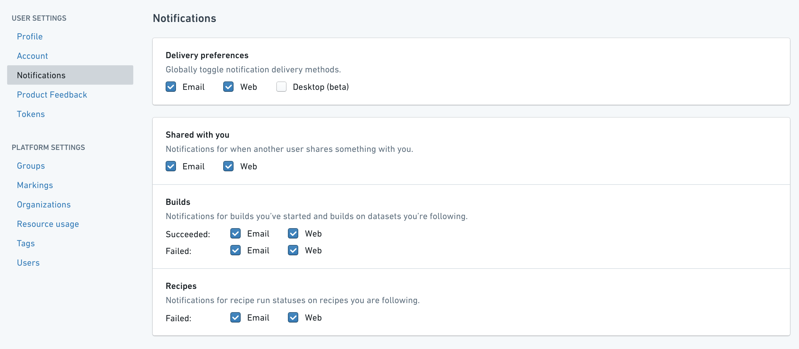
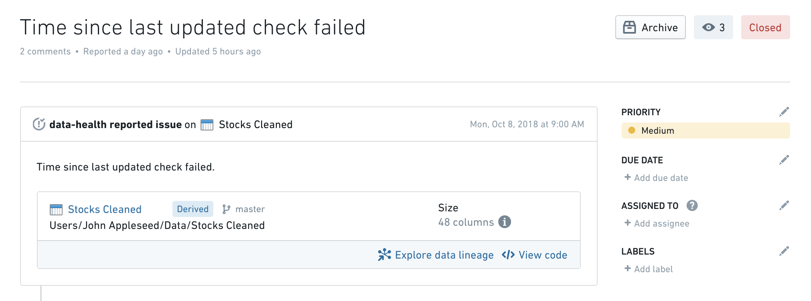
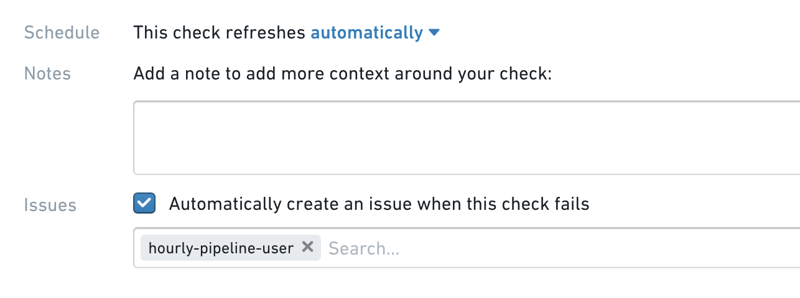

<!-- source: https://palantir.com/docs/foundry/health-checks/notifications/ · mirrored 2026-08-22 from Palantir Foundry docs -->

# Notifications and issues

Data Health is integrated with Foundry Notifications and Emails to provide in-platform notifications and emails, respectively, in the event of a failed check.

## Foundry Notifications

Data Health will always send an in-platform notification to [watchers](/docs/foundry/health-checks/watching-checks/) of failed checks:

## Email Notifications

As a watcher of a check, you can also enable email notifications for failed checks. You can change your email and notification preferences by navigating to the **Profile Icon** in the upper right corner, clicking on **Settings** and then navigating to the **Notifications** tab:

To receive updates on checks make sure to check everything under the **Builds** section.

## Integrating with Issues

You can also configure Data Health to automatically report an Issue when a check fails to make further debugging & discussion easier:

To enable Issue reporting, you just need to tick the **Automatically create an issue when this check fails** box when creating/editing a check:

You can also automatically assign the created issue to a specific user by entering their name in the box below.

:::callout{theme="neutral"}
Data Health will file an issue upon check failure, but it can also automatically close the issue once the check resolves.
:::
