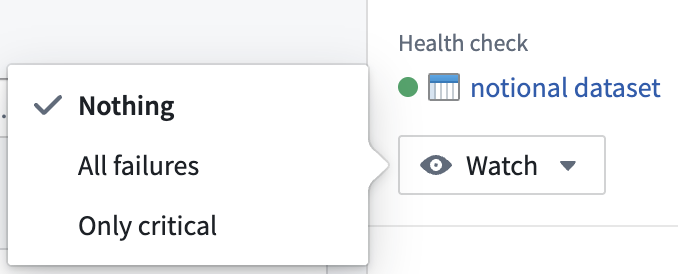
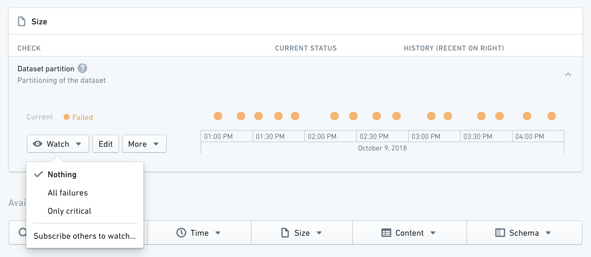
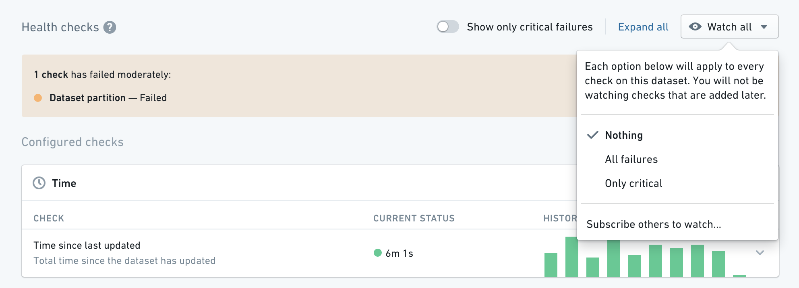

<!-- source: https://palantir.com/docs/foundry/health-checks/watching-checks/ · mirrored 2026-08-22 from Palantir Foundry docs -->

# Watching checks

:::callout{theme="success" title="Tip"}
Instead of watching individual checks, you can create and subscribe to a [monitoring view](/docs/foundry/monitoring-views/overview/).
:::

You can **watch** checks to be alerted when they fail. You can watch an individual check by expanding it and selecting the **Watch** button:

According to the configuration in the [**Rule Section**](/docs/foundry/health-checks/checks-reference/) of the check:

* **Nothing** will never notify you of a failure, regardless of severity.
* **All failures** will notify you of any failures (both `Moderate` and `Critical`).
* **Only critical** will *only* notify you of any `Critical` failures.

:::callout{theme="neutral"}
We recommend setting different thresholds for Moderate and Critical checks. Ideally Critical alerts should have looser bounds (e.g. Build duration check fails Moderately if build takes 5 mins and Critically if it takes 10 mins).
:::

## Watching all checks on a dataset

You can also take any of the above actions on all checks on a dataset by using the **Watch All** button:

## Pausing and removing checks

You can also pause or delete a check by expanding it and clicking the **More** button.

* **Pausing** a check will temporarily snooze its alerts for all watching/subscribed users.
* **Deleting** a check will permanently remove its configuration and schedule and it will need to be recreated if you want to watch it.
