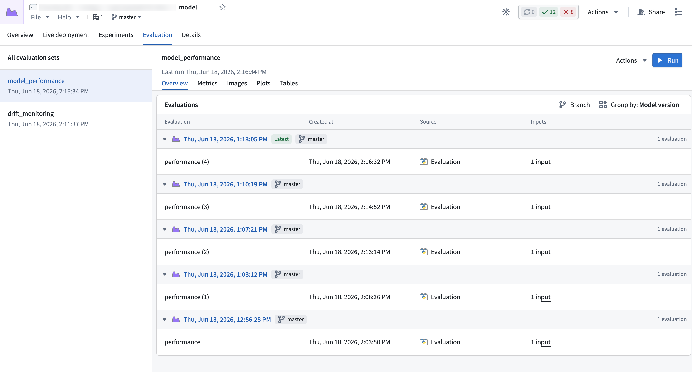
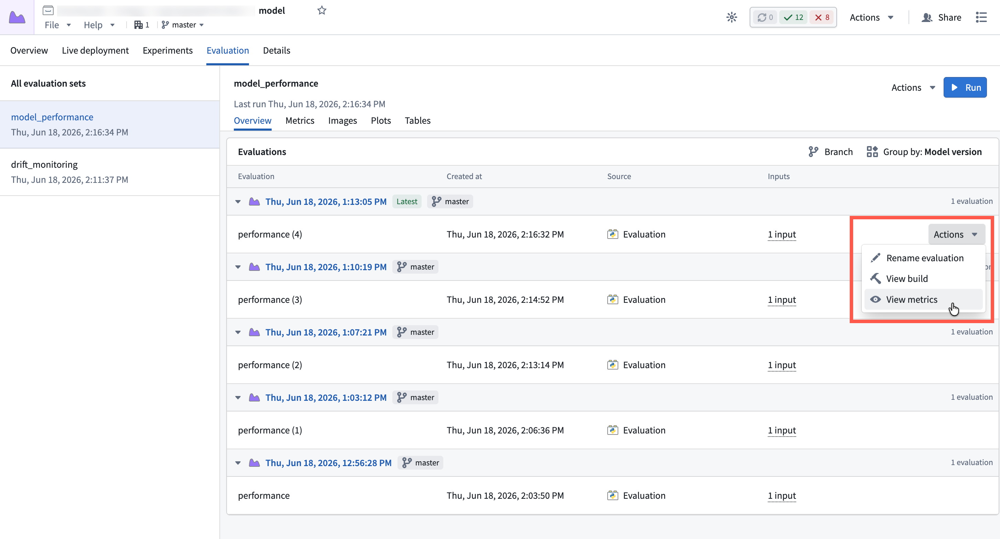
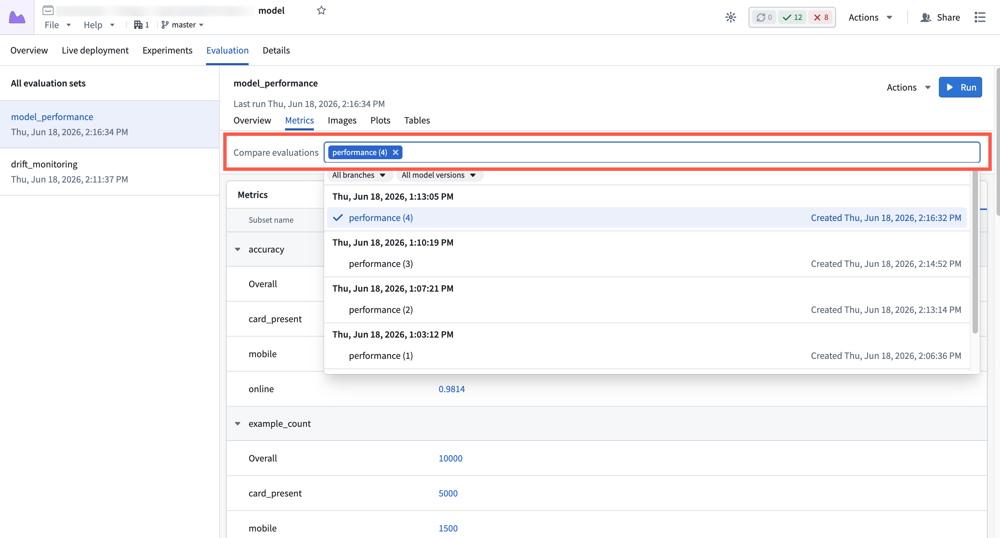
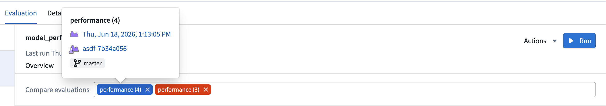
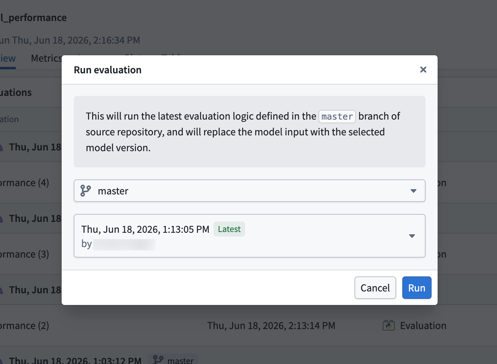
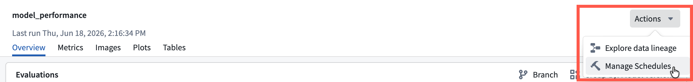
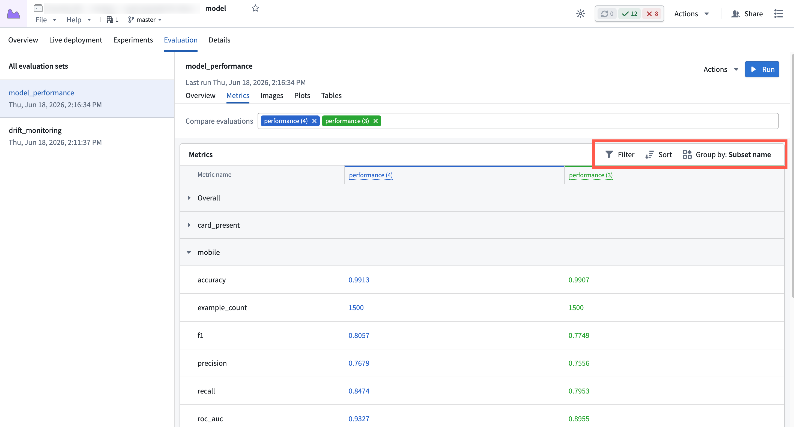
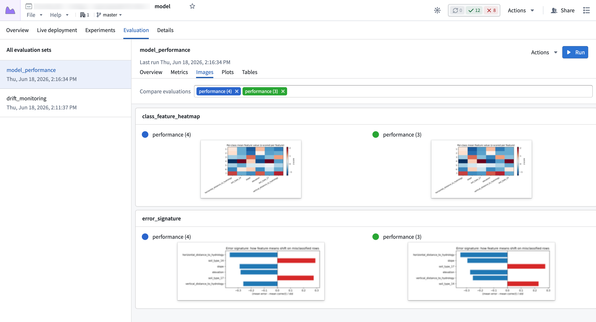
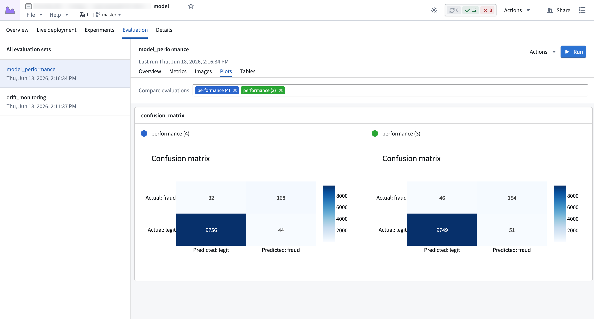
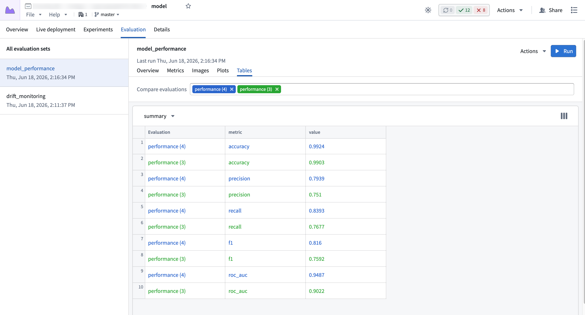

<!-- source: https://palantir.com/docs/foundry/integrate-models/evaluations-visualize/ · mirrored 2026-08-18 from Palantir Foundry docs -->

# Visualize evaluations

Once published, evaluations are immediately available to view and compare on the model page under the **Evaluations** tab.

On the left sidebar, you see all the available [evaluation sets](/docs/foundry/integrate-models/evaluations-overview/#evaluation-sets) that have been created on the model. Selecting an evaluation set updates the main table in the **Overview** tab with all evaluations in that evaluation set.

By default, the evaluations table will show all evaluations from every branch, grouped by model version. These groups are in descending order based on the creation time of the model version which was evaluated. You can use the **Branch** control in the top of the table to filter down the visible model version groups to only those from specific branches, and change the grouping strategy with the **Group by** control.

## Select an evaluation

To visualize the metrics from an evaluation, hover over the row in the evaluations table and select **Actions**, then **View metrics**:

This navigates to the **Metrics** tab and renders all of the metrics for that evaluation. To add more evaluations to the view, use the **Compare evaluations** selector to select more.

The selector lists and groups evaluations in the same way the **Overview** tab does: evaluations are grouped by model version, in descending time order.

## Navigate back to a model version

To navigate back to a model version for an evaluation, you can hover over the selected evaluation in the **Compare evaluations** selector:

A popover will appear with some metadata about the model version, and a link to navigate to the model version in the model view.

## Running an evaluation

Evaluations can also be ran in an ad-hoc manner. From the evaluations view, select the **Run** option at the top of the page. This will show a dialog that will guide you through running an evaluation:

The dialog presents options to choose the exact model version to run, and will execute it against the latest evaluation logic in your source repository.

## Create a schedule

To create a schedule for an evaluation, select the **Actions** dropdown in the header, then select **Manage schedules**. Schedules can be set up to run when a new model version is published for automatic evaluation, or on a schedule for automatic drift detection.

## Tabs

The results for the selected evaluations are organized into four tabs: **Metrics**, **Images**, **Plots**, and **Tables**. Select a tab to view the corresponding results, each described in the following sections.

### Metrics tab

The **Metrics** tab renders a table of all logged numeric metrics for the evaluation. By default, these are grouped by [subset](/docs/foundry/integrate-models/evaluations-overview/#subsets), but can be changed with **Group by** control at the top of the table. When grouped by subset, a default **Overall** group will be added which will group any non-subset metrics.

Selecting multiple evaluations will show the metrics side by side for comparison.

Metrics can be logged using the [`Evaluation.log_metric`](/docs/foundry/integrate-models/evaluation-reference/#evaluationlog_metric) and [`Evaluation.log_metrics`](/docs/foundry/integrate-models/evaluation-reference/#evaluationlog_metrics) functions in Python.

### Images tab

In the **Images** tab, each card represents a single image. When comparing evaluations, images are rendered side by side if they share the same name:

Select an image to expand it and reveal a **Download** option to save the image.

Images can be logged using [`Evaluation.log_image`](/docs/foundry/integrate-models/evaluation-reference/#evaluationlog_image) in python.

### Plots tab

In the **Plots** tab, each card represents a single plot. When comparing evaluations, the plots will be rendered side by side if they share the same name:

The rendered plots are interactive: hover to inspect points, pan, and zoom.

Plots can be logged using [`Evaluation.log_plot`](/docs/foundry/integrate-models/evaluation-reference/#evaluationlog_plot) in python.

### Tables tab

In the **Tables** tab, a single card is used to render the selected table. Use the table name selector to choose a different table to visualize:

Tables can be logged using [`Evaluation.log_table`](/docs/foundry/integrate-models/evaluation-reference/#evaluationlog_table) in python.
