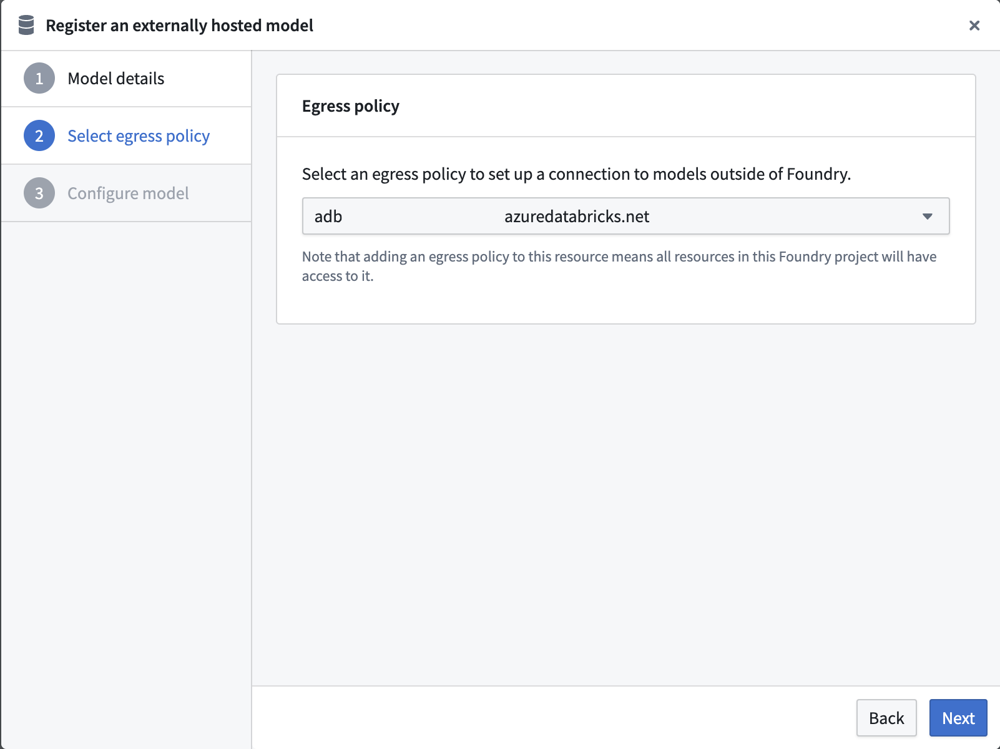
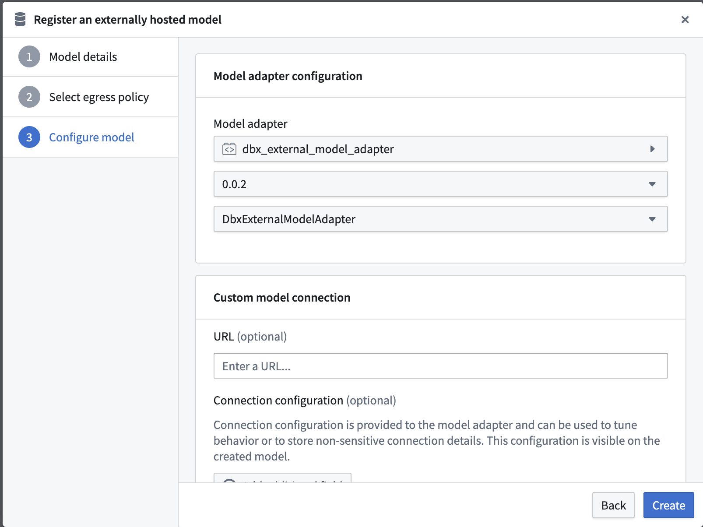
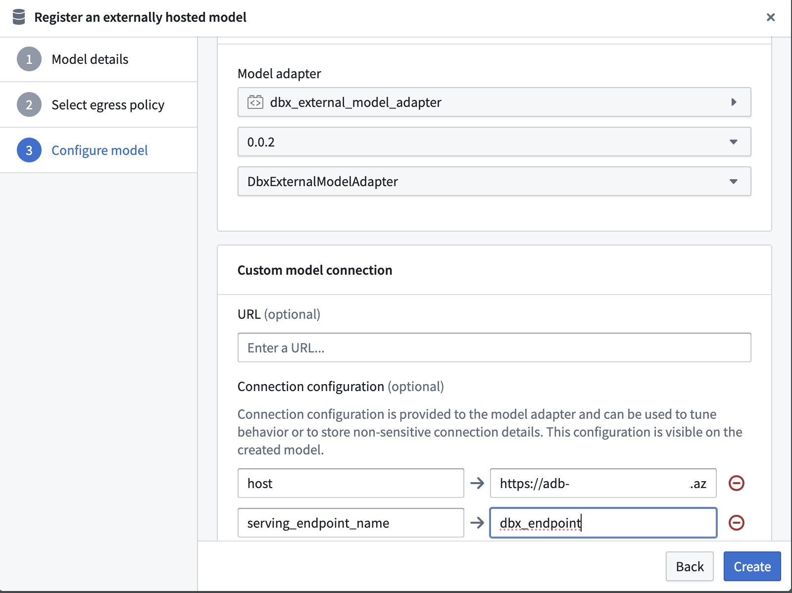
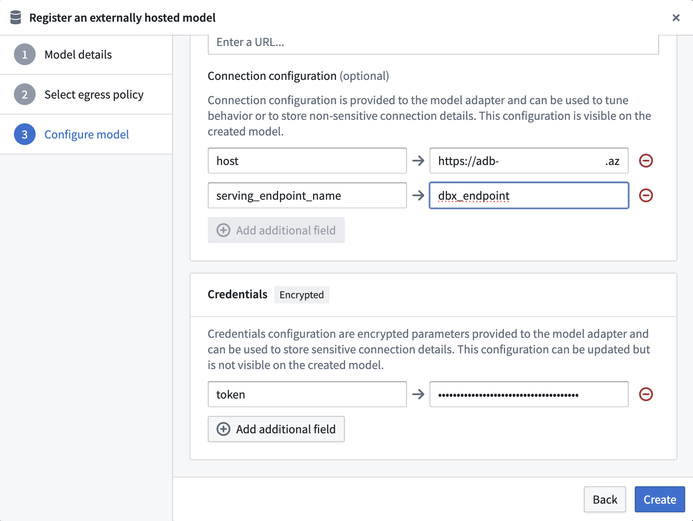
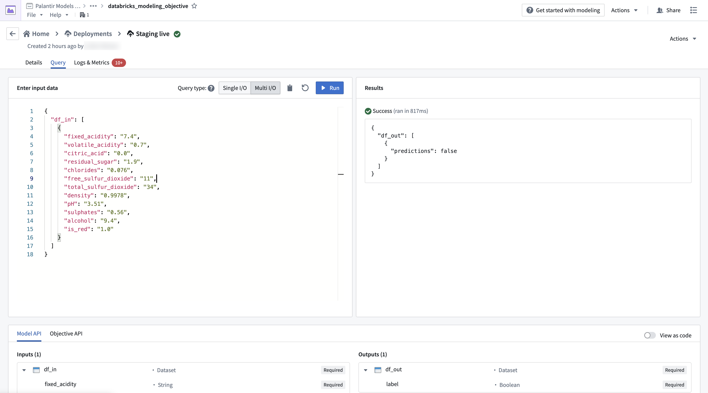

<!-- source: https://palantir.com/docs/foundry/integrate-models/external-model-connection-databricks/ · mirrored 2026-08-18 from Palantir Foundry docs -->

# Example: Integrate a Databricks model

This page provides an example configuration and model adapter for a custom connection to a model hosted in Databricks. Review the [benefits of external model integration](/docs/foundry/integrate-models/external-model-connection/#benefits-of-wrapping-an-externally-hosted-model-in-foundry) to understand if an external model is suitable for your use case.

For a step-by-step guide, refer to the documentation on [how to create a model adapter](/docs/foundry/integrate-models/model-adapter-creation/) and [how to create a connection to an externally hosted model](/docs/foundry/integrate-models/external-model-connection/).

In this example, you will:

1. [Publish and tag a model adapter](#example-databricks-tabular-model-adapter)
2. [Configure an externally hosted model to use this model adapter](#configure-the-databricks-tabular-model)
3. [Host the model in a live deployment or Python transform and use the model](#use-the-databricks-tabular-model)

## Publish and tag a Databricks tabular model adapter

The first step in connecting to an external model is to [publish and tag a model adapter](/docs/foundry/integrate-models/model-adapter-creation/#model-adapter-library-template) using the model adapter library in Code Repositories. The example model adapter below configures a connection to a Unity Catalog model deployed on [Databricks Model Serving ↗](https://docs.databricks.com/aws/en/machine-learning/model-serving/create-manage-serving-endpoints). The below code was tested with versions `Python 3.11.11`, `databricks-sdk 0.55.0`, and `pandas 2.2.3`. For this example, we will use the wine quality prediction problem from the [Databricks machine learning tutorial ↗](https://docs.databricks.com/aws/en/getting-started/ml-get-started).

### Example Databricks tabular model adapter

Note that this model adapter makes the following assumptions:

* This model adapter assumes that data being provided to this model is tabular.
* This model adapter will serialize the input data to JSON and send this data to the Databricks model serving endpoint.
* This model adapter assumes that the response is deserializable from JSON to a pandas DataFrame.
* This model adapter takes three inputs to construct a client.
  * `host`: Provided in **connection configuration** (the host URL for your Databricks instance).
  * `serving_endpoint_name`: Provided in **connection configuration**.
  * `token`: Provided as **credentials**.

```python
import logging

import palantir_models as pm
import pandas as pd
from databricks.sdk import WorkspaceClient
from databricks.sdk.service.serving import QueryEndpointResponse

logger = logging.getLogger(__name__)


class DatabricksExternalModelAdapter(pm.ExternalModelAdapter):
    def __init__(self, host, serving_endpoint_name, creds):
        self.serving_endpoint_name = serving_endpoint_name
        self.client = WorkspaceClient(host=host, token=creds["token"])

    @classmethod
    def init_external(cls, external_context: pm.ExternalContext) -> "pm.ExternalModelAdapter":
        return cls(
            host=external_context.connection_config["host"],
            serving_endpoint_name=external_context.connection_config["serving_endpoint_name"],
            creds=external_context.resolved_credentials,
        )

    @classmethod
    def api(cls):
        input_cols = [
            "fixed_acidity",
            "volatile_acidity",
            "citric_acid",
            "residual_sugar",
            "chlorides",
            "free_sulfur_dioxide",
            "total_sulfur_dioxide",
            "density",
            "pH",
            "sulphates",
            "alcohol",
            "is_red",
        ]

        inputs = {"df_in": pm.Pandas(columns=[(col, str) for col in input_cols])}
        outputs = {"df_out": pm.Pandas(columns=[("predictions", bool)])}
        return inputs, outputs

    def predict(self, df_in):
        try:
            response: QueryEndpointResponse = self.client.serving_endpoints.query(
                name=self.serving_endpoint_name,
                dataframe_records=df_in.to_dict(orient="records")
            )
        except Exception as err:
            logger.error(f"An error occurred while querying the model serving endpoint: {err}")
            raise err
        else:
            return pd.DataFrame(response.as_dict()).drop("served-model-name", axis=1)
```

## Configure the Databricks tabular model

After publishing and tagging a model adapter, you will need to [configure your externally hosted model](/docs/foundry/integrate-models/external-model-connection/) to use this model adapter in order to provide the required configuration and credentials as expected by the model adapter.

Note that the URL is required by the above `DatabricksExternalModelAdapter` and should be set to the full Databricks model serving endpoint URL.

### Select an egress policy

The below uses an egress policy that has been configured for your Databricks workspace domain (e.g., `<workspace-name>.cloud.databricks.com` or your custom domain) on Port 443.



### Configure model adapter

Choose the published model adapter in the **Connect an externally hosted model** dialog.



### Configure connection URL

Set the Base URL to the full Databricks serving endpoint URL by setting the `host` and `serving_endpoint_name` expected by the Databricks adapter.



### Configure credential configuration

Define credential configurations as required by the [example Databricks tabular model adapter](#example-databricks-tabular-model-adapter).

This adapter requires credential configuration of:

* `token`: A Databricks personal access token with permission to access the model serving endpoint.



## Use the Databricks tabular model

Now that the Databricks model has been configured, this model can be hosted in a [live deployment](/docs/foundry/manage-models/set-up-live/) or [Python transform](/docs/foundry/transforms-python/overview/).

### Use the Databricks tabular model in a live deployment

The image below shows an example query made to the Databricks model in a live deployment.



### Use the Databricks tabular model in a transform

You can also use the adapter in a transform, as shown in the example code below:

```python
import pandas as pd
from transforms.api import Output, transform, lightweight
from palantir_models.transforms import ModelInput
from transforms.external.systems import EgressPolicy, use_external_systems


@lightweight
@use_external_systems(
    egress=EgressPolicy('<databricks_egress_policy>')
)
@transform(
    out=Output("<output_dataset_path>"),
    model=ModelInput("<external_model_path>"),
)
def compute(egress, out, model):
    df_in = pd.DataFrame([
        {
            "fixed_acidity": "7.4",
            "volatile_acidity": "0.7",
            "citric_acid": "0.0",
            "residual_sugar": "1.9",
            "chlorides": "0.076",
            "free_sulfur_dioxide": "11",
            "total_sulfur_dioxide": "34",
            "density": "0.9978",
            "pH": "3.51",
            "sulphates": "0.56",
            "alcohol": "9.4",
            "is_red": "1.0"
        },
        {
            "fixed_acidity": "7.4",
            "volatile_acidity": "0.7",
            "citric_acid": "0.0",
            "residual_sugar": "1.9",
            "chlorides": "0.076",
            "free_sulfur_dioxide": "11",
            "total_sulfur_dioxide": "34",
            "density": "0.9978",
            "pH": "3.51",
            "sulphates": "0.56",
            "alcohol": "9.4",
            "is_red": "1.0"
        }
    ]
    )
    out.write_pandas(
        model.predict(df_in)
    )
```
