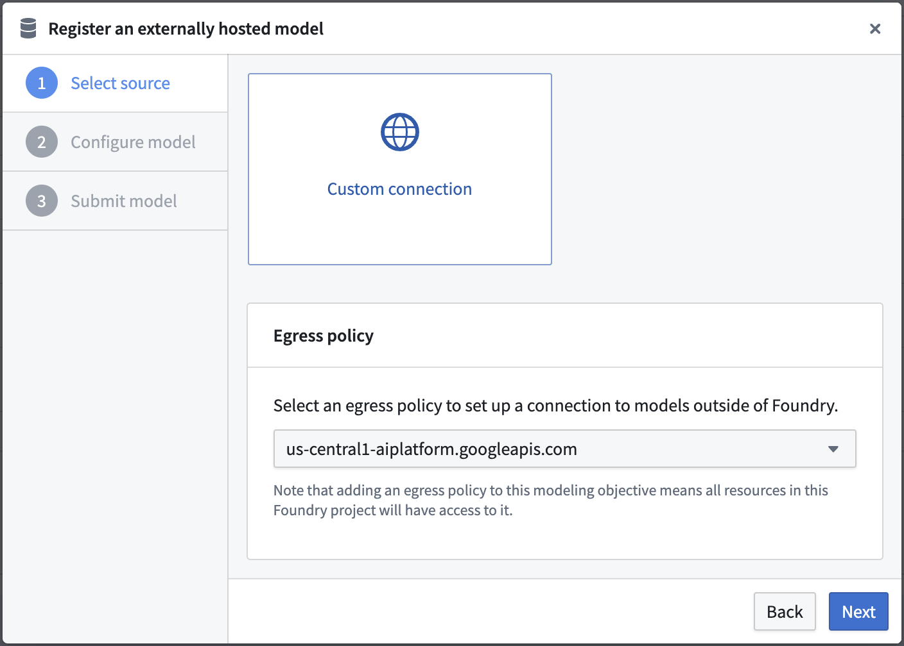
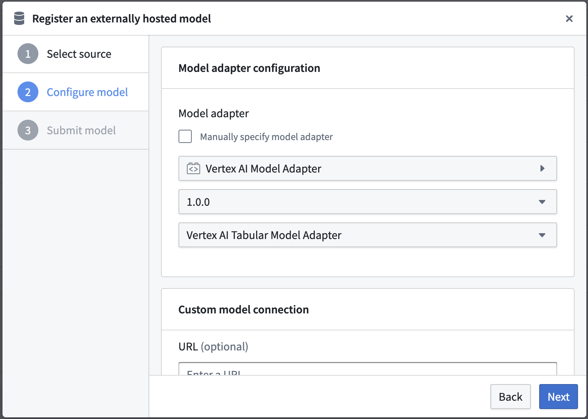
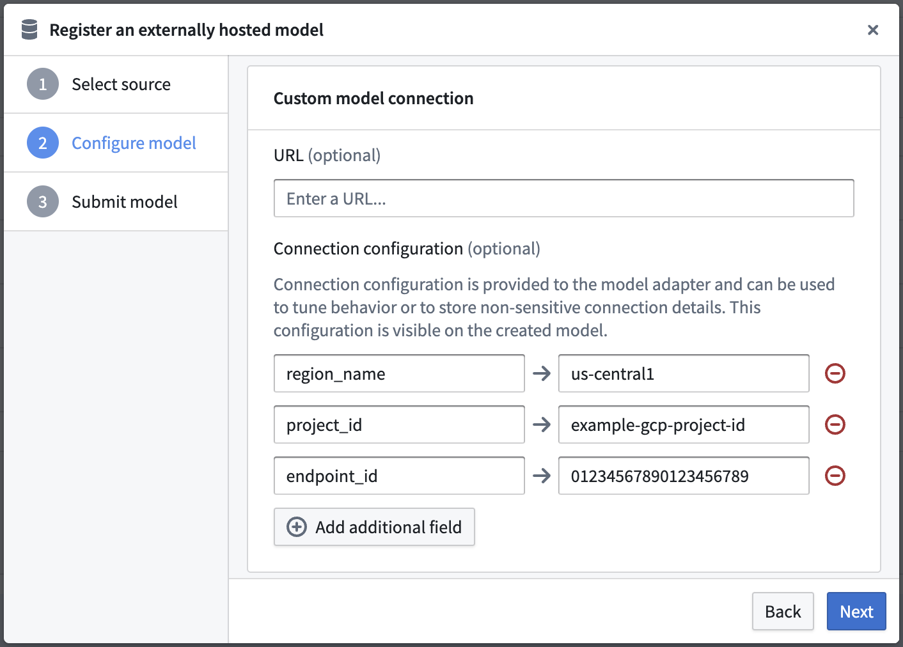
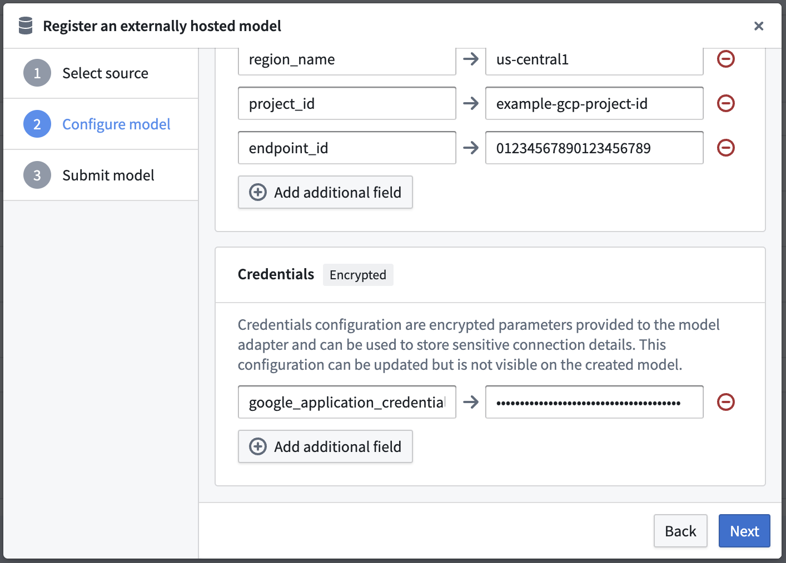
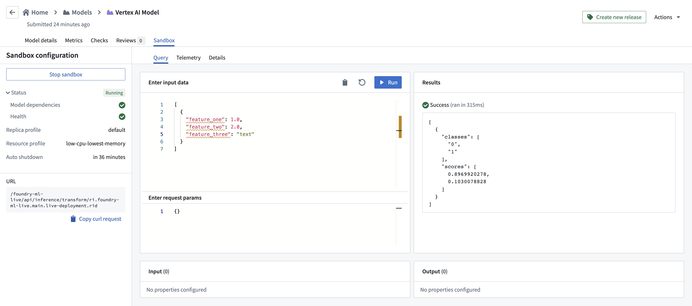

<!-- source: https://palantir.com/docs/foundry/integrate-models/external-model-connection-vertex-ai/ · mirrored 2026-08-18 from Palantir Foundry docs -->

# Example: Integrate a Vertex AI model

The below documentation provides an example configuration and model adapter for a custom connection to a model hosted in Google's Vertex AI. Review [the benefits of external model integration](/docs/foundry/integrate-models/external-model-connection/#benefits-of-wrapping-an-externally-hosted-model-in-foundry) to make sure this is the right fit for your use case.

For a step-by-step guide, refer to the documentation on [how to create a model adapter](/docs/foundry/integrate-models/model-adapter-creation/) and [how to create a connection to an externally hosted model](/docs/foundry/integrate-models/external-model-connection/).

## Example Vertex AI tabular model adapter

First, [publish and tag a model adapter](/docs/foundry/integrate-models/model-adapter-creation/#model-adapter-library-template) using the model adapter library in the Code Repositories application. The below model adapter configures a connection to a model hosted in Vertex AI using the [Vertex AI SDK for Python ↗](https://cloud.google.com/vertex-ai/docs/python-sdk/use-vertex-ai-python-sdk) and framework. The below code was tested with versions `Python 3.8.17`, `pandas 1.5.3`,
`google-cloud-aiplatform 1.32.0`, `google-auth 2.23.0`, `google-auth-oauthlib 1.1.0`.

Note that this model adapter makes the following assumptions:

* This model adapter assumes that data being provided to this model is tabular.
* This model adapter will serialize the input data to JSON and send this data to the hosted Vertex AI model.
* This model adapter assumes that the response is deserializable from JSON to a pandas dataframe.
* This model adapter takes four inputs to construct a Vertex AI client.
  * `region_name` - Provided as **connection configuration**
  * `project_id` - Provided as **connection configuration**
  * `endpoint_id` - Provided as **connection configuration**
  * `google_application_credentials` - Provided as **credentials**

```python
import palantir_models as pm
import models_api.models_api_executable as executable_api

from google.oauth2 import service_account
from google.cloud import aiplatform
from google.api_core import exceptions

import json
import pandas as pd
import logging
from typing import Optional

logger = logging.getLogger(__name__)


class VertexAITabularAdapter(pm.ExternalModelAdapter):
  """
  :display-name: Vertex AI Tabular Model Adapter
  :description: Default model adapter for Vertex AI models that expect tabular input and output data.
  """

  def __init__(self, project_id, region_name, endpoint_id, google_application_credentials):
    self.endpoint_id = endpoint_id
    # google_application_credentials is expected to be valid string representation of the Google provided
    # secret key_file
    credentials = service_account.Credentials.from_service_account_info(
      json.loads(google_application_credentials),
      scopes=["https://www.googleapis.com/auth/cloud-platform"]
    )
    aiplatform.init(project=project_id, location=region_name, credentials=credentials)

  @classmethod
  def init_external(cls, external_context) -> "pm.ExternalModelAdapter":
    project_id = external_context.connection_config["project_id"]
    region_name = external_context.connection_config["region_name"]
    endpoint_id = external_context.connection_config["endpoint_id"]
    google_application_credentials = external_context.resolved_credentials["google_application_credentials"]
    return cls(
      project_id,
      region_name,
      endpoint_id,
      google_application_credentials
    )

  @classmethod
  def api(cls):
    inputs = {"df_in": pm.Pandas()}
    outputs = {"df_out": pm.Pandas()}
    return inputs, outputs

  def predict(self, df_in):
    instances = df_in.to_dict(orient='records')
    try:
      endpoint = aiplatform.Endpoint(endpoint_name=self.endpoint_id)
    except ValueError as error:
      logger.error("Error initializing endpoint object double check the inputted endpoint_id, project_id and "
                   "region_name.")
      raise error
    try:
      # Output from model is assumed to be json serializable
      # if result is too large for executor this may cause an OOM
      prediction_result = endpoint.predict(instances=instances)
    except exceptions.Forbidden as error:
      logger.error("Error performing inference provided google_application_credentials do not have sufficient "
                   "permissions.")
      raise error
    except exceptions.BadRequest as error:
      logger.error("Error performing inference double check your input dataframe.")
      raise error
    return pd.json_normalize(prediction_result.predictions)
```

## Vertex AI tabular model configuration

Next, [configure a externally hosted model](/docs/foundry/integrate-models/external-model-connection/) to use this model adapter and provide the required configuration and credentials as expected by the model adapter. In this example, the model is assumed to be hosted in `us-central1`, but this is configurable.

Note that the URL is not required by the above `VertexAITabularAdapter` and so is left blank; however, the configuration and credentials maps are completed using the same keys as defined in the Model Adapter.

### Select an egress policy

The below uses an egress policy that has been configured for `us-central1-aiplatform.googleapis.com` (Port 443).



### Configure model adapter

Choose the published model adapter in the **Connect an externally hosted model** dialog.



### Configure connection configuration

Define connection configurations as required by the [example Vertex AI tabular model adapter](#example-vertex-ai-tabular-model-adapter).

This adapter requires connection configuration of:

* **region\_name** - The Google region name where the model is hosted.
* **project\_id** - The unique identifier for the project this external hosted model belongs to.
* **endpoint\_id** - The unique identifier for the externally hosted model.



### Configure credential configuration

Define credential configurations as required by the [example Vertex AI tabular model adapter](#example-vertex-ai-tabular-model-adapter).

This adapter requires credential configuration of:

* **google\_application\_credentials** - This is the full contents of a service account private key file that can be used to obtain credentials for a service account. You can create a private key using the [Credentials page of the Google Cloud Console ↗](https://console.cloud.google.com/apis/credentials).



## Vertex AI tabular model usage

Now that the Vertex AI model has been configured, this model can be hosted in a [live deployment](/docs/foundry/manage-models/set-up-live/), or [Python transform](/docs/foundry/transforms-python/overview/).

The below image shows an example query made to the Vertex AI model in a live deployment.


