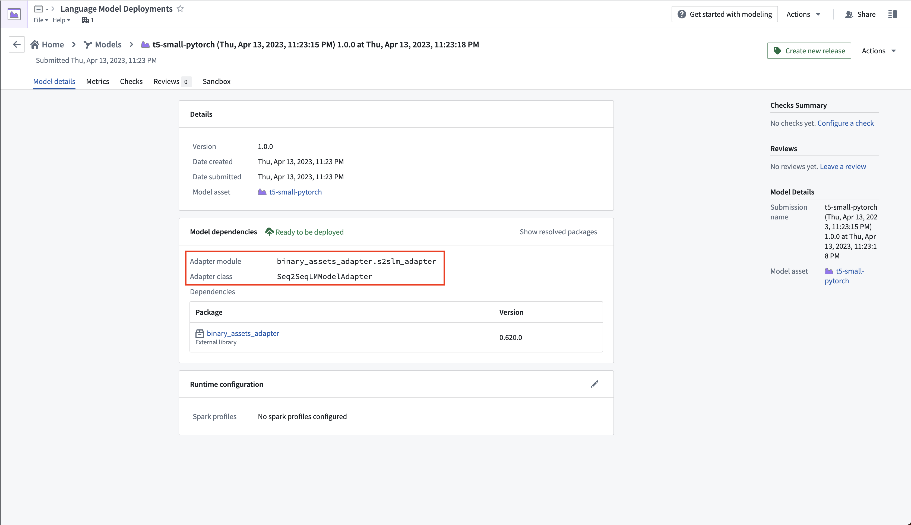
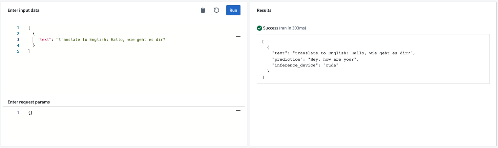
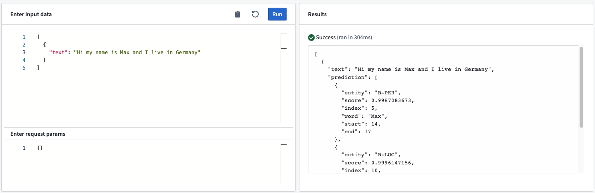
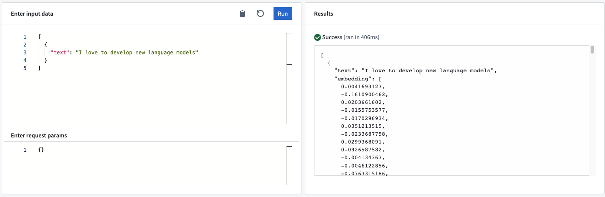
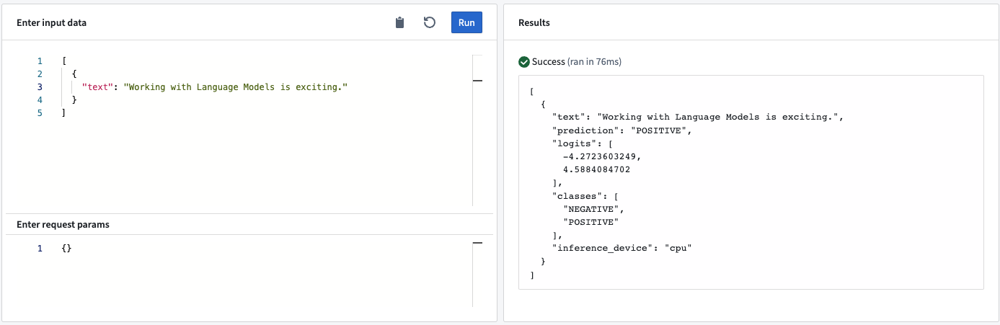
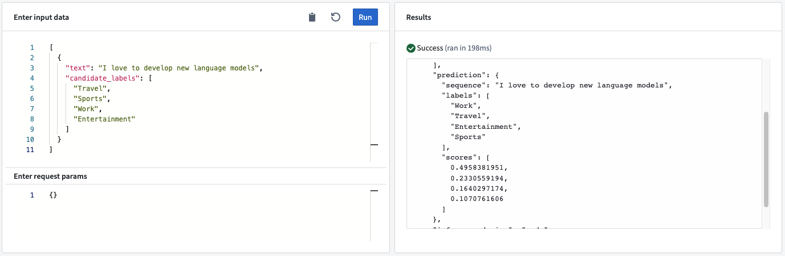

<!-- source: https://palantir.com/docs/foundry/integrate-models/language-models-adapters/ · mirrored 2026-08-18 from Palantir Foundry docs -->

# API: Language model adapters \[Sunset]

:::callout{theme="warning"}
The adapters on this page are no longer supported, will not receive new features such as [direct deployments](/docs/foundry/manage-models/create-a-model-deployment/), and are provided as a reference only. To import Hugging Face models into Foundry, refer to the [import guide](/docs/foundry/integrate-models/import-huggingface-models/). For language model use cases, consider the [LLMs natively supported by Palantir AIP](/docs/foundry/aip/supported-llms/).
:::

This page documents the [model adapters](/docs/foundry/integrate-models/model-adapter-overview/) that were previously used as part of the **Import an open source model** functionality. These adapters provided default parameters and structure for interacting with Hugging Face language models, including automatic routing to CPU and GPU devices depending on availability in the deployment infrastructure. The [adapter source code](#model-adapter-source-code) below and the [import guide](/docs/foundry/integrate-models/import-huggingface-models/) can be used as a starting point to write replacement adapters in your own repositories that can be extended as needed. The adapters below include custom `load` and `save` implementations. When writing a new adapter, consider using the [Hugging Face auto serializers](/docs/foundry/integrate-models/serialization/#hugging-face) instead.

The model adapter currently in use is viewable on the model submission page in the Modeling Objectives application.



## Seq2SeqLMModelAdapter

### Usage

This model adapter adds support for [sequence-to-sequence language models ↗](https://huggingface.co/docs/transformers/model_doc/auto#transformers.AutoModelForSeq2SeqLM). The adapter generates text based on the provided input text.

**Example:** The expected input text and its structure depends on the selected model. We highly recommend reading the model details to ensure correct prompt engineering. The [flan-t5-large ↗](https://huggingface.co/google/flan-t5-large) model, for example, can perform a wide variety of prompts from translation to summarization to question answering.



### Model API

* **Input<string> “text”:** The text input for the language model to generate the output prediction.
* **Output<string> “prediction”:** The text generated by the model.

## NerAdapter

### Usage

This model adapter adds support for [Named Entity Recognition pipelines ↗](https://huggingface.co/docs/transformers/main_classes/pipelines#transformers.TokenClassificationPipeline). The model adapter extracts the entities within the text and returns them in a list.

**Example:** When sending the text “My name is Max and I live in Germany” to the model through a live deployment, the model recognizes two entities: Max and Germany.



### Model API

* **Input<string> “text”:** The text for which the language model generates the output prediction.
* **Output\<list<dict>> “prediction”:** The models output is a list of dictionaries where each dictionary provides detailed information about the extracted entity. In particular, the dictionary contains:
  * **entity:** The type of entity the that was recognized.
  * **score:** The numerical score of the specific entity.
  * **index:** The index of the entity’s token (for example, an index of `5` means the recognized entity is the fifth token in the input text).
  * **word:** The string representation of the recognized entity.
  * **start:** The start index of the recognized entity in the input string.
  * **end:** The end index of the recognized entity in the input string.

## EmbeddingAdapter

### Usage

This model adapter calculates the embedding for a given text based on the model's [attention mask ↗](https://huggingface.co/docs/transformers/glossary#attention-mask). This adapter does "mean pooling" and normalization, which aligns with the [sentenced-transformers ↗](https://www.sbert.net/) defaults.

**Example:**



### Model API

* **Input<string> “text”:** The input text for the embedding model.
* **Output\<list<float>> “embedding”:** The n-dimensional vector representing the input text.

## TextClassificationAdapter

### Usage

This model adapter classifies the input text for a predefined set of classes. Common examples for text classification are sentiment or language detection.

**Example:**



### Model API

* **Input<string> “text”:** The input text for the language model to generate the output prediction.
* **Output<string> “prediction”:** The most likely class.
* **Output\<list<float>> “logits”:** The logit values for each of the classes.
* **Output\<list<string>> “classes”:** The classes the model can predict. The order is the same as the order of the logits (for example, the first logit entry corresponds to the first entry in the classes list).

## ZeroShotClassificationAdapter

### Usage

This model adapter classifies the input text based on a list of classes that are provided at prediction time. This behavior allows the model adapter to classify texts without the need for fine-tuning a language model to a specific use case.

**Example:** When sending the text “I love to develop new language models” and the candidate labels “Travel”, “Sports”, “Work”, and “Entertainment”, the model will score the labels and rank "Work" as the most likely classification.



### Model API

* **Input<string> “text”:** The input text for the language model to generate the output prediction.
* **Input\<list<string>> “candidate\_labels”:** A list of potential labels for the input text that the model scores.
* **Output<dict> “prediction”:**
  * **sequence:** The text used for the zero-shot classification.
  * **labels:** The candidate labels ordered based on the models score, in descending order.
  * **scores:** The float number representing the classification score for the candidate labels. The order of the scores matches the order of the labels.

## Model adapter source code

### foundry-huggingface-adapters/python/huggingface\_adapters/utils/\_hf.py

```python
import tempfile
import os


def set_hf_evaluate_caches():
    import evaluate

    HF_CACHE_HOME = tempfile.mkdtemp()
    evaluate.config.HF_CACHE_HOME = HF_CACHE_HOME

    HF_EVALUATE_CACHE = os.path.join(HF_CACHE_HOME, "evaluate")
    evaluate.config.HF_EVALUATE_CACHE = HF_EVALUATE_CACHE
    HF_METRICS_CACHE = os.path.join(HF_CACHE_HOME, "metrics")
    evaluate.config.HF_METRICS_CACHE = HF_METRICS_CACHE
    HF_MODULES_CACHE = os.path.join(HF_CACHE_HOME, "modules")
    evaluate.config.HF_MODULES_CACHE = HF_MODULES_CACHE

    DOWNLOADED_DATASETS_DIR = "downloads"
    DOWNLOADED_EVALUATE_PATH = os.path.join(HF_EVALUATE_CACHE, DOWNLOADED_DATASETS_DIR)
    evaluate.config.DOWNLOADED_EVALUATE_PATH = DOWNLOADED_EVALUATE_PATH

    EXTRACTED_EVALUATE_DIR = "extracted"
    EXTRACTED_EVALUATE_PATH = os.path.join(
        DOWNLOADED_EVALUATE_PATH, EXTRACTED_EVALUATE_DIR
    )
    evaluate.config.EXTRACTED_EVALUATE_PATH = EXTRACTED_EVALUATE_PATH
```

### foundry-huggingface-adapters/python/huggingface\_adapters/utils/\_io.py

```python
import shutil
import tempfile
import os


def copy_model_to_driver(filesystem):
    temp_dir = tempfile.mkdtemp()
    for raw_file in filesystem.ls():
        output_path = os.path.join(temp_dir, raw_file.path)
        with filesystem.open(raw_file.path, "rb") as remote:
            with open(output_path, "wb") as local:
                shutil.copyfileobj(remote, local)

    return temp_dir
```

### foundry-huggingface-adapters/python/huggingface\_adapters/utils/device\_mixin.py

```python
import torch
from tempfile import TemporaryDirectory
from transformers import pipeline


class DeviceMixin:
    _moved_model_to_device: bool = False

    def _move_model_to_device_once(self, device: torch.device) -> None:
        """Expected to be called in the ModelAdapter.predict() method.

        This cannot be done during load() method because the model is loaded in a separate process from inference,
        causing a CUDA shared memory re-initialization error during inference.

        Lazy initialization of the CUDA context to ensure model init happens in the same process as inference, to
        avoid multiprocessing hassles.
        """
        if not self._moved_model_to_device:
            self.model.to(device)
            self._moved_model_to_device = True

    def _move_pipeline_to_device_once(self, device: torch.device) -> None:
        if str(device) == "cpu":  # noop
            self._moved_model_to_device = True
        elif not self._moved_model_to_device:
            with TemporaryDirectory() as temp_dir:
                self.pipeline.save_pretrained(temp_dir)
                self.pipeline = pipeline(self.PIPELINE_TYPE, temp_dir, device=device)
            self.loaded_model_to_device = True

    @staticmethod
    def _get_cuda_or_cpu() -> torch.device:
        """
        If available, returns cuda device. Otherwise, default to cpu
        """
        return torch.device("cuda:0" if torch.cuda.is_available() else "cpu")
```

### foundry-huggingface-adapters/python/huggingface\_adapters/utils/rouge.py

```python
# Copyright 2020 The HuggingFace Evaluate Authors.
#
# Licensed under the Apache License, Version 2.0 (the "License");
# you may not use this file except in compliance with the License.
# You may obtain a copy of the License at
#
#     http://www.apache.org/licenses/LICENSE-2.0
#
# Unless required by applicable law or agreed to in writing, software
# distributed under the License is distributed on an "AS IS" BASIS,
# WITHOUT WARRANTIES OR CONDITIONS OF ANY KIND, either express or implied.
# See the License for the specific language governing permissions and
# limitations under the License.
""" ROUGE metric from Google Research github repo. """

# The dependencies in https://github.com/google-research/google-research/blob/master/rouge/requirements.txt

try:
    from rouge_score import rouge_scorer, scoring
except Exception as e:
    rouge_scorer = None

if rouge_scorer is not None:
    import absl  # Here to have a nice missing dependency error message early on
    import datasets
    import nltk  # Here to have a nice missing dependency error message early on
    import numpy  # Here to have a nice missing dependency error message early on
    import six  # Here to have a nice missing dependency error message early on
    import evaluate


_CITATION = """\
@inproceedings{lin-2004-rouge,
    title = "{ROUGE}: A Package for Automatic Evaluation of Summaries",
    author = "Lin, Chin-Yew",
    booktitle = "Text Summarization Branches Out",
    month = jul,
    year = "2004",
    address = "Barcelona, Spain",
    publisher = "Association for Computational Linguistics",
    url = "https://www.aclweb.org/anthology/W04-1013",
    pages = "74--81",
}
"""

_DESCRIPTION = """\
ROUGE, or Recall-Oriented Understudy for Gisting Evaluation, is a set of metrics and a software package used for
evaluating automatic summarization and machine translation software in natural language processing.
The metrics compare an automatically produced summary or translation against a reference or a set of references (human-produced) summary or translation.

Note that ROUGE is case insensitive, meaning that upper case letters are treated the same way as lower case letters.

This metrics is a wrapper around Google Research reimplementation of ROUGE:
https://github.com/google-research/google-research/tree/master/rouge
"""

_KWARGS_DESCRIPTION = """
Calculates average rouge scores for a list of hypotheses and references
Args:
    predictions: list of predictions to score. Each prediction
        should be a string with tokens separated by spaces.
    references: list of reference for each prediction. Each
        reference should be a string with tokens separated by spaces.
    rouge_types: A list of rouge types to calculate.
        Valid names:
        `"rouge{n}"` (e.g. `"rouge1"`, `"rouge2"`) where: {n} is the n-gram based scoring,
        `"rougeL"`: Longest common subsequence based scoring.
        `"rougeLsum"`: rougeLsum splits text using `"\n"`.
        See details in https://github.com/huggingface/datasets/issues/617
    use_stemmer: Bool indicating whether Porter stemmer should be used to strip word suffixes.
    use_aggregator: Return aggregates if this is set to True
Returns:
    rouge1: rouge_1 (f1),
    rouge2: rouge_2 (f1),
    rougeL: rouge_l (f1),
    rougeLsum: rouge_lsum (f1)
Examples:

    >>> rouge = evaluate.load('rouge')
    >>> predictions = ["hello there", "general kenobi"]
    >>> references = ["hello there", "general kenobi"]
    >>> results = rouge.compute(predictions=predictions, references=references)
    >>> print(results)
    {'rouge1': 1.0, 'rouge2': 1.0, 'rougeL': 1.0, 'rougeLsum': 1.0}
"""


class Tokenizer:
    """Helper class to wrap a callable into a class with a `tokenize` method as used by rouge-score."""

    def __init__(self, tokenizer_func):
        self.tokenizer_func = tokenizer_func

    def tokenize(self, text):
        return self.tokenizer_func(text)


@evaluate.utils.file_utils.add_start_docstrings(_DESCRIPTION, _KWARGS_DESCRIPTION)
class Rouge(evaluate.Metric):
    def _info(self):
        return evaluate.MetricInfo(
            description=_DESCRIPTION,
            citation=_CITATION,
            inputs_description=_KWARGS_DESCRIPTION,
            features=[
                datasets.Features(
                    {
                        "predictions": datasets.Value("string", id="sequence"),
                        "references": datasets.Sequence(
                            datasets.Value("string", id="sequence")
                        ),
                    }
                ),
                datasets.Features(
                    {
                        "predictions": datasets.Value("string", id="sequence"),
                        "references": datasets.Value("string", id="sequence"),
                    }
                ),
            ],
            codebase_urls=[
                "https://github.com/google-research/google-research/tree/master/rouge"
            ],
            reference_urls=[
                "https://en.wikipedia.org/wiki/ROUGE_(metric)",
                "https://github.com/google-research/google-research/tree/master/rouge",
            ],
        )

    def _compute(
        self,
        predictions,
        references,
        rouge_types=None,
        use_aggregator=True,
        use_stemmer=False,
        tokenizer=None,
    ):
        if rouge_types is None:
            rouge_types = ["rouge1", "rouge2", "rougeL", "rougeLsum"]

        multi_ref = isinstance(references[0], list)

        if tokenizer is not None:
            tokenizer = Tokenizer(tokenizer)

        scorer = rouge_scorer.RougeScorer(
            rouge_types=rouge_types, use_stemmer=use_stemmer, tokenizer=tokenizer
        )
        if use_aggregator:
            aggregator = scoring.BootstrapAggregator()
        else:
            scores = []

        for ref, pred in zip(references, predictions):
            if multi_ref:
                score = scorer.score_multi(ref, pred)
            else:
                score = scorer.score(ref, pred)
            if use_aggregator:
                aggregator.add_scores(score)
            else:
                scores.append(score)

        if use_aggregator:
            result = aggregator.aggregate()
            for key in result:
                result[key] = result[key].mid.fmeasure

        else:
            result = {}
            for key in scores[0]:
                result[key] = list(score[key].fmeasure for score in scores)

        return result
```

### foundry-huggingface-adapters/python/huggingface\_adapters/causal\_lm\_adapter.py

```python
import os
import shutil
import tempfile
import pandas as pd
from huggingface_adapters.utils.device_mixin import DeviceMixin
import palantir_models as pm
from transformers import AutoModelForCausalLM, AutoTokenizer


class CausalLMAdapter(pm.ModelAdapter, DeviceMixin):
    """Used for LM with auto-regressive architecture (eg GPT-X)
    Expected input columns/fields:
        - text: str

    Expected output columns/fields:
        - text: str
        - prediction: str
    """

    INPUT_COLUMN: str = "text"
    GENERATION_COLUMN: str = "prediction"
    BATCH_SIZE: int = 16

    def __init__(self, tokenizer: AutoTokenizer, model: AutoModelForCausalLM):
        self.tokenizer = tokenizer
        self.model = model

    @classmethod
    def load(cls, state_reader):
        with state_reader.extract_to_temp_dir() as tmp_dir:
            tokenizer = AutoTokenizer.from_pretrained(tmp_dir, trust_remote_code=True)
            model = AutoModelForCausalLM.from_pretrained(tmp_dir, trust_remote_code=True)
            return cls(tokenizer, model)

    def save(self, state_writer):
        model_temp_dir = tempfile.mkdtemp()
        self.tokenizer.save_pretrained(model_temp_dir, from_pt=True)
        self.model.save_pretrained(model_temp_dir, from_pt=True)

        for f in os.listdir(model_temp_dir):
            local_name = os.path.join(model_temp_dir, f)
            with state_writer.open(f, "wb") as remote_file:
                with open(local_name, "rb") as local_file:
                    shutil.copyfileobj(local_file, remote_file)

    @classmethod
    def api(cls):
        inputs = {
            "inference_data": pm.Pandas(columns=[(cls.INPUT_COLUMN, str)])
        }
        outputs = {
            "output_data": pm.Pandas(columns=[(cls.INPUT_COLUMN, str), (cls.GENERATION_COLUMN, str)])
        }
        return inputs, outputs

    def _gen_batches(self, df: pd.DataFrame) -> pd.DataFrame:
        for i in range(0, len(df), self.BATCH_SIZE):
            yield df[i:i + self.BATCH_SIZE]

    def predict(self, inference_data: pd.DataFrame) -> pd.DataFrame:
        device = self._get_cuda_or_cpu()
        self._move_model_to_device_once(device)

        batch_out = []
        for batch in self._gen_batches(inference_data[self.INPUT_COLUMN]):
            input_ids = self.tokenizer(
                batch.tolist(), return_tensors="pt", padding=True
            ).input_ids
            input_ids = input_ids.to(device)
            outputs = self.model.generate(input_ids)
            result = self.tokenizer.batch_decode(outputs, skip_special_tokens=True)
            batch_out.extend(result)

        inference_data[CausalLMAdapter.GENERATION_COLUMN] = pd.Series(
            batch_out, index=inference_data.index
        )

        return inference_data
```

### foundry-huggingface-adapters/python/huggingface\_adapters/embedding\_adapter.py

```python

import tempfile

import pandas as pd
import torch
import torch.nn.functional as F
from huggingface_adapters.utils.device_mixin import DeviceMixin
import palantir_models as pm
from transformers import AutoModel, AutoTokenizer


class EmbeddingAdapter(pm.ModelAdapter, DeviceMixin):
    """
    Expected input columns/fields:
    - "text": str
    """

    INPUT_COLUMN: str = "text"
    OUTPUT_COLUMN: str = "embedding"

    SENTENCE_BATCH_SIZE = 128

    pretrained_model_tmp_dir: tempfile.TemporaryDirectory = None

    def __init__(self, tokenizer: AutoTokenizer = None, model: AutoModel = None):
        self.model = model
        self.tokenizer = tokenizer

    @classmethod
    def load(cls, state_reader):
        pretrained_model_tmp_dir = tempfile.TemporaryDirectory()
        state_reader.extract(pretrained_model_tmp_dir.name)
        tokenizer = AutoTokenizer.from_pretrained(pretrained_model_tmp_dir.name)
        model = AutoModel.from_pretrained(pretrained_model_tmp_dir.name)
        adapter = cls(tokenizer=tokenizer, model=model)
        adapter.pretrained_model_tmp_dir = pretrained_model_tmp_dir
        return adapter

    def save(self, state_writer):
        with tempfile.TemporaryDirectory() as model_temp_dir:
            self.tokenizer.save_pretrained(model_temp_dir, from_pt=True)
            self.model.save_pretrained(model_temp_dir, from_pt=True)
            state_writer.put_directory(model_temp_dir)

    @classmethod
    def api(cls):
        inputs = {
            "inference_data": pm.Pandas(columns=[(cls.INPUT_COLUMN, str)])
        }
        outputs = {
            "output_data": pm.Pandas(columns=[(cls.INPUT_COLUMN, str), (cls.OUTPUT_COLUMN, list[float])])
        }
        return inputs, outputs

    def _gen_batches(self, df: pd.DataFrame) -> pd.DataFrame:
        for i in range(0, len(df), self.SENTENCE_BATCH_SIZE):
            yield df[i:i + self.SENTENCE_BATCH_SIZE]

    def predict(self, inference_data: pd.DataFrame) -> pd.DataFrame:
        device = self._get_cuda_or_cpu()
        self._move_model_to_device_once(device)

        # Sentences we want sentence embeddings for
        sentences = inference_data[self.INPUT_COLUMN].tolist()

        batch_embeddings_list = []

        for sentence_batch in self._gen_batches(sentences):
            encoded_input = self.tokenizer(
                sentence_batch, padding=True, truncation=True, return_tensors="pt"
            ).to(device)

            # Compute token embeddings
            with torch.no_grad():
                model_output = self.model(**encoded_input)

            # Perform pooling
            batch_embeddings = mean_pooling(
                model_output, encoded_input["attention_mask"]
            )

            batch_embeddings_list.append(batch_embeddings)

        sentence_embeddings = torch.cat(batch_embeddings_list)

        # Normalize embeddings
        sentence_embeddings = F.normalize(sentence_embeddings, p=2, dim=1)

        inference_data[self.OUTPUT_COLUMN] = sentence_embeddings.tolist()

        return inference_data


def mean_pooling(
    model_output: torch.Tensor, attention_mask: torch.Tensor
) -> torch.Tensor:
    # First element of model_output contains all token embeddings
    token_embeddings = model_output[0]
    input_mask_expanded = (
        attention_mask.unsqueeze(-1).expand(token_embeddings.size()).float()
    )
    return torch.sum(token_embeddings * input_mask_expanded, 1) / torch.clamp(
        input_mask_expanded.sum(1), min=1e-9
    )
```

### foundry-huggingface-adapters/python/huggingface\_adapters/ner\_adapter.py

```python
import os
import shutil
import tempfile

import pandas as pd
from huggingface_adapters.utils.device_mixin import DeviceMixin
import palantir_models as pm
from transformers import Pipeline, pipeline


class NerAdapter(pm.ModelAdapter, DeviceMixin):
    INPUT_COLUMN: str = "text"
    GENERATION_COLUMN: str = "prediction"
    PIPELINE_TYPE: str = "ner"
    BATCH_SIZE: int = 16

    def __init__(self, pipeline: Pipeline):
        self.pipeline = pipeline

    @classmethod
    def load(cls, state_reader):
        with state_reader.extract_to_temp_dir() as tmp_dir:
            loaded_pipeline = pipeline(NerAdapter.PIPELINE_TYPE, tmp_dir, device=-1)
            return cls(loaded_pipeline)

    def save(self, state_writer):
        model_temp_dir = tempfile.mkdtemp()
        self.pipeline.save_pretrained(model_temp_dir)

        for f in os.listdir(model_temp_dir):
            local_name = os.path.join(model_temp_dir, f)
            with state_writer.open(f, "wb") as remote_file:
                with open(local_name, "rb") as local_file:
                    shutil.copyfileobj(local_file, remote_file)

    @classmethod
    def api(cls):
        inputs = {
            "inference_data": pm.Pandas(columns=[(cls.INPUT_COLUMN, str)])
        }
        outputs = {
            "output_data": pm.Pandas(columns=[(cls.INPUT_COLUMN, str), (cls.GENERATION_COLUMN, str)])
        }
        return inputs, outputs

    def _gen_batches(self, df: pd.DataFrame) -> pd.DataFrame:
        for i in range(0, len(df), self.BATCH_SIZE):
            yield df[i:i + self.BATCH_SIZE]

    def predict(self, inference_data: pd.DataFrame) -> pd.DataFrame:
        device = self._get_cuda_or_cpu()
        self._move_pipeline_to_device_once(device)

        batch_out = []
        for batch in self._gen_batches(inference_data[self.INPUT_COLUMN].to_list()):
            result = self.pipeline(batch)
            batch_out.extend(result)

        inference_data[NerAdapter.GENERATION_COLUMN] = pd.Series(
            batch_out, index=inference_data.index
        )
        return inference_data
```

### foundry-huggingface-adapters/python/huggingface\_adapters/s2slm\_adapter.py

```python
import os
import shutil
import tempfile

import numpy as np
import pandas as pd
from huggingface_adapters.utils import set_hf_evaluate_caches
from huggingface_adapters.utils.device_mixin import DeviceMixin
import palantir_models as pm
from transformers import AutoModelForSeq2SeqLM, AutoTokenizer


DEFAULT_TRAINING_ARGUMENTS = {
    "per_device_train_batch_size": 4,
    "per_device_eval_batch_size": 4,
    "evaluation_strategy": "steps",
    "eval_steps": 3,
    "logging_strategy": "steps",
    "logging_steps": 3,
    "save_strategy": "steps",
    "save_steps": 3,
    "learning_rate": 4e-5,
    "weight_decay": 0.01,
    "save_total_limit": 3,
    "num_train_epochs": 20,
    "predict_with_generate": True,
    "load_best_model_at_end": True,
    "metric_for_best_model": "rouge1",
}


class Seq2SeqLMModelAdapter(pm.ModelAdapter, DeviceMixin):
    """Used for LM with encoder-decoder architecture (eg T5, BART)
    Expected input columns/fields:
        - text: str

    Expected output columns/fields:
        - text: str
        - prediction: str
    """

    INPUT_COLUMN: str = "text"
    GENERATION_COLUMN: str = "prediction"
    pretrained_model_tmp_dir: tempfile.TemporaryDirectory = None
    BATCH_SIZE: int = 16
    TEMPERATURE_COLUMN: str = "temperature"
    TEMPERATURE: float = 1.0

    def __init__(
        self,
        tokenizer: AutoTokenizer = None,
        model: AutoModelForSeq2SeqLM = None,
        state_reader=None,
    ):
        if state_reader:
            self.pretrained_model_tmp_dir = tempfile.TemporaryDirectory()
            state_reader.extract(self.pretrained_model_tmp_dir.name)
            self.tokenizer = AutoTokenizer.from_pretrained(
                self.pretrained_model_tmp_dir.name
            )
            self.model = AutoModelForSeq2SeqLM.from_pretrained(
                self.pretrained_model_tmp_dir.name
            )
        else:
            self.model = model
            self.tokenizer = tokenizer

    @classmethod
    def load(cls, state_reader):
        return cls(state_reader=state_reader)

    def save(self, state_writer):
        # Ensure all model weights are contiguous
        for param in self.model.parameters():
            if not param.is_contiguous():
                param.data = param.data.contiguous()

        model_temp_dir = tempfile.mkdtemp()
        self.tokenizer.save_pretrained(model_temp_dir, from_pt=True)
        self.model.save_pretrained(model_temp_dir, from_pt=True)
        for f in os.listdir(model_temp_dir):
            local_name = os.path.join(model_temp_dir, f)
            with state_writer.open(f, "wb") as remote_file:
                with open(local_name, "rb") as local_file:
                    shutil.copyfileobj(local_file, remote_file)

    @classmethod
    def api(cls):
        inputs = {
            "inference_data": pm.Pandas(columns=[(cls.INPUT_COLUMN, str)])
        }
        outputs = {
            "output_data": pm.Pandas(columns=[(cls.INPUT_COLUMN, str), (cls.GENERATION_COLUMN, str)])
        }
        return inputs, outputs

    def _gen_batches(self, df: pd.DataFrame) -> pd.DataFrame:
        for i in range(0, len(df), self.BATCH_SIZE):
            yield df[i:i + self.BATCH_SIZE]

    def _maybe_get_temperature(self, inference_data: pd.DataFrame) -> float:
        if (
            self.TEMPERATURE_COLUMN in inference_data.columns
            and len(inference_data) > 0
        ):
            temperature = inference_data[self.TEMPERATURE_COLUMN].values[0]
        else:
            temperature = self.TEMPERATURE
        if not isinstance(temperature, float):
            try:
                temperature = float(temperature)
            except ValueError as exc:
                raise ValueError("Temperature must be a float") from exc
        return temperature

    def predict(self, inference_data: pd.DataFrame) -> pd.DataFrame:
        device = self._get_cuda_or_cpu()
        self._move_model_to_device_once(device)
        temperature = self._maybe_get_temperature(inference_data)

        batch_out = []
        for batch in self._gen_batches(inference_data[self.INPUT_COLUMN]):
            input_ids = self.tokenizer(
                batch.tolist(), return_tensors="pt", padding=True
            ).input_ids
            input_ids = input_ids.to(device)
            outputs = self.model.generate(input_ids, temperature=temperature)
            result = self.tokenizer.batch_decode(outputs, skip_special_tokens=True)
            batch_out.extend(result)

        inference_data[Seq2SeqLMModelAdapter.GENERATION_COLUMN] = pd.Series(
            batch_out, index=inference_data.index
        )

        return inference_data

    def finetune(
        self,
        train_data: pd.DataFrame,
        eval_data: pd.DataFrame = None,
        input_column: str = "text_input",
        target_column: str = "text_target",
        max_input_length: int = 512,
        max_target_length: int = 64,
        train_args=dict(DEFAULT_TRAINING_ARGUMENTS),
    ):
        assert isinstance(train_data, pd.DataFrame)
        assert input_column in train_data.columns
        assert target_column in train_data.columns

        if eval_data is not None:
            assert isinstance(eval_data, pd.DataFrame)
            assert input_column in eval_data.columns
            assert target_column in eval_data.columns
        else:
            eval_data = train_data

        device = self._get_cuda_or_cpu()
        self.model = self.model.to(device)

        # Imports only needed for training
        import evaluate
        import nltk
        from datasets import Dataset as hfDataset
        from huggingface_adapters.utils import rouge
        from transformers import (
            DataCollatorForSeq2Seq,
            Seq2SeqTrainer,
            Seq2SeqTrainingArguments,
        )

        set_hf_evaluate_caches()

        # Prepare data
        model = self.model
        tokenizer = self.tokenizer

        def preprocess_data(examples):
            model_inputs = tokenizer(
                examples[input_column], max_length=max_input_length, truncation=True
            )

            # Setup the tokenizer for targets
            with tokenizer.as_target_tokenizer():
                labels = tokenizer(
                    examples[target_column],
                    max_length=max_target_length,
                    truncation=True,
                )

            model_inputs["labels"] = labels["input_ids"]
            return model_inputs

        train_data_hf = hfDataset.from_pandas(train_data)
        train_data_tokenized = train_data_hf.map(preprocess_data, batched=True)

        eval_data_hf = hfDataset.from_pandas(eval_data)
        eval_data_tokenized = eval_data_hf.map(preprocess_data, batched=True)

        # Prepare training config
        model_temp_dir = tempfile.mkdtemp()
        args = Seq2SeqTrainingArguments(model_temp_dir, **train_args)

        path_rouge = os.path.abspath(rouge.__file__)
        metric = evaluate.load(path_rouge, keep_in_memory=True)
        data_collator = DataCollatorForSeq2Seq(tokenizer)

        def compute_metrics(eval_pred):
            predictions, labels = eval_pred
            decoded_preds = tokenizer.batch_decode(
                predictions, skip_special_tokens=True
            )

            # Replace -100 in the labels as we can't decode them.
            labels = np.where(labels != -100, labels, tokenizer.pad_token_id)
            decoded_labels = tokenizer.batch_decode(labels, skip_special_tokens=True)

            # Rouge expects a newline after each sentence
            decoded_preds = [
                "\n".join(nltk.sent_tokenize(pred.strip())) for pred in decoded_preds
            ]
            decoded_labels = [
                "\n".join(nltk.sent_tokenize(label.strip())) for label in decoded_labels
            ]

            # Compute ROUGE scores
            result = metric.compute(
                predictions=decoded_preds, references=decoded_labels, use_stemmer=True
            )
            return result

        # Training
        trainer = Seq2SeqTrainer(
            model=model,
            args=args,
            train_dataset=train_data_tokenized,
            eval_dataset=eval_data_tokenized,
            data_collator=data_collator,
            tokenizer=tokenizer,
            compute_metrics=compute_metrics,
        )

        training_result = trainer.train()

        return training_result
```

### foundry-huggingface-adapters/python/huggingface\_adapters/text\_classification\_adapter.py

```python
import os
import shutil
import tempfile

import pandas as pd
import torch
from huggingface_adapters.utils.device_mixin import DeviceMixin
import palantir_models as pm
from transformers import AutoModelForSequenceClassification, AutoTokenizer


class TextClassificationAdapter(pm.ModelAdapter, DeviceMixin):
    """
    Expected input columns/fields:
        - "text": str

    Output columns/fields:
        - "text": str
        - "prediction": str
        - "logits": list[float]
        - "classes": list[str]
    """

    INPUT_COLUMN: str = "text"
    BATCH_SIZE: int = 16

    pretrained_model_tmp_dir: tempfile.TemporaryDirectory = None

    def __init__(
        self,
        tokenizer: AutoTokenizer = None,
        model: AutoModelForSequenceClassification = None,
        state_reader=None,
    ):
        if state_reader:
            self.pretrained_model_tmp_dir = tempfile.TemporaryDirectory()
            state_reader.extract(self.pretrained_model_tmp_dir.name)
            self.tokenizer = AutoTokenizer.from_pretrained(
                self.pretrained_model_tmp_dir.name
            )
            self.model = AutoModelForSequenceClassification.from_pretrained(
                self.pretrained_model_tmp_dir.name
            )
        else:
            self.model = model
            self.tokenizer = tokenizer

    @classmethod
    def load(cls, state_reader):
        return cls(state_reader=state_reader)

    def save(self, state_writer):
        model_temp_dir = tempfile.mkdtemp()
        self.tokenizer.save_pretrained(model_temp_dir, from_pt=True)
        self.model.save_pretrained(model_temp_dir, from_pt=True)
        for f in os.listdir(model_temp_dir):
            local_name = os.path.join(model_temp_dir, f)
            with state_writer.open(f, "wb") as remote_file:
                with open(local_name, "rb") as local_file:
                    shutil.copyfileobj(local_file, remote_file)

    @classmethod
    def api(cls):
        inputs = {
            "inference_data": pm.Pandas(columns=[(cls.INPUT_COLUMN, str)])
        }
        outputs = {
            "output_data": pm.Pandas(columns=[
                (cls.INPUT_COLUMN, str),
                ("prediction", str),
                ("logits", list[float]),
                ("classes", list[str]),
            ])
        }
        return inputs, outputs

    def _gen_batches(self, df: pd.DataFrame) -> pd.DataFrame:
        for i in range(0, len(df), self.BATCH_SIZE):
            yield df[i:i + self.BATCH_SIZE]

    def predict(self, inference_data: pd.DataFrame) -> pd.DataFrame:
        device = self._get_cuda_or_cpu()
        self._move_model_to_device_once(device)
        id2label = self.model.config.id2label

        batch_out = []
        for batch in self._gen_batches(inference_data[self.INPUT_COLUMN]):
            inputs = self.tokenizer(
                batch.to_list(), return_tensors="pt", truncation=True, padding=True
            )
            inputs = inputs.to(device)

            with torch.no_grad():
                logits = self.model(**inputs).logits

            predicted_class_id = logits.argmax(1)
            logits_list = logits.tolist()
            classes = list(id2label.values())

            for i, pred_class_id in enumerate(predicted_class_id):
                batch_out.append(
                    {
                        "prediction": id2label[pred_class_id.item()],
                        "logits": logits_list[i],
                        "classes": classes,
                    }
                )

        pred_df = pd.DataFrame(batch_out, index=inference_data.index)
        inference_data = pd.concat([inference_data, pred_df], axis=1)

        return inference_data
```

### foundry-huggingface-adapters/python/huggingface\_adapters/zeroshot\_adapter.py

```python
import os
import shutil
import tempfile
from typing import Any
import logging
import pandas as pd
from huggingface_adapters.utils.device_mixin import DeviceMixin
import palantir_models as pm
from transformers import Pipeline, pipeline
import pickle as pkl


ADAPTER_METADATA_FILENAME = "adapter_metadata.pkl"


class ZeroShotClassificationAdapter(pm.ModelAdapter, DeviceMixin):
    INPUT_COLUMN: str = "text"
    INPUT_LABELS_COLUMN: str = "candidate_labels"

    GENERATION_COLUMN = "prediction"
    PREDICTED_LABELS_COLUMN = "predicted_labels"
    PIPELINE_TYPE = "zero-shot-classification"

    ADAPTER_METADATA_ARGS = ["candidate_labels", "preserve_scores_order"]

    def __init__(
        self,
        pipeline: Pipeline,
        candidate_labels: list[str] | None = None,
        preserve_scores_order: bool = False,
    ):
        """
        :param pipeline: HuggingFace pipeline
        :param candidate_labels: List of candidate labels. If not provided, will take labels
            from the `candidate_labels` column during inference. If provided and `candidate_labels` column
            is present during inference, will use the labels from the column.
        :param preserve_scores_order: If True, will reorder scores to preserve the order of candidate labels.
                                      If False, predicted scores/labels are sorted by score in descending order.
        """
        self.pipeline = pipeline
        self.candidate_labels = candidate_labels
        self.preserve_scores_order = preserve_scores_order

    @classmethod
    def load(cls, state_reader):
        with state_reader.extract_to_temp_dir() as tmp_dir:
            # We load with default device, then move to proper one upon the first predict() call
            loaded_pipeline = pipeline(
                ZeroShotClassificationAdapter.PIPELINE_TYPE, tmp_dir, device=None
            )
            adapter_metadata = cls._load_metadata(tmp_dir)
            return cls(loaded_pipeline, **adapter_metadata)

    def save(self, state_writer):
        model_temp_dir = tempfile.mkdtemp()
        self.pipeline.save_pretrained(model_temp_dir)

        for f in os.listdir(model_temp_dir):
            local_name = os.path.join(model_temp_dir, f)
            with state_writer.open(f, "wb") as remote_file:
                with open(local_name, "rb") as local_file:
                    shutil.copyfileobj(local_file, remote_file)
        self._save_metadata(state_writer)

    def _save_metadata(self, state_writer):
        metadata = {k: self.__dict__.get(k, None) for k in self.ADAPTER_METADATA_ARGS}
        with state_writer.open(ADAPTER_METADATA_FILENAME, "wb") as remote_file:
            pkl.dump(metadata, remote_file)

    @classmethod
    def _load_metadata(cls, dirname: str) -> dict[str, Any]:
        metadata_file_path = os.path.join(dirname, ADAPTER_METADATA_FILENAME)
        if not os.path.exists(metadata_file_path):
            logging.warning(
                """[_load_metadata] failed to read the medatafile -- it's not found in the expected location: %s.
                Returning empty dict, meaning using defaults""", metadata_file_path
            )
            return dict()
        with open(metadata_file_path, "rb") as remote_file:
            metadata = pkl.load(remote_file)
        return metadata

    @classmethod
    def api(cls):
        inputs = {
            "inference_data": pm.Pandas(columns=[
                (cls.INPUT_COLUMN, str),
                (cls.INPUT_LABELS_COLUMN, list[str]),
            ])
        }
        outputs = {
            "output_data": pm.Pandas(columns=[
                (cls.INPUT_COLUMN, str),
                (cls.INPUT_LABELS_COLUMN, list[str]),
                (ZeroShotClassificationAdapter.GENERATION_COLUMN, list[float]),
                (ZeroShotClassificationAdapter.PREDICTED_LABELS_COLUMN, list[str]),
            ])
        }
        return inputs, outputs

    def predict(self, inference_data: pd.DataFrame) -> pd.DataFrame:
        device = self._get_cuda_or_cpu()
        self._move_pipeline_to_device_once(device)

        # We need to use batch here, but it's tricky -- candidate_labels must be defined
        # for the whole batch
        def _generate(row: pd.Series):
            input_text: str = row[self.INPUT_COLUMN]
            candidate_labels: list[str] | None = row.get(
                self.INPUT_LABELS_COLUMN, self.candidate_labels
            )
            if candidate_labels is None:
                raise ValueError("candidate_labels column must be provided")

            result = self.pipeline(input_text, candidate_labels)

            if self.preserve_scores_order:
                return reorder_prediction_to_candidate_labels(
                    result["scores"], result["labels"], candidate_labels
                )
            return [result["scores"], result["labels"]]

        inference_data[
            [
                ZeroShotClassificationAdapter.GENERATION_COLUMN,
                ZeroShotClassificationAdapter.PREDICTED_LABELS_COLUMN,
            ]
        ] = inference_data.apply(lambda x: _generate(x), axis=1, result_type="expand")
        return inference_data


def reorder_prediction_to_candidate_labels(
    pred_scores: list[float], pred_labels: list[str], candidate_labels: list[str]
) -> tuple[list[float], list[str]]:
    """Reorder scores to preserve the order of candidate labels"""
    order_dct = {key: idx for idx, key in enumerate(candidate_labels)}
    ordered_labels = sorted(
        [(order_dct[key], idx) for idx, key in enumerate(pred_labels)],
        key=lambda x: x[0],
    )
    order_idx = [o[1] for o in ordered_labels]
    ordered_scores = [pred_scores[idx] for idx in order_idx]
    ordered_labels = candidate_labels
    return [ordered_scores, ordered_labels]
```

To download the GPU-enabled version of PyTorch through Conda, users can add the `external-conda-pytorch` as a [backing repository](/docs/foundry/code-repositories/artifact-settings/) and replace the `pytorch 2.2.*` specification with `pytorch 2.2.* *cuda*`, which matches the CUDA-enabled builds of PyTorch according to the [Conda specification ↗](https://docs.conda.io/projects/conda/en/stable/user-guide/concepts/pkg-search.html#standard-specification). Adding the PyTorch backing repository is necessary because Conda Forge does not allow installing a GPU-enabled packages unless there is a GPU on the system, which is not the case for the node which resolves the environment.

### foundry-huggingface-adapters/conda\_recipe/meta.yaml

```yaml
package:
  name: "{{ PACKAGE_NAME }}"
  version: "{{ PACKAGE_VERSION }}"

source:
  path: ../python

requirements:
  build:
    - python
    - setuptools

  run:
    - python
    - pytorch >=2.2
    - transformers >=4.35
    - tokenizers
    - palantir_models {{ PALANTIR_MODELS_VERSION }}
    - numpy
    - sacremoses

test:
  requires: []

build:
  script: python setup.py install --single-version-externally-managed --record=record.txt
  noarch: python
```
