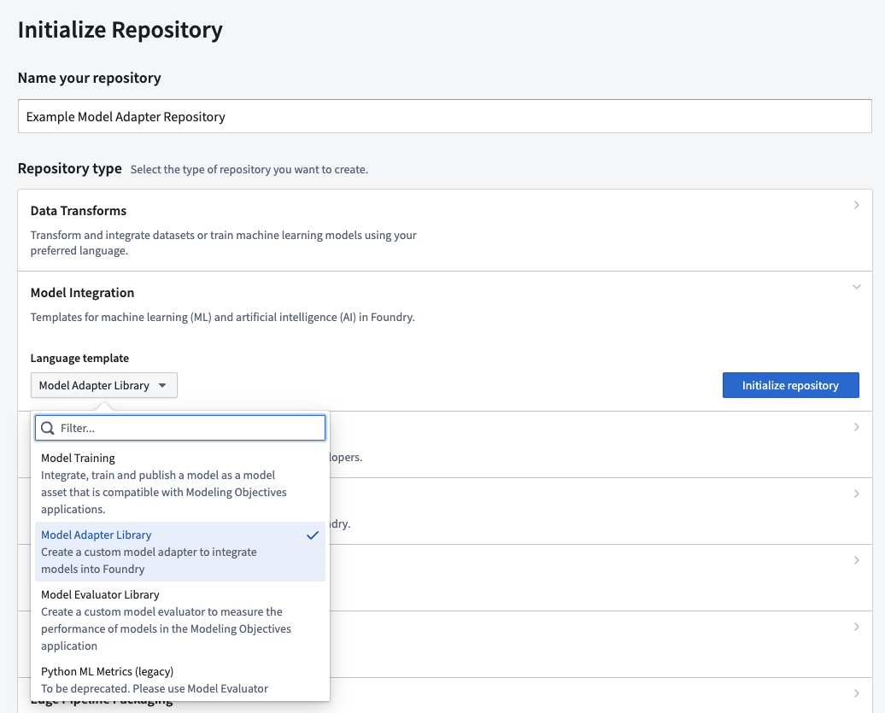
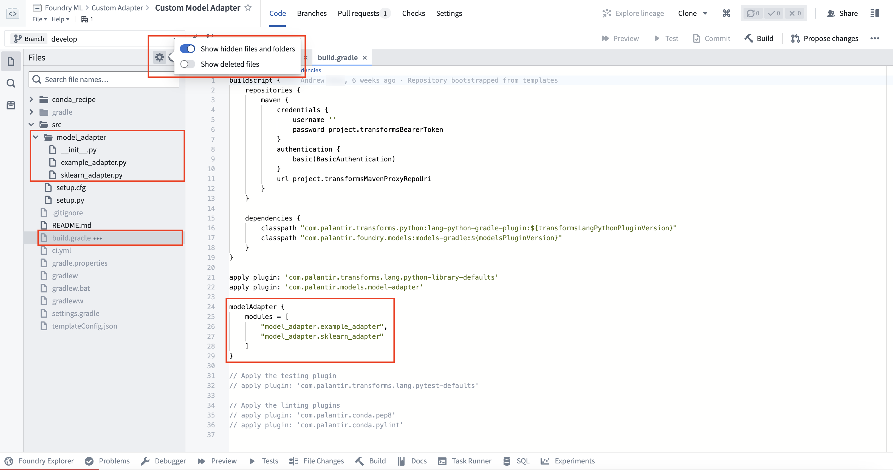
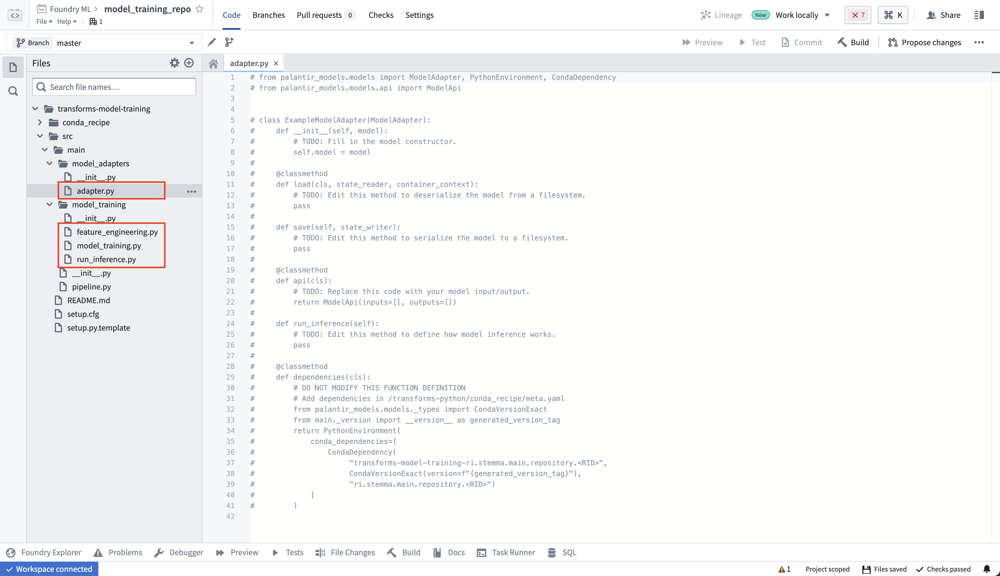

<!-- source: https://palantir.com/docs/foundry/integrate-models/model-adapter-creation/ · mirrored 2026-08-18 from Palantir Foundry docs -->

# Create a model adapter

There are two primary methods for creating a model adapter:

* Through a standalone **Model Adapter Library** template, where the adapter is published to your Foundry environment as a [Python library](/docs/foundry/transforms-python/share-python-libraries/#publish-a-python-library) for use across multiple consuming repositories.
* By defining your adapter class locally to the resource the model is being published from:
  * In a code repository using the **Model Training Template**.
  * In a Jupyter® code workspace, by defining the adapter in a Python file separate from your notebook.

The **Model Adapter Library** template should be used for the following:

1. Container-backed models
2. External models
3. Creating a model adapter that can be shared across repositories

The **Model Training** template should be used for most models that are created in Foundry through Python transforms in Code Repositories. By integrating the model adapter definition into the transforms repository, you can iterate on the adapter and training logic quicker than with the `Model Adapter Library` template.

When training models in a Jupyter® workspace, the adapter must be defined in a separate `.py` file and imported into the notebook.

Below is a comparison of the methods, along with guidance on when to use each:

|                       | Model Training Template              | Jupyter® Workspace                       | Model Adapter Library                  |
|:----------------------|:------------------------------------:|:-------------------------------------:|:--------------------------------------:|
| Authoring environment | Code Repositories                    | Jupyter® notebook                     | Code Repositories                      |
| Supported model types | Foundry-produced                     | Foundry-produced                     | Python transforms, Container, External |
| Adapter package name  | Derived from repository              | `cws_adapter`                         | Configurable                           |
| Limitations           | Hard to reuse across repositories   | Hard to reuse across repositories    | Slower iteration cycles                |

## Model Adapter Library template

To create a container, external, or re-usable Python transforms model adapter, open the [Code Repositories application](/docs/foundry/code-repositories/overview/) and choose **Model Adapter Library**.

The **Model Adapter Library** contains some example implementation in the `src/model_adapter/` directory. Model adapters produced using this template have a configurable package name, initially derived from the name of the repository. You can view and modify the `condaPackageName` value in the hidden `gradle.properties` file (note that spaces and other special characters will be replaced with `-` in the published library).

As with other [Python library repositories](/docs/foundry/transforms-python/share-python-libraries/#publish-a-python-library), tagging commits will publish a new version of the library. These published libraries can be imported into other Python transforms repositories for both model training and inference.

A repository can publish multiple model adapters. Any additional adapter implementation files must be added as a reference to the list of model adapter modules within the `build.gradle` hidden file of the adapter template. By default, only the `model_adapter.example_adapter` will be published.

The implementation of the adapter depends on the type of model being produced. Learn more in the [external model adapters documentation](/docs/foundry/integrate-models/external-model-connection/#example-model-adapter-structure), or review the [example container model adapter](/docs/foundry/integrate-models/container-model-adapter-example/).

## Model Training template

To create a model directly in Foundry using Code Repositories, open the [Code Repositories application](/docs/foundry/code-repositories/overview/) and choose the **Model Training** template. This repository allows you to author [Python data transforms](/docs/foundry/transforms-python/getting-started/) to train and run inference on models.

Model adapters produced using this template cannot have a custom package name or be tagged. The adapter will be published in a library called `transforms-model-training-<repository rid>`, and the version will be derived from the Git commit. The full name and version of the package can be viewed on the Palantir model page. This library must be added to downstream repositories to be able to load the model as a `ModelInput`. If this is not suitable for your use case, the Model Adapter Library template allows you to configure both the version and package name.

To learn more, read the documentation on [training models in Foundry with the training template](/docs/foundry/integrate-models/model-asset-code-repositories/).

## Code Workspaces

To create a model in a Jupyter® workspace, open the **Models** tab in the left sidebar and select **Add model > Create new model**. A skeleton model adapter will be generated in a `.py` file named after the alias you provide for the model.

In a Jupyter® workspace, the adapter class must be defined in a separate `.py` file and imported into the notebook. Defining the adapter class directly in a notebook cell is not supported. When the model is published, the adapter and other Python files in the working directory are packaged into a library called `cws_adapter`, and the version is derived from the latest Git tag.

To learn more, read the documentation on [training models in a Jupyter® notebook](/docs/foundry/integrate-models/model-asset-code-workspaces/).
