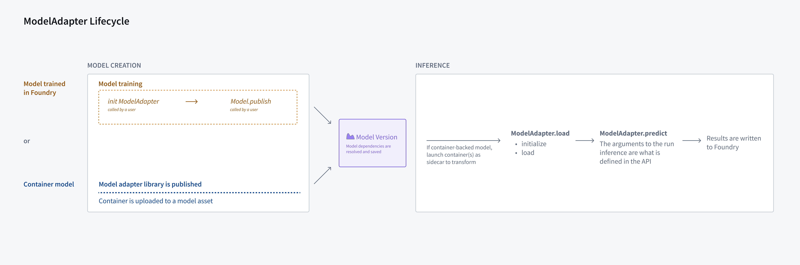

<!-- source: https://palantir.com/docs/foundry/integrate-models/model-adapter-overview/ · mirrored 2026-08-18 from Palantir Foundry docs -->

# Model adapter overview

Model adapters are a generalized framework to enable Foundry to interoperate with arbitrary models. Model adapters are one of the two components that make a [model](/docs/foundry/integrate-models/integrate-overview/):

* **Model artifacts:** The model files, parameters, weights, containers, or credentials where a trained model is saved.
* **Model adapter:** The logic and the environment dependencies needed for Foundry to interact with the **model artifacts** to load, initialize, and perform inference with the model.

Model adapters can enable Foundry to interoperate with the following:

1. [Models trained in Foundry](/docs/foundry/integrate-models/model-asset-code-repositories/)
2. [Model files trained outside of Foundry](/docs/foundry/integrate-models/integrate-overview/)
3. [Models containerized outside of Foundry and pushed into the Foundry Docker registry](/docs/foundry/integrate-models/container-overview/)
4. [Models trained and hosted outside of Foundry](/docs/foundry/integrate-models/external-model-connection/)

## Adapter components

Palantir interacts with all models in the same way by interfacing with the model adapter class of that model version.

### Initialization

Since models can be created once, and used in multiple places within the platform, the adapter needs to be aware of how to initialize an instance of models from either the weights or the underlying container.

For weights trained within the platform, users should use the [@auto\_serialize](/docs/foundry/integrate-models/serialization/#auto-serialization) annotation to leverage built-in serializers that should work with most model types. In advanced cases where serialization / deserialization logic must be explicitly specified, see: [load() and \_save() methods](/docs/foundry/integrate-models/model-adapter-reference/).

For container and external models, the adapter is initialized using either the [`init_container()`](/docs/foundry/integrate-models/container-model-adapter-example/), or [`init_external()`](/docs/foundry/integrate-models/external-model-connection-sagemaker/) method, so that it can be used for inference. For both types of models, the  `load()` method is also called when the model is initialized, but it then calls `init_container()` or `init_external()` in the background so that only the context that is relevant to these types of models (for example, [ContainerizedApplicationContext](/docs/foundry/integrate-models/model-adapter-reference/#containerizedapplicationcontext) or [ExternalModelContext](/docs/foundry/integrate-models/model-adapter-reference/#externalmodelcontext)) is provided to the model instances. As an alternative to using `init_container()` or `init_external()`, users can overwrite the `load()` method to define how these models should be initialized.

:::callout{theme="neutral"}
To use a model in a transform, the environment must contain the model adapter's dependencies. To prevent dependency conflicts between model adapters and transform environments, set `use_sidecar = True` in `ModelInput` to run the model in an isolated container. `predict()` requests will be automatically routed to the sidecar without additional code changes. Review [the `ModelInput` class reference](/docs/foundry/integrate-models/transform-model-input/) for more details.
:::

### API

Each adapter is required to declare an API description. The platform relies on this description, which includes the expected inputs, outputs, column names and type, for enabling integrations with other applications for a variety of model consumption patterns.

For supported types and examples of API definitions, review the [API reference](/docs/foundry/integrate-models/model-adapter-api/).

### Inference

Once initialized, the adapter can be used for inference for either batch or interactive workloads. The inference logic must be defined as part of the [`predict()`](/docs/foundry/integrate-models/model-adapter-api/) method.

The platform uses the provided [API](#api) definition to call the [`predict()`](/docs/foundry/integrate-models/model-adapter-api/) method with the defined names and types so that inference can be performed.

For more information on creating model adapters, refer to the documentation on [creating model adapters](/docs/foundry/integrate-models/model-adapter-creation/). You can also consult the full Python API on the [model adapter reference page](/docs/foundry/integrate-models/model-adapter-reference/).
