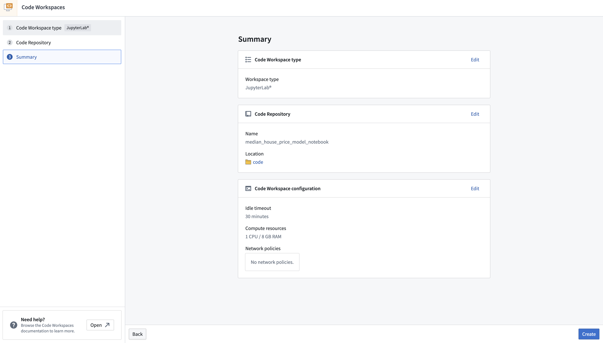
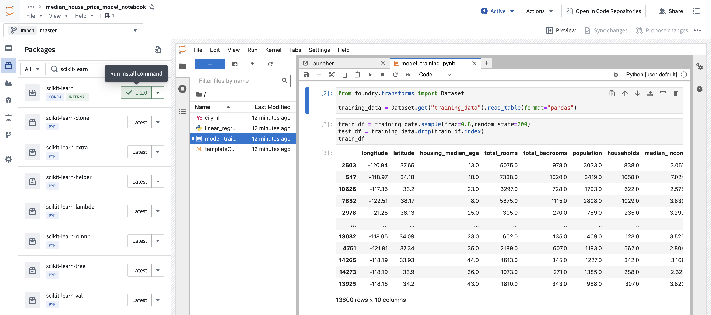
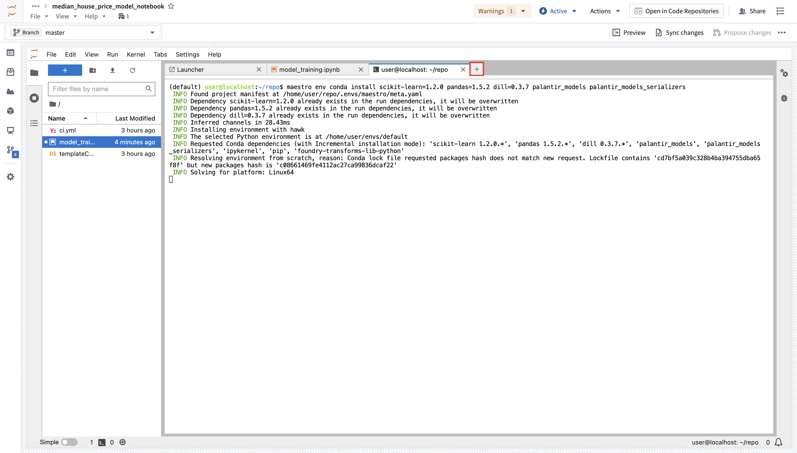
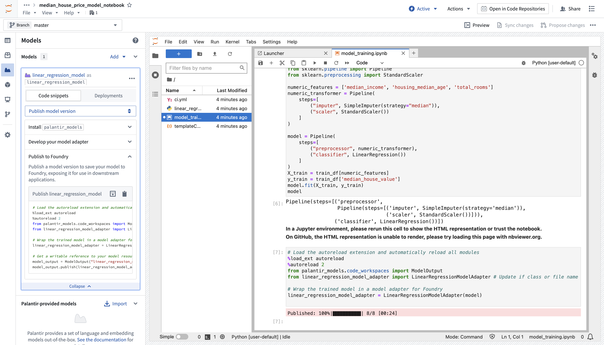

<!-- source: https://palantir.com/docs/foundry/integrate-models/model-asset-code-workspaces/ · mirrored 2026-08-18 from Palantir Foundry docs -->

# Train a model in a Jupyter® notebook

:::callout{theme="warning"}
Model assets do not currently support the SparkML library. We recommend switching to a single-node machine learning framework like PyTorch, TensorFlow, XGBoost, LightGBM, or scikit-learn.
:::

[Models](/docs/foundry/model-integration/models/) can be trained in a Jupyter® notebook in [Code Workspaces](/docs/foundry/code-workspaces/overview/). To train a model, complete the following steps:

1. [Create a Jupyter® code workspace](#create-a-jupyter-code-workspace)
2. [Import data and write model training code](#import-data-and-write-model-training-code)
3. [Add a model output and implement the model adapter](#add-a-model-output-and-implement-the-model-adapter)
4. [Publish the model to Foundry](#publish-the-model-to-foundry)
5. [Consume the model](#consume-the-model)

The [supervised model training tutorial](/docs/foundry/model-integration/tutorial-train-jupyter-notebook/) provides additional instruction on model training in Jupyter® code workspaces.

## Create a Jupyter® code workspace

1. To create a new Jupyter® code workspace for model training, navigate to your project folder and select **+ New > Jupyter® Code Workspace**, or select **+ New code workspace** in the Code Workspaces application.
2. In Code Workspaces, select **JupyterLab®** as the workspace type, then select **Continue** on the bottom right.
3. Name your workspace in relation to the model you are training. You can optionally configure additional settings such as the workspace's compute resources or network policies by selecting **Advanced** in the **Code Repository** step. Once you have named your notebook, Select **Continue**.
4. Lastly, select **Create** to create and launch the workspace.



## Import data and write model training code

After establishing a workspace, you can create a new notebook to import data and begin writing model training code.

:::callout{theme="neutral" title="Installing dependencies"}
Code Workspaces grants access to packages available in other Foundry code authoring environments, such as Code Repositories. To add a new package, open the **Packages** tab available on the left sidebar of your workspace, search for the package you need, and select, then click on **Latest** or another available version to open a Terminal and run the corresponding install command.
:::

### Import data into the workspace

The Code Workspaces application enables users to import existing Foundry datasets for use as training data. Training data used in Code Workspaces will need a human-readable alias as its resource identifier.

1. To import a dataset, open the **Data** tab at the top of the left sidebar, then select **Add dataset > Read existing datasets**.
2. Select the dataset you want to import to your workspace, enter a dataset alias, and then select **+ Add dataset** to complete **Step 1**.
3. Code Workspaces will then generate a code snippet in **Step 2** where you can select the dataset format, such as a `pandas DataFrame`. To copy the generated code snippet into your notebook, select the clipboard icon in the upper right corner of the code snippet, then select **Done**. Below is an example of a code snippet generated by Code Workspaces:

```python
from foundry.transforms import Dataset

training_data = Dataset.get("my-alias").read_table(format="pandas")
```

4. With the code snippet copied to your clipboard, launch a Notebook from the `Launcher` panel by selecting **Python \[user-default]**, and pasting the code snippet into the first cell.
5. Run the code to import the dataset by selecting the "play" icon in the action toolbar or by selecting **Run > Run Selected Cells** in the menu bar.

### Write model training code

The open source tools available for model development in Code Workspaces allow you to train your model for a wide array of analytical use cases, such as regression or classification. Below is a sample linear regression model that predicts median household income using `scikit-learn`.

1. Install `scikit-learn` in your workspace by selecting the **Packages** icon under **Data** in the left sidebar.
2. Choose between `Conda` or `PyPi` managers in the dropdown to the left of the search bar, then search for `scikit-learn`.
3. To run the install command in the terminal, choose a package version in the drop down, then select the version button. Alternatively, you can install several packages into your [managed environment](/docs/foundry/code-workspaces/jupyterlab/#managed-condapypi-environments-in-jupyter-notebooks) at once from a terminal using the `maestro env conda install` or `maestro env pip install` commands.

Package installation using the sidebar:



Package installation from the terminal:



After writing and running your model in Code Workspaces, you can publish it to Foundry for integration across other applications. Below is an example of model training code:

```python
from sklearn.impute import SimpleImputer
from sklearn.linear_model import LinearRegression
from sklearn.pipeline import Pipeline
from sklearn.preprocessing import StandardScaler

numeric_features = ['median_income', 'housing_median_age', 'total_rooms']
numeric_transformer = Pipeline(
    steps=[
        ("imputer", SimpleImputer(strategy="median")),
        ("scaler", StandardScaler())
    ]
)

model = Pipeline(
    steps=[
        ("preprocessor", numeric_transformer),
        ("classifier", LinearRegression())
    ]
)
X_train = training_dataframe[numeric_features]
y_train = training_dataframe['median_house_value']
model.fit(X_train, y_train)
```

## Add a model output and implement the model adapter

To make a model available outside of Code Workspaces, you must add a new model output to the workspace. Code Workspaces will automatically create and store a new `.py` file in your existing workspace after you create a new model output, which you can use to implement a [model adapter](/docs/foundry/integrate-models/model-adapter-overview/). Model adapters provide a standard interface for all models in Foundry, ensuring the platform's production applications can consume models immediately after they are created. Foundry infrastructure will load the model, configure its Python dependencies, expose its API(s), and enable model interfacing.

1. To add an output, open the **Models** tab in the left sidebar below **Packages** and select **Add model > Create new model**. Name the model and save it to a location of your choice.


2. After you name and save your model, you will be prompted to **Publish a new model** in the left panel of your workspace. Complete **Step 1: Install `palantir_models`** by copying the code snippet to your clipboard and running it in your original `.ipynb` notebook file.

3. After you successfully install `palantir_models`, create and develop your model adapter in **Step 2: Develop your model adapter**. A model adapter must implement the following methods:

   1. **`save` and `load`:** In order to reuse your model, you need to define how your model should be saved and loaded. Palantir provides [default methods](/docs/foundry/integrate-models/serialization/#auto-serialization) of serialization (saving), and in more complex cases, you can [implement custom serialization](/docs/foundry/integrate-models/model-adapter-reference/#model-save-and-load) logic.
   2. **`api`:** Defines the API of your model and tells Foundry what type of input data your model requires.
   3. **`predict`:** Called by Foundry to provide data to your model. This is where you can pass input data to the model and generate inferences (predictions).

   Refer to the [model adapter API reference](/docs/foundry/integrate-models/model-adapter-reference/) for more details.

The code sample below implements the functions described above to develop an adapter for a linear regression model using `scikit-learn`:

```python
import palantir_models as pm
from palantir_models.serializers import DillSerializer

class LinearRegressionModelAdapter(pm.ModelAdapter):

    @pm.auto_serialize(
        model=DillSerializer()
    )
    def __init__(self, model):
        self.model = model

    @classmethod
    def api(cls):
        columns = [
            ('median_income', float),
            ('housing_median_age', float),
            ('total_rooms', float),
        ]
        return {"df_in": pm.Pandas(columns)}, \
               {"df_out": pm.Pandas(columns + [('prediction', float)])}

    def predict(self, df_in):
        df_in['prediction'] = self.model.predict(
            df_in[['median_income', 'housing_median_age', 'total_rooms']]
        )
        return df_in
```

Refer to the [model adapter documentation](/docs/foundry/integrate-models/model-adapter-overview/) for more guidance.

### (Optional) Log metrics and hyperparameters to a model experiment

[Model experiments](/docs/foundry/model-integration/experiments/) is a lightweight framework for logging metrics and hyperparameters produced during a model training run, which can then be published alongside a model and persisted in the model page.

[Learn more about creating and writing to experiments.](/docs/foundry/integrate-models/experiments-overview/)

## Publish the model to Foundry

To publish the model to Foundry, copy the available snippet for the model you wish to publish in the left sidebar under **Step 3: Publish your model**, paste it in your notebook and run the cell. Here is an example snippet to publish a linear regression model using the `LinearRegressionModelAdapter` written above:

```python
from palantir_models.code_workspaces import ModelOutput

# Model adapter has been defined in linear_regression_model_adapter.py
from linear_regression_model_adapter import LinearRegressionModelAdapter

# sklearn_model is a model trained in another cell
linear_regression_model_adapter = LinearRegressionModelAdapter(sklearn_model)

# "linear_regression_model" is the alias for this example model
model_output = ModelOutput("linear_regression_model")
model_output.publish(linear_regression_model_adapter)
```

The snippet should work as is, with the exception of having to properly pass the model you trained to the adapter initialization. Once the code is ready, you can run the cell to publish the model to Foundry.



## Consume the model

Models can be consumed through submission to a [modeling objective](/docs/foundry/model-integration/objectives/). A model can be submitted to a modeling objective for:

* [Automatic model evaluation](/docs/foundry/evaluate-models/model-evaluation-automatic/)
* [Batch pipelines](/docs/foundry/manage-models/set-up-batch/)
* [Live hosting](/docs/foundry/manage-models/set-up-live/)

Models can also be consumed using [model deployments](/docs/foundry/manage-models/create-a-model-deployment/), which represent an alternative model hosting system beyond modeling objectives.

***

*Jupyter®, and JupyterLab®, are trademarks or registered trademarks of NumFOCUS.*

All third-party trademarks referenced remain the property of their respective owners. No affiliation or endorsement is implied.
