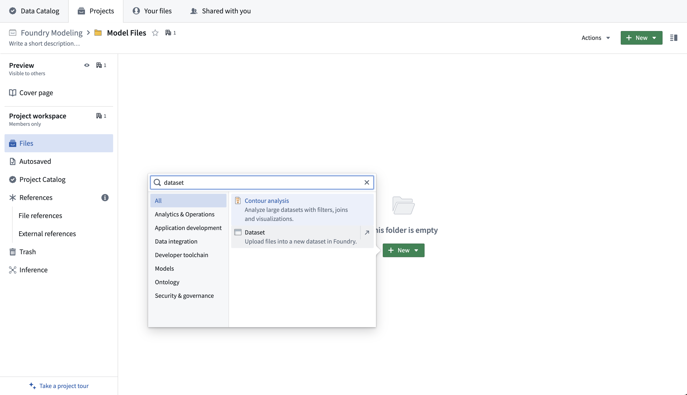
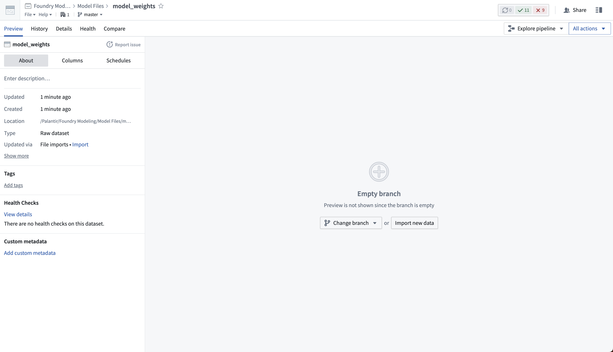
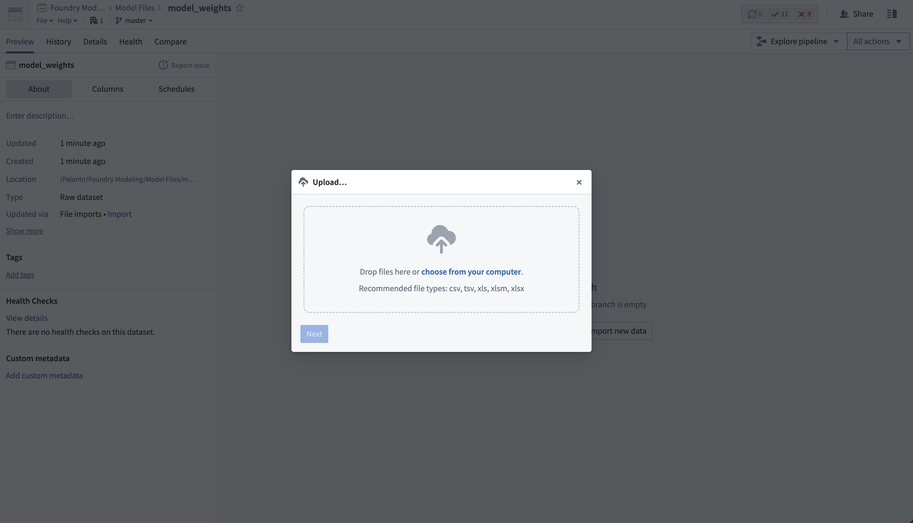
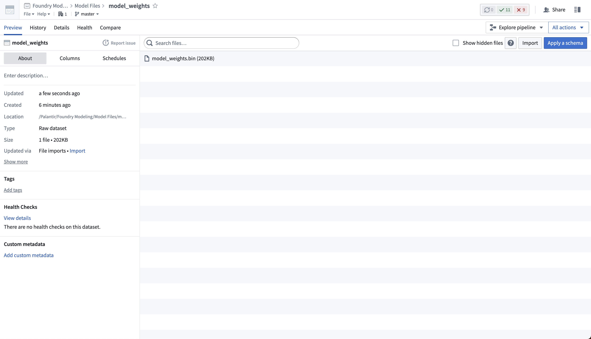
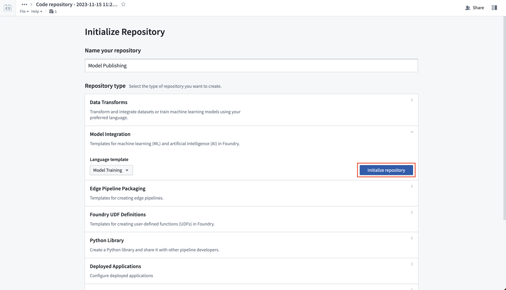
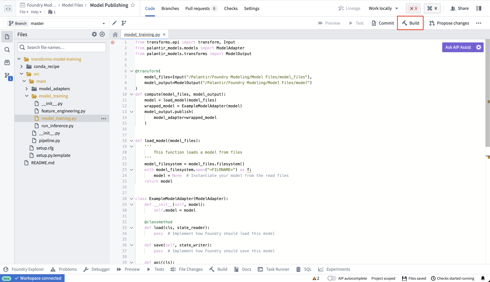

<!-- source: https://palantir.com/docs/foundry/integrate-models/model-asset-files/ · mirrored 2026-08-18 from Palantir Foundry docs -->

# Publish a model from pre-trained files

Palantir enables the creation of a model that wrap weights produced outside of the platform. These files can include open-source model weights, models trained in a local development environment, models trained in the [Code Workspaces](/docs/foundry/code-workspaces/jupyterlab/) application, and model weights from legacy systems.

Once a Palantir model has been created, Palantir provides the following:

* Integration with batch pipelines and real-time model hosting.
* Full versioning, granular permissioning, and governed model lineage.
* Model management and live deployment via [Modeling Objectives](/docs/foundry/model-integration/objectives/).
* Binding to the Ontology, allowing for operationalization via [functions on models](/docs/foundry/functions/functions-on-models/) and what-if scenario analysis.

## Create a model from model files

To create a model from model files, you will need the following:

* Model files that can be uploaded to Palantir
* A [model adapter](#2-create-a-model-training-repository-to-define-model-adapter-logic) that tells Palantir how to load and run inference with the model

### 1. Upload model files to an unstructured dataset

First, upload your model files to an unstructured dataset in the Palantir platform. Create a new dataset by selecting **+New > Dataset** in a Project.



Then, select **Import new data** and choose the files from your computer to upload to the model.





If required, you can upload many different files to the same dataset. The dataset will be unstructured, meaning it will not have a tabular schema.



### 2. Create a model training repository to define model adapter logic

Create a new code repository that will manage the logic for reading the model files from your unstructured dataset. The logic will wrap those files in a model adapter and publish them as a model. In the Code Repositories application, choose to initialize a **Model Integration** repository with the **Model Training** language template.

View the full documentation on the [Model Training template](/docs/foundry/integrate-models/model-asset-code-repositories/#1-author-a-model-adapter) and the [model adapter API](/docs/foundry/integrate-models/model-adapter-reference/) for reference.



### 3. Publish weights to a model

To publish model files in your unstructured dataset as a Palantir model, you must author a transform that completes the following:

1. Loads the saved model files into a proper Python object from the unstructured dataset
2. Instantiates a model adapter using that loaded Python object
3. Publishes the model adapter as a model resource

You can place the logic for loading and publishing a model within the `model_training` folder in the repository.

For additional information, we recommend reviewing the following documentation:

* The full [Model Adapter API definition](/docs/foundry/integrate-models/model-adapter-reference/)
* How to [read files from an unstructured dataset](/docs/foundry/transforms-python/unstructured-files/)
* How to [create and publish a model adapter with the Model Training template](/docs/foundry/model-integration/tutorial-train-code-repositories/#2c3-how-to-author-model-training-logic-in-code-repositories)
* An [example wrapping of a locally-trained model](/docs/foundry/integrate-models/model-asset-files-iris/)

Once you have defined your model training logic, select **Build** to execute the logic to read the model files and publish a model.

```python
from transforms.api import transform, Input
from palantir_models.transforms import ModelOutput, copy_model_to_driver

import palantir_models as pm

import os
import pickle

@transform(
    model_files=Input("<Model Files Dataset>"),
    model_output=ModelOutput("<Your Model Path>")
)
def compute(model_files, model_output):
    # all the files from the dataset are copied onto the driver
    model_files_path = copy_model_to_driver(model_files.filesystem())

    # for example, if you had a model saved as in a pickle file, you would then load that using pickle
    with open(os.path.join(model_files_path, "model.pkl"), 'rb') as file:
        model = pickle.load(file)

    wrapped_model = ExampleModelAdapter(model)
    model_output.publish(
        model_adapter=wrapped_model
    )

class ExampleModelAdapter(pm.ModelAdapter):

    @pm.auto_serialize
    def __init__(self, model):
        self.model = model

    @classmethod
    def api(cls):
        pass  # Implement the API of this model

    def predict(self, df_in):
        pass # Implement the inference logic

```

The same file loading logic applies to most other cases, where libraries (such as PyTorch or Tensorflow) may provide methods for reading serialized files to Python objects.



### 4. Consume the published model

Once you have successfully published a model, you can consume the model for inference. Use the following documentation for guidance:

* [Deploy the model in a modeling objective for live inference](/docs/foundry/manage-models/set-up-live/)
* [Use the uploaded model in a batch pipeline in a modeling objective](/docs/foundry/manage-models/set-up-batch/)
* [Configure a Python transform that performs inference with the model](/docs/foundry/integrate-models/model-asset-code-repositories/#run-inference-in-python-transforms)
