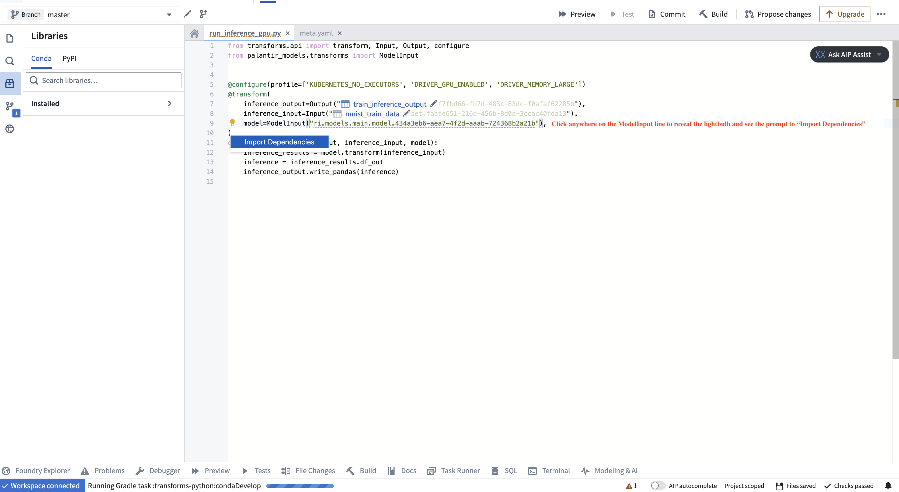

<!-- source: https://palantir.com/docs/foundry/integrate-models/transform-model-input/ · mirrored 2026-08-18 from Palantir Foundry docs -->

# ModelInput in transforms

The `ModelInput` class allows you to load and use models within Python transforms, making it easy to incorporate model inference logic into your data pipelines. To learn more about using models in code workspaces, [you can review details on the `ModelInput` class in Jupyter® Code Workspaces](/docs/foundry/code-workspaces/training-models/#model-input-class).

## Class definition

```python
from palantir_models.transforms import ModelInput

ModelInput(
    alias,                  # (string) Path or RID of model to load
    model_version=None,     # (Optional) RID of specific model version
    use_sidecar=False,      # (Optional) Run model in separate container
    sidecar_resources=None  # (Optional) Resource configuration for sidecar
)
```

## Parameters

| Parameter | Type | Description | Version / Notes |
|---|---|---|---|
| **`alias`** | `str` | Path or resource ID (RID) of the model resource to load from. | |
| **`model_version`** | `Optional[str]` | RID or semantic version of the specific model version to use. If not specified, the latest version will be used. | |
| **`use_sidecar`** | `Optional[bool]` | When `True`, runs the model in a separate container to prevent dependency conflicts between the model adapter and transform environment. | Introduced in `palantir_models` version 0.1673.0 |
| **`sidecar_resources`** | `Optional[Dict[str, Union[float, int]]]` | Resource configuration for the sidecar container. This parameter can only be used when `use_sidecar` is set to `True`. <br><br> Supports the following options: <br> <table><tr><th>Option</th><th>Type</th><th>Description</th></tr><tr><td>`"cpus"`</td><td>`float`</td><td>Number of CPUs for the sidecar container</td></tr><tr><td>`"memory_gb"`</td><td>`float`</td><td>Memory in GB for the sidecar container</td></tr><tr><td>`"gpus"`</td><td>`int`</td><td>Number of GPUs for the sidecar container</td></tr></table> | Introduced in `palantir_models` version 0.1673.0 |

## Examples

The code snippets below demonstrate the usage of a model in a transform. The examples assume the adapter for the model has a single Pandas input and a single Pandas output DataFrame called `output_df` specified in its API. The `transform` method on the model adapter, which leverages your provided `predict` method, automatically converts `data_in`, a `TransformInput`/`LightweightInput` instance, into the tabular input (either a Spark or Pandas DataFrame) expected by your model adapter's API.

### Model inference in lightweight transforms (recommended)

For use cases that do not require distributed inference in Spark, it is recommended to use lightweight transforms (the default with `@transform.using`) and run the model as a sidecar container. [Learn more about model sidecars below](#running-models-as-sidecar-containers).

```python
from transforms.api import Input, Output, transform, LightweightInput, LightweightOutput
from palantir_models import ModelAdapter
from palantir_models.transforms import ModelInput


# Using use_sidecar=True with @transform.using requires palantir_models version 0.2010.0 or higher.
@transform.using(
    data_in=Input("path/to/input"),
    model_input=ModelInput(
        "path/to/my/model",
        use_sidecar=True # runs the model as a sidecar container
    ),
    out=Output('path/to/output'),
)
def my_transform(data_in: LightweightInput, model_input: ModelAdapter, out: LightweightOutput) -> None:
    # Assuming the model's API has a single Pandas input
    # and a single pandas output named `df_out`.
    inference_results = model_input.transform(data_in)
    predictions = inference_results.df_out
    # Alternatively, you can use the predict method on
    # a Pandas DataFrame instance directly:
    # predictions = model_input.predict(data_in.pandas())
    out.write_pandas(predictions)
```

### Distributed inference in Spark transforms

Using the `DistributedInferenceWrapper`, the model will be distributed to each of the executors in the Spark job. [Learn more about distributed Spark inference below](#distributed-inference-using-Spark-executors).

```python
from transforms.api import transform, Input, Output, configure
from palantir_models.transforms import ModelInput, DistributedInferenceWrapper

@transform.spark.using(
    input_df=Input("ri.foundry.main.dataset.3cd098b3-aae0-455a-9383-4eec810e0ac0"),
    model_input=ModelInput("ri.models.main.model.5b758039-370c-4cfc-835e-5bd3f213454c"),
    output=Output("ri.foundry.main.dataset.c0a3edbc-c917-4f20-88f1-d797ebf27cb2"),
)
def compute(ctx, input_df, model_input, output):
    model_input = DistributedInferenceWrapper(model_input, ctx, 'auto')
    # Use .predict with the DistributedInferenceWrapper and pass it a Spark DataFrame
    # It handles passing the data as pandas to the model and returns a Spark DataFrame
    predictions = model_input.predict(input_df.dataframe())
    # Write the output as a Spark DataFrame
    output.write_dataframe(predictions)
```

## Usage notes

### Importing the adapter code when not using a sidecar container

To instantiate the model adapter class, the environment must have access to the model adapter code. In particular, if the model was created in a different repository, the adapter code, which is packaged alongside the model as a Python library, needs to be imported as a dependency in your repository. The application will prompt you to do this, as shown in the screenshot below.



### Specifying a version

You can specify a particular model version using the `model_version` parameter. This is especially recommended if the model is not being retrained on a regular schedule as it helps prevent an unintended or problematic model from reaching production. If you do not specify a model version, the system will use the latest model available on the build’s branch by default.

:::callout{theme="info"}
Note that if no version is specified, each transform run will automatically fetch the latest model files for the model input, but it will not automatically update the adapter library version (containing the adapter logic you authored for that version and its Python dependencies) in the repository if the model was generated outside of the repository where it is being used. To update the library version, you will need to select the appropriate adapter version in the repository’s **Libraries** sidebar and verify that all checks pass. The adapter version corresponding to each model version can be found on the model’s page under **Inference configuration**.

If this workflow does not suit your needs, consider either using the model within the same repository where it is created or setting `use_sidecar` to `True`, as [explained below](#running-models-as-sidecar-containers).
:::

### Running models as sidecar containers

Running a model in a sidecar container (`use_sidecar=True`) is recommended for the majority of model inference use cases.

The main benefit of running the model as a sidecar is that the exact same library versions used to produce the model will also be used to run inference with it. In contrast, importing the adapter code as prompted by the repository user interface will create a new environment solve that merges the constraints from the adapter code and the repository. This may result in different library versions being used.

Additionally, when using a sidecar container to run the model, the adapter code corresponding to the model version being used will automatically be loaded in the sidecar without the user having to manually update the dependency and run checks in the repository.

When using a sidecar, `predict()` requests are automatically routed to the sidecar container without any additional code changes required:

```python
from transforms.api import Input, Output, transform, LightweightInput, LightweightOutput
from palantir_models import ModelAdapter
from palantir_models.transforms import ModelInput


# Using use_sidecar=True with @transform.using requires palantir_models version 0.2010.0 or later.
@transform.using(
    data_in=Input("path/to/input"),
    model_input=ModelInput(
        "path/to/my/model",
        use_sidecar=True
    ),
    out=Output('path/to/output'),
)
def my_transform(data_in: LightweightInput, model_input: ModelAdapter, out: LightweightOutput) -> None:
    # Assuming the model's API has a single Pandas input
    # and a single pandas output named `df_out`.
    inference_results = model_input.transform(data_in)
    predictions = inference_results.df_out
    # Alternatively, you can use the predict method on
    # a Pandas DataFrame instance directly:
    # predictions = model_input.predict(data_in.pandas())
    out.write_pandas(predictions)
```

#### Specifying resources with the sidecar

The example below will provision a sidecar alongside the driver and executor, each with 1 GPU, 2 CPUs and 4 GB of memory.

```python
from transforms.api import Input, Output, transform, LightweightInput, LightweightOutput
from palantir_models import ModelAdapter
from palantir_models.transforms import ModelInput


# Using use_sidecar=True with @transform.using requires palantir_models version 0.2010.0 or later.
@transform.using(
    data_in=Input("path/to/input"),
    model_input=ModelInput(
        "path/to/my/model",
        use_sidecar=True,
        sidecar_resources={
            "cpus": 2.0,
            "memory_gb": 4.0,
            "gpus": 1
        }
    ),
    out=Output('path/to/output'),
)
def my_transform(data_in: LightweightInput, model_input: ModelAdapter, out: LightweightOutput) -> None:
    ...
```

### Distributed inference using Spark executors

You can run distributed model inference using Spark executors. This approach can be beneficial for batch inference involving computationally heavy models or large datasets, with near-linear scalability.

Consider the following code snippet demonstrating how you can wrap an existing model for distributed inference:

```python
from transforms.api import transform, Input, Output, configure
from palantir_models.transforms import ModelInput, DistributedInferenceWrapper

@transform.spark.using(
    input_df=Input("ri.foundry.main.dataset.3cd098b3-aae0-455a-9383-4eec810e0ac0"),
    model_input=ModelInput("ri.models.main.model.5b758039-370c-4cfc-835e-5bd3f213454c"),
    output=Output("ri.foundry.main.dataset.c0a3edbc-c917-4f20-88f1-d797ebf27cb2"),
)
def compute(ctx, input_df, model_input, output):
    model_input = DistributedInferenceWrapper(model_input, ctx, 'auto')
    # Use .predict with the DistributedInferenceWrapper and pass it a Spark DataFrame
    # It handles passing the data as pandas to the model and returns a Spark DataFrame
    predictions = model_input.predict(input_df.dataframe())
    # Write the output as a Spark DataFrame
    output.write_dataframe(predictions)
```

:::callout{theme="warning"}
Do not use the `DistributedInferenceWrapper` for models that require multiple input rows to produce predictions. One example of such models are time series models, which require historical data for inference. The `DistributedInferenceWrapper` will use native Spark partitioning to send a subset of rows to each executor, and makes no guarantees that all rows required for prediction (for example, all rows from a given time series) will be sent to the model as part of the same partition. This can lead to erroneous predictions due to incomplete input data for models that take multiple rows.
:::

The `DistributedInferenceWrapper` class is initialized with the following parameters:

| Parameter | Type | Description | Notes |
|---|---|---|---|
| **`model`** | `ModelAdapter` | The model adapter instance to be wrapped. This is typically the `model_input` provided by `ModelInput`. | |
| **`ctx`** | `TransformContext` | The transform context, used to access Spark session information. This is typically the `ctx` argument of your transform function. | |
| **`num_partitions`** | `Union[Literal["auto"], int]` | Number of partitions to use for the Spark DataFrame. If `'auto'`, it will be set to match the number of Spark executors. If you experience Out Of Memory (OOM) errors, try increasing this value. | Default: `'auto'` |
| **`max_rows_per_chunk`** | `int` | Spark splits each partition into chunks before sending it to the model. This parameter sets the maximum number of rows allowed per chunk. More rows per chunk means less overhead but more memory usage. | Default: `1,000,000` |

Usage notes:

* You can configure the number of executors through Spark profiles.
* The distributed wrapper uses Spark’s user-defined functions (UDFs).
* The provided DataFrame must be a Spark DataFrame. The wrapped predict call will return a Spark DataFrame as well.
* The model adapter API should have one pandas DataFrame input and one pandas DataFrame output, with any number of input parameters.
* Usage of the `use_sidecar` parameter (described above) is supported, but optional.
