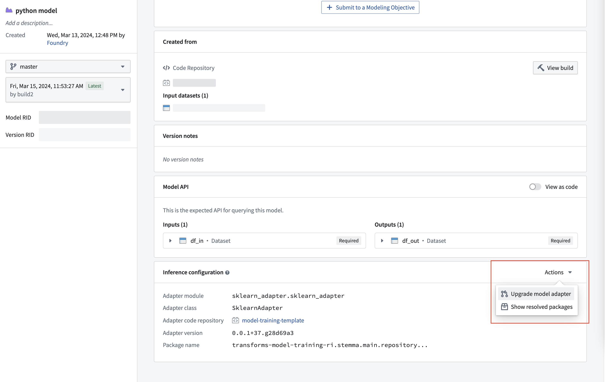
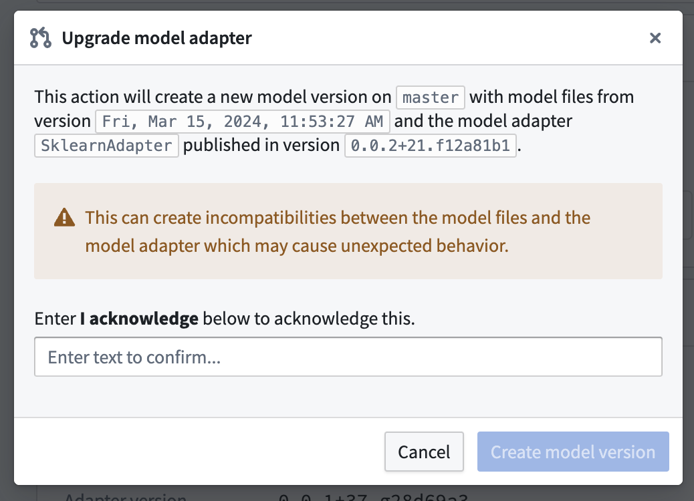

<!-- source: https://palantir.com/docs/foundry/integrate-models/upgrade-model-adapter/ · mirrored 2026-08-18 from Palantir Foundry docs -->

# Upgrade model adapter without retraining

:::callout{theme="neutral"}
This feature only applies to models trained in Code Repositories.
:::

Recall that a model is the combination of **model artifacts** and a **model adapter**:

* **Model artifacts:** The model files, parameters, weights, containers, or credentials where a trained model is saved.
* **Model adapter:** The logic and the environment dependencies needed for Foundry to interact with the **model artifacts** to load, initialize, and perform inference with the model.

Sometimes, it can be useful to update the model adapter without changing or reproducing the **model artifacts**. For example:

* Fixing a bug in a model adapter without retraining the saved model.
* Updating a model's `load`, `api`, `predict`, or `run_inference` method.
* Updating a model's Python environment in the event that a Python dependency was found to have a vulnerability or bug.

However, updating the model adapter can also introduce breaking changes to the model's inference environment. The following must be kept in mind when making changes to a model adapter:

* Changes to any Python dependency in the environment must be compatible with existing model artifacts.
* The new implementation of `load`, `api`, `predict`, or `run_inference` must be compatible with existing artifacts.
* The updated model adapter must be located in the same Python module with the same class name as the original model adapter.

It is highly recommended to exercise caution while updating a model adapter and to test changes first on a new branch.

## Upgrade Model Adapter from Models App

Foundry enables upgrading a model version's model adapter to its most recent commit or tag while retaining its published model weights.

To upgrade a model adapter, first implement and publish changes to the model adapter class in the repository where it is defined. In the Model Training template in Code Repositories, changes will be published after every commit. In a Model Adapter template, changes will be published after a new tag is created.

Next, on the model application, scroll to the **Inference Configuration** card. Click **Upgrade model adapter**.

Clicking **Create model version** will create a new model version using the updated model adapter with the previously published model artifacts.

If the previous model version has been submitted to a modeling objective, the updated model version will not automatically be submitted and must be submitted again.
