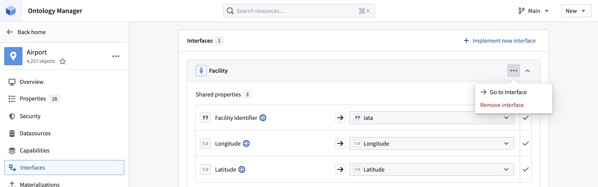
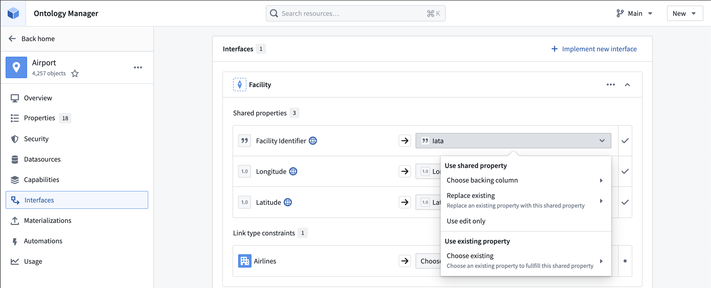

<!-- source: https://palantir.com/docs/foundry/interfaces/edit-interface-implementation/ · mirrored 2026-07-23 from Palantir Foundry docs -->

# Edit an interface implementation

Once implemented on an object, you can update the implementation by deleting it or changing the mappings.

First, open Ontology Manager and navigate to the object with the interface implementation you wish to edit.

## 1. Delete an interface implementation

Select the **...** icon and choose **Remove interface** to delete the implementation of the interface from this object type.

Select **Save** in the upper right corner to update the Ontology.

## Update implementation mappings

Select the dropdown menu to update the property or link type used to implement the interface.

Select **Save** in the upper right corner to update the Ontology.
