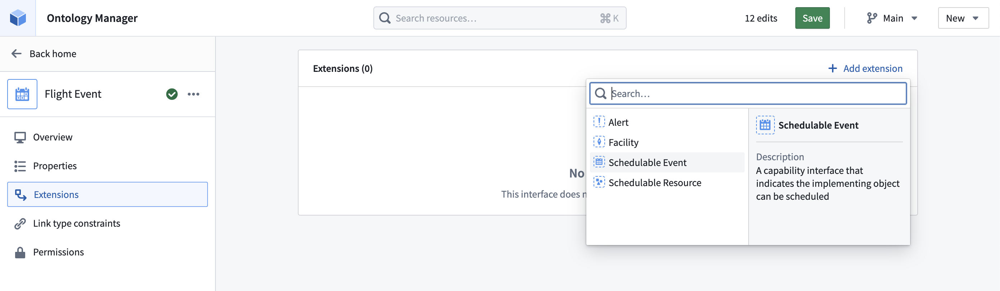
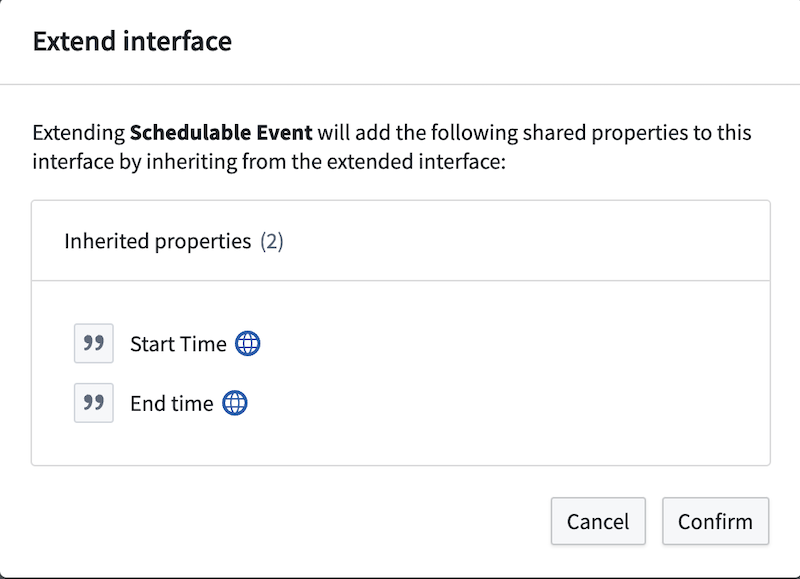
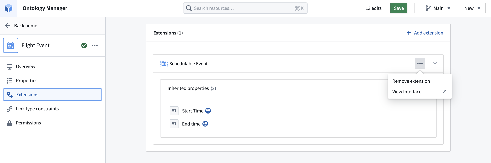

<!-- source: https://palantir.com/docs/foundry/interfaces/extend-interface/ · mirrored 2026-07-23 from Palantir Foundry docs -->

# Extend an interface

Extending an interface allows you to compose interfaces together, creating a new, more specific interface. This is particularly useful for constructing [abstract object interfaces](/docs/foundry/interfaces/interface-overview/) that implement multiple [capability interfaces](/docs/foundry/interfaces/interface-overview/). An interface inherits the shared properties, link type constraints, and action type constraints of the interface it extends. An interface can extend any number of other interfaces.

To extend an interface, follow the steps below.

1. From Ontology Manager, select the interface you wish to extend to open the interface overview page.

2. From the overview page, select **Extension** from the left side panel.

3. From the interface extensions page, select **Add extension**.

4. From the dropdown menu, select the interface to extend from your current interface.

5. In the confirmation dialog, review the shared properties, link type constraints, and action type constraints that will be added to the interface extension and select **Confirm**.

6. Select **Save** in the upper right corner to add the interface extension to the Ontology.

You can also remove an extension to decouple one interface from another. This action will remove all inherited shared properties from the interface, remove all inherited link type constraints, remove all inherited action type constraints, and disassociate the extending interface from the base interface.

