<!-- source: https://palantir.com/docs/foundry/interfaces/implement-interface/ · mirrored 2026-07-23 from Palantir Foundry docs -->

# Implement an interface

Once defined, an interface can be implemented by any object type that conforms to the interface definition. This means that object types must have properties that satisfy the interface's required properties, links that satisfy all required link type constraints, and action types that satisfy all required action type constraints defined on the interface.

Implementing an interface with an object type indicates that that object type is a concrete instance of the interface within the Ontology. This declaration facilitates additional functionality on the object type, namely:

* Object Set Service searches against the interface will return matching objects of the implementing object type.
* Objects of the implementing object type can be interacted with using both their local API names when typed as the concrete object type and the interface API names for properties and links when typed as the interface type.

In short, implementing an interface allows application consumers to interact with any and all implementing objects through the interface definition. This allows application code to be written using the interface as an API layer instead of requiring the application to support every implementing object type individually. Additionally, by using the interface as an application API layer, new object types can be added to the application by having them implement the application interface without requiring code changes to explicitly support the new object type.

## How to implement an interface in Ontology Manager

Follow the steps below to implement an interface with an object type.

### 1. Select your interface and object type

First, navigate to the object type in Ontology Manager and open the **Interfaces** tab. Select **+ Implement new interface** in the top right corner of the page.

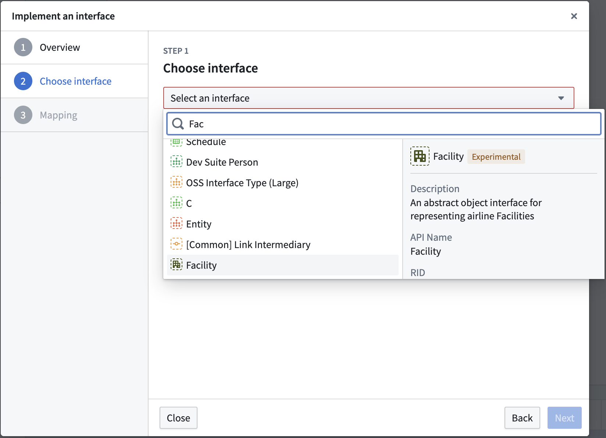

In the dialog that appears, select the interface to implement.

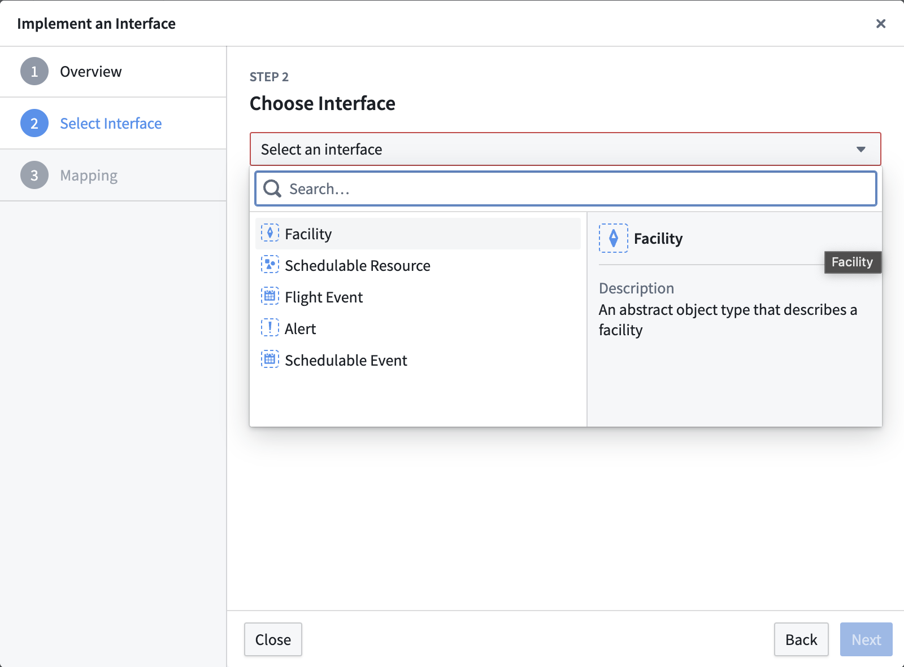

Alternatively, navigate to the interface overview page and select **+ New** in the **Implementations** section.

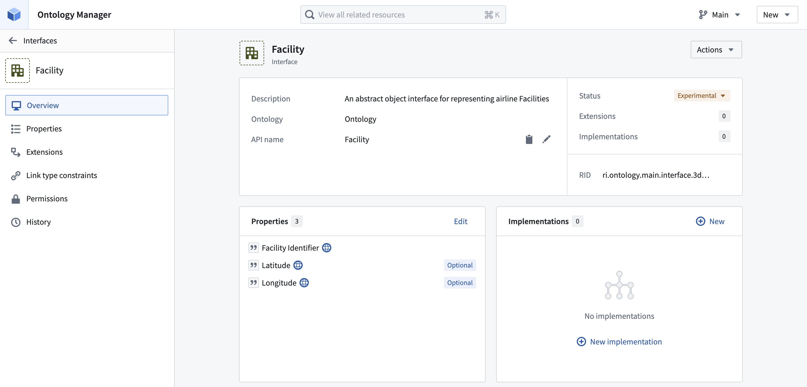

Then, select the object type to implement the interface.

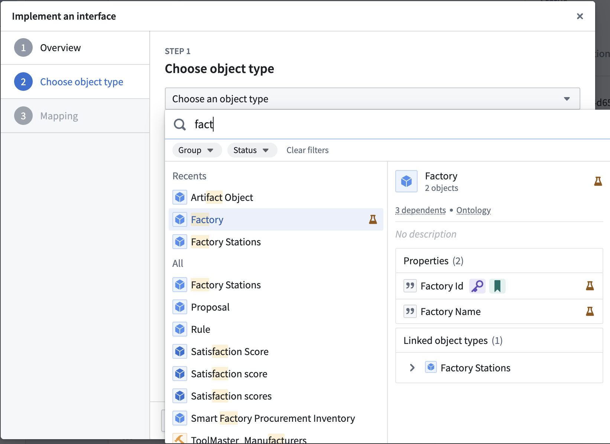

### 2. Map local properties

To implement an interface, an object type must declare a mapping of existing object properties onto the required interface properties. If an interface property is marked as **optional**, mapping may be skipped.

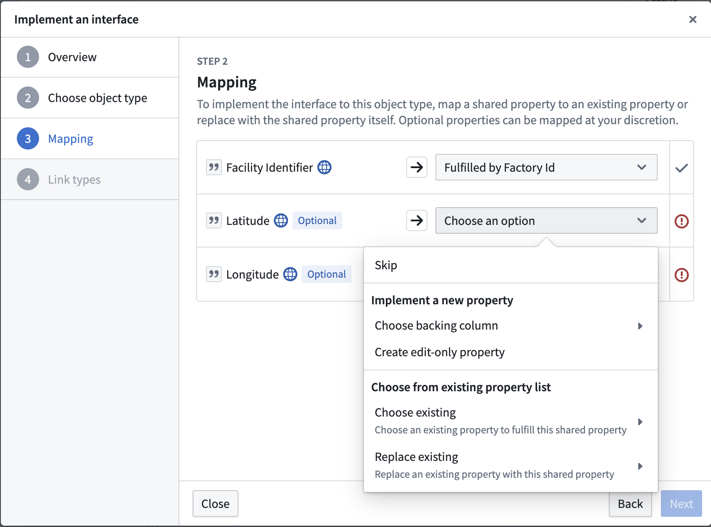

### 3. Map link type constraints

If any required [link type constraints](/docs/foundry/interfaces/interface-link-types-overview/) are declared on the interface, you must select a link type on the object type that satisfies each required link type constraint. You can also optionally provide a link mapping for any non-required link type constraints. You can choose an existing link type or create a new one to satisfy each constraint.

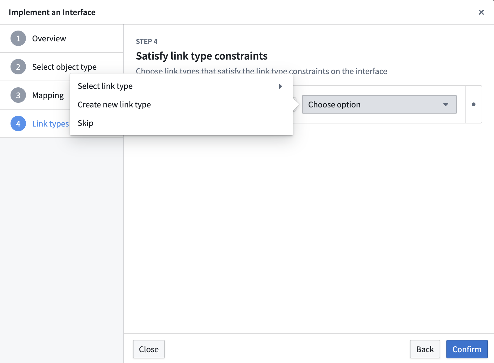

### 4. Map action type constraints

If any required [action type constraints](/docs/foundry/interfaces/interface-action-type-constraints/) are declared on the interface, you must select an action type on the object type that satisfies each required action type constraint. You can also optionally provide an action mapping for any non-required action type constraints.

After the interface implementation is created, configure parameter mappings from the object type's **Interfaces** tab. You must map any required parameter constraints to compatible required parameters on the concrete action type before saving changes to the Ontology.

### 5. Save changes

Select **Save** to make the changes to your Ontology.

## How to implement an interface in Pipeline Builder

Follow the steps below to implement an interface on an [object type output](/docs/foundry/pipeline-builder/outputs-add-ontology-output/#add-an-object-type-output) in Pipeline Builder.

### 1. Open output type configuration

Select the object type output that you would like to implement an interface, then select the **Edit** option.

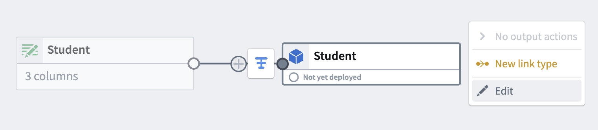

### 2. Select the interface to implement

Select **Implement interface**.

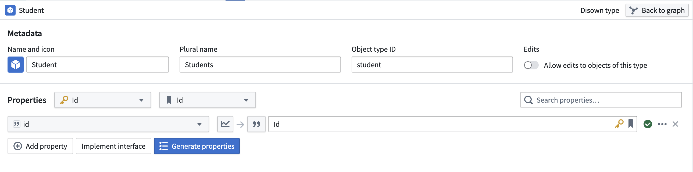

Then, select the interface to implement and choose **Implement and go to mapping**.

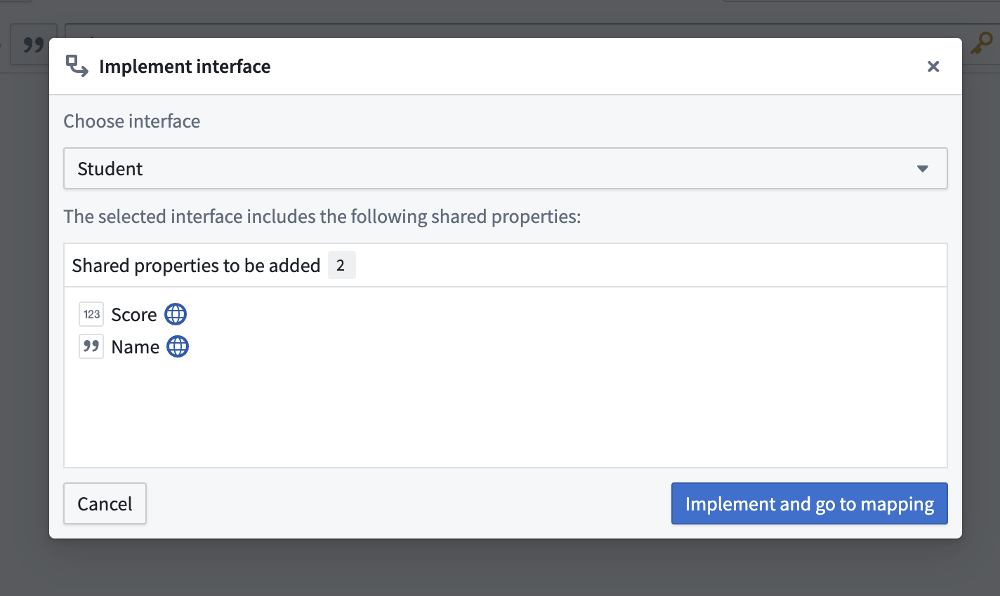

### 3. Map local properties

To implement an interface, an object type must contain the interface's shared properties **or** declare a mapping of existing object properties onto the interface shared properties. Shared properties that are present on both the interface and object type will be automatically mapped. Any shared properties that are not on the object type will require you to manually input a mapping to satisfy the interface definition.

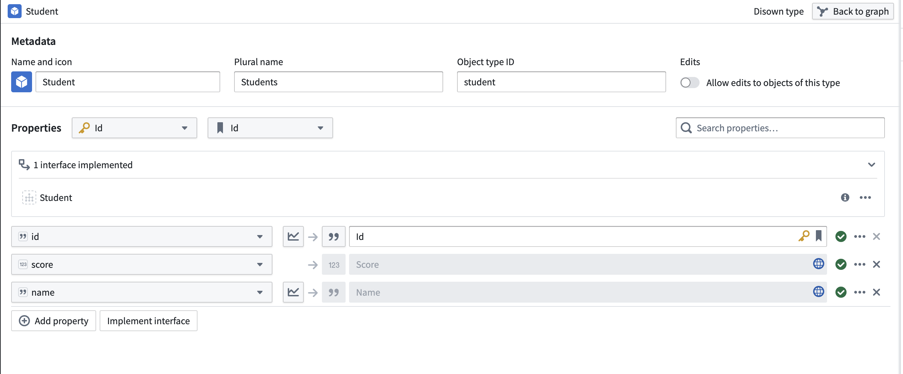

### 4. Review implemented interfaces

You can view the interfaces implemented by this object type output from the output type configuration panel.

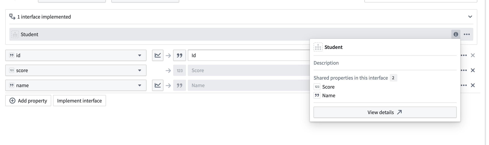

:::callout{theme="neutral"}
Pipeline Builder does not currently support link type constraint or action type constraint mapping when implementing an interface. If your interface contains required link type constraints or required action type constraints, you must implement the interface through Ontology Manager.
:::
