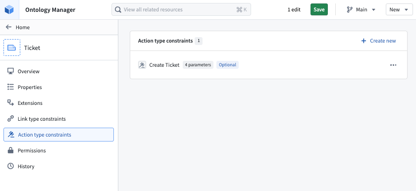
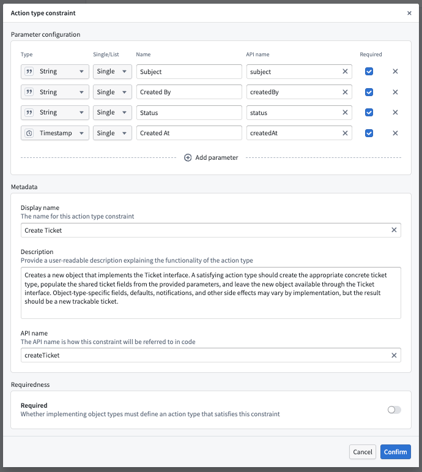
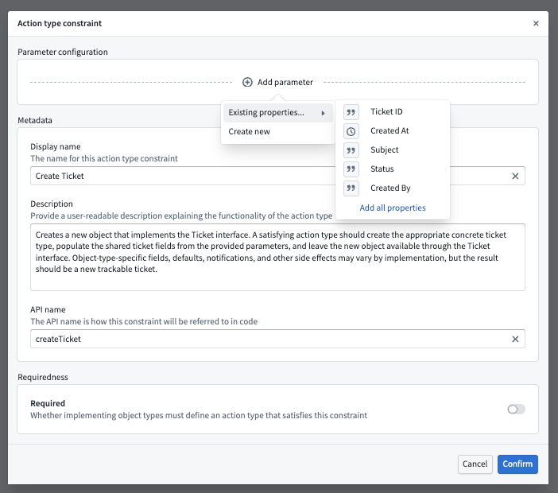
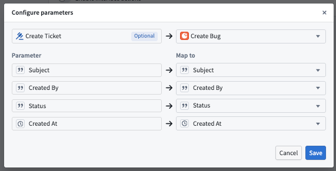

<!-- source: https://palantir.com/docs/foundry/interfaces/interface-action-type-constraints/ · mirrored 2026-08-22 from Palantir Foundry docs -->

# Interface action type constraints

:::callout{theme="neutral" title="Beta"}
Interface action type constraints are in the [beta](/docs/foundry/platform-overview/development-life-cycle/) phase of development and may not be available on your enrollment. Functionality and platform support may change during active development.
:::

An interface action type constraint defines an expected action capability common across object types that implement an interface. The constraint describes the action's user-facing meaning, API name, and parameter shape. Each implementing object type can then map the constraint to a concrete action type on that object type.

For example, a `Ticket` interface defines a `Create ticket` action type constraint. The `Bug` object type satisfies that constraint with a `Create bug` action type, and the `Feature request` object type satisfies it with a `Create feature request` action type. Both action types implement the same interface-level capability, even though the concrete action logic is specific to each object type.

Interface action type constraints do not define action execution logic, submission criteria, side effects, or form layout. To configure those behaviors, do so on the concrete action types that satisfy the constraint. For more information about action rules that operate on interface objects, see [Actions on interfaces](/docs/foundry/action-types/actions-on-interfaces/).

Currently, action type constraints have limited expressiveness for describing how the satisfying action type must behave. Use the constraint description to inform application builders what the satisfying action type is meant to do, including expected edits, side effects, submission behavior, or other semantic requirements that are not enforced by the constraint model. More expressive behavioral constraints are under active development.

## Action type constraints

Action type constraints define the parameters of an interface-level action capability. These parameters include the following:

* **Display name:** The user-facing name for the action type constraint.
* **Description:** A user-readable description of what the satisfying action type should do.
* **API name:** The API name used to refer to the constraint in code and platform configuration.
* **Parameter constraints:** The parameters that a satisfying action type must expose.
* Whether the action type constraint is required as part of object type implementation.

If an action type constraint is required, every object type implementing the interface must map the constraint to a concrete action type. Optional action type constraints can be mapped when an implementing object type supports the capability, but can be skipped when the capability does not apply.

## Parameter constraints

Parameter constraints define the shape of the action parameters that satisfying action types must provide. Each parameter constraint includes:

* **Type:** The parameter type, such as string, timestamp, object reference, interface reference, object set, attachment, media reference, or struct.
* **Single or list value:** Whether the parameter accepts one value or a list of values.
* **Display name:** The user-facing name for the parameter constraint.
* **API name:** The API name used to refer to the parameter constraint.
* Whether the parameter must be mapped by implementing object types.

When you create a parameter constraint, you can define a new parameter manually or add parameters from existing interface properties. Adding parameters from interface properties creates parameter constraints based on the selected properties' display names, types, and required status. The parameter API names are generated from the display names and can be edited.

Required parameter constraints must be mapped to required parameters on the concrete action type. Where useful, you can map optional parameter constraints. Note that the same concrete action parameter cannot satisfy multiple parameter constraints on the same action type constraint.

For object reference, interface reference, object set, and struct parameters, interface action type constraints describe the general parameter kind rather than every concrete implementation detail. For example, an object reference parameter constraint requires a compatible object reference parameter on the satisfying action type, but the constraint does not itself bind to one specific object type.

## Implementing action type constraints

When an object type implements an interface with action type constraints, the object type must choose concrete action types that satisfy any required constraints. A concrete action type satisfies a constraint when it has compatible parameters for the constraint's required parameters.

After adding the interface implementation in Ontology Manager, the object type's **Interfaces** tab lists the interface's action type constraints in the **Actions** sub-tab. Select a concrete action type on the implementing object type for each required constraint. You may skip or map optional constraints.

To configure parameter mappings, select the settings icon for the mapped action type constraint to open the **Configure parameters** dialog. Map each required parameter constraint to a compatible required parameter on the selected action type. You can also map optional parameter constraints when applications need to pass or pre-fill those values through the interface action capability.

Ontology Manager validates action type constraint mappings when you save changes to the Ontology. You will not be allowed to save if:

* A required action type constraint is not mapped by an implementing object type.
* A required parameter constraint is not mapped.
* A mapped parameter has an incompatible parameter type.
* The same concrete action parameter is mapped to more than one parameter constraint.
* The mapped action type constraint or parameter constraint no longer exists.

## Interface extensions

Action type constraints are inherited through [interface extensions](/docs/foundry/interfaces/extend-interface/). If a child interface extends a base interface with action type constraints, object types implementing the child interface must satisfy the inherited required action type constraints as well as any constraints declared directly on the child interface.

Use inherited action type constraints when a capability applies to a broad interface and should be available through more specific interfaces. Define a new action type constraint on the child interface when the capability is specific to that child interface.

## Choosing required vs. optional constraints

Use a required action type constraint when every object type implementing the interface must support the capability for interface-based applications to work correctly.

Use an optional action type constraint when the capability is useful but not universal. Optional constraints are also useful while iterating on a beta interface model, because they let object types adopt the capability without blocking implementations that are not ready to support it.

For parameter constraints, mark a parameter as required only when every satisfying action type must expose that parameter as a required action input. Keep parameter constraints optional when implementations may compute the value internally, use a default value, or not need the value at all.

## Limitations

Interface action type constraints are currently configured and mapped in Ontology Manager. Pipeline Builder does not currently support action type constraint mapping when implementing an interface. If your interface contains required action type constraints, implement and map the interface through Ontology Manager. Additional platform integrations are under active development.

End users cannot currently discover or invoke interface action type constraints from Foundry applications. Users can run the satisfying concrete action types directly through any application that supports them.

Interface action type constraints are not currently supported in the Ontology SDK. You cannot currently use an interface action type constraint in OSDK to discover or invoke the concrete action types that satisfy it.

Interface action type constraints define the expected shape of a concrete action type. They do not make object-type-specific action logic uniform. Review each satisfying action type's rules, submission criteria, permissions, and side effects to ensure they match the semantics described by the interface constraint.
