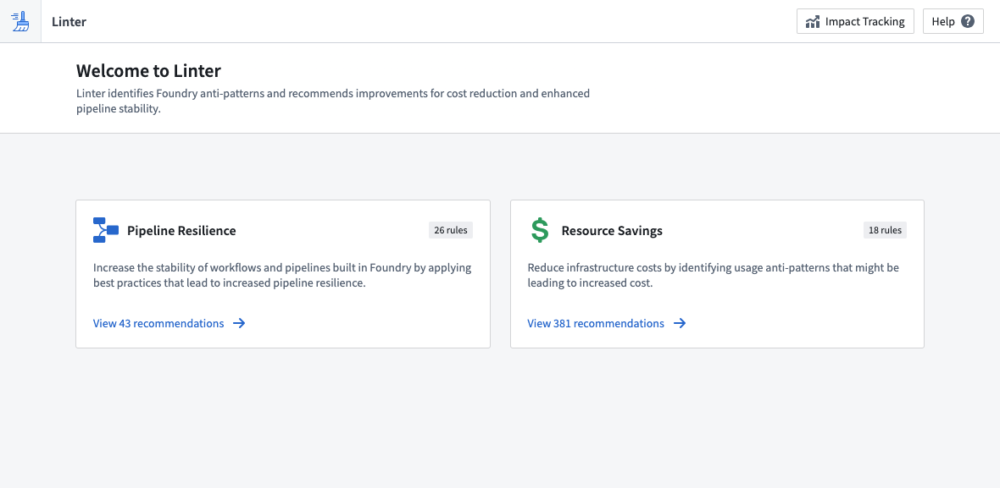

<!-- source: https://palantir.com/docs/foundry/linter/ · mirrored 2026-08-14 from Palantir Foundry docs -->

# Linter

The Linter application checks the state of Foundry for anti-patterns and suggests ways to move resources to a better state. You can use these recommendations to reduce cost, and increase pipeline stability and resilience.

With Linter, you can better understand the wide range of capabilities that Foundry has to offer while monitoring any platform updates that could benefit your use case objectives.

The state of any Foundry enrollment changes over time: more data is added, applications are built, and user actions are performed. As Foundry offerings grow and evolve, Linter recognizes time, cost, and resource-saving recommendations to ensure the delivery method for your use case output is optimized towards your goals. For example, if an optional upgrade or migration may produce a benefit (such a readability, cost, or maintainability), Linter could recommend the upgrade based on the [rule criteria](/docs/foundry/linter/rules/) you set.

Linter performs a regularly-occurring sweep to gather a reactive analysis of the state of Foundry. The sweep identifies a list of resources that match predefined rules and produces a list of recommendations based on the results of the sweep. The recommendations are sorted by estimates of the impact they could make across your Foundry enrollment. Because Foundry capabilities are frequently changing, the results of a Linter sweep are dynamic and will change from day to day.

Consider a use case that requires a valuable prototype as soon as possible. You may first choose to optimize your output for speed to deliver something quickly. Later, as the project goes into production and gains users, you may want to optimize for other objectives, including reliability, data latency, or cost. By optimizing Linter towards specific recommendation [modes](/docs/foundry/linter/modes/) based on your use case objectives and configuring [rules](/docs/foundry/linter/rules/) to run across your enrollment, you can ensure that your use case is always working towards the desired output.

## Glossary

Below are terms that will help you navigate Linter.

* **Resource scope:** A set of Foundry resources that will be swept by Linter according to a sweep schedule. Resource scopes are defined by [spaces](/docs/foundry/platform-security-management/manage-orgs-and-spaces/#spaces), and rules are run against resources in a space.

* **Rule scope:**  A set of [rules](/docs/foundry/linter/rules/) that will be run against the resources in scope.

* **Sweep schedule:** A configuration for Linter that defines the resource scope and the rule scope. Sweep schedules must belong to a [space](/docs/foundry/platform-security-management/manage-orgs-and-spaces/#spaces), which is their default resource scope.

* **Sweep:** A single run of a sweep schedule. Sweeps run based on an environment-wide schedule. They store basic metadata about the sweep, such as the sweep status, queue start and end times, and any errors that may have caused the sweep to fail.

* **Rule:** A set of pre-defined logic that is evaluated against the resource scope to produce a set of recommendations. Rules change and evolve over time as the products and capabilities in Foundry change. Rules can be grouped together in pre-defined rule presets such as the `PIPELINE_COST_RULES` preset.

* **Recommendation:** A suggestion associated with a specific rule, resource, and project. Recommendations provide a description that defines the recommendation, what resources are affected, and how to apply the recommendation.

* **Fix Proposal:** A proposal created by Linter for implementing a recommendation. Fix proposals do not make changes to underlying resources, so they are safe to create and can be accepted and applied by a user. An example of a fix proposal is a pull request for a profile change that can be merged after user approval.

The following documentation includes a description of the [modes](/docs/foundry/linter/modes/) in which Linter operates, the pre-defined [rules](/docs/foundry/linter/rules/) that determine Linter [recommendations](/docs/foundry/linter/recommendations/), and instructions for modifying the operation of the analysis.

To start using Linter, go to `<your-Foundry-enrollment-URL>/workspace/linter/` or search for the Linter application. You may need an enrollment administrator to first enable the application in the **Application access** section of Control Panel.
