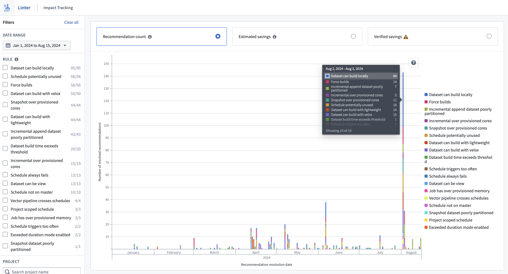

<!-- source: https://palantir.com/docs/foundry/linter/impact-tracking/ · mirrored 2026-08-14 from Palantir Foundry docs -->

# Impact tracking

The Linter impact tracking interface allows you to track progress on actioned recommendations and savings estimates. You  can reach the impact tracking page by selecting **Impact Tracking** on the Linter home page. You can use filters to see metrics across a selected time range, rule and project.

Three metrics are surfaced in impact tracking:

* **Recommendation count:** Displays the number of resolved recommendations. When a user selects a recommendation from the recommendation table for the first time, it transitions to an `Under Investigation` status and a snapshot of the current recommendation is taken. Recommendations that a user has not selected will have an `Open` status and disappear in the next sweep. These recommendations are not tracked and will not show up in impact tracking.
* **Estimated impact:** Displays the compute hour reduction that Linter predicted prior to actioning the recommendation. This estimation is normalized to thirty days and is identical to the monthly estimated savings figures in the recommendation table.
* **Verified impact:** Displays the difference in estimated monthly usage before and after the recommendation was actioned. Linter builds the verified estimate by taking the usage for the week before the fix, subtracting the usage for the week after the fix, and normalizing the difference to 30 days of usage. Note that the week before and after the fix are not guaranteed to be representative of resource usage affected by the recommendation.

Verification typically takes seven days, so an action's verified impact will not be immediately visible on the impact tracking page. All estimates on savings are calculated based on visibility and access provided by APIs. This means that there can be double counting of resources across Linter estimations due to shared resources across rules, for example, a [schedule potentially unused](/docs/foundry/linter/rules/#schedule-potentially-unused) rule can cover a dataset that is also mentioned by an [incremental append dataset too many files](/docs/foundry/linter/rules/#incremental-append-dataset-too-many-files) rule. Users should consider this when summing recommendation figures.

## Disparities between impact metrics

Estimated impact and verified impact are estimations that use [resource management](/docs/foundry/resource-management/overview/). The difference in estimation methodologies between the two metrics is that if an action is taken quickly upon recommendation by Linter, the estimated savings will be higher than the verified savings.

For example, assume a `Schedule potentially unused` recommendation is created on day one:

1. You pause the schedule one day after the alert is created, on day two.
2. The verified impact estimation subtracts the usage for seven days after the fix (normal usage) from the usage for seven days before the fix (six days of normal and one day of high usage).
3. The difference is normalized to thirty days.
4. The estimated impact will be dramatically higher than the verified impact because the estimated impact is based on the savings that would have happened if this had run for a month with the problem and then another month with the fix.
