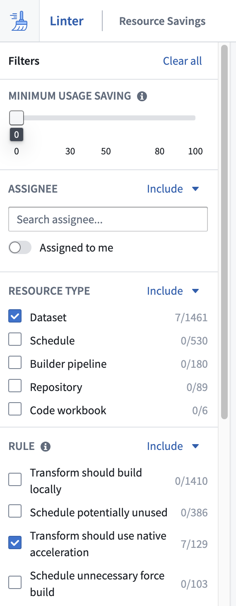
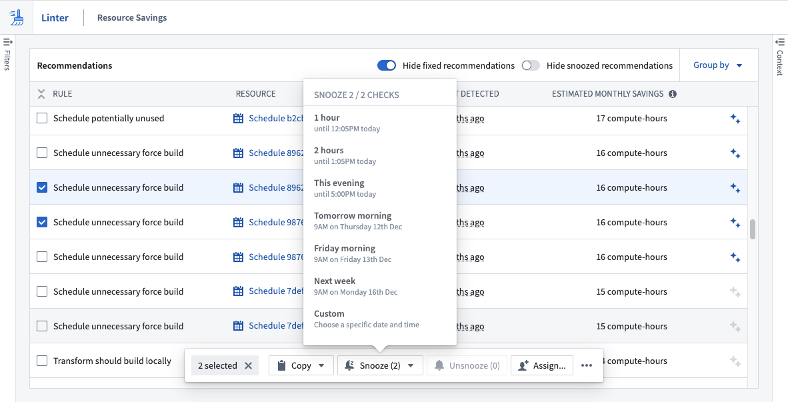
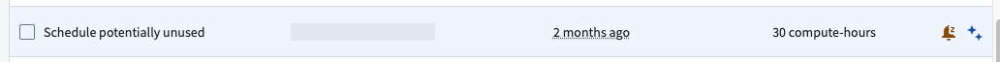
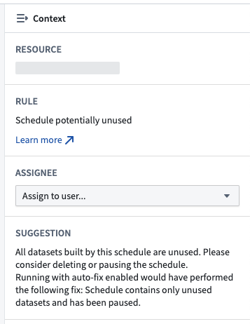
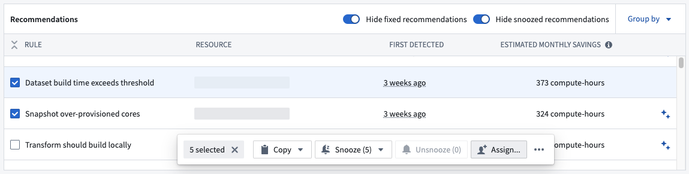

<!-- source: https://palantir.com/docs/foundry/linter/recommendations/ · mirrored 2026-08-14 from Palantir Foundry docs -->

# Recommendations

A recommendation in Linter represents a single action you can take to migrate one or more resources from the detected, potentially suboptimal state towards a more desirable state. Recommendations are generated once Linter runs a sweep of rules over a given scope.

Linter recommendations contain a Foundry resource, and your ability to see a recommendation is inherited from your permissions to view its underlying resource. A recommendation can belong to one or more projects and, for some modes, can contain an estimate of the impact of following its suggested action.

Once a user actions on the recommendation, another Linter sweep must occur to confirm rule criteria and remove the recommendation from the view.

## Filter to recommendations

Use the left sidebar to filter the displayed recommendations by resource type, rule, project, or assignee.

## Recommendation context

Use the right sidebar to pull recommendation context and learn more about why it appeared, the potential effects of the current state, and required actions to move the resource to a more desired state.

## Recommendation state

A recommendation can be in one of three states that can be changed based on user interactions:

* **Default:** A recommendation that has not been actioned on after a Linter sweep is in a default state. It will remain in this state unless it is snoozed or removed from the view following another sweep.
* **Snoozed:** You can choose to snooze a recommendation if you are unable to take action at a given time. Review [the section below](#snooze-a-recommendation) to learn more.
* **Snooze expired:** A previously snoozed recommendation will move into the snooze expired state once the allotted timeframe of the snooze has passed.

### Snooze a recommendation

If you are unable to immediately action on one or more recommendations, you can choose to snooze them and avoid seeing them repeatedly. Use the action bar to set up a snooze for the selected recommendation(s); enter a reason for the snooze, and provide a time when the snooze will expire. After that time, the recommendation will no longer be in the snoozed state.

Snoozed recommendations are indicated by an orange dot and a snoozed alarm symbol. You can choose to un-snooze a recommendation from the action bar.

### Assign a recommendation

Recommendations can be assigned to individual users for tracking purposes. To assign a recommendation, select the recommendation and use the **Assignee** selector in the right context panel to assign it to a user.

Multiple recommendations can be assigned through the bulk action bar.

The assignee filter in the [left sidebar](#filter-to-recommendations)  can be used to filter recommendations assigned to the current user or specified user(s).
