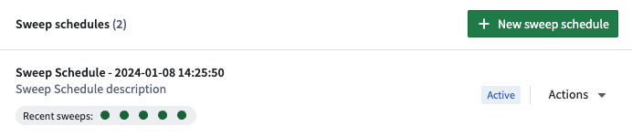
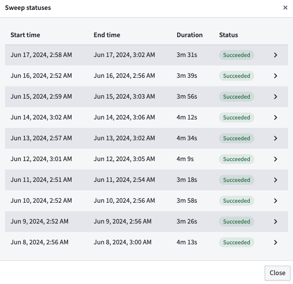
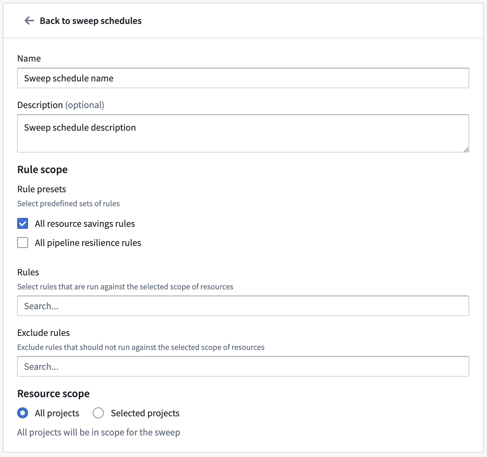

<!-- source: https://palantir.com/docs/foundry/linter/sweep-schedules/ · mirrored 2026-08-14 from Palantir Foundry docs -->

# Sweep schedules

A Linter sweep schedule is a Linter configuration that defines the following:

* **Resource scope:** The set of Foundry resources that will be swept according to schedule.
* **Rule scope:** The set of rules that will be run against the resource scope.

Sweep schedules must belong to a [space](/docs/foundry/platform-security-management/manage-orgs-and-spaces/#spaces), and rules are run against Foundry resources in Projects that belong to that space. You can view, edit, or create a new Linter configuration from the **Linter Configuration** tab under enrollment settings in [Control Panel](/docs/foundry/administration/control-panel/). From here you can configure sweep schedules. These schedules will only work on the space specified in the bar at the top left of the page.

The **Linter configuration** page lists existing sweep schedules for your specified space. Here, you can see the status of recent sweeps and create new sweep schedules. Each schedule can be edited, paused, triggered, or deleted from the **Actions** dropdown.

You can also see a detailed status of the 10 most recent sweeps by selecting **Recent sweeps**.

## Edit a sweep schedule

You can edit schedule metadata such as the name and description and also change the rule scope in the **Edit sweep schedule** page.

### Rule scopes

Rule scopes allow users to define the [rules](/docs/foundry/linter/rules/) that will be used by a sweep schedule. There are three ways to define the rule scope:

* **Rule Presets:** A bundle of recommended rules that can be added in bulk. For example, adding the `PIPELINE_COST_RULES` preset would add all cost related rules.
* **Rules:** You can multi-select specific rules to include in the rule scope.
* **Exclude Rules:** You can specify rules to be removed from the sweep schedule.

The order of operations follows the order listed above: first, the rule presets are applied, then individual rules are added, and then excluded rules are removed from the rule scope.

### Resource scope

The resource scope defines which Projects are within the scope of the sweep schedule. By default, all Projects in the current space are in scope for the sweep. Users can also reduce the scope to include only selected Projects.
