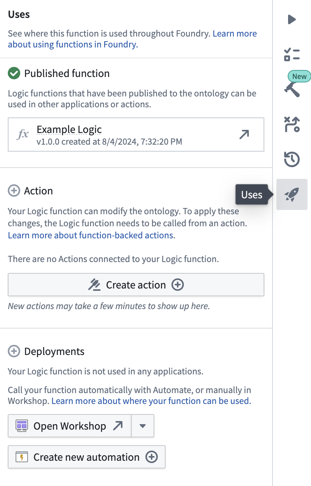
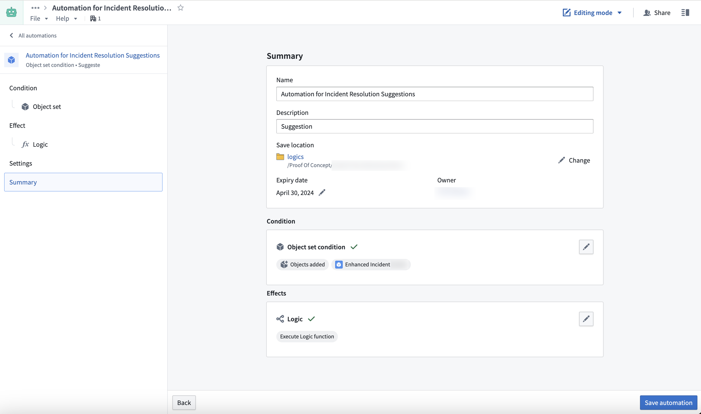
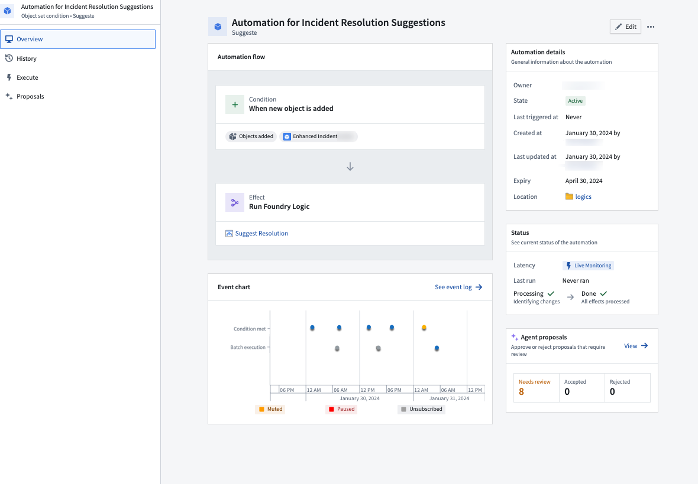
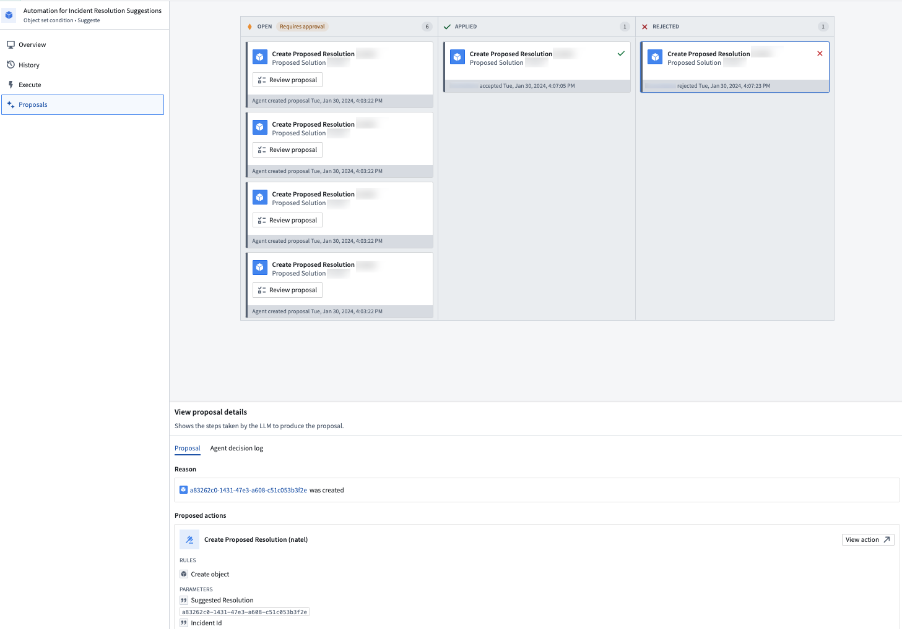

<!-- source: https://palantir.com/docs/foundry/logic/aip-logic-integration-automate/ · mirrored 2026-08-18 from Palantir Foundry docs -->

# AIP Logic integration with Automate

AIP Logic can now be automated such that Ontology edits can be automatically applied or staged for human review. These automations can be triggered on existing objects or when new objects are created.

:::callout{theme="neutral"}
How an AIP Logic function can be called from Automate depends on whether [staged writes](/docs/foundry/logic/staged-writes/) execution mode is enabled:

* **Staged writes enabled:** the function must be wrapped with an action type and called through an action effect. AIP Logic provides a **Create action** button to generate the action type. Learn more in [staged writes in AIP Logic](/docs/foundry/logic/staged-writes/).
* **Staged writes disabled:** the function can be called directly through the Logic effect, as described on this page.
:::

## Create an automation for staged-write Logic functions

To call a staged-write Logic function from Automate, you must first create an action type backed by the function, then use an action effect in the automation.

1. In your AIP Logic file, navigate to the **Usage** tab and select **Create action** to generate an action type backed by your Logic function.
2. Create the automation using an [action effect](/docs/foundry/automate/effect-actions/) in Automate that submits the action.

Actions generated from Logic functions support the same review workflow as legacy automations. You can configure the automation to stage actions as proposals for human review instead of applying them automatically.

For more details on creating and managing the action type, see [staged writes in AIP Logic](/docs/foundry/logic/staged-writes/#using-staged-write-logic-functions-in-automate).

## Create an automation with the Logic effect

The workflow in this section applies to Logic functions that return a list of Ontology edits as their output, which is the legacy behavior when staged writes are disabled. These functions are called directly through the Logic effect.

You can start creating a new automation from your AIP Logic file using the **Uses** option on the right side.

Doing so will prompt a new window with a pre-populated automation flow based on your Logic instructions.

The condition you set up will monitor an object set and trigger the Logic effect for each new object added or automatically run edits. Learn how to [set up an automation](/docs/foundry/automate/getting-started/).

After confirming the name and settings of the new automation, select **Save automation**.

You will be redirected to the **Automation Overview** screen after saving.

The Overview screen displays the automation flow, status, and event chart which updates automatically when the automation is triggered.

If you configured your automation to stage Actions for approval over automatically running edits, you can see an overview of Agent proposals that were generated and require a review by navigating to the **Proposals** tab using the left side navigation bar.

To review these agent proposals, do one of the following:

* Access the **Proposals** tab from the navigation bar.
* From the **Agent proposals** section, select **View**.

On the **Proposals** tab, select a specific proposal to inspect the reason it was created.

Additionally, the proposed Action will be previewed at the bottom of the screen. By selecting the **Agent decision log** tab under **View proposal details**, you can inspect the decision process the LLM followed to generate the proposed Action.

When you accept a proposal, the Action will be automatically executed, and the proposal card will be moved to the **Applied** column.

## FAQ

The following are some frequently asked questions about the AIP Logic integration.

### Why can I not see any proposals?

For security considerations, open proposals are visible for only 24 hours and only to the user who created the automation. Older proposals will not be visible.

### Why is the **Create Automation** button unavailable?

The AIP Logic output must return an Ontology edit for the Automation to run.

### What happens when staged writes are enabled on a Logic function used in an existing automation?

The existing automation continues to run against the previously published legacy version of the function. If the function's output type is a list of Ontology edits, enabling or disabling staged writes publishes a new major version, because the output type will change to a different type based on the Logic configuration. Automations do not automatically upgrade across major versions.

To migrate the automation to the staged-write version:

1. Select **Create action** in your AIP Logic file to generate an action type.
2. In the automation, replace the Logic effect with an [action effect](/docs/foundry/automate/effect-actions/) that submits the generated action.
3. Save the automation.

For more details, see [migrate existing automations](/docs/foundry/logic/staged-writes/#migrate-existing-automations).

### Why is there no condition block in the Automation summary page?

Ensure that the AIP Logic input is an object.
