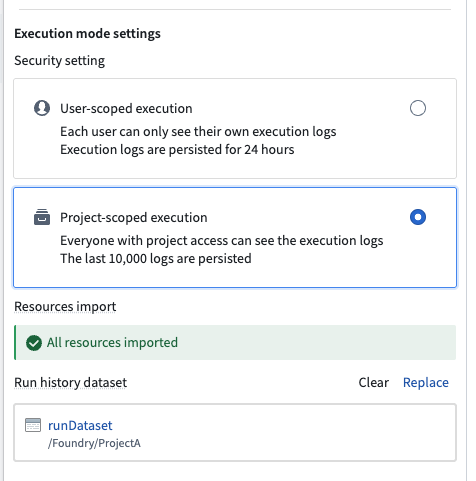

<!-- source: https://palantir.com/docs/foundry/logic/execution-mode-settings/ · mirrored 2026-08-18 from Palantir Foundry docs -->

# Execution mode settings

You can choose between two execution modes for a Logic function: *user-scoped* execution and *project-scoped* execution. User-scoped execution is the default mode.

## User-scoped execution

When configured in user-scoped mode, the Logic function will run using the permissions of the user running the Logic function.

In user-scoped mode, each user can only see their own execution logs, and not the logs of other users running the Logic function. Execution logs are persisted for 24 hours.

## Project-scoped execution

When configured in project-scoped mode, the Logic function will run using the permissions of the project containing the Logic function. In project-scoped mode, execution logs are visible to everyone with project access.

Project-scoped execution requires that all resources which are used by the Logic function must also be imported into the same project as the Logic function. Users will additionally require access to the markings on these resources.

You can check if all required resources are imported in the execution mode settings; if a resource is missing, you will be able to import it directly from the configuration.

### Run history dataset

When using project-scoped execution, you can configure a dataset where all run histories will be logged. Each execution is recorded as a new row in this dataset, and the past 10000 runs are preserved.
