<!-- source: https://palantir.com/docs/foundry/logic/getting-started/ · mirrored 2026-08-18 from Palantir Foundry docs -->

# Getting started

This guide demonstrates how to access AIP Logic, introduces the AIP Logic interface, and describes how to set up a basic Logic function by composing LLM blocks and examining the LLM’s [chain of thought (CoT)](/docs/foundry/logic/core-concepts/#debugging) in the Debugger.

## Access AIP Logic

AIP Logic can be accessed from the platform’s workspace navigation bar or by using the quick search shortcuts `CMD + J` (macOS) or `CTRL + J` (Windows). Alternatively, you can create a new Logic function from your **Files** by selecting **+New** and then selecting **AIP Logic**, as shown below.

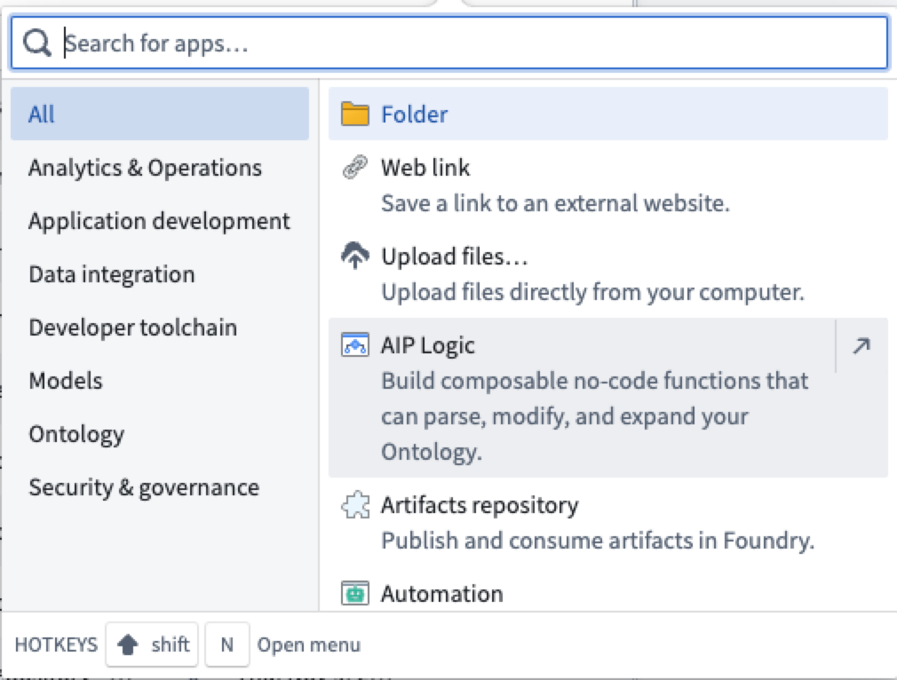

After opening AIP Logic, you can create a new Logic file. Note that Logic files must be saved in a project folder, not in your home folder.

## Application interface

There are three main components of AIP Logic’s interface, numbered left-to-right in the notional screenshot below:

1. [Inputs, blocks, and outputs configuration](#inputs-blocks-and-outputs-configuration)
2. [Debugger](#debugger)
3. [Run panel](#run-panel)

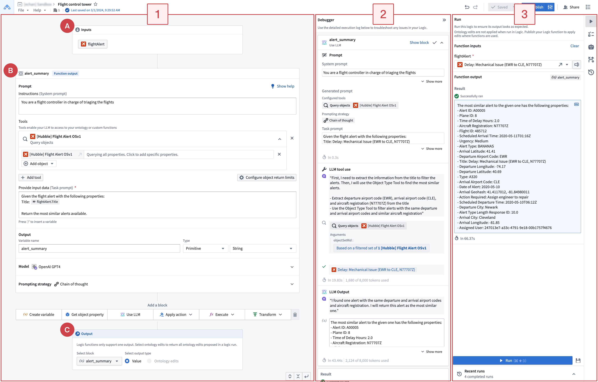

## Workflow overview

A typical AIP Logic workflow starts with configuring the [**input (A), blocks (B), and outputs (C)**](#inputs-blocks-and-outputs-configuration) in the left panel (1). Use the [**Run panel**](#run-panel) (3) to generate a sample output. After Logic runs, the [**Debugger**](#debugger) (2) displays the chain-of-thought (CoT) prompting and steps used by the LLM to produce the output. Use the Debugger with the Run panel to visualize the final output. The Run panel also displays recent Logic runs and lets you create unit tests. The right sidebar provides integrations with [Automate](/docs/foundry/automate/overview/) and [AIP Evals](/docs/foundry/aip-evals/getting-started/).

## Inputs, blocks, and outputs configuration

When you first begin using AIP, you will see the **Run** panel on the right and three types of boards on the left: [inputs](#inputs), for optionally choosing an object and its properties, [blocks](#blocks) for defining your Logic instructions, and [outputs](#outputs) that represent the desired Logic function results. The output from one block can be fed into subsequent blocks.

The screenshot below shows the configuration area for inputs, blocks, and outputs with the **Run** panel collapsed.

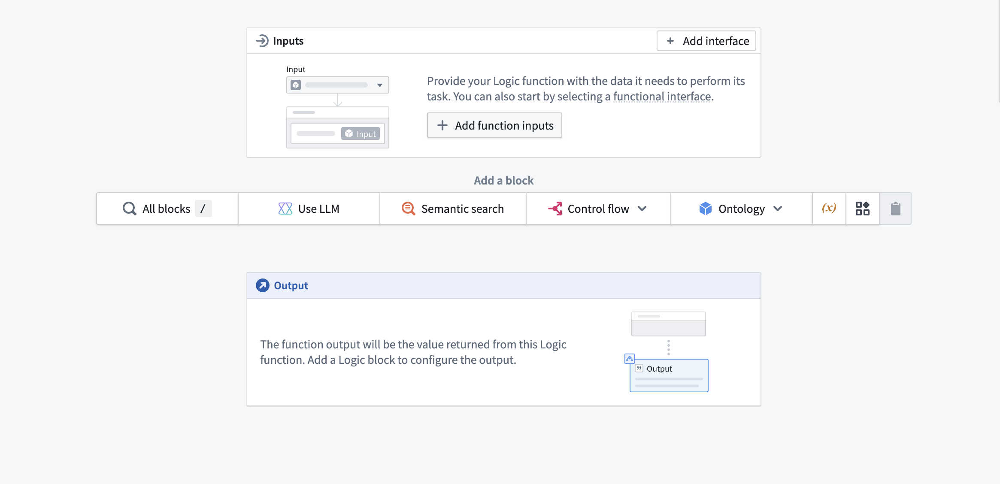

## Inputs

AIP Logic takes a variety of *inputs*. In the **Inputs** block (labeled as "A" in the [application interface guide](#application-interface)), you can specify the input name and type. Supported inputs include array, boolean, date, double, float, integer, long, media reference, model, object, object list, object set, short, string, struct, and timestamp.

## Blocks

An AIP Logic function is composed of blocks (labeled as "B" in the [application interface guide](#application-interface)). Block types include [create variable](/docs/foundry/logic/blocks/#create-variable), [apply action](/docs/foundry/logic/blocks/#apply-action), [execute function](/docs/foundry/logic/blocks/#execute-function), [use LLM](/docs/foundry/logic/blocks/#use-llm), [loops](/docs/foundry/logic/blocks/#loops), and [conditionals](/docs/foundry/logic/blocks/#conditionals). A block's output can be used in subsequent blocks. For more information, see [Blocks](/docs/foundry/logic/blocks/).

## Outputs

You can define an intermediary output for every Logic block. The last block in your Logic path is the output of Logic function, labeled as "C" in the [application interface guide](#application-interface).

* **Block output:** Intermediary outputs that are passed between blocks. The output of your block can either be a primitive or an object for use in subsequent blocks.

* **Logic function output:** The output of the Logic function that you want to return. This can be either a **Value** (primitive or object) or all the **Ontology edits** that your function has made.

## Debugger

Once you have composed your Logic function, you can test the Logic function by selecting **Run** on the right side of the view. When the Logic has been run, Debugger will open to display the LLM’s [chain-of-thought (CoT)](/docs/foundry/logic/core-concepts/).

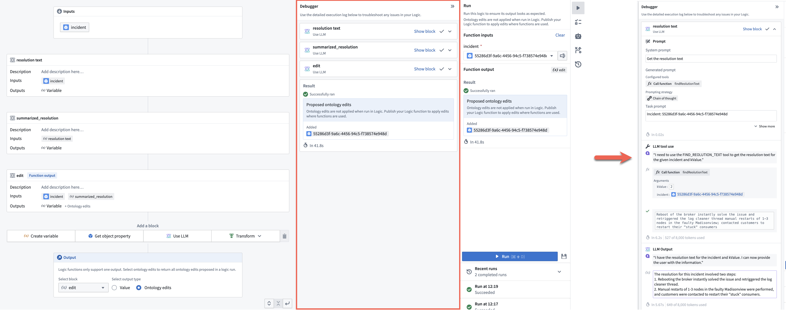

The debugger allows you to expand and collapse block cards, clear tool calls, and easily review generated prompts, making it easier to interpret the chain of thought.

## Run panel

From the **Run** panel, you can run and evaluate your Logic, as well as review recent runs. The right-hand sidebar lets you set unit tests, run [automations](/docs/foundry/automate/overview/), and view run history.

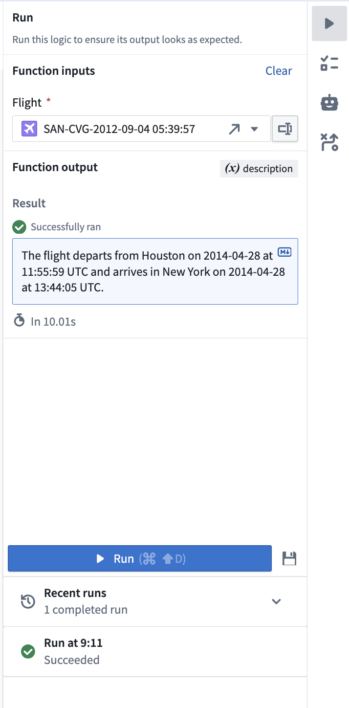

At the bottom of the **Run** panel, you can also select any of your recent runs to view their output and debug log.

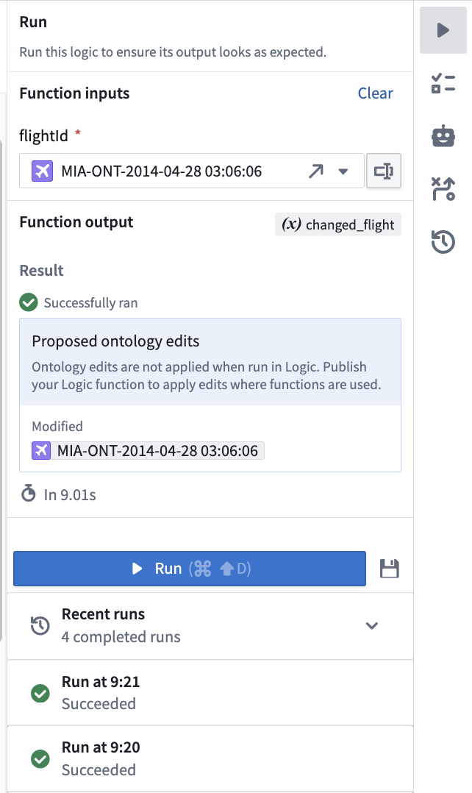

:::callout{theme="neutral"}
The visibility of execution logs depends on the Logic function's [execution mode settings](/docs/foundry/logic/execution-mode-settings/). In user-scoped mode, which is the default, you can only see your own execution logs. In project-scoped mode, logs are visible to everyone with project access.
:::

Select the unit tests icon () to save a version of your input for performance evaluation purposes.

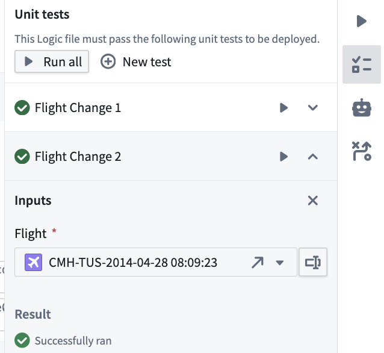

To edit test case parameter names, types, and optionality, select **Modify columns**. Add parameters in the schema editor.

In **Run history**, select **Add as test case** to convert historical execution results into test cases for new or existing evaluation suites.

### Evaluate your Logic with AIP Evals

To generate an evaluation suite for your Logic function, open the **Evals** tab in the right sidebar and select **Generate evals**. AIP Evals creates test cases, configures evaluators, and sets up metrics based on your function. You can edit the generated test cases and evaluators to refine coverage and scoring. Learn more in [AIP Evals: Getting started](/docs/foundry/aip-evals/getting-started/).

## Use a Logic function

Logic functions can be used the same way you would use a regular [function on objects (FoO)](/docs/foundry/functions/functions-on-objects/) in the platform.

* You can back an action with a Logic function, then call the action from Workshop.

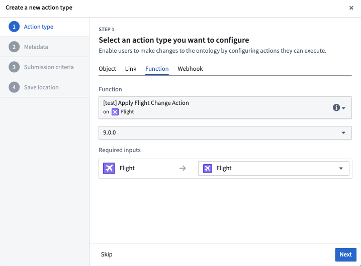

* You can also call a Logic function to back a Markdown widget in Workshop; in this case, the output type from the Logic function must be a string.

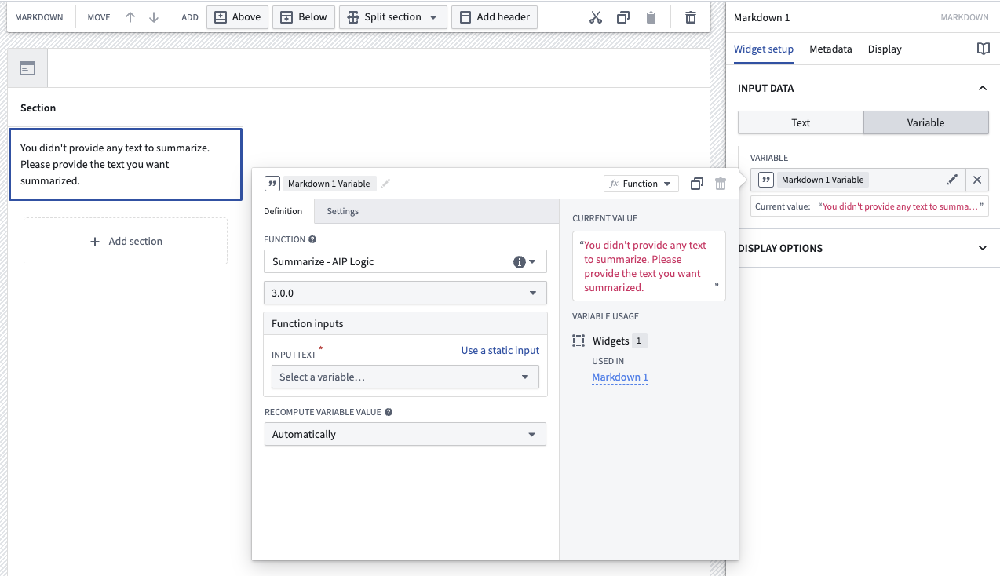

* You can call a Logic function in other Logic functions, as well as in functions on objects, via the **Ontology function** tool in AIP Logic.

### Running a Logic function via the command line

In the **Uses** tab you can copy a curl request to run the logic outside of Foundry in your terminal. Note this isn't available for Logics that return ontology edits.

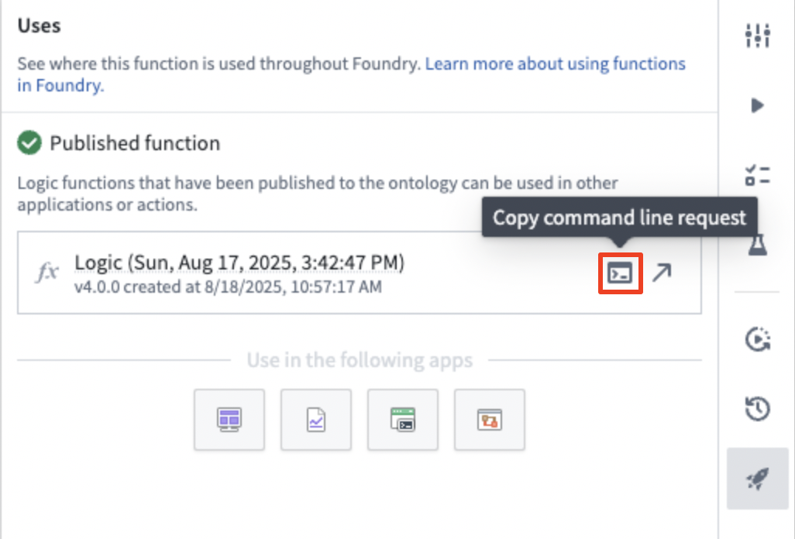

## Make Ontology edits using Logic functions

When running the function in Logic, you will see all the proposed Ontology edits in your scenario in the Debugger. These edits will not actually be executed. If you wish to apply your edits to the Ontology, either:

* Call your Logic function from an action; or,
* Call your Logic function from an automation. You can start creating a new automation from your Logic dashboard using the **Automations**  option located on the right-hand side.

For a Logic function to be able to edit the Ontology, you must:

1. Set up an **Apply actions tool** in a **Use LLM** block that the Logic function can call. This allows the LLM to edit the Ontology.

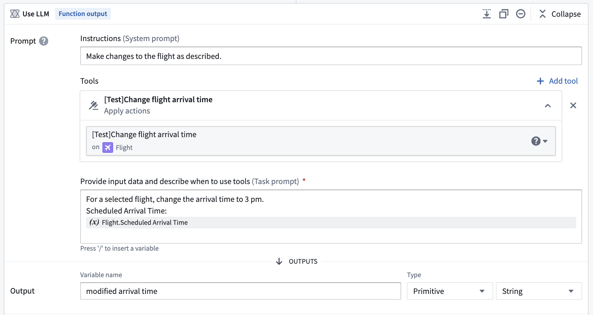

2. When you are done iterating on your Logic function, find and select the **Publish** option located next to save to publish the Logic function.

3. Next, create a new action backed by the **Logic function** you have just published.

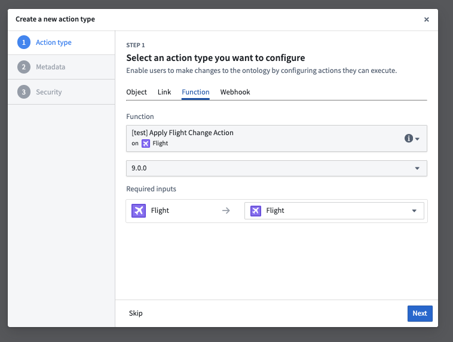

4. You can now use this new action in a Workshop module to power an operational workflow.
     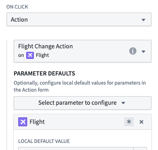

## Branching

Use Foundry branching to develop and test Logic functions in isolation. You can publish them for use in branch-aware applications such as Workshop and merge the changes through an approved proposal. For more information, see [Branching AIP Logic](/docs/foundry/logic/branching-logic/).

## Comparison view

In the version history tab you can compare two versions of a logic to see what changed between them. Specifically what blocks were edited, added, or removed.

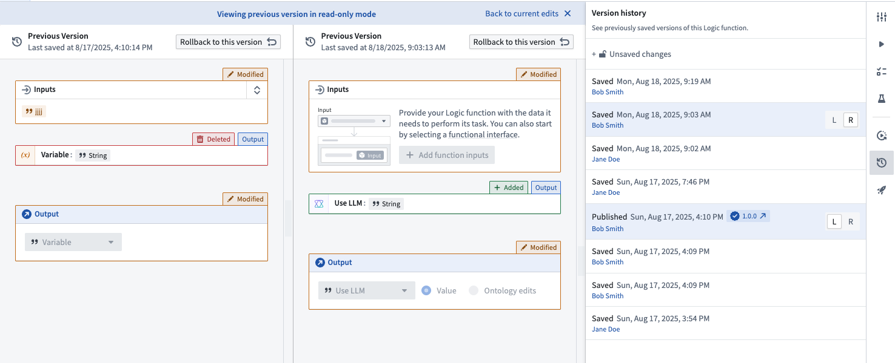

## Next steps

If you have access to AIP Logic, we recommend that you begin experimenting with LLM blocks to interact with your Ontology and build out a use case of your own. You may find it helpful to review the documentation on [Functions](/docs/foundry/functions/overview/) in the platform.
