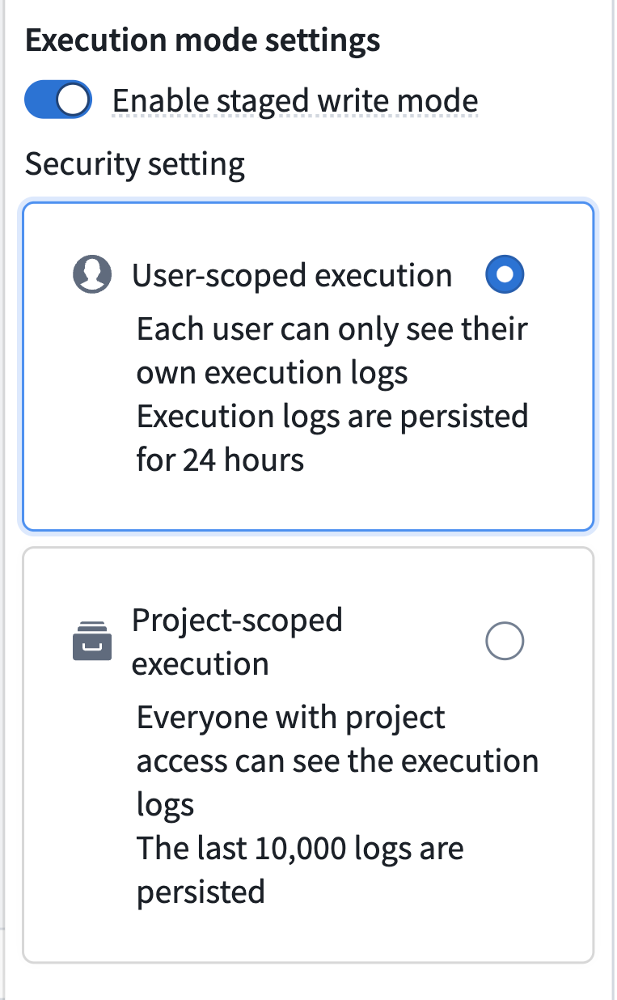
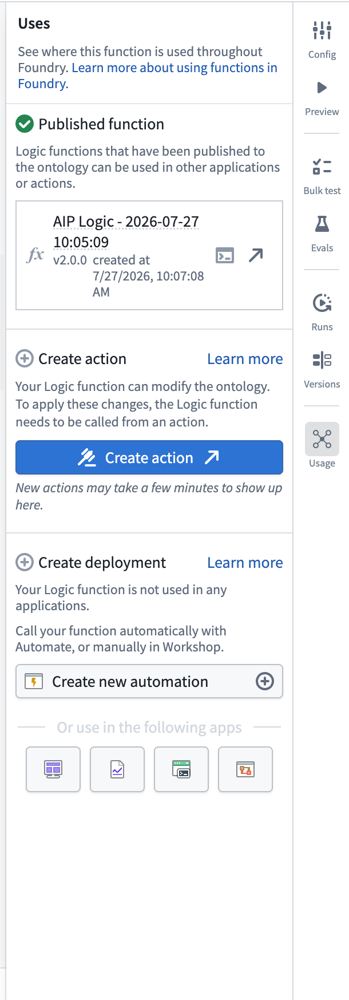

<!-- source: https://palantir.com/docs/foundry/logic/staged-writes/ · mirrored 2026-08-16 from Palantir Foundry docs -->

# Staged writes in AIP Logic

:::callout{theme="neutral" title="Beta"}
Staged writes are in the [beta](/docs/foundry/platform-overview/development-life-cycle/) phase of development and may not be available on your enrollment. Functionality may change during active development. Contact Palantir Support to request access.
:::

Staged writes provide an improved execution model for AIP Logic functions that edit objects in the Ontology. Staged writes will soon be enabled by default for newly created Logic functions.

Compared to legacy Ontology edit behavior, staged-write Logic functions:

* **Support Ontology edits in nested function and action calls.** A staged-write Logic function can call other staged-write functions or other functions that make Ontology edits directly, or apply actions backed by other functions that make Ontology edits. This was previously not supported.
* **Support all object set filters.** All object set filters are now supported, including **contain keywords** and **relative time range**, which are not supported in legacy mode.

For a full description of staged-write semantics, refer to the [staged writes documentation](/docs/foundry/functions/typescript-v2-staged-writes/).

## Key differences from legacy behavior

There are several notable differences between staged-write Logic functions and legacy Ontology edit behavior.

### Ontology edits in nested function and action calls

With staged writes enabled, your Logic function can call other staged-write functions (such as other Logic functions or [TypeScript v2 functions](/docs/foundry/functions/typescript-v2-staged-writes/)) or other functions that make Ontology edits directly, or apply actions backed by other functions that perform Ontology edits. Previously, calling an action backed by another Logic function that also makes Ontology edits from within a Logic function was not supported.

Edits made by nested calls are visible to subsequent reads within the same Logic execution. All edits are staged to temporary storage and applied to the Ontology when the execution completes.

For example, a Logic function that processes a support email can create a `Support Ticket` object, then apply a triage action backed by a separate Logic function. That triage function can assign the ticket and edit related objects. All edits are staged together, and a later block in your Logic function can query the results of both.

### Support for all object set filter boards

In legacy mode, once your Logic function has made an edit, certain object set filter boards are no longer supported for the remainder of the execution:

* Contain keywords
* Contain keywords (in order)
* Relative time range

With staged writes enabled, all object set filters are now supported throughout the AIP Logic execution.

### Function output is no longer a list of Ontology edits

Legacy Logic functions that edit the Ontology return a list of Ontology edits as their output. Staged-write Logic functions instead stage their edits to temporary storage and apply them to the Ontology when the execution completes. As a result, the function no longer returns Ontology edits and can return other types of values.

:::callout{theme="warning"}
Because staged-write Logic functions do not return Ontology edits, they cannot be selected in the Logic effect in [Automate](/docs/foundry/automate/overview/). To call a staged-write Logic function from Automate, wrap it with an action type and use an action effect. See [Automate staged-write Logic functions](#using-staged-write-logic-functions-in-automate) below.
:::

## Enable or disable staged writes

Staged writes will soon be enabled by default for new Logic functions. You can turn staged writes on or off for a Logic function using the **Enable staged write mode** toggle under **Execution mode settings** in AIP Logic.

Disabling staged writes reverts the function to the legacy behavior, where the function returns a list of Ontology edits as its output. You may want to disable staged writes if your workflow depends on calling the Logic function directly from the Logic effect in Automate.

:::callout{theme="success"}
We recommend keeping staged writes enabled and calling your function through an action type. Legacy behavior does not support Ontology edits in nested action calls, does not support keyword and relative time range filters after the function has made an edit, and will be deprecated in the future.
:::

### Versioning when switching modes

The versioning impact of toggling staged writes depends on the function's output type:

* **Output type is a list of Ontology edits:** Enabling or disabling staged writes publishes a new **major version** of the function, because the output type will change to a different type depending on the Logic configuration. Version ranges configured in actions or in Automate do not cross major version boundaries, so existing consumers will continue to run against the previously published version and will not automatically upgrade. See [Migrate existing automations](#migrate-existing-automations) below.
* **Output type is not a list of Ontology edits:** Toggling staged writes does not change the output type, so no major version bump occurs. Existing consumers will automatically pick up the new version if they are configured to auto upgrade.

## Using staged-write Logic functions in Automate

Staged-write Logic functions must be called through an [action type](/docs/foundry/action-types/overview/) to be used in Automate. The action provides the execution context in which edits are staged and applied.

### Create an action type from your Logic function

AIP Logic provides a **Create action** button for staged-write Logic functions that generates an action type calling your function:

1. In your AIP Logic file, navigate to the **Usage** tab and select **Create action**.
2. Review the generated action type. The action's parameters are mapped from your Logic function's inputs.
3. Save the action type.

You can then use this action in an [action effect](/docs/foundry/automate/effect-actions/) in Automate, or apply it anywhere else actions are supported, such as Workshop.

:::callout{theme="neutral"}
Creating an action type does not enable or disable staged writes on the function; the execution mode is controlled only by the **Enable staged write mode** toggle.
:::

Alternatively, you can configure an existing action type to be backed by your Logic function in [Ontology Manager](/docs/foundry/ontology-manager/overview/). Creating a new action type with **Create action** is usually the simpler path.

### Create an automation

For staged-write Logic functions, once you have created the action type, navigate to Automate and create an [action effect](/docs/foundry/automate/effect-actions/).

In Automate, configure the action parameters from the objects or values that trigger the automation, as with any other action effect. All Automate capabilities available to action effects — including staging actions as [proposals for human review](/docs/foundry/logic/aip-logic-integration-automate/), retry strategies, and fallback effects — work with actions that call staged-write Logic functions.

## Migrate existing automations

If you enable staged writes on a Logic function that is already used directly in an automation through the Logic effect:

* The automation **continues to run** against the previously published legacy major version of the function. Enabling staged writes does not break existing automations.
* If you attempt to update the automation to the staged-write major version of the function, you will be **blocked from saving**, because the Logic effect only supports legacy Logic functions.
* The **Auto upgrade to compatible versions** setting in Automate will not move an automation onto the staged-write version, because auto upgrade never crosses a major version boundary.

To migrate an existing automation to staged writes:

1. Enable staged writes on your Logic function and publish. If the function's output type is a list of Ontology edits, this creates a new major version.
2. In AIP Logic, select **Create action** in the **Usage** tab to generate an action type from the function.
3. In your automation, replace the Logic effect with an action effect that submits the generated action.
4. Save the automation.
