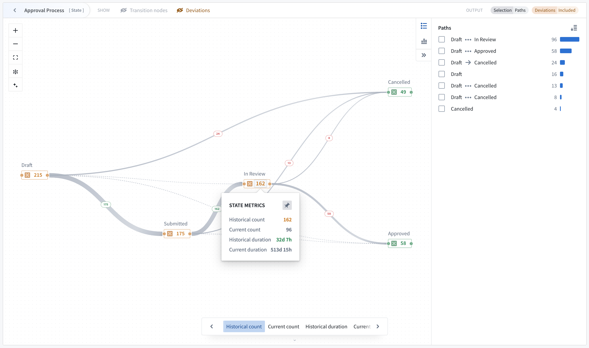
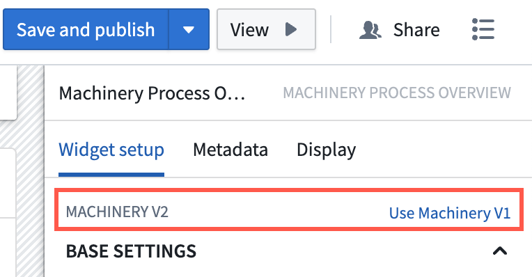
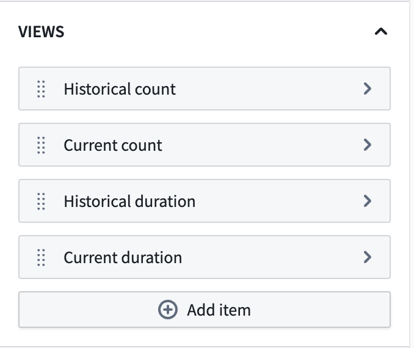
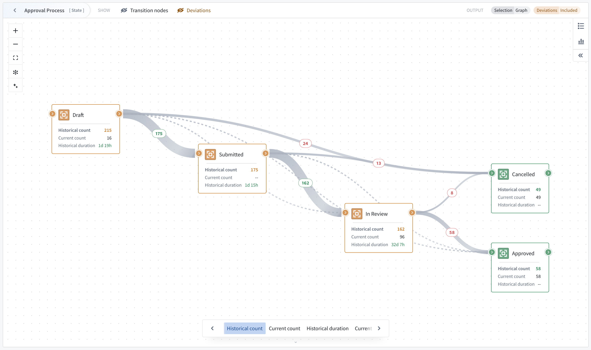
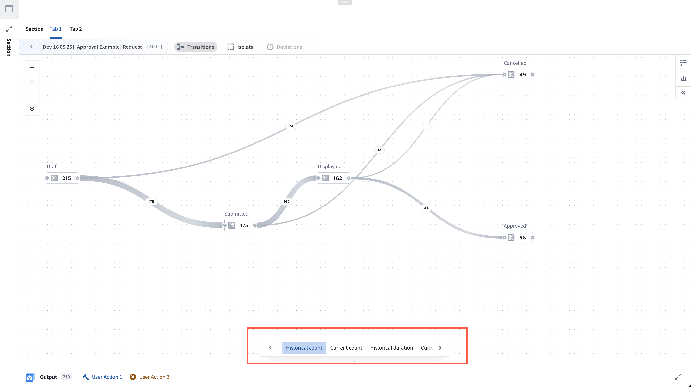
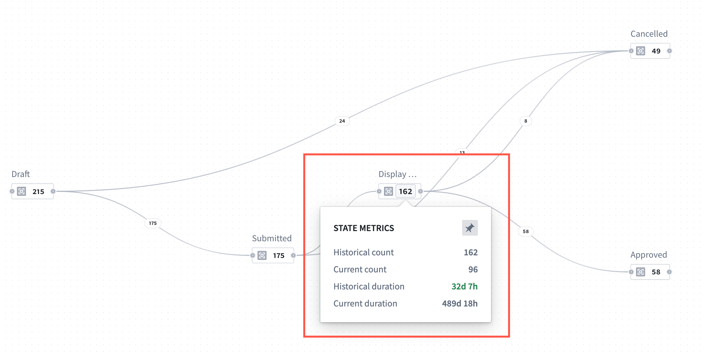
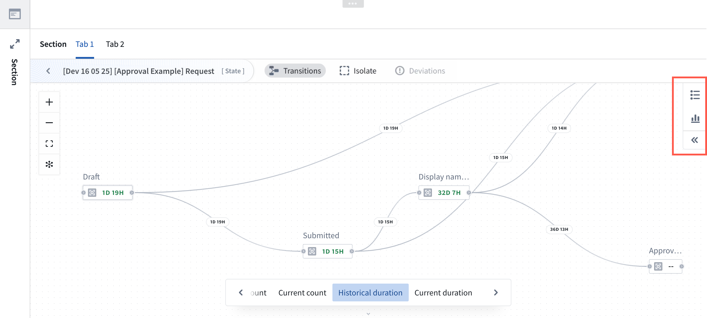
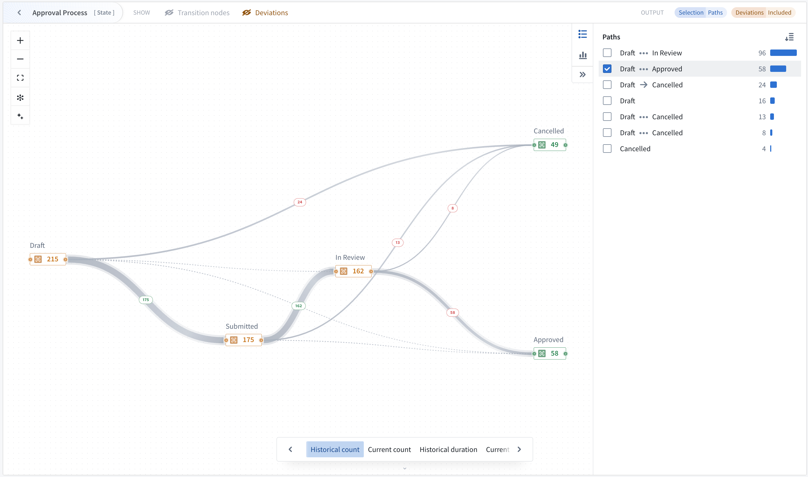
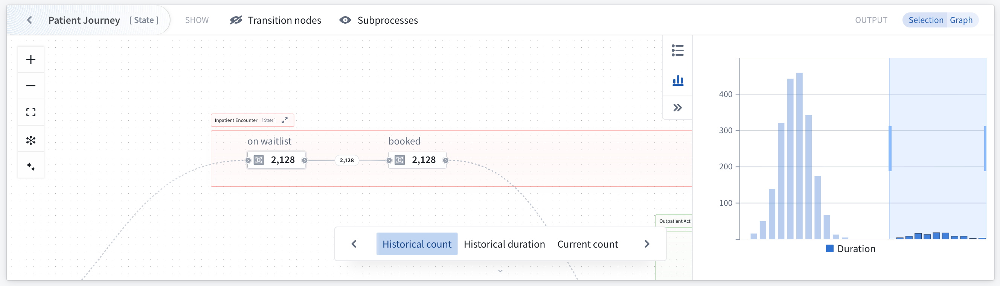

<!-- source: https://palantir.com/docs/foundry/machinery/analyze-and-monitor/ · mirrored 2026-08-14 from Palantir Foundry docs -->

# Analyze and monitor a process

The Machinery widget provides operational insights and monitoring capabilities for your configured Machinery processes.

* Gain visibility into process operations when users are actively working within processes.
* Identify bottlenecks for analytical and monitoring workflows.
* Visualize process flows and metrics through configurable views.

The widget renders your Machinery graph in Workshop applications as a visualization that can display metrics, process flows, and object distributions.

The Machinery widget is available in Workshop modules or as a stand-alone view mode in the Machinery application with limited features.

## Widget configuration

Create or open a Workshop module and select the Machinery Overview widget. The widget version v2 is selected by default and supports Machinery v2 resources. At the top of the widget configuration, select your Machinery graph resource.

### Upgrade existing applications

New Machinery widgets will be created as v2 widgets by default. Existing widgets will need to be upgraded to v2.

1. To upgrade a legacy widget to v2, open **Workshop** edit mode with the **...** dropdown menu.
2. Select anywhere in the graph, and under the **Widget setup** menu, select **Use Machinery v2**.
3. Update your [inputs](#inputs) appropriately.

### Inputs

Configure an input object set for each root process in your graph. The Machinery widget automatically derives subprocess object sets from the link type setup, and subprocesses have link types to their parent objects, as configured under **Object type**.

**Example:** If you provide 100 application objects, and each application is linked to multiple review objects, the widget automatically identifies all related reviews through the configured link types. This means that you only need to configure the object input for each root process of the graph (typically 1 object input).

### Metric views

The Machinery widget is instantiated with the following pre-configured metric views:

* **Historical count:** Show ever count metrics.
* **Current count:** Show current count in state.
* **Historical duration:** Show historical duration in the state.
* **Current duration:** Show current duration in the state.

Application builders can add, remove, reorganize or customize these metrics views.

Custom views may also be added using the **+ Add item** option. For each view, a builder can define one node metric with numerical formatting and conditional coloring, an optional edge metric, and enable Sankey diagram edge thickness settings.

### Outputs

Output datasets can be used for further analysis within the Workshop module. Configure output object sets to capture filtered results based on graph interactions:

* Create one output per process in the graph (optional)
* The output object set applies filters defined on the process level in the Machinery application as well as search arounds from parent to child processes.
* Outputs respond dynamically to node/edge selection
* Path explorer and distribution charts provide additional means of affecting the output

#### Node and edge selection

You can change how node selection affects the object output by toggling either of the options:

* Processes currently in selected states
* Processes ever in selected states

Edge selection can be configured to show objects that ever went through a transition or just the last transition.

### Configure views

Views determine what metrics and visualizations appear in the widget. See the metric views section below for details.

## Widget features

A user viewing a graph in the Machinery widget can benefit from features including metric cycling and pinning, various usage modes, and filters.

### Metric views, cycling, and pinning

The widget displays metrics in a space-efficient manner. On the graph, one node metric is visible at a time, as well as one optional edge metric if selected. If the viewport is sufficiently zoomed in, the graph will show node cards with 3 metrics, starting with the active view. If Sankey diagram edges have been configured, edge thickness is used to represent flow frequency on the Transitions view.

#### Preconfigured views

Users of the widget can cycle through preconfigured [metric views](#metric-views), including historical count, current count, historical duration, and current duration. Once a view is selected, hover over any node to reveal all available metrics.

Additionally, select a node metric to pin it and keep the metrics visible for review, or select again to unpin.

### Process-conformance filtering

By default, the widget only displays processes that conform to your process definition:

* States and transitions that are not present in Machinery are excluded.
* Metrics are computed only over conforming processes.
* If any log object type on the graph contains more than 1M objects, conformance filtering is disabled and the graph will cover all input objects including metrics computation and output object sets.

### Focus into a parent process

On a graph, you may focus into a desired parent process to narrow your view.

### Graph selection and outputs

Interact with the graph to filter output object sets:

* Select nodes to filter objects by state.
* Select edges to filter objects by transitions.
* Output object sets update automatically based on your selection.

### Graph features

The following graph features may be enabled or disabled individually in the widget header.

* **Transition nodes:** When your graph includes actions or automations as configured in the Machinery application, the Machinery widget will replace them with implicit state transitions to help you understand the process from a state-transition perspective. You can choose to show the transition nodes instead, and configure default behavior in the widget configuration.
* **Subprocesses:** If the graph has subprocesses, you can replace these subprocesses with their implicit state transitions to allow you to see transition metrics on the currently focused process.
* **Deviations:** If your current data has deviating objects, they are hidden by default. Deviating objects are those that take any states or transitions that are not included in the process definition. You can make them invisible and independently choose whether they are included in the widget output.

### Analysis modes

With the Machinery graph open, you can toggle between the path explorer feature and the duration distribution feature located on the right side of the graph. The selected feature will open on the right side.

#### Path explorer

Analyze individual process paths and their frequency using the path explorer feature for one process at a time. To open path explorer, select the path explorer icon located on the right side of the graph.

Path explorer displays all paths taken by the currently focused process, and shows the path frequency distribution (the frequency of objects completing the path).

Hover over a path in the window to see it highlighted on your graph. You may also select one or more paths to filter the output.

Note that when path explorer is open, path selection controls the widget output and overrides previous node/edge selection.

#### Duration distribution

Use the duration distribution filter to identify performance outliers and analyze time spent in states.

The duration chart responds to selection on the graph and follows configured node and edge selection options.

Selecting individual buckets or a range of buckets will filter the output object set. You can combine chart selection with graph selection to find objects with undesirable behavior, such as taking too long in an individual transition or state.

