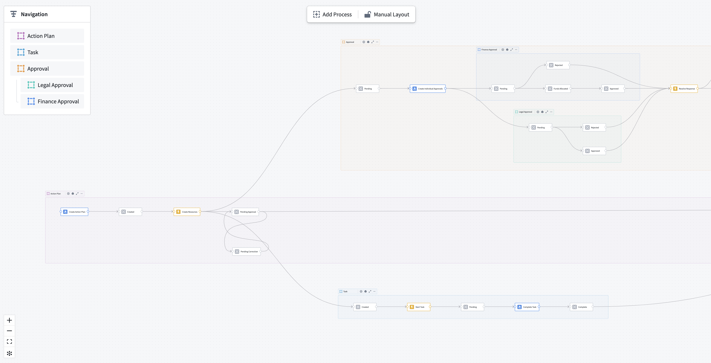
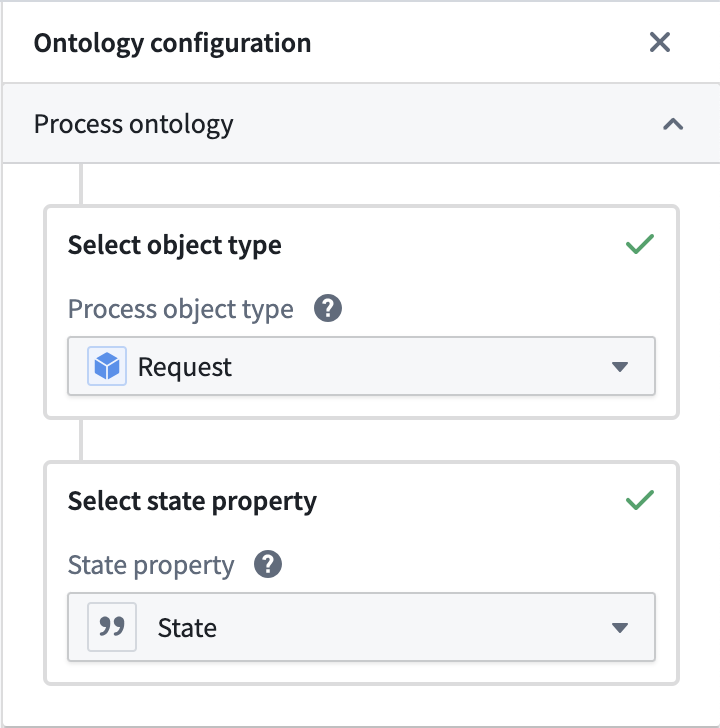
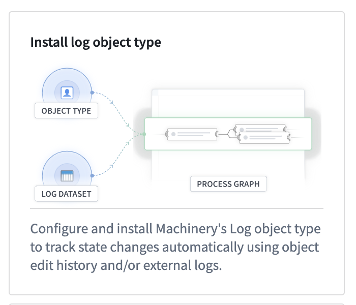

<!-- source: https://palantir.com/docs/foundry/machinery/connect-data/ · mirrored 2026-08-14 from Palantir Foundry docs -->

# Connect data to Machinery

By connecting a process to a datasource, you can bridge the gap between an abstract process definition and real-world observations. This data can be used to conduct initial [process mining](/docs/foundry/machinery/process-mining/) or to [monitor performance and find bottlenecks](/docs/foundry/machinery/analyze-and-monitor/).

Machinery connects to two types of object data in the ontology: [process objects](#process-objects) and [log objects](#log-objects). The side panel for data configuration is accessible through the main toolbox or from process containers.

## Process objects

A process object is an entity that goes through a process.

For example, this may be an `Employee` for an onboarding process, or an `Invoice` for a purchase-to-pay process. The state of the entity is explicitly tracked by a string property, typically called `state`. The values of the `state` property (for instance, "created" or "approved") are represented by state nodes on the graph.

:::callout{theme="neutral"}
A state value may have dependencies, like submission criteria in actions or automations that are triggered by a certain state condition. Changing the state value in Machinery does not update these dependencies, nor does it change the values in the ontology data.
:::

In the multi-process setting, each process container captures exactly one state property on an object type.

As in the resource example screenshot above, an object type can have multiple state properties; for instance, a coarse state and a granular state.

The process object type represents the latest state of the entity, and therefore cannot inform on state transitions and temporal patterns.

## Log objects

A log object represents an individual change to an entity’s state. Log objects contain a reference to the process entity, its previous state, its new state, and the timing of the transitions.

* **Log ID (string) \[required]:** The primary key of the log object.
* **Process ID (string) \[required]:** The primary key of the process object that is being tracked. Use when setting up an Ontology link between the process object and the Log object.
* **Old state (string) \[required]:** The start state of the transition.
* **New state (string) \[required]:** The end state of the transition.
* **Timestamp (timestamp) \[required]:** Timestamp of entering the end state.
* **isLatest (boolean) \[optional]:** True if this log is the most recent for the process object, otherwise False.
* **Duration (long) \[optional]:** Duration in milliseconds since entering the old state.
* **Path (string) \[optional]:** A list of all states encountered so far, including the current state. Must be a serialized JSON string.
* **Action type RID (string) \[optional]:** An identifier of the action type that caused the transition. Typically, `NULL` for external changes.
* **Owning RID (string) \[optional]:** An identifier of the application from which the action was executed. Allows discrimination between manual and automated Actions. `NULL` for external changes.

Maintaining such a log requires orchestration when edits are made. Machinery provides a standard solution that can be installed from within the application. Setting up a log object type requires a process object type.

A dialog will guide you through the setup. You can choose which source of edits you want to track:

* If the process object type receives changes from external datasource, you can select and configure a changelog dataset.
* If the process object type can be edited in the platform, you can choose to [enable edit history on the process object type](/docs/foundry/object-edits/user-edit-history/) and include those edits in the log object type. Machinery will automatically create a materialization dataset of the edit history to make it available for aggregated analysis.

:::callout{theme="neutral"}
Tracking logs from platform edits for object types with multiple datasources or row-level permissions is currently not supported.
:::

If you want to track changes from external datasources, you must select a dataset in standard changelog format, which is a simpler version of Machinery’s log object type schema. That dataset is typically upstream of the object type datasource, and contains the following columns:

* **processId (string) \[required]:** A unique identifier of the process entity.
* **state (string) \[required]:** The new state the process has entered.
* **timestamp (timestamp) \[required]:** The timestamp at which the transition occurred.
* **isDeleted (boolean) \[optional]:** Property that flags an entity as deleted. If isDeleted of the latest log is `True`, that object will not appear in the ontology.

On confirmation, Machinery will install a [Marketplace product](/docs/foundry/marketplace/overview/) into a folder of your choosing. This product contains a [Pipeline Builder](/docs/foundry/pipeline-builder/overview/) pipeline that computes log entries from the configured sources into the correct format. The product also deploys the log object type itself with an ontology link to your process object type.

After the installation is complete, the pipeline needs to complete an initial build, and the log object type needs to be indexed in the databases before the data is available for mining and monitoring.

:::callout{theme="neutral"}
The deployed pipeline is scheduled to run on every change to any of its datasources. As a result, the log object type lags behind the process object type by one build and one indexing job, typically about 2-5 minutes. If you require real-time updates, you need to maintain a custom log object type.
:::

You can manually map a custom log object type if it fulfills the minimal schema.
