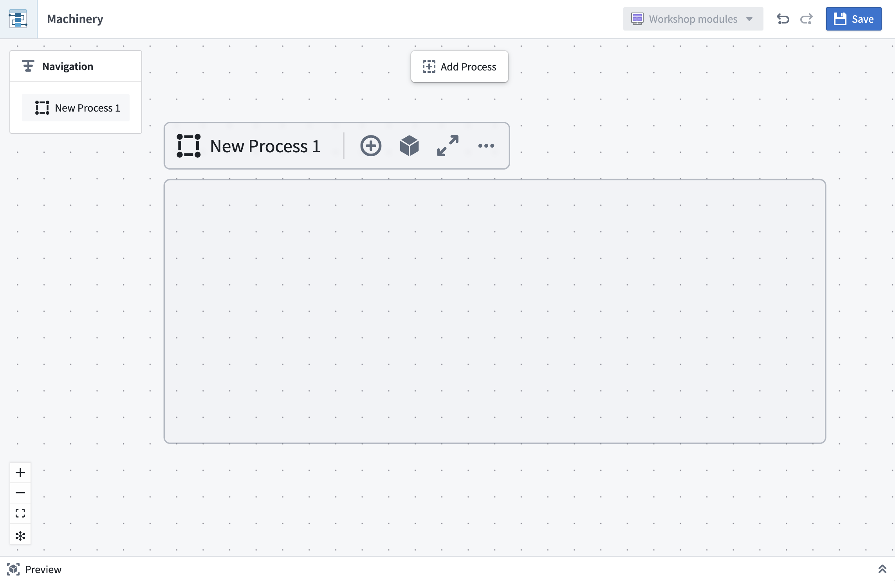
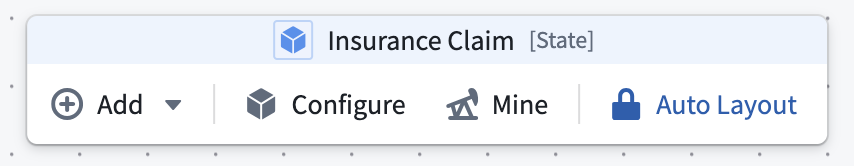
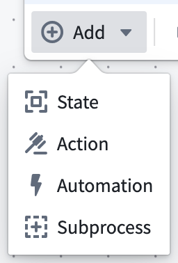
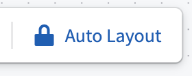

<!-- source: https://palantir.com/docs/foundry/machinery/draw-a-graph/ · mirrored 2026-08-14 from Palantir Foundry docs -->

# Draw a Machinery process

To create a model of a process using the Machinery application, you can derive a process model automatically from historical observations by [process mining](/docs/foundry/machinery/process-mining/), or you can define a process manually by drawing states and transitions.

You may want to use the manual process drawing tools in situations when you have a physical process in mind that you want to model and visualize graphically, or when you need to modify and enhance an existing process model.

From the blank canvas of a Machinery resource, your first step in manual process drawing is to create a process container. The container is used to represent a specific type of entity and its states; for instance, a `Claim`. If there are multiple entities interacting with each other, you may add further process containers, either in parallel or nested within others.

For a better editing experience, you can focus your view on a process container by selecting the fullscreen option to have the process container and its children fill the entire canvas. To revert from  fullscreen focus, you can change your view by using the **Navigation** panel.

All drawing interactions are available through actions on the process container, or from the main toolbar when a process is in focus.

## Adding states, actions, and automations

A typical pattern for building out a process is to start with an initial state, draw subsequent states, and then add actions and automations in between.

Alternatively, you can start with a sequence of actions and fill in the states later.

Edges between states denote state transitions. When connecting actions or automations to states, these edges follow the semantics below:

* **Input States:** Allowed states of objects prior to the action. For Foundry actions, this can be enforced through [submission criteria](/docs/foundry/action-types/submission-criteria/). You can inspect existing submission criteria in the **Details** panel of action nodes.

* **Output States:** Possible resulting states after the action. For instance, an action to *extract entities* can result in *extraction succeeded* or *extraction failed*. Output states cannot be enforced; however, output states can be manually validated by reviewing the action logic in Machinery.

* **Automations:** A representation of an action that is automatically triggered when one of its input states is reached. Automations can also send notifications, which describe a *side effect* of a state.

Nodes and edges can be deleted by selecting the element and using the trash can icon or pressing backspace on your keyboard.

Once you have chosen a [process ontology](/docs/foundry/machinery/connect-data/), the state names represent values of the `state` property of your object types. Changing the name of a state in Machinery does not change values in your data. You can also link concrete actions or automations to the elements on the graph. In doing so, you can gradually turn your process model into a process implementation.

## Auto-layout feature

Machinery’s **auto-layout** feature is enabled by default. Nodes are automatically positioned as you add or connect them, keeping the graph organized in a left-to-right process flow.

You can influence the vertical ordering of nodes of the same “layer” by dragging them up or down.

If there are loops in your process, you can choose which nodes to place first by dragging any node leftward. The rest of the layout will adapt accordingly.

You may also choose to toggle off the auto-layout feature if it does not produce satisfactory results. Switching off the feature allows you to move nodes freely on the graph.

During manual layout mode, you may benefit from the one-time layout option accessible in the control bar on the bottom left to reorganize your graph.

## Multiple object types

Many real-world processes involve multiple entities. You can represent those with process containers and link their states and actions. For instance, an action in one container may affect the state of another entity and therefore be connected to those states as outputs. We recommend placing actions into the container of the object that they take as input.
