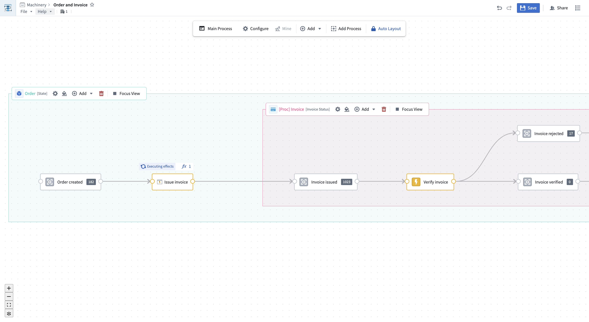

<!-- source: https://palantir.com/docs/foundry/machinery/overview/ · mirrored 2026-08-14 from Palantir Foundry docs -->

# Machinery

Many real-world events can be thought of as processes, such as business workflows, government operations, or healthcare procedures. In a process, entities such as documents, equipment, or individuals undergo changes of state over time. The Machinery application enables you to understand and manage all aspects of a process, identify unwanted behavior, and make improvements toward a desired outcome. With support from [AIP's LLM-powered functionality](/docs/foundry/logic/overview/), you can use Machinery as a reliable framework for orchestrating multiple automations in multi-step AIP workflows. Supported workflows include:

* Resolving process inefficiencies with the help of AIP and automation
* Managing an AIP use case end to end by orchestrating several AI agents
* Mining an ongoing process from external event logs to gain visibility into an existing process
* Defining and monitoring performance metrics and expectations to identify process bottlenecks
* Building operational applications to supervise AIP workflows with real-time human intervention

## Use cases

Example use cases and workflows for Machinery include:

* **Insurance:** Capture the process of insurance claims from the initial filing to the final decision, including OCR on relevant documents, semi-automated processing, and human approval.
* **Hospital operations:** Model the patient journey through hospital care from end to end. Support operations through medical document generation.
* **Purchase-to-pay:** Consider the procurement process from requisition to payment and improve workflow efficiency.
* **Order-to-cash:** Optimize the sales process from order receipt to payment collection for customer satisfaction and cash flow.

:::callout{theme="success" title="Palantir Learning portal"}
Get started with Machinery in the ["Mining your first business process" speedrun course ↗](http://learn.palantir.com/speedrun-mining-your-first-business-process) at [learn.palantir.com ↗](http://learn.palantir.com).
:::
