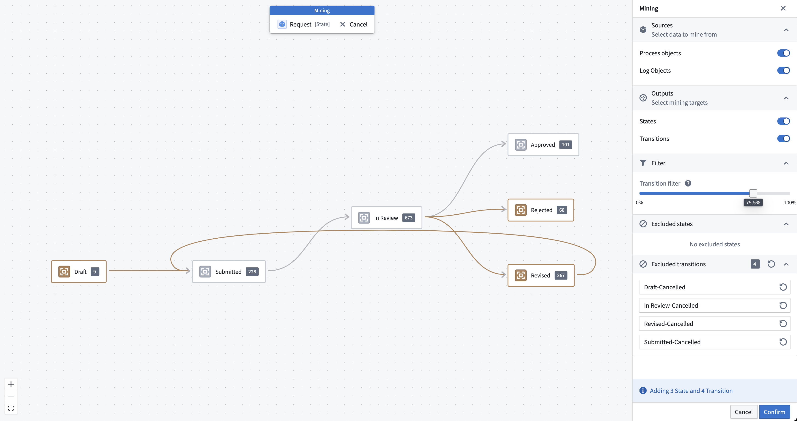
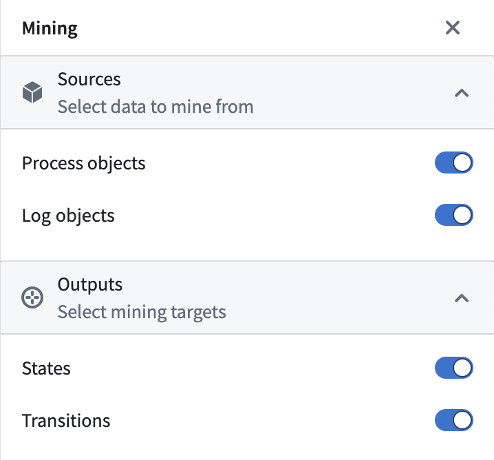
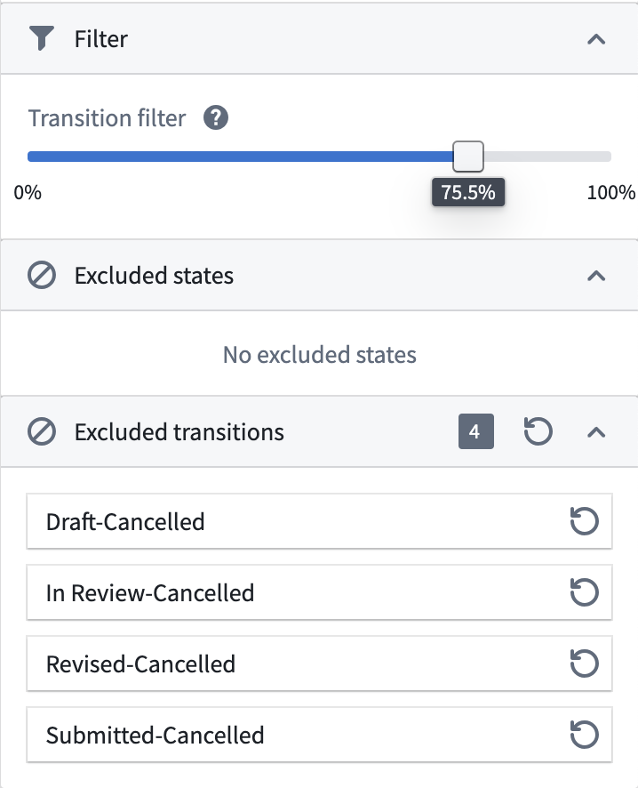

<!-- source: https://palantir.com/docs/foundry/machinery/process-mining/ · mirrored 2026-08-14 from Palantir Foundry docs -->

# Process mining

There are several ways to create a model of a process using the Machinery application: you can define a process manually by [drawing states and transitions](/docs/foundry/machinery/draw-a-graph/), or you can derive a process model automatically from historical observations by *process mining*.

Process mining is supported as a dedicated mode in Machinery. The process mining workflow is accessible through the main toolbar once a [data connection has been configured](/docs/foundry/machinery/connect-data/).

In mining mode, you will see your existing process definition overlaid with states and transitions as they occur in the data. The styling indicates the following:

* **Amber:** The mining result. These elements will be added to your process definition once you confirm.
* **Gray:** These elements occur in data but already exist in your process definition.
* **Dashed line:** Elements from the current process definition that have no reference in the data. This may indicate an issue with your process definition.

## Settings

At the top of the mining side panel, you can configure which data source should be used for mining: process objects, log objects, or both. While it is possible to mine only the latest state values from the process object type, a log object type is recommended.

In addition, you can select what elements should be mined: states, transitions, or both. Typically, you should mine both states and transitions if the relevant datasources are available.

## Filtering

Collected data often contains noise and errors. The raw output from mining can be too complex or contain unexpected results. Machinery allows you to filter states and transitions from the data to help you produce a more usable representation of your process.

At the bottom of the mining side panel, you can configure filters.

* **Transition filter:** This filter sorts all transitions by their occurrence, with the most frequent transitions ranked highest. It then computes a cumulative sum of all those values and keeps the top *x* % of all transitions. This cuts off the tail-end of infrequent transitions.
* **Excluded elements:** A list of erroneous state values or transitions that should not be accepted into the process definition. These excluded values are persisted when saving and can be managed over time.
