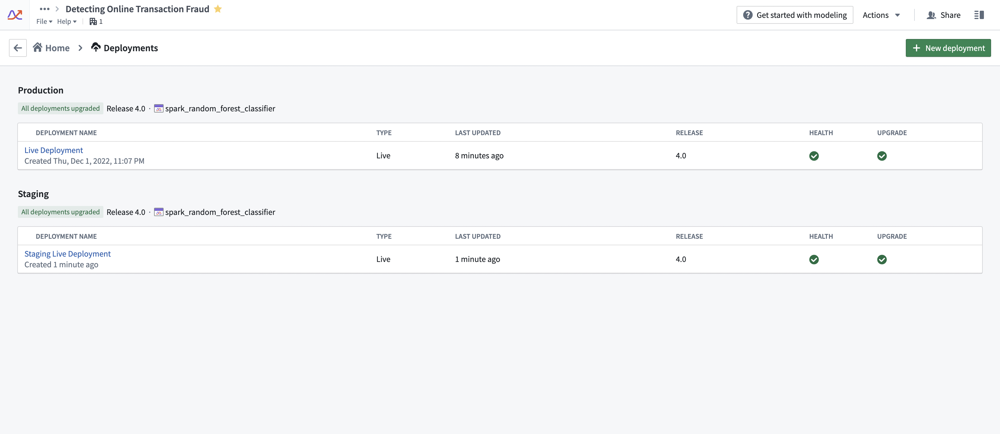
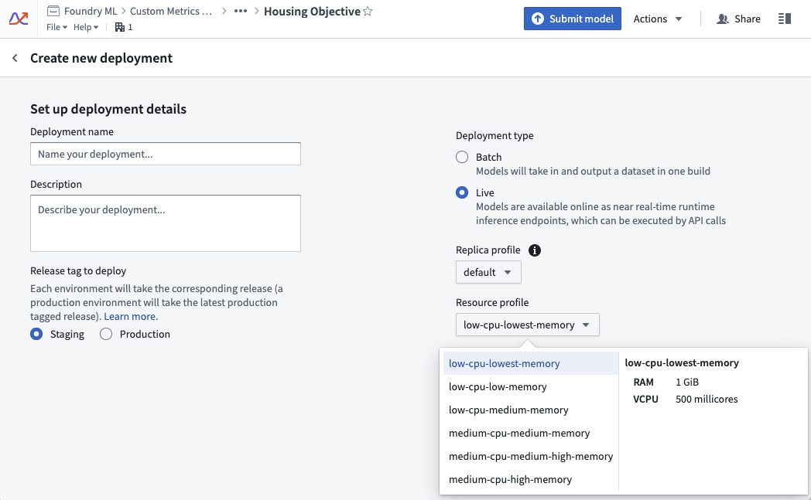
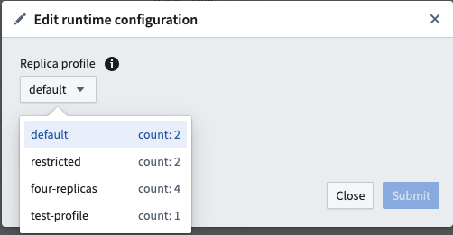
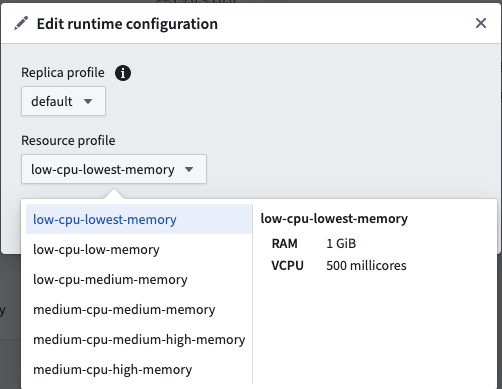

<!-- source: https://palantir.com/docs/foundry/manage-models/compute-usage/ · mirrored 2026-08-18 from Palantir Foundry docs -->

# Live deployment compute usage

A Foundry Machine Learning live deployment is a persistent, scalable deployment for model releases that can be interacted with via an API endpoint. Live deployments continuously reserve dedicated compute resources to ensure that the deployment can quickly respond to incoming traffic. As a result, hosting a live deployment uses Foundry compute-seconds while the deployment is active.

:::callout{theme="neutral"}
The following documentation covers Modeling Objective-backed live deployments only. Neither JavaScript function-backed deployments nor [direct deployments](/docs/foundry/manage-models/create-a-model-deployment/) are covered here. Direct deployments are backed by compute modules and therefore [follow the corresponding principles](/docs/foundry/compute-modules/usage/); however, the caveat on [container-backed models](/docs/foundry/integrate-models/container-overview/) requiring both deployment and model resources still applies.
:::

When running live, Foundry Machine Learning compute usage is attributed to the Modeling Objective itself and is aggregated at the level of the Project that contains the Modeling Objective. For a deep dive on the definition of a compute-second in Foundry and the origins of the formulas used for computing usage, review the [usage types](/docs/foundry/resource-management/usage-types/) documentation.

## Measuring compute seconds

Foundry Machine Learning live deployments host their infrastructure on dedicated “replicas” that run in Foundry’s pod-based computation cluster. Each replica is assigned a set of computational resources, measured in vCPU’s and GiB of RAM. Each replica locally hosts the model and uses computational resources to service incoming requests.

A Foundry Machine Learning live deployment imported into a Modeling Objective uses compute-seconds while it is active, regardless of the number of incoming requests it receives. A deployment is considered “active” once it is started and remains "active" until the deployment is shut down through the graphical interface or API. If the Modeling Objective with which the live deployment is associated is sent to the platform trash, the live deployment will be shut down. Alternatively, a [direct deployment](/docs/foundry/manage-models/create-a-model-deployment/) started from a model resource rather than a Modeling Objective will auto-scale based on request volume and can be configured to support zero minimum replicas when there is no usage. Learn more about the [differences between live deployment from Modeling Objectives and direct deployments](/docs/foundry/manage-models/create-a-model-deployment/#comparison-direct-model-deployments-vs-modeling-objective-live-deployments) and [direct deployment auto-scaling behavior.](/docs/foundry/manage-models/create-a-model-deployment/#2-configure-a-direct-model-deployment)

The number of compute-seconds that a live deployment will use is dependent on three main factors:

* The number of vCPU’s per replica
  * For live deployments, vCPU’s are measured in millicores, each of which are 1/1000 of a vCPU
* The GiB of RAM per replica
* The number of GPUs per replica
* The number of replicas
  * Each replica in the deployment will have an identical number of vCPU’s and GiB of RAM

When paying for Foundry usage, the default usage rates are the following:

| vCPU / GPU | Usage rate |
| --- | --- |
| vCPU | 0.2 |
| T4 GPU | 1.2 |
| A100 GPU | 1.3 |
| L4 GPU | 2.1 |
| A10G GPU | 1.5 |
| V100 GPU | 3 |
| H100 GPU | 4.7 |

These are the rates at which live models use compute based on their profile under Foundry's parallel compute framework. If you have an enterprise contract with Palantir, contact Palantir Support to discuss compute usage calculations.

The following formula measures vCPU compute seconds:

```
live_deployment_vcpu_compute_seconds = max(vCPUs_per_replica, GiB_RAM_per_replica / 7.5) * num_replicas * live_model_vcpu_usage_rate * time_active_in_seconds
```

The following formula measures GPU compute seconds:

```
live_deployment_gpu_compute_seconds = GPUs_per_replica * num_replicas * live_model_gpu_usage_rate * time_active_in_seconds
```

:::callout{theme="neutral" title="Container-backed models"}
In the case of [container-backed models](/docs/foundry/integrate-models/container-overview/), every replica comes with a container with its own dedicated GPU or vCPU resources, as specified in the container [model version's runtime configuration](/docs/foundry/integrate-models/upload-image-container-model/#3-configure-the-model-version).
:::

## Investigating Modeling Objective usage

All compute-second usage in the platform is available in the [Resource Management application](/docs/foundry/resource-management/overview/).

Compute usage for deployments is attached to the Modeling Objective from which it is deployed. Multiple live deployments can be active for any given objective. The live deployments of a Modeling Objective can be found under the **Deployments** section. See the screenshot below for an example.



## Drivers of increased or decreased usage

Live deployments use compute-seconds while they are active. The following strategies can help control the overall usage of a deployment:

* Ensure that the deployment is tuned correctly for the request load that you expect. Deployments should be tuned for the peak expected number of simultaneous requests. If a deployment is under-resourced, it will start to return failed responses to requests. However, over-resourcing a deployment can use more compute seconds than necessary.
  * We recommend that live deployment administrators run stress-tests against live deployment endpoints to determine the correct resource configuration before deploying the model into an operationally critical setting.
* Live deployments will run until they are explicitly stopped or canceled. It is important to monitor for live deployment usage to ensure that deployments are not erroneously left running when they are not needed. This can be common on staging deployments.
* Increasing/decreasing API load on a deployment without changing its profile does not affect its compute usage. A live deployment will service as many requests as its resources will allow it to without changing the number of compute-seconds it uses.

## Configuring usage

A live deployment’s resource usage is defined by its profile. The profile can be set at creation time of the live deployment. Profiles can be changed while the deployment is active. Deployments will automatically receive the updated profile with no downtime.



## Managing usage

In enrollments where compute is managed through [Resources Queues](/docs/foundry/resource-management/resource-queues/), Resource Management administrators can view which live deployments are currently running in a given queue using the steps below:

1. Open the Resource Management application.
2. Select **Resource queues**.
3. Select a queue from the left sidebar.
4. Choose the **Continuous compute** tab in the middle of the page.
5. Select the filter icon on the far right side, then choose to filter by **Live deployment**.

## Usage calculation examples

### Example 1: vCPU compute

The following example shows a live deployment with the default replica profile of two replicas that is active for 20 seconds with the “low-cpu-lowest-memory” profile:





```
resource_config:
    num_replicas: 2
    vcpu_per_replica: 0.5 vCPU
    GiB_RAM_per_replica: 1 GiB
seconds_active: 20 seconds
live_model_vcpu_usage_rate: 0.2

compute seconds = max(vcpu_per_replica, GiB_RAM_per_replica / 7.5) * num_replicas * live_model_vcpu_usage_rate * time_active_in_seconds
                = max(0.5vCPU, 1GiB / 7.5) * 2replicas * 0.2 * 20sec
                = 0.5 * 2 * 0.2 * 20
                = 4 compute-seconds
```

### Example 2: GPU compute

The following example shows the usage rate for a live deployment. The live deployment has a default replica profile with two replicas and is active for 20 seconds with a GPU V100 profile.

```
resource_config:
    num_replicas: 2
    gpu_per_replica: 1 V100 GPU
seconds_active: 20 seconds
live_model_gpu_usage_rate: 3

compute seconds = gpu_per_replica * num_replicas * live_model_gpu_usage_rate * time_active_in_seconds
                = 1 * 2replicas * 3 * 20sec
                = 1 * 2 * 3 * 20
                = 120 compute-seconds
```

### Example 3: Container-backed model compute

```
Deployment resource_config:
    num_replicas: 2
    vcpu_per_replica: 0.5 vCPU
    GiB_RAM_per_replica: 1 GiB

Model image resource_config:
    CPU: 4 cores
    Memory: 30 GiB

seconds_active: 20 seconds
live_model_vpcu_usage_rate: 0.2

total compute seconds = (compute seconds deployment resource) + (compute seconds model resource)

compute seconds deployment resource = max(vcpu_per_replica, GiB_RAM_per_replica / 7.5) * num_replicas * live_model_vcpu_usage_rate * time_active_in_seconds
                = 0.5 * 2replicas * 0.2 * 20sec
                = 0.5 * 2replicas * 0.2 * 20sec
                = 4 compute seconds

compute seconds model resources = max(cores, Memory / 7.5) * num_replicas * live_model_vcpu_usage_rate * time_active_in_seconds
compute seconds model resources = 30 / 7.5 * 2 * 0.2 * 20
compute seconds model resources = 32 compute seconds

total compute seconds = 36 compute seconds
```
