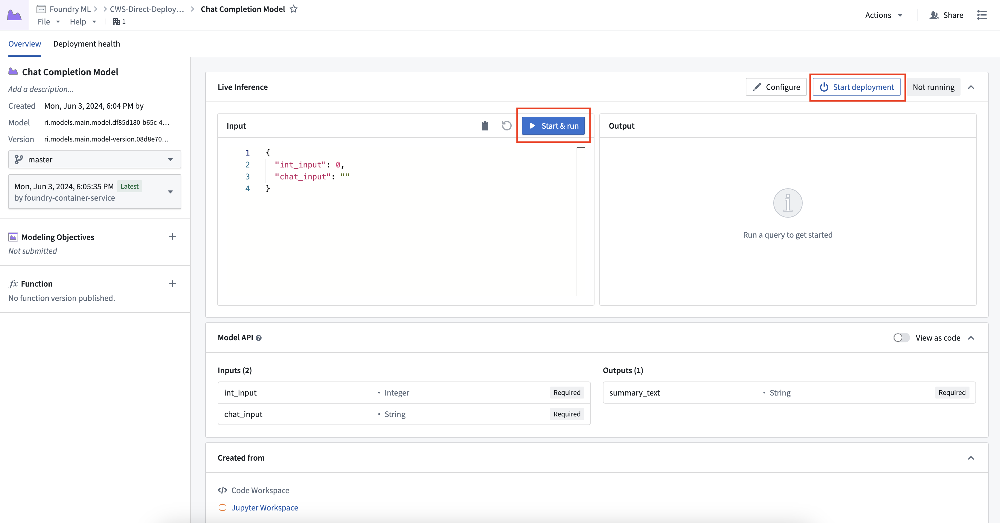
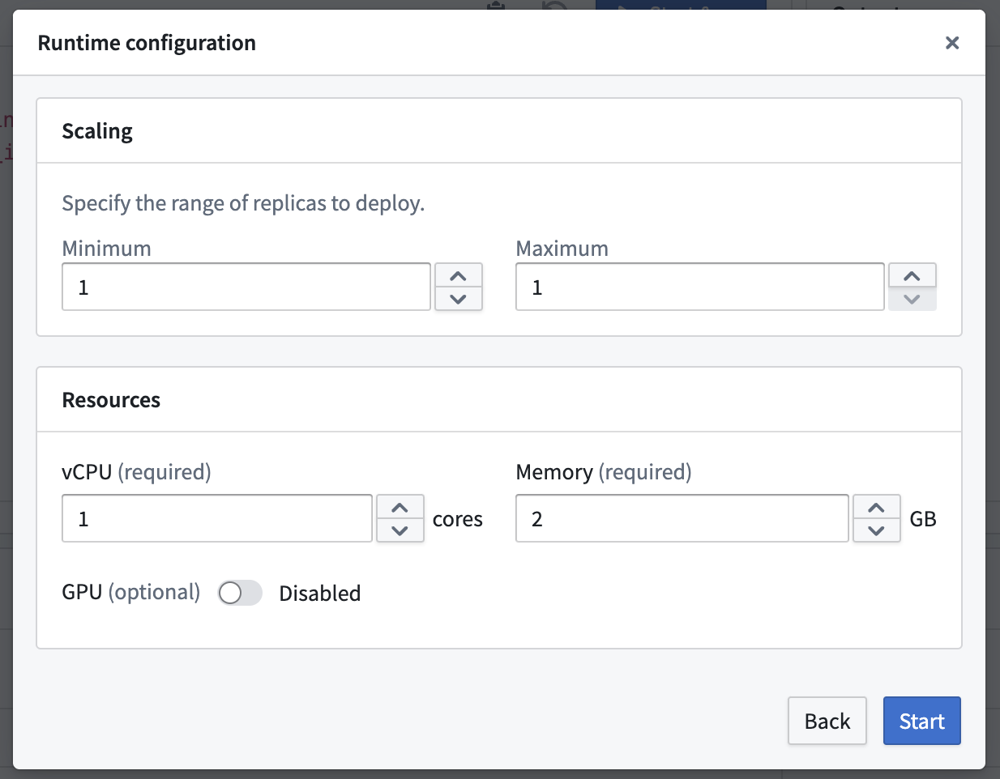
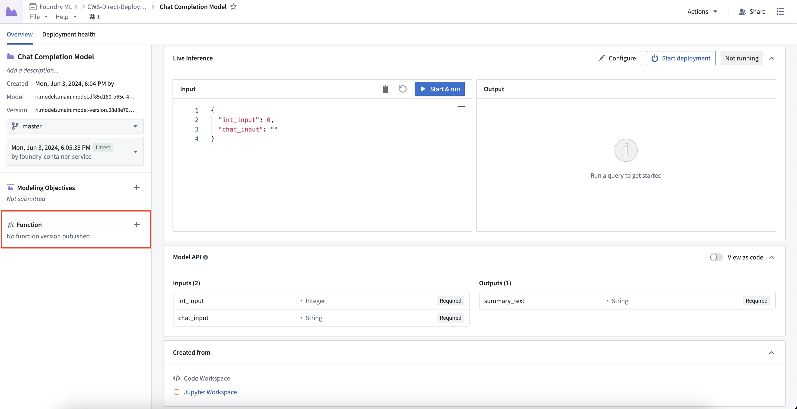
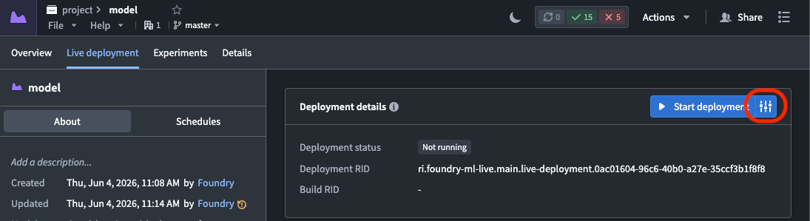
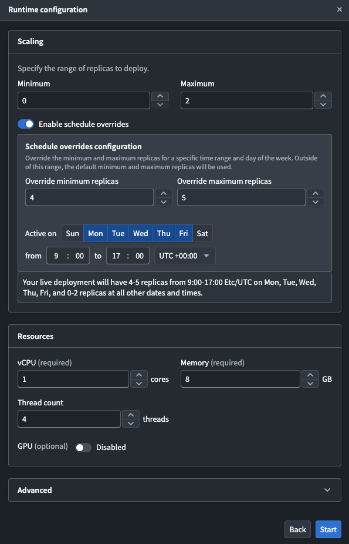
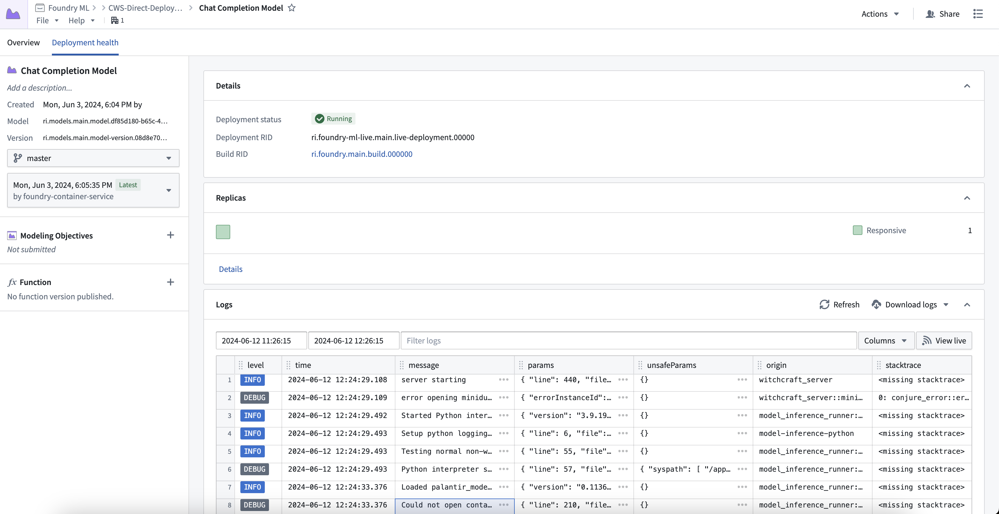
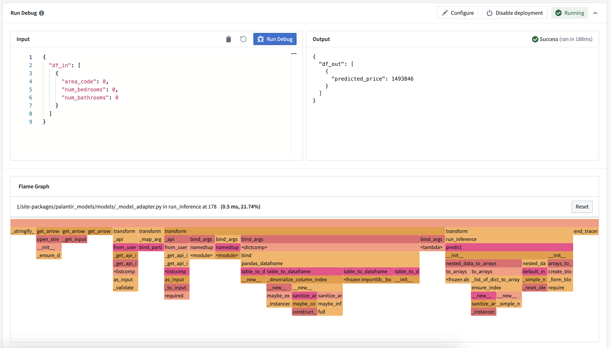

<!-- source: https://palantir.com/docs/foundry/manage-models/create-a-model-deployment/ · mirrored 2026-08-18 from Palantir Foundry docs -->

# Create a direct model deployment

Direct model deployments are live hosted endpoints that immediately connect models to user applications such as [Workshop](/docs/foundry/workshop/overview/) and [Slate](/docs/foundry/slate/overview/). Direct model deployments are queried in TypeScript through [Functions on models](/docs/foundry/functions/functions-on-models/) or from an external system through a REST API call.

The following sections explain how to create, configure, and publish a direct model deployment and describe some debugging steps and feature considerations to review before getting started.

## 1. Create a direct model deployment

To create and start a direct model deployment, navigate to the [model](/docs/foundry/model-integration/models/). Select **Start Deployment** at the top of a model page under **Live Inference**. Once running, you can interactively test the deployment by selecting **Run**.

## 2. Configure a direct model deployment

To configure the resources of a direct model deployment, select the **Configure** button in the top right of the **Live Inference** panel. Direct model deployments can be configured to scale from zero. When the deployment reaches 75% capacity, it will create an additional replica until it reaches the maximum replica count specified in the runtime scaling configuration. This also allows deployments to automatically scale down after 30 minutes without a live request.

## 3. Publish a function for the deployment

You can publish a [function](/docs/foundry/functions/overview/) for the model, enabling usage of models for live inference in [Workshop](/docs/foundry/workshop/functions-use/), [Vertex](/docs/foundry/vertex/overview/), and other end-user applications.

To publish a function, select the **+** icon in the model artifact sidebar and provide a function name. You can register one function per branch. This creates a wrapper function with the same input and output API as your model, which can be [imported and called from a functions repository](/docs/foundry/functions/functions-on-models/) to add custom business logic.

For details on function behavior, version upgrades, and configuration options, see the [Model functions developer guide](/docs/foundry/model-integration/model-functions-guide/).

## Automatic upgrades

One direct model deployment can be created for each branch of a [model](/docs/foundry/model-integration/models/). When a new model version is published to that branch, the direct model deployment will automatically upgrade to the new endpoint with no downtime. If you do not want automatic upgrades, consider using a [Modeling Objective live deployment](/docs/foundry/manage-models/create-a-model-deployment/) and review the [differences between a live and a direct deployment described below](/docs/foundry/manage-models/create-a-model-deployment/#comparison-direct-model-deployments-vs-modeling-objective-live-deployments). If a function was created for the deployment, a new version will automatically be created.

## Automatic horizontal scaling

Direct model deployments are backed by [compute modules](/docs/foundry/compute-modules/overview/) and therefore support automatic horizontal scaling between a user-specified minimum and maximum replica range, as [detailed above](#2-configure-a-direct-model-deployment). Modeling Objective live deployments also support configuring a minimum and maximum replica range to automatically scale based on request volume, as described in the [resource configuration section](/docs/foundry/manage-models/set-up-live/#resource-configuration).

## Configure a schedule override

You can schedule overrides for your minimum and maximum replica configuration on specific days and times during the week. This is useful when you expect predictable changes, such as higher traffic during business hours or reduced load on weekends.

To configure a schedule override:

1. Navigate to your direct model deployment's **Live deployment** tab and select the settings icon to the right of **Start deployment** to edit the runtime configuration.   
      
2. In the **Scaling** section, toggle on **Enable schedule overrides** to render a configuration panel where you schedule the overrides.   
      
3. Configure the following settings for your override:
   * **Override minimum replicas:** The minimum number of replicas during the scheduled period.
   * **Override maximum replicas:** The maximum number of replicas during the scheduled period.
   * **Active on:** The days of the week that the override will be applied.
   * **Time range:** The start and end time for the override, along with the timezone.

The default replica configuration applies outside of the configured time periods. Currently, you can only schedule one override.

## Model API type safety

Direct model deployments enforce type safety for all inference requests to ensure the model API type matches the input type. Type safety is respected for all input types, particularly the following:

* **Numeric values:** If the API of a model is defined as type `int`, and a value of 3.6 is passed to the model, the 0.6 will be truncated and the input will be 3.
* **Date and timestamps:** Direct model deployments will cast date and timestamp types before being provided to the `predict()` method. Timestamp fields now expect a string with format ISO 8601.
* **Enforced API structure:** Direct model deployments will explicitly require fields marked as required in the model API.

:::callout{theme="neutral"}
Model type safety is different from live modeling deployments which do not currently support type casting.
:::

## Debug a direct model deployment

To view debugging information and logs for your direct model deployment, select the **Deployment health** tab at the top of the model page.  Here you can find the deployment's running build, health information about replicas, logs, and metrics about each replica's state.

You can also view the call stack of your model inference under the **Run Debug** card.  This allows you to see how long each python function took and where performance improvements can be made.

**Note:** This does not show the call stack in container models, or if an error is thrown during inference.

## Comparison: Direct model deployments vs Modeling Objective live deployments

The available features of direct model deployments differ from features of Modeling Objective live deployments. Review the table below for more details.

| Feature| Direct model deployment | Modeling Objective live deployment |
|---|---|---|
| [Automatic upgrades](#automatic-upgrades) | Yes | No |
| [Automatic scaling](#automatic-horizontal-scaling) | Yes | Yes |
| [Type safety](#model-api-type-safety) | Yes | No |
| [Scheduled overrides](#configure-a-schedule-override) | Yes | No |
| [Supported endpoints](/docs/foundry/manage-models/live-deployment-reference/) | Yes (V2 only) | Yes (both V1 and V2) |
| [Model inference history](/docs/foundry/manage-models/model-inference-history/) | No | Yes |
| [Pre-release review](/docs/foundry/manage-models/set-up-checks/) | No | Yes |
| [Automatic model evaluation](/docs/foundry/evaluate-models/model-evaluation-automatic/) | No | Yes |
| [Trained in Code Repositories](/docs/foundry/integrate-models/model-asset-code-repositories/) | Yes | Yes |
| [Trained in Code Workspaces](/docs/foundry/model-integration/tutorial-train-jupyter-notebook/) | Yes | Yes |
| [Supports container images](/docs/foundry/integrate-models/container-overview/) | Yes | Yes |
| [Supports externally-hosted models](/docs/foundry/integrate-models/external-model-connection/) | No | Yes |
| [Spark model adapter API type](/docs/foundry/integrate-models/model-adapter-api/#api-types) | No | Yes |
| [Marketplace support](/docs/foundry/marketplace/overview/) | No | No |
