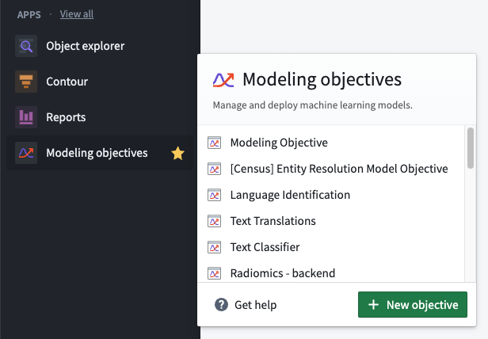
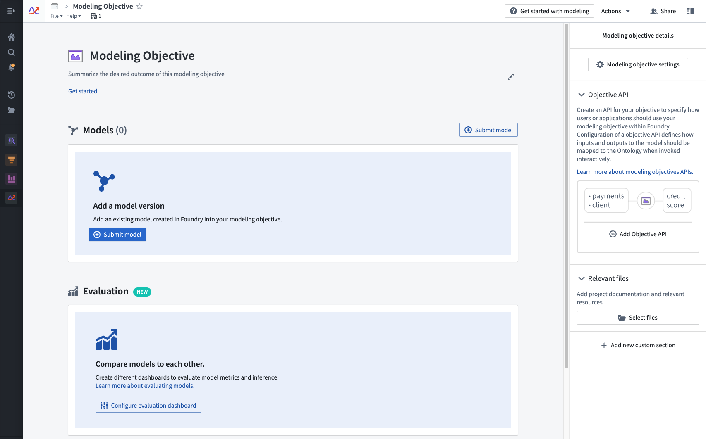
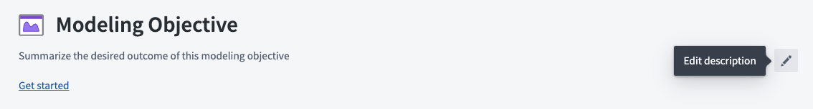

<!-- source: https://palantir.com/docs/foundry/manage-models/create-a-modeling-objective/ · mirrored 2026-08-18 from Palantir Foundry docs -->

# Create a modeling objective

The Modeling Objectives application is an intuitive workspace for teams to manage models as they progress through the modeling lifecycle. Creating a modeling objective helps simplify a modeling project by consolidating models, metadata, and data sources alongside the model review, release, and deployment of those models.

Create a modeling objective by selecting the **Modeling Objectives** application on the Foundry sidebar and clicking **New objective**.

After the modeling objective has been created, you can select a location to save the objective. We recommend saving the modeling objective in a centralized location where all relevant contributors, stakeholders, and consumers will have access to the project.

## Configure modeling objective

Modeling objectives can be edited and configured in several ways. This section provides more information about configuration options available for modeling objectives.

### Edit description

After creating a modeling objective, you can add a description by clicking the **Edit description** button. The description field is [Markdown ↗](https://www.markdownguide.org/)-compatible; we recommend using this space as a README for the objective and its goals.

### Edit objective metadata

There are several options available for editing objective metadata, including:

* [**Modeling objective checks**](/docs/foundry/manage-models/set-up-checks/) are a way to ensure that models pass predefined quality checks before a model is operationalized.
* [**Model submission metadata**](/docs/foundry/manage-models/configure-objective-metadata/) enable a modeling objective owner to ensure that all models submitted to that objective have required metadata.
* [**Model evaluation**](/docs/foundry/evaluate-models/model-evaluation-automatic/) options allow modeling objectives to be configured to automatically generate and build inference and metrics pipelines for all model submissions. This enables a systematic testing and evaluation plan in software.
