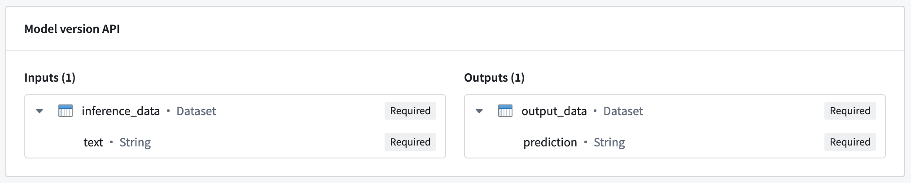
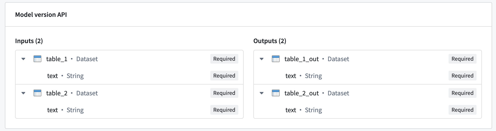

<!-- source: https://palantir.com/docs/foundry/manage-models/live-deployment-reference/ · mirrored 2026-08-18 from Palantir Foundry docs -->

# API: Query a model or Modeling Objective live deployment

In both a direct model deployment and modeling objective, you can create a live deployment and host your model over an HTTP endpoint. You can test the hosted model from the **Query** tab of your live deployment by using the model in production through [Functions on models](/docs/foundry/functions/functions-on-models/), or by using the live deployment API directly.

To query the hosted model directly, choose from the following endpoint options:

* **Multi I/O (input/output) endpoint:** A flexible endpoint that can handle complex hosted models and input types as well as simple models with a single input and output. Multi I/O endpoint URLs are suffixed with `/v2` and are also known as "v2 endpoints".
* **Single I/O endpoint \[sunset]:** A legacy endpoint that can only handle simple hosted models with an API consisting of a single input and output. Single I/O endpoints are also referred to as "v1 endpoints" and will be deprecated in the future.

:::callout{theme="warning"}
The single I/O endpoint is deprecated and only supported in modeling objective deployments.
:::

## Multi I/O endpoint

A multi I/O endpoint - sometimes referred to as a "v2 endpoint" - is a flexible endpoint that supports one or more inputs and one or more outputs.

* **URL:** `<ENVIRONMENT_URL>/foundry-ml-live/api/inference/transform/ri.foundry-ml-live.<LIVE_DEPLOYMENT_RID>/v2`
  * `<ENVIRONMENT_URL>`: See section [below](#environment-url) for more information.
* **HTTP Method:** `POST`
* **Authentication type:** Bearer token
* **Required HTTP headers:**
  * `Content-Type`: Must be `"application/json"`.
  * `Authorization`: Must be `"Bearer <BEARER_TOKEN>"`, where `<BEARER_TOKEN>` is your authentication token.
* **Request Body:** A JSON object containing the information to be sent to the model. The expected shape of this depends on API of the deployed model.
* **Response:** A successful response will return a status code of `200` and a JSON object representing the inference response returned by the model. The shape of this object will reflect the API of the currently deployed model.

### Examples: Query a live deployment with the multi I/O endpoint

For the following examples, we will use a model with a simple API of a single input and output.



The hosted model in this example expects a single input named `inference_data`, which is a dataset containing a `text` column. In this case, the expected request format would be the following:

```json
{
  "inference_data": [{
    "text": "<Text goes here>"
  }]
}
```

The model responds with a dataset named `output_data`, which contains a `prediction` column. This translates to the following response:

```json
{
  "output_data": [{
    "prediction": "<Model prediction here>"
  }]
}
```

#### Example: curl

```curl
curl --http2 -H "Content-Type: application/json" -H "Authorization: <BEARER_TOKEN>" -d '{ "inference_data": [ { "text": "Hello, how are you?" } ] }' --request POST <ENVIRONMENT_URL>/foundry-ml-live/api/inference/transform/ri.foundry-ml-live.<LIVE_DEPLOYMENT_RID>/v2
```

#### Example: Python

```python
import requests

url = '<ENVIRONMENT_URL>/foundry-ml-live/api/inference/transform/ri.foundry-ml-live.<LIVE_DEPLOYMENT_RID>/v2'

inference_request = { 'inference_data': [ { 'text': 'Hello, how are you?' } ] }

response = requests.post(
    url,
    json=inference_request,
    headers={ 'Content-Type': 'application/json', 'Authorization': 'Bearer <BEARER_TOKEN>' })

if response.ok:
    modelResult = response.json()
    print(modelResult)
else:
    print("An error occurred")
```

#### Example: JavaScript (using Node.js 18)

```js
  // Construct request
  const inferenceRequest = {
    "inference_data": [{
      "text": "Hello, how are you?"
    }]
  };

  // Send the request
  const response = await fetch(
    "<ENVIRONMENT_URL>/foundry-ml-live/api/inference/transform/ri.foundry-ml-live.<RID>/v2",
    {
      method: "POST",
      headers: {
        "Content-Type": "application/json",
        Authorization:
          "Bearer <BEARER_TOKEN>",
      },
      body: JSON.stringify(inferenceRequest),
    }
  );

  if (!response.ok) {
    throw Error(`${response.status}: ${response.statusText}`);
  }

  const result = await response.json();

  console.log(result);
```

### Example: Multi I/O models

Multi I/O models can receive multiple inputs and return multiple outputs. The image below shows an example of a model with multiple inputs and outputs:



To query a multi I/O, use the same request format as shown in the previous examples, with the `inference_request` containing a named field for each input:

```json
{
  "table_1": [{ "text": "Text for table one" }],
  "table_2": [{ "text": "Text for table two" }]
}
```

The model will also respond with an object containing a named field for each output:

```json
{
  "table_1_out": [{ "text": "Result for table one" }],
  "table_2_out": [{ "text": "Result for table two" }],
}
```

## Single I/O endpoint

:::callout{theme="warning"}
Single I/O endpoints are no longer recommended for new implementations. Prefer the more flexible multi I/O endpoint described above.
:::

* **URL:** `<ENVIRONMENT_URL>/foundry-ml-live/api/inference/transform/ri.foundry-ml-live.<LIVE_DEPLOYMENT_RID>`
* `<ENVIRONMENT_URL>`: See section [below](#environment-url) for more information.
* **HTTP Method:** `POST`
* **Authentication type:** Bearer token
* **Required HTTP headers:**
  * `Content-Type`: Must be `"application/json"`.
  * `Authorization`: Must be `"Bearer <BEARER_TOKEN>"`, where `<BEARER_TOKEN>` is your authentication token.
* **Request Body:** A JSON object with the following fields:
  * `requestData`: An array containing the information to be sent to the model. The expected shape of this depends on the API of the deployed model.
* **Response:** A successful response will return a status code of `200` and a JSON object containing the following fields:
  * `modelUuid`: A string identifying the model.
  * `responseData`: An array of objects, where each object represents the inference response of the model. The shape of these objects depends on the API of the deployed model.

### Examples: Query a live deployment with the single I/O endpoint

:::callout{theme="warning"}
Single I/O endpoints are no longer recommended for new implementations. Prefer the more flexible multi I/O endpoint described above.
:::

For the following examples, we will use a model with a simple API of a single input and output.


The hosted model in this example expects a single input named `inference_data`, which is a dataset containing a `text` column. In this case, the expected request format would be the following:

```json
{
  "requestData": [{ "text": "<Text goes here>" }],
  "requestParams": {},
}
```

The model responds with a dataset named `output_data`, which contains a `prediction` column. This translates to the following response:

```json
{
  "modelUuid": "000-000-000",
  "responseData": [{
    "prediction": "<Model prediction here>"
  }]
}
```

#### Example: curl

```curl
curl --http2 -H "Content-Type: application/json" -H "Authorization: <BEARER_TOKEN>" -d '{"requestData":[ { "text": "Hello, how are you?" } ], "requestParams":{}}' --request POST <ENVIRONMENT_URL>/foundry-ml-live/api/inference/transform/ri.foundry-ml-live.<RID>
```

#### Example: Python

```python
import requests
# This v1 endpoint is being sunset and only works for single input
# and single output models. Prefer the more generic v2 endpoint.
url = '<ENVIRONMENT_URL>/foundry-ml-live/api/inference/transform/ri.foundry-ml-live.<RID>'

inference_request = {
    'requestData': [{ 'text': 'Hello, how are you?' }],
    'requestParams': {},
}

response = requests.post(
    url,
    json=inference_request,
    headers={ 'Content-Type': 'application/json', 'Authorization': 'Bearer <BEARER_TOKEN>' })

if response.ok:
    modelResult = response.json()['responseData']
    print(modelResult)
else:
    print("An error occurred")
```

#### Example: JavaScript (using Node.js 18)

```js
// Construct request
const inferenceRequest = {
  requestData: [{ text: "Hello, how are you?" }],
  requestParams: {},
};

// Send the request.
// This v1 endpoint is being sunset and will only work for single input
// and single output models. You should use the v2 endpoint instead of v1.
const response = await fetch(
  "<ENVIRONMENT_URL>/foundry-ml-live/api/inference/transform/ri.foundry-ml-live.<RID>",
  {
    method: "POST",
    headers: {
      "Content-Type": "application/json",
      Authorization:
        "Bearer <BEARER_TOKEN>",
    },
    body: JSON.stringify(inferenceRequest),
  }
);

if (!response.ok) {
  throw Error(`${response.status}: ${response.statusText}`);
}

const result = await response.json();

console.log(result.responseData);
```

## Environment URL

In the examples shown above, the `<ENVIRONMENT_URL>` placeholder represents the URL of your environment. To retrieve your environment URL, copy the curl request from the **Query** tab of your deployment and extract the URL.

## Error handling

The most common HTTP error codes are detailed below:

* **400:** Caused by an invalid request or model failure.
  * Usually caused by an exception that occurred during model inference. The stacktrace will usually be available in the response body to aid debugging.
  * This error code is also returned if the request does not conform to the model API.
* **422:** Caused by a request that is not properly formatted. Confirm that the JSON in the request is valid and in the expected format.
* **429:** Caused by too many requests. Retry with backoff or reduce concurrency. Rate limits are dependent on your environment.
* **500:** Caused by an internal server or deployment error. Manual intervention may be required.
* **503:** The service or deployment is unavailable. This can happen when the deployment is under resource starvation, is out of memory, cannot handle more requests concurrently, or is automatically attempting to restart. Retry with backoff. Manual intervention may be required.
