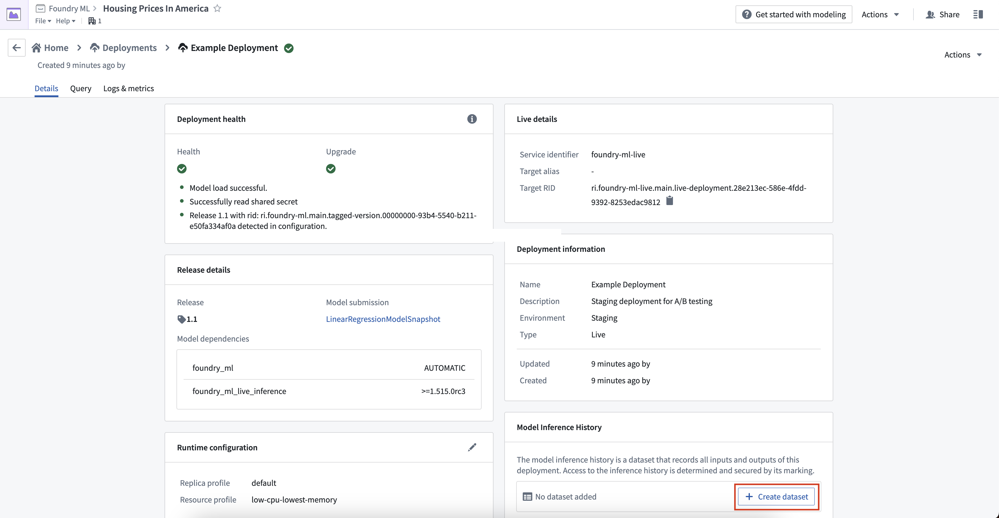
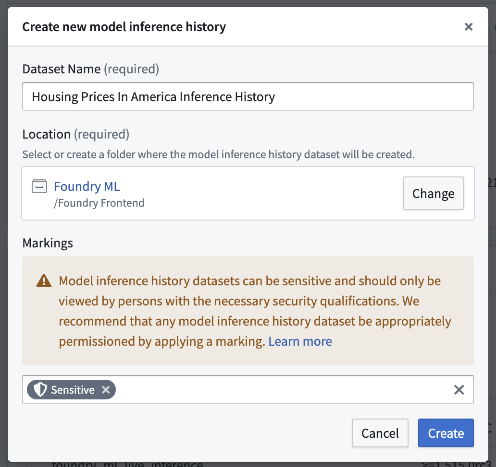
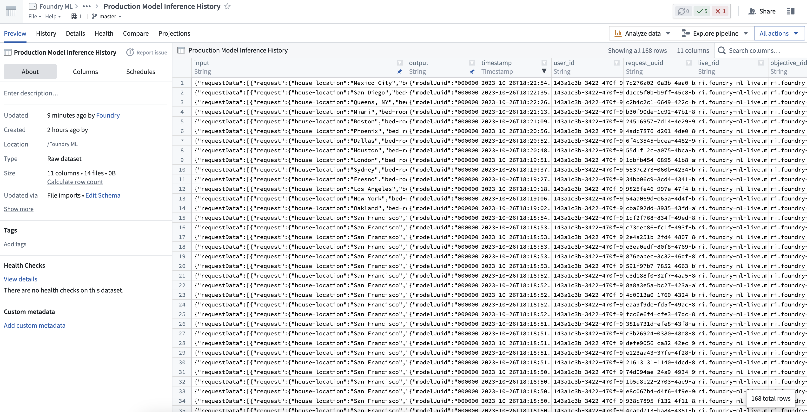
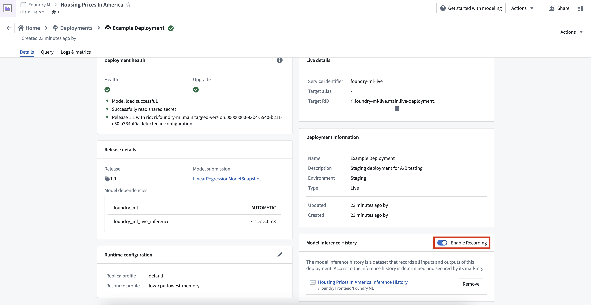
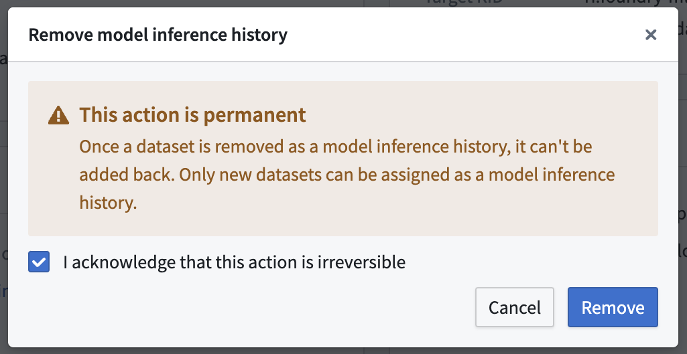

<!-- source: https://palantir.com/docs/foundry/manage-models/model-inference-history/ · mirrored 2026-08-18 from Palantir Foundry docs -->

# Model inference history

The model inference history is a dataset in Foundry that captures all inference requests (inputs) and inference results (outputs) that are sent to a Modeling Objective live deployment. This can enable many workflows, such as the following:

* **Drift detection:** Model inference history can help you to detect changes in a model's performance over time, which might indicate a drift in the underlying data distribution. Examining the inference history can provide valuable insights into how the model's accuracy is evolving.
* **Continuous retraining:** Model inference history can be used in continuous retraining scenarios, in which a model is iteratively trained with new data based on the model's previous predictions.
* **Performance evaluation for model:** The history of inference inputs and outputs can be used to evaluate a model's performance over time. Inference history can help you to identify patterns and trends in the model's performance.
* **Usage Analysis:** The inference history can help you to understand where and how frequently a model is being called. These insights into a model's usage patterns can inform decisions about resource allocation and optimization.

## Model inference history usage

To create a model inference history, navigate to the **Deployments** page of your Modeling Objective and select the live deployment to which you would like to add the model inference history. Under the **Model Inference History** card, click on **Create dataset**. This will open the **Create new model inference history** dialog.

In the **Create new model inference history**  dialog, enter a dataset name and location for the model inference history. We strongly recommend adding [Security Markings](/docs/foundry/security/markings/) since inputs and outputs may contain sensitive information and should only be accessible by individuals with the appropriate security permissions.

Once the model inference history is created, the following information will be recorded in the dataset:

* `timestamp`: Timestamp of the input request
* `user_id`: Foundry user ID of the person who sent the request
* `request_uuid`: Unique identifier of the request
* `live_rid`: Modeling live deployment resource identifier
* `objective_rid`: Modeling objective resource identifier
* `model_rid`: Model asset resource identifier
* `model_version_rid`: Model asset version resource identifier
* `input`: JSON representation of the input sent to the model
* `output`: JSON representation of the model output
* `error`: Detailed error message or stacktrace encountered by the model while running inference on the provided input

To temporarily enable or disable a model inference history, click the toggle in the top right corner of the **Model Inference History** card labeled **Enable Recording**.

To permanently disable a model inference history, select **Remove** to the right of the dataset in the **Model Inference History** card.

:::callout{theme="danger"}
Removing a model inference history is permanent and cannot be undone. Once a dataset is removed as a model inference history, the dataset will still exist, but cannot be added back to a deployment.
:::

## Frequently Asked Questions (FAQ)

### What permissions are required to set up a model inference history on my live deployment?

To enable a model inference history a user requires the gatekeeper permission `foundry-ml-live:edit-inference-ledger`. Typically, this is granted with the "owner" role on a modeling objective.

### Where can I save a model inference history dataset?

As inputs and outputs may contain sensitive information, you are required to save the dataset to the same project as its parent modeling objective.

### Can I write model inference history inputs and outputs to an existing dataset?

To ensure the model inference history matches the designated schema, you cannot choose an existing dataset for the model inference history.

### What happens if I remove my model inference history?

If you remove your model inference history, the dataset will not be deleted, however, Foundry will stop writing new records to it.

### How do I temporarily enable/disable my model inference history?

You can use the recording toggle to temporarily enable or disable your model inference history.

### Are there guarantees that all inference inputs will be logged to the model inference history?

Not all inputs and outputs are guaranteed to appear in the inference history. To maintain platform performance, requests that fail when trying to write to the model inference history are not retried.
