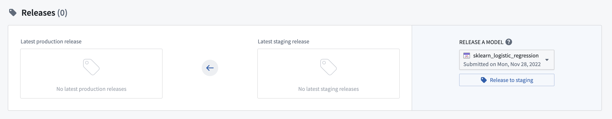
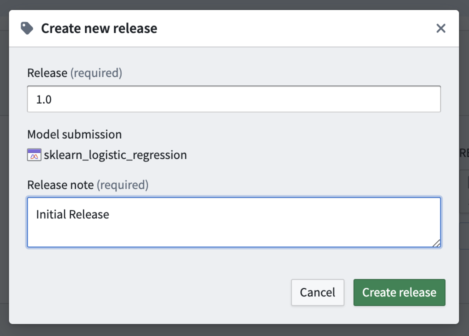
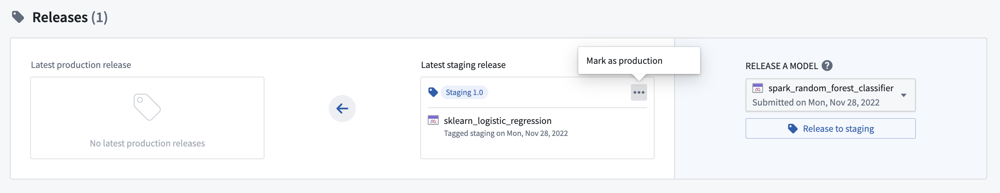
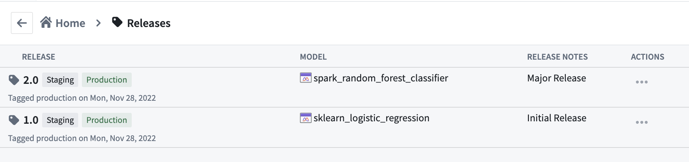

<!-- source: https://palantir.com/docs/foundry/manage-models/release-model/ · mirrored 2026-08-18 from Palantir Foundry docs -->

# Release a model

There are two types of **Releases** in a modeling objective.

A **production release** represents the best current model and will power all production deployments in its modeling objective.

A **staging release** is a release that is staged to become the production release; staging releases are used in all staging deployments. A staging deployment can be used to test downstream operational uses of a model before the model is productionized. After testing, an objective owner can mark a staging release as production.

Once a model submission has been released, it can no longer be [archived](/docs/foundry/manage-models/archive-model/).

## Create a new staging release

To create a new release, navigate to the modeling objective home page, scroll to the **Releases** section, select the model that you want to release, and click **Release to staging**.

Alternatively, navigate to the model submission page and click **Create new release** at the top right of the page.

Give the model a release number and a release note, then click **Create release**.

## Create a new production release

If a staging release meets organizational testing criteria, a staging release can be promoted to production by clicking **Mark as production** from the model submission page or from the releases section on the Modeling Objective home page.

## Release history

Every release will overwrite the previous release for that environment, and all deployments in that environment will automatically be upgraded to use the newly released model. To view a history of releases, upgrade times, and release metadata, click **Releases** from the Modeling Objective home page and view the full release history.

