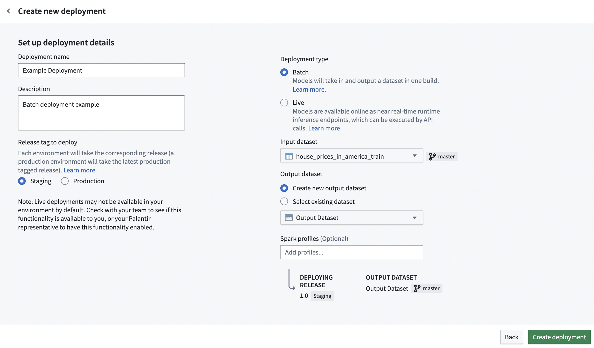
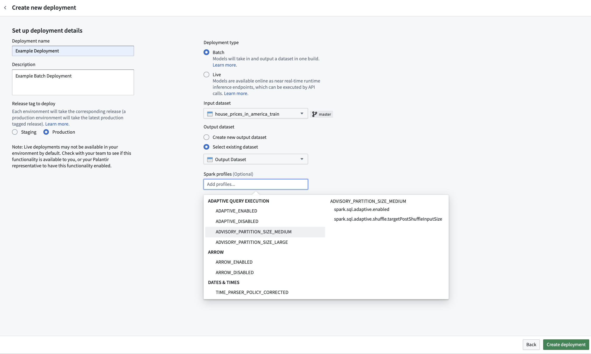
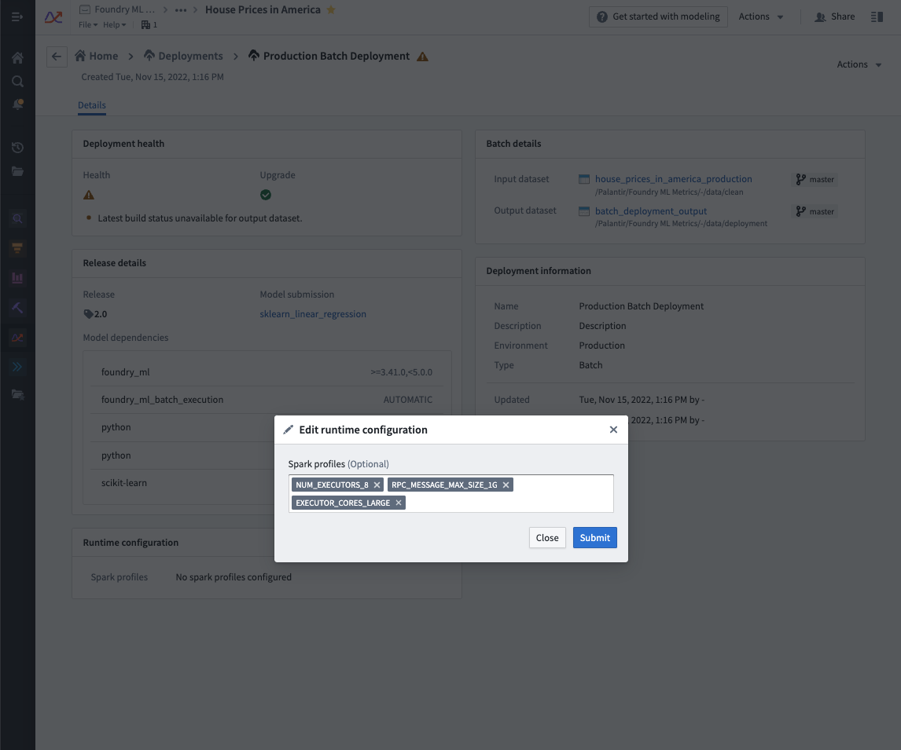
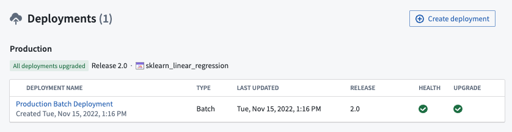
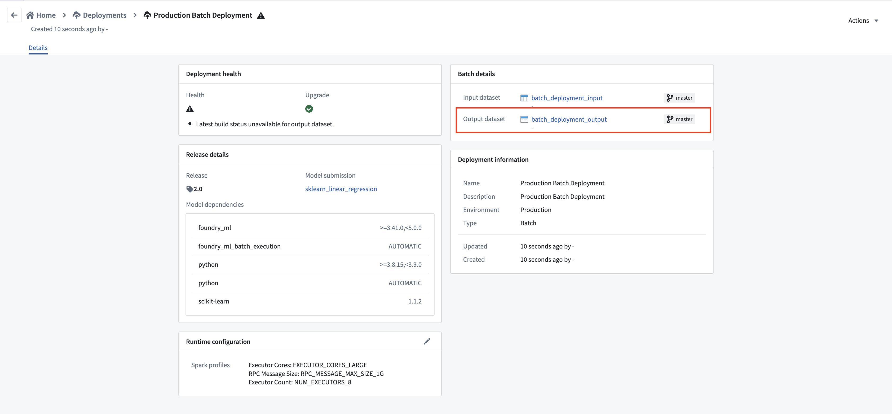
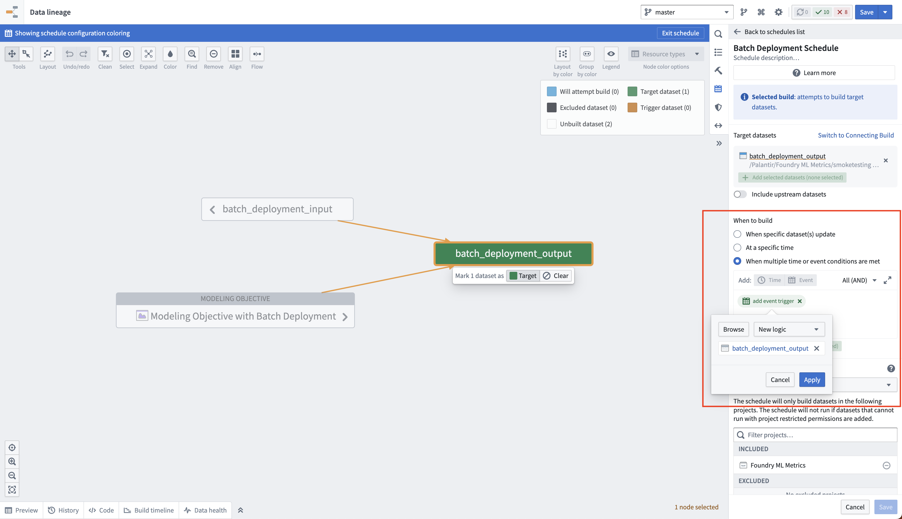

<!-- source: https://palantir.com/docs/foundry/manage-models/set-up-batch/ · mirrored 2026-08-18 from Palantir Foundry docs -->

# Set up a batch deployment

A [batch deployment](/docs/foundry/model-integration/objectives/#batch-deployments) is a special pipeline configured inside a modeling objective which allows data to be run through a model that outputs results to a Foundry dataset. These output datasets can be managed on a build schedule.

## Prerequisites

Before creating a new batch deployment, there are two prerequisites:

1. There must be an existing release inside the objective with the corresponding [environment tag](/docs/foundry/model-integration/objectives/#releases) of either staging or production.

2. Select an input dataset to run through your models. Ideally this dataset should be carefully maintained and updating regularly—it represents the new information of the problem you're trying to solve.

## Create deployment

To create a new batch deployment, navigate to the **Deployments** section at the bottom of your modeling objective home page, and select **+ Create deployment** in the top right.

Fill out the details and relevant information inside the prompts. Select your deployment environment based off of requirement #1, choose the input dataset decided upon in requirement #2, and choose a location and name for the output dataset. Alternatively, instead of creating a new output dataset, an existing dataset can also be chosen as the output dataset.

:::callout{theme="neutral"}
Direct set up of batch deployment in Modeling Objectives is only compatible with models using a single tabular dataset input. If your model adapter requires several inputs, you can set up batch inference [in a Python transform](/docs/foundry/integrate-models/model-asset-code-repositories/#run-inference-in-python-transforms) instead.
:::

## Resource configuration

While creating a new batch deployment, you can configure the resources required for that individual deployment. Resources are configured via [Spark profiles](/docs/foundry/optimizing-pipelines/apply-spark-profiles/), which will be applied to the Spark environment during inference.

If creating a new batch deployment, a Spark profile selector will be presented upon initial deployment configuration. The behavior matches that of Python transforms. If omitted, no Spark profiles will be configured for the deployment, and a default resource profile will be used.

To edit the configured Spark profiles on an existing batch deployment, navigate to the **Deployments** section in your modeling objective, select your deployment from the listed deployments, and select the edit button under **Runtime configuration** to edit the Spark profiles. This will automatically update the deployment.

## Automatically build deployment output

To navigate to the deployment view, select the new deployment.

To navigate to the output dataset, select the dataset link in the deployment details view.

You can [create a schedule](/docs/foundry/building-pipelines/create-schedule/) on the output dataset of a batch deployment for it to automatically update whenever a new model is released to that deployment environment. This is achieved by creating a new logic schedule that builds the output dataset whenever the logic for that dataset updates. When a new model is released in the objective, the logic for the output dataset will be updated and this schedule will be triggered.

