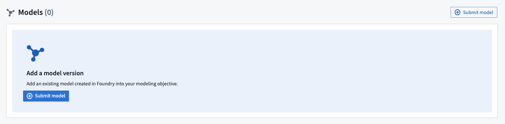
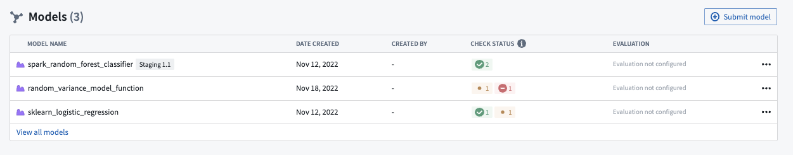
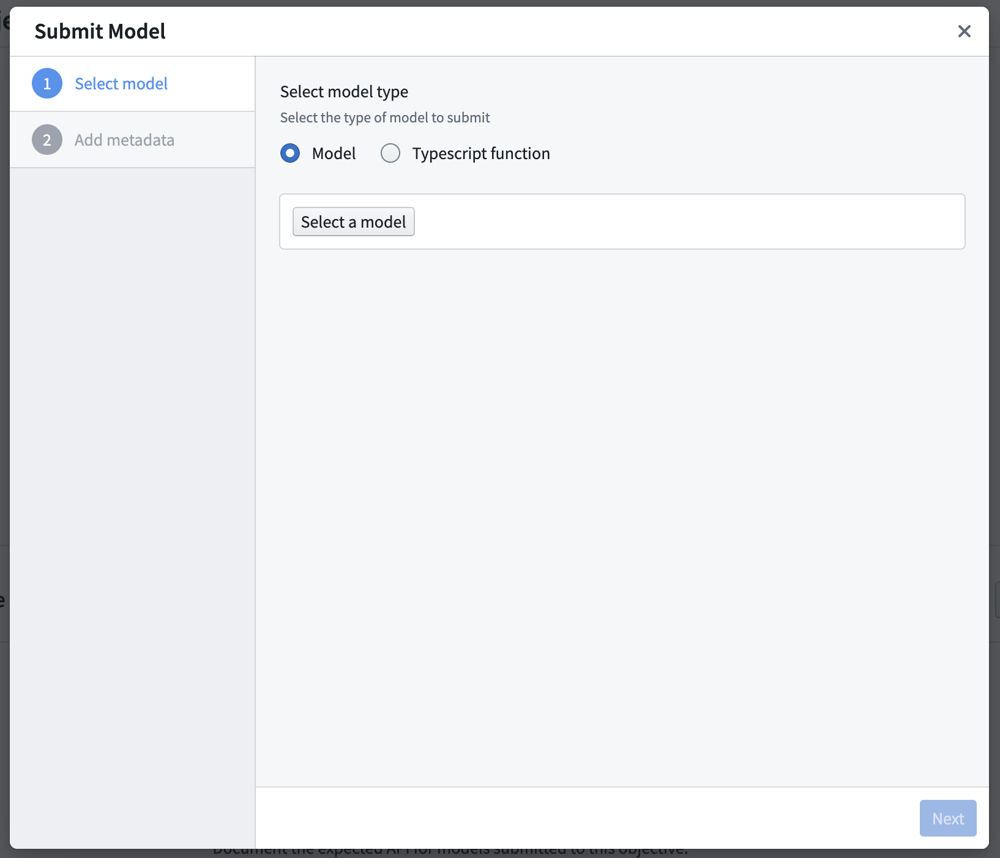

<!-- source: https://palantir.com/docs/foundry/manage-models/submit-model/ · mirrored 2026-08-18 from Palantir Foundry docs -->

# Submit a model to an objective

You can submit a model to a modeling objective via the [UI](#submission-via-ui).

## Submission via UI

To submit a model to a new modeling objective, select the blue **Submit model** button from the objective home page:

Or, from an existing modeling objective, click **Submit model** at the top right of the models view.

For most models, including [Model Assets](/docs/foundry/integrate-models/integrate-overview/), select **Model** as shown, then navigate to and select the relevant model resource.

Finally, if applicable, fill out any [required metadata for this objective](/docs/foundry/manage-models/configure-objective-metadata/) and choose **Submit**.
